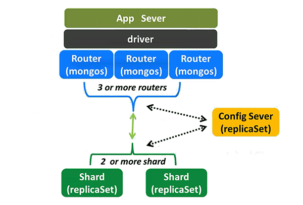
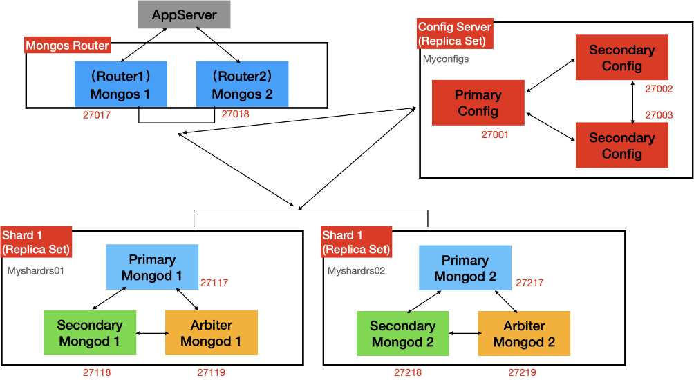

[TOC]

# 分片集群 Sharded Cluster

## 分片 sharding

将数据拆分，将其分散到不同的机器上的过程。

- Mongo支持通过分片进行水平扩展
- MongoDB在集合级别（表级别）对数据进行分片，将集合数据分布在集群中的分片上。

## 分片集群包含的组件

MongoDB分片集群包含以下组件：

- 分片（存储）

  - 每个分片包含分片数据的子集。
  - 每个分片都可以部署为副本集。

- 路由（mogos）

  - mongos充当路由，在应用程序和分片集群之间提供接口。

- 存储调度的配置服务器（config servers）

  - 配置服务器存储集群的元数据和配置设置。
  - 从MongoDB 3.4开始，必须将配置服务器部署为副本集（CSRS）

  

## 分片集群架构目标

> - router
>   - router1,27017
>   - router2,27018
> - shard1 myshardrs01
>   - shard1 primary,27117
>   - shrad1 secondary,27118
>   - shard1 Arbiter,27119
> - shard2 myshardrs02
>   - shard2 primary,27217
>   - shard2 secondary,27218
>   - shard2 Arbiter,27219
> - config server myconfigs
>   - config primary,27001
>   - config secondary,27002
>   - config secondary,27003

