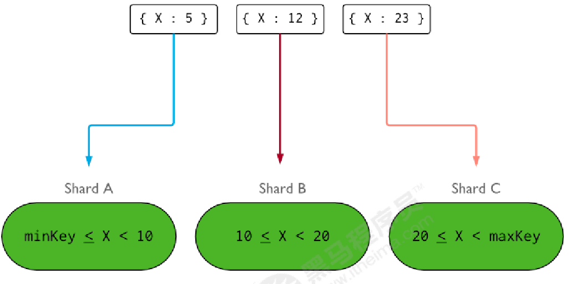

[TOC]

# 架构

- router
  - router1,27017
  - router2,27018
- shard1 myshardrs01
  - shard1 primary,27117
  - shrad1 secondary,27118
  - shard1 Arbiter,27119
- shard2 myshardrs02
  - shard2 primary,27217
  - shard2 secondary,27218
  - shard2 Arbiter,27219
- config server myconfigs
  - config primary,27001
  - config secondary1,27002
  - config secondary2,27003


# 分片（存储）节点副本集的创建

## shard1 myshardrs01

- 准备目录

  ```
  kk@kk:/mongo/shard$ mkdir -p myshardrs01_27117/log
  kk@kk:/mongo/shard$ mkdir -p myshardrs01_27117/data/db
  kk@kk:/mongo/shard$ mkdir -p myshardrs01_27118/data/db
  kk@kk:/mongo/shard$ mkdir -p myshardrs01_27118/log
  kk@kk:/mongo/shard$ mkdir -p myshardrs01_27119/data/db
  kk@kk:/mongo/shard$ mkdir -p myshardrs01_27119/log
  ```

- 准备配置文件

  myshardrs01_27117.conf

  myshardrs01_27118.conf

  myshardrs01_27119.conf

  ```
  kk@kk:/mongo$ cat shard/myshardrs01_27117/myshardrs01_27117.conf
  systemLog:
     destination: file
     path: "/mongo/shard/myshardrs01_27117/log/mongod_27117.log"
     logAppend: true
  storage:
     dbPath: "/mongo/shard/myshardrs01_27117/data/db"
     journal:
        enabled: true
  processManagement:
     fork: true
     pidFilePath: "/mongo/shard/myshardrs01_27117/mongod_27117.pid"
  net:
     bindIp: 0.0.0.0		#服务实例绑定所有IP，有副作用，副本集初始化的时候，节点名字会自动设置为本地域名，而不是ip
     port: 27117
  replication:
     replSetName: myshardrs01
  sharding:
     clusterRole: shardsvr
  ```

  > 设置sharding.clusterRole需要mongod实例运行复制。 要将实例部署为副本集成员，请使用replSetName设置并指定副本集的名称。

- 启动第一套副本集

  ```
  kk@kk:/mongo/shard$ mongod -f myshardrs01_27117/myshardrs01_27117.conf
  about to fork child process, waiting until server is ready for connections.
  forked process: 8096
  child process started successfully, parent exiting
  kk@kk:/mongo/shard$ mongod -f myshardrs01_27118/myshardrs01_27118.conf
  about to fork child process, waiting until server is ready for connections.
  forked process: 8140
  child process started successfully, parent exiting
  kk@kk:/mongo/shard$ mongod -f myshardrs01_27119/myshardrs01_27119.conf
  about to fork child process, waiting until server is ready for connections.
  forked process: 8184
  child process started successfully, parent exiting
  kk@kk:/mongo/shard$ ps -ef|grep 2711
  kk          8096       1  4 13:30 ?        00:00:00 mongod -f myshardrs01_27117/myshardrs01_27117.conf
  kk          8140       1  5 13:30 ?        00:00:00 mongod -f myshardrs01_27118/myshardrs01_27118.conf
  kk          8184       1  8 13:30 ?        00:00:00 mongod -f myshardrs01_27119/myshardrs01_27119.conf
  kk          8227    5203  0 13:30 pts/0    00:00:00 grep --color=auto 2711
  kk@kk:/mongo/shard$
  ```

- 初始化第一套副本集

  ```
  # 尽可能连接主节点
  kk@kk:/mongo/shard$ mongo --port 27117
  
  > rs.initiate()
  myshardrs01:PRIMARY> rs.conf()
  ```

- 添加副本节点

  ```
  myshardrs01:PRIMARY> rs.add("192.168.227.128:27118")
  {
  	"ok" : 1,
  	"$clusterTime" : {
  		"clusterTime" : Timestamp(1641216934, 1),
  		"signature" : {
  			"hash" : BinData(0,"AAAAAAAAAAAAAAAAAAAAAAAAAAA="),
  			"keyId" : NumberLong(0)
  		}
  	},
  	"operationTime" : Timestamp(1641216934, 1)
  }
  ```

- 添加仲裁节点

  ```
  myshardrs01:PRIMARY> rs.add("192.168.227.128:27119")
  {
  	"ok" : 1,
  	"$clusterTime" : {
  		"clusterTime" : Timestamp(1641216950, 1),
  		"signature" : {
  			"hash" : BinData(0,"AAAAAAAAAAAAAAAAAAAAAAAAAAA="),
  			"keyId" : NumberLong(0)
  		}
  	},
  	"operationTime" : Timestamp(1641216950, 1)
  }
  ```

- 查看副本集配置

  ```
  myshardrs01:PRIMARY> rs.conf()
  {
  	"_id" : "myshardrs01",
  	"version" : 3,
  	"protocolVersion" : NumberLong(1),
  	"writeConcernMajorityJournalDefault" : true,
  	"members" : [
  		{
  			"_id" : 0,
  			"host" : "kk:27117",
  			"arbiterOnly" : false,
  			"buildIndexes" : true,
  			"hidden" : false,
  			"priority" : 1,
  			"tags" : {
  
  			},
  			"slaveDelay" : NumberLong(0),
  			"votes" : 1
  		},
  		{
  			"_id" : 1,
  			"host" : "192.168.227.128:27118",
  			"arbiterOnly" : false,
  			"buildIndexes" : true,
  			"hidden" : false,
  			"priority" : 1,
  			"tags" : {
  
  			},
  			"slaveDelay" : NumberLong(0),
  			"votes" : 1
  		},
  		{
  			"_id" : 2,
  			"host" : "192.168.227.128:27119",
  			"arbiterOnly" : false,
  			"buildIndexes" : true,
  			"hidden" : false,
  			"priority" : 1,
  			"tags" : {
  
  			},
  			"slaveDelay" : NumberLong(0),
  			"votes" : 1
  		}
  	],
  	"settings" : {
  		"chainingAllowed" : true,
  		"heartbeatIntervalMillis" : 2000,
  		"heartbeatTimeoutSecs" : 10,
  		"electionTimeoutMillis" : 10000,
  		"catchUpTimeoutMillis" : -1,
  		"catchUpTakeoverDelayMillis" : 30000,
  		"getLastErrorModes" : {
  
  		},
  		"getLastErrorDefaults" : {
  			"w" : 1,
  			"wtimeout" : 0
  		},
  		"replicaSetId" : ObjectId("61d2fafb85069223ba961366")
  	}
  }
  myshardrs01:PRIMARY>
  ```

  

## shard2 myshardrs02

- 准备目录

  ```
  kk@kk:/mongo/shard$ mkdir -p myshardrs02_27217/log
  kk@kk:/mongo/shard$ mkdir -p myshardrs02_27217/data/db
  kk@kk:/mongo/shard$ mkdir -p myshardrs02_27218/log
  kk@kk:/mongo/shard$ mkdir -p myshardrs02_27218/data/db
  kk@kk:/mongo/shard$ mkdir -p myshardrs02_27219/log
  kk@kk:/mongo/shard$ mkdir -p myshardrs02_27219/data/db
  ```

- 准备配置文件

  myshardrs02_27217.conf

  myshardrs02_27218.conf

  myshardrs02_27219.conf

  ```
  kk@kk:/mongo/shard$ cat myshardrs02_27217/myshardrs02_27217.conf
  systemLog:
     destination: file
     path: "/mongo/shard/myshardrs02_27217/log/mongod_27217.log"
     logAppend: true
  storage:
     dbPath: "/mongo/shard/myshardrs02_27217/data/db"
     journal:
        enabled: true
  processManagement:
     fork: true
     pidFilePath: "/mongo/shard/myshardrs02_27217/mongod_27217.pid"
  net:
     bindIp: 0.0.0.0
     port: 27217
  replication:
     replSetName: myshardrs02
  sharding:
     clusterRole: shardsvr
  ```

  

- 启动第二套副本集

  ```
  kk@kk:/mongo/shard$ mongod -f myshardrs02_27217/myshardrs02_27217.conf
  about to fork child process, waiting until server is ready for connections.
  forked process: 8461
  child process started successfully, parent exiting
  kk@kk:/mongo/shard$ mongod -f myshardrs02_27218/myshardrs02_27218.conf
  about to fork child process, waiting until server is ready for connections.
  forked process: 8505
  child process started successfully, parent exiting
  kk@kk:/mongo/shard$ mongod -f myshardrs02_27219/myshardrs02_27219.conf
  about to fork child process, waiting until server is ready for connections.
  forked process: 8549
  child process started successfully, parent exiting
  kk@kk:/mongo/shard$ ps -ef|grep 2721
  kk          8461       1  4 13:46 ?        00:00:00 mongod -f myshardrs02_27217/myshardrs02_27217.conf
  kk          8505       1  5 13:46 ?        00:00:00 mongod -f myshardrs02_27218/myshardrs02_27218.conf
  kk          8549       1 11 13:46 ?        00:00:00 mongod -f myshardrs02_27219/myshardrs02_27219.conf
  kk          8592    5203  0 13:46 pts/0    00:00:00 grep --color=auto 2721
  ```

  

- 初始化第二套副本集

  ```
  > rs.initiate()
  {
  	"info2" : "no configuration specified. Using a default configuration for the set",
  	"me" : "kk:27217",
  	"ok" : 1
  }
  ```

  

- 添加副本节点

- 添加仲裁节点

  ```
  myshardrs02:PRIMARY> rs.add("192.168.227.128:27217")
  myshardrs02:PRIMARY> rs.add("192.168.227.128:27218")
  ```

  

- 查看副本集配置

  ```
  myshardrs02:PRIMARY> rs.status()
  myshardrs02:PRIMARY> rs.conf()
  ```

  

# 配置副本集的创建

## configr server myconfigs

- 准备目录

  ```
  kk@kk:/mongo/shard$ mkdir -p myconfigs_27001/log
  kk@kk:/mongo/shard$ mkdir -p myconfigs_27001/data/db
  kk@kk:/mongo/shard$ mkdir -p myconfigs_27002/log
  kk@kk:/mongo/shard$ mkdir -p myconfigs_27002/data/db
  kk@kk:/mongo/shard$ mkdir -p myconfigs_27003/log
  kk@kk:/mongo/shard$ mkdir -p myconfigs_27003/data/db
  ```

  

- 准备配置文件

  myconfigs_27001.conf

  myconfigs_27002.conf

  myconfigs_27003.conf

  ```
  kk@kk:/mongo/shard$ cat myconfigs_27001/myconfigs_27001.conf
  systemLog:
     destination: file
     path: "/mongo/shard/myconfigs_27001/log/mongod_27001.log"
     logAppend: true
  storage:
     dbPath: "/mongo/shard/myconfigs_27001/data/db"
     journal:
        enabled: true
  processManagement:
     fork: true
     pidFilePath: "/mongo/shard/myconfigs_27001/mongod_27001.pid"
  net:
     bindIp: 0.0.0.0
     port: 27001
  replication:
     replSetName: myconfigs
  sharding:
     clusterRole: configsvr
  ```

  

- 启动配置副本集

  ```
  kk@kk:/mongo/shard$ mongod -f myconfigs_27001/myconfigs_27001.conf
  about to fork child process, waiting until server is ready for connections.
  forked process: 8774
  child process started successfully, parent exiting
  kk@kk:/mongo/shard$ mongod -f myconfigs_27002/myconfigs_27002.conf
  about to fork child process, waiting until server is ready for connections.
  forked process: 8827
  child process started successfully, parent exiting
  kk@kk:/mongo/shard$ mongod -f myconfigs_27003/myconfigs_27003.conf
  about to fork child process, waiting until server is ready for connections.
  forked process: 8891
  child process started successfully, parent exiting
  kk@kk:/mongo/shard$ ps -ef|grep 2700
  kk          8774       1  5 13:56 ?        00:00:00 mongod -f myconfigs_27001/myconfigs_27001.conf
  kk          8827       1  8 13:56 ?        00:00:00 mongod -f myconfigs_27002/myconfigs_27002.conf
  kk          8891       1 15 13:56 ?        00:00:00 mongod -f myconfigs_27003/myconfigs_27003.conf
  kk          8945    5203  0 13:56 pts/0    00:00:00 grep --color=auto 2700
  ```

  

- 初始化配置副本集

  ```
  kk@kk:/mongo/shard$ mongo --port 27001
  
  > rs.initiate()
  {
  	"info2" : "no configuration specified. Using a default configuration for the set",
  	"me" : "kk:27001",
  	"ok" : 1,
  	"$gleStats" : {
  		"lastOpTime" : Timestamp(1641218221, 1),
  		"electionId" : ObjectId("000000000000000000000000")
  	},
  	"lastCommittedOpTime" : Timestamp(0, 0)
  }
  ```

  

- 添加副本节点一

- 添加副本节点二

  ```
  myconfigs:SECONDARY> rs.add("192.168.227.128:27002")
  myconfigs:PRIMARY> rs.add("192.168.227.128:27003")
  ```

  

- 查看副本集配置

  ```
  myconfigs:PRIMARY> rs.status()
  myconfigs:PRIMARY> rs.conf()
  ```

  


# 路由节点的创建和操作

## router1

- 准备目录

  ```
  # 路由不需要data storage
  kk@kk:/mongo/shard$ mkdir -p router1_27017/log
  ```

- 准备配置文件

  router1_27017.conf

  ```
  kk@kk:/mongo/shard$ cat router1_27017/router1_27017.conf
  systemLog:
     destination: file
     path: "/mongo/shard/router1_27017/log/mongod_27017.log"
     logAppend: true
  processManagement:
     fork: true
     pidFilePath: "/mongo/shard/router1_27017/mongod_27017.pid"
  net:
     bindIp: 0.0.0.0
     port: 27017
  sharding:
     configDB: myconfigs/192.168.227.128:27001,192.168.227.128:27002,192.168.227.128:27003
  ```

- 启动mongos

  ```
  kk@kk:/mongo/shard$ mongos -f router1_27017/router1_27017.conf
  about to fork child process, waiting until server is ready for connections.
  forked process: 9185
  child process started successfully, parent exiting
  ```

- 登录mongos

  ```
  kk@kk:/mongo/shard$ mongo --port 27017
  
  # 此时无法写入数据
  # 原因:
  # 通过路由节点操作，现在只是连接了配置节点，还没有连接分片数据节点，因此无法写入业务数据。
  mongos> db.aa.insert({"aa":"aaa"})
  WriteCommandError({
  	"ok" : 0,
  	"errmsg" : "unable to initialize targeter for write op for collection aadb.aa :: caused by :: Database aadb could not be created :: caused by :: No shards found",
  	"code" : 70,
  	"codeName" : "ShardNotFound",
  	"operationTime" : Timestamp(1641219160, 2),
  	"$clusterTime" : {
  		"clusterTime" : Timestamp(1641219160, 2),
  		"signature" : {
  			"hash" : BinData(0,"AAAAAAAAAAAAAAAAAAAAAAAAAAA="),
  			"keyId" : NumberLong(0)
  		}
  	}
  })
  ```

## 在路由节点上进行分片配置操作

- 添加分片

  语法

  ```
  sh.addShard("IP:PORT")
  ```

- 将第一套分片副本集 myshardrs01添加进来

  ```
  mongos> sh.addShard("myshardrs01/192.168.227.128:27117,192.168.227.128:27118,192.168.227.128:27119")
  {
  	"shardAdded" : "myshardrs01",
  	"ok" : 1,
  	"operationTime" : Timestamp(1641219611, 4),
  	"$clusterTime" : {
  		"clusterTime" : Timestamp(1641219611, 4),
  		"signature" : {
  			"hash" : BinData(0,"AAAAAAAAAAAAAAAAAAAAAAAAAAA="),
  			"keyId" : NumberLong(0)
  		}
  	}
  }
  ```

  > 可能会解析成域名，导致IP和域名字符不一致，拒绝添加。
  >
  > 我这里采用的方法是，将配置导出后，修改域名为IP，再重新加载配置。

- 查看分片状态

  ```
  mongos> sh.status()
  
  --- Sharding Status ---
    sharding version: {
    	"_id" : 1,
    	"minCompatibleVersion" : 5,
    	"currentVersion" : 6,
    	"clusterId" : ObjectId("61d300adcbe6e8a9d4ccc113")
    }
    shards:
          {  "_id" : "myshardrs01",  "host" : "myshardrs01/192.168.227.128:27117,192.168.227.128:27118,192.168.227.128:27119",  "state" : 1 }
    active mongoses:
          "4.4.10" : 1
    autosplit:
          Currently enabled: yes
    balancer:
          Currently enabled:  yes
          Currently running:  no
          Failed balancer rounds in last 5 attempts:  0
          Migration Results for the last 24 hours:
                  No recent migrations
    databases:
          {  "_id" : "config",  "primary" : "config",  "partitioned" : true }
                  config.system.sessions
                          shard key: { "_id" : 1 }
                          unique: false
                          balancing: true
                          chunks:
                                  myshardrs01	1024
                          too many chunks to print, use verbose if you want to force print
  mongos>
  ```

- 将第二套分片副本集 myshardrs02添加进来

  ```
  mongos> sh.addShard("myshardrs02/192.168.227.128:27217,192.168.227.128:27218,192.168.227.128:27219")
  {
  	"shardAdded" : "myshardrs02",
  	"ok" : 1,
  	"operationTime" : Timestamp(1641219810, 4),
  	"$clusterTime" : {
  		"clusterTime" : Timestamp(1641219810, 4),
  		"signature" : {
  			"hash" : BinData(0,"AAAAAAAAAAAAAAAAAAAAAAAAAAA="),
  			"keyId" : NumberLong(0)
  		}
  	}
  }
  ```

  > myshardrs02:PRIMARY> cfg['members'][0]['host']
  > kk:27217
  > myshardrs02:PRIMARY> cfg['members'][0]['host'] = '192.168.227.128:27217'
  > 192.168.227.128:27217
  > myshardrs02:PRIMARY> rs.reconfig(cfg)

- 查看分片状态

  ```
  mongos> sh.status()
  --- Sharding Status ---
    sharding version: {
    	"_id" : 1,
    	"minCompatibleVersion" : 5,
    	"currentVersion" : 6,
    	"clusterId" : ObjectId("61d300adcbe6e8a9d4ccc113")
    }
    shards:
          {  "_id" : "myshardrs01",  "host" : "myshardrs01/192.168.227.128:27117,192.168.227.128:27118,192.168.227.128:27119",  "state" : 1 }
          {  "_id" : "myshardrs02",  "host" : "myshardrs02/192.168.227.128:27217,192.168.227.128:27218,192.168.227.128:27219",  "state" : 1 }
    active mongoses:
          "4.4.10" : 1
    autosplit:
          Currently enabled: yes
    balancer:
          Currently enabled:  yes
          Currently running:  no
          Failed balancer rounds in last 5 attempts:  0
          Migration Results for the last 24 hours:
                  24 : Success
    databases:
          {  "_id" : "config",  "primary" : "config",  "partitioned" : true }
                  config.system.sessions
                          shard key: { "_id" : 1 }
                          unique: false
                          balancing: true
                          chunks:
                                  myshardrs01	1000
                                  myshardrs02	24
                          too many chunks to print, use verbose if you want to force print
  mongos>
  ```

  

- 如果添加分片失败，需要先手动移除分片。

  ```
  use admin
  db.runCommand( {removeShard: "分片副本集名称"} )
  ```

  > - 如果只剩下最后一个shard，是无法删除的。
  > - 移除分片会自动转义分片数据，需要一个时间过程
  > - 完成后，再次执行删除分片命令才能真正删除。

## 开启分片功能

语法

```
sh.enableSharding("库名")
sh.shardCollection("库名.集合名",{"key":1})
```

- 在mongos上的为articledb数据库配置sharding

  ```
  mongos> sh.enableSharding("articledb")
  
  {
  	"ok" : 1,
  	"operationTime" : Timestamp(1641220154, 29),
  	"$clusterTime" : {
  		"clusterTime" : Timestamp(1641220154, 30),
  		"signature" : {
  			"hash" : BinData(0,"AAAAAAAAAAAAAAAAAAAAAAAAAAA="),
  			"keyId" : NumberLong(0)
  		}
  	}
  }
  ```

- 查看分片状态

  ```
  mongos> sh.status()
  --- Sharding Status ---
    sharding version: {
    	"_id" : 1,
    	"minCompatibleVersion" : 5,
    	"currentVersion" : 6,
    	"clusterId" : ObjectId("61d300adcbe6e8a9d4ccc113")
    }
    shards:
          {  "_id" : "myshardrs01",  "host" : "myshardrs01/192.168.227.128:27117,192.168.227.128:27118,192.168.227.128:27119",  "state" : 1 }
          {  "_id" : "myshardrs02",  "host" : "myshardrs02/192.168.227.128:27217,192.168.227.128:27218,192.168.227.128:27219",  "state" : 1 }
    active mongoses:
          "4.4.10" : 1
    autosplit:
          Currently enabled: yes
    balancer:
          Currently enabled:  yes
          Currently running:  no
          Failed balancer rounds in last 5 attempts:  0
          Migration Results for the last 24 hours:
                  332 : Success
    databases:															// sharding 库信息
          {  "_id" : "articledb",  "primary" : "myshardrs02",  "partitioned" : true,  "version" : {  "uuid" : UUID("996c78f9-ec4f-4ea0-97d8-b7e5c239e0f9"),  "lastMod" : 1 } }
          {  "_id" : "config",  "primary" : "config",  "partitioned" : true }
                  config.system.sessions
                          shard key: { "_id" : 1 }
                          unique: false
                          balancing: true
                          chunks:
                                  myshardrs01	692
                                  myshardrs02	332
                          too many chunks to print, use verbose if you want to force print
  ```

  

### 对集合进行分片

必须使用sh.shardCollection()方法指定集合和分片键

语法

```
sh.shardCollection( namespave, key, unique )
```

> | parameter | type     | desc                                                         |
> | --------- | -------- | ------------------------------------------------------------ |
> | namespace | string   | 要分片的目标集合的命名空间，<br/>格式为 `<database>.<collection>` |
> | key       | document | 用作分片键的索引规范文档。<br>shardkey决定MongoDB如何在shard之间分发文档。<br/>除非集合为空，否则索引必须在shard collection命令之前存在。<br/>如果集合为空，则MongoDB在对集合进行分片之前创建索引，前提是支持分片键的索引不存在。<br/>简单说：由包含字段和该字段的索引遍历方向的文档组成。 |
> | unique    | boolean  | 当值为true情况下，分片键字段上会限制为确保为唯一索引。<br/>哈希策略分片键不支持唯一索引。<br/>默认为false。 |
>
> MongoDB使用 基于哈希的分片方式(随机平均分配)或者基 于范围的分片方式(数值大小分配) 。

#### 哈希策略分片

```
mongos> sh.shardCollection("articledb.comment",{"name":"hashed"})

{
	"collectionsharded" : "articledb.comment",
	"collectionUUID" : UUID("4a3a0d1f-1512-4f50-865a-be6d8044100f"),
	"ok" : 1,
	"operationTime" : Timestamp(1641220581, 29),
	"$clusterTime" : {
		"clusterTime" : Timestamp(1641220581, 29),
		"signature" : {
			"hash" : BinData(0,"AAAAAAAAAAAAAAAAAAAAAAAAAAA="),
			"keyId" : NumberLong(0)
		}
	}
}
```

> mongos> sh.status()
> --- Sharding Status ---
>   sharding version: {
>   	"_id" : 1,
>   	"minCompatibleVersion" : 5,
>   	"currentVersion" : 6,
>   	"clusterId" : ObjectId("61d300adcbe6e8a9d4ccc113")
>   }
>   shards:
>         {  "_id" : "myshardrs01",  "host" : "myshardrs01/192.168.227.128:27117,192.168.227.128:27118,192.168.227.128:27119",  "state" : 1 }
>         {  "_id" : "myshardrs02",  "host" : "myshardrs02/192.168.227.128:27217,192.168.227.128:27218,192.168.227.128:27219",  "state" : 1 }
>   active mongoses:
>         "4.4.10" : 1
>   autosplit:
>         Currently enabled: yes
>   balancer:
>         Currently enabled:  yes
>         Currently running:  no
>         Failed balancer rounds in last 5 attempts:  0
>         Migration Results for the last 24 hours:
>                 512 : Success
>   databases:
>         {  "_id" : "articledb",  "primary" : "myshardrs02",  "partitioned" : true,  "version" : {  "uuid" : UUID("996c78f9-ec4f-4ea0-97d8-b7e5c239e0f9"),  "lastMod" : 1 } }
>                 articledb.comment
>                         <font color=red>shard key: { "name" : "hashed" }</font>
>                         unique: false
>                         balancing: true
>                         chunks:
>                                 myshardrs01	2
>                                 myshardrs02	2
>                         <font color=red>{ "name" : { "$minKey" : 1 } } -->> { "name" : NumberLong("-4611686018427387902") } on : myshardrs01 Timestamp(1, 0)</font>
>                         <font color=red>{ "name" : NumberLong("-4611686018427387902") } -->> { "name" : NumberLong(0) } on : myshardrs01 Timestamp(1, 1)</font>
>                         <font color=red>{ "name" : NumberLong(0) } -->> { "name" : NumberLong("4611686018427387902") } on : myshardrs02 Timestamp(1, 2)</font>
>                         <font color=red>{ "name" : NumberLong("4611686018427387902") } -->> { "name" : { "$maxKey" : 1 } } on : myshardrs02 Timestamp(1, 3)</font>
>         {  "_id" : "config",  "primary" : "config",  "partitioned" : true }
>                 config.system.sessions
>                         shard key: { "_id" : 1 }
>                         unique: false
>                         balancing: true
>                         chunks:
>                                 myshardrs01	512
>                                 myshardrs02	512
>                         too many chunks to print, use verbose if you want to force print
> mongos>

#### 范围分片策略

在使用片键做范围划分的系统中,拥有”相近”片键的文档很可能存储在同一个数据块中,因此也会存储在同 一个分片中.

```
mongos> sh.shardCollection("articledb.author",{"age":1})		// 根据age索引进行分配数据。

{
	"collectionsharded" : "articledb.author",
	"collectionUUID" : UUID("369e27b2-04c9-4f1e-944f-cde27c6866d6"),
	"ok" : 1,
	"operationTime" : Timestamp(1641220744, 12),
	"$clusterTime" : {
		"clusterTime" : Timestamp(1641220744, 12),
		"signature" : {
			"hash" : BinData(0,"AAAAAAAAAAAAAAAAAAAAAAAAAAA="),
			"keyId" : NumberLong(0)
		}
	}
}
```

> mongos> sh.status()
> --- Sharding Status ---
>   sharding version: {
>   	"_id" : 1,
>   	"minCompatibleVersion" : 5,
>   	"currentVersion" : 6,
>   	"clusterId" : ObjectId("61d300adcbe6e8a9d4ccc113")
>   }
>   shards:
>         {  "_id" : "myshardrs01",  "host" : "myshardrs01/192.168.227.128:27117,192.168.227.128:27118,192.168.227.128:27119",  "state" : 1 }
>         {  "_id" : "myshardrs02",  "host" : "myshardrs02/192.168.227.128:27217,192.168.227.128:27218,192.168.227.128:27219",  "state" : 1 }
>   active mongoses:
>         "4.4.10" : 1
>   autosplit:
>         Currently enabled: yes
>   balancer:
>         Currently enabled:  yes
>         Currently running:  no
>         Failed balancer rounds in last 5 attempts:  0
>         Migration Results for the last 24 hours:
>                 512 : Success
>   databases:
>         {  "_id" : "articledb",  "primary" : "myshardrs02",  "partitioned" : true,  "version" : {  "uuid" : UUID("996c78f9-ec4f-4ea0-97d8-b7e5c239e0f9"),  "lastMod" : 1 } }
>                 <font color=red>articledb.author</font>
>                         <font color=red>shard key: { "age" : 1 }</font>
>                         unique: false
>                         balancing: true
>                         chunks:
>                                 myshardrs02	1
>                         <font color=red>{ "age" : { "$minKey" : 1 } } -->> { "age" : { "$maxKey" : 1 } } on : myshardrs02 Timestamp(1, 0)</font>
>                 articledb.comment
>                         shard key: { "name" : "hashed" }
>                         unique: false
>                         balancing: true
>                         chunks:
>                                 myshardrs01	2
>                                 myshardrs02	2
>                         { "name" : { "$minKey" : 1 } } -->> { "name" : NumberLong("-4611686018427387902") } on : myshardrs01 Timestamp(1, 0)
>                         { "name" : NumberLong("-4611686018427387902") } -->> { "name" : NumberLong(0) } on : myshardrs01 Timestamp(1, 1)
>                         { "name" : NumberLong(0) } -->> { "name" : NumberLong("4611686018427387902") } on : myshardrs02 Timestamp(1, 2)
>                         { "name" : NumberLong("4611686018427387902") } -->> { "name" : { "$maxKey" : 1 } } on : myshardrs02 Timestamp(1, 3)
>         {  "_id" : "config",  "primary" : "config",  "partitioned" : true }
>                 config.system.sessions
>                         shard key: { "_id" : 1 }
>                         unique: false
>                         balancing: true
>                         chunks:
>                                 myshardrs01	512
>                                 myshardrs02	512
>                         too many chunks to print, use verbose if you want to force print
> mongos>

### 分片注意

- 一个集合只能指定一个片键，否则报错。

  > // 为comment再指定一个范围分片，会收到报错，提醒已经根据name做了hash分片。
  >
  > mongos> sh.shardCollection("articledb.comment",{"age":1})
  > {
  > 	"ok" : 0,
  > 	"errmsg" : "sharding already enabled for collection articledb.comment with options { _id: \"articledb.comment\", lastmodEpoch: ObjectId('61d309e5c6b07669c36a6c2f'), lastmod: new Date(4294967299), dropped: false, key: { name: \"hashed\" }, unique: false, uuid: UUID(\"4a3a0d1f-1512-4f50-865a-be6d8044100f\"), distributionMode: \"sharded\" }",
  > 	"code" : 23,
  > 	"codeName" : "AlreadyInitialized",
  >
  > ...
  >
  > ...

- 一旦对一个集合分片，分片键和分片值就不可改变。 如:不能给集合选择不同的分片键、不能更新分片键的值。

  

  

## 基于范围的分片方式与基于哈希的分片方式性能对比

基于范围的分片方式提供了更高效的范围查询,给定一个片键的范围,分发路由可以很简单地确定哪个数据块存储了请求需要的数据,并将请求转发到相应的分片中.

不过,基于范围的分片会导致数据在不同分片上的不均衡,有时候,带来的消极作用会大于查询性能的积极 作用.比如,如果片键所在的字段是线性增长的,一定时间内的所有请求都会落到某个固定的数据块中,最终 导致分布在同一个分片中.在这种情况下,一小部分分片承载了集群大部分的数据,系统并不能很好地进行 扩展.

与此相比,基于哈希的分片方式以范围查询性能的损失为代价,保证了集群中数据的均衡.哈希值的随机性 使数据随机分布在每个数据块中,因此也随机分布在不同分片中.但是也正由于随机性,一个范围查询很难 确定应该请求哪些分片,通常为了返回需要的结果,需要请求所有分片.

如无特殊情况，一般推荐使用 Hash Sharding。

而使用 _id 作为片键是一个不错的选择，因为它是必有的，你可以使用数据文档 _id 的哈希作为片键。

这个方案能够是的读和写都能够平均分布，并且它能够保证每个文档都有不同的片键所以数据块能够很精细。似乎还是不够完美，因为这样的话对多个文档的查询必将命中所有的分片。虽说如此，这也是一种比较好的方案了。

理想化的 shard key 可以让 documents 均匀地在集群中分布:




# 分片相关的查询命令

## db.printShardingStatus()  显示集群的详细信息

```
mongos> db.printShardingStatus()				// 貌似和sh.status() 一样
--- Sharding Status ---
  sharding version: {
  	"_id" : 1,
  	"minCompatibleVersion" : 5,
  	"currentVersion" : 6,
  	"clusterId" : ObjectId("61d300adcbe6e8a9d4ccc113")
  }
  shards:
        {  "_id" : "myshardrs01",  "host" : "myshardrs01/192.168.227.128:27117,192.168.227.128:27118,192.168.227.128:27119",  "state" : 1 }
        {  "_id" : "myshardrs02",  "host" : "myshardrs02/192.168.227.128:27217,192.168.227.128:27218,192.168.227.128:27219",  "state" : 1 }
  active mongoses:
        "4.4.10" : 1
  autosplit:
        Currently enabled: yes
  balancer:
        Currently enabled:  yes
        Currently running:  no
        Failed balancer rounds in last 5 attempts:  0
        Migration Results for the last 24 hours:
                512 : Success
  databases:
        {  "_id" : "articledb",  "primary" : "myshardrs02",  "partitioned" : true,  "version" : {  "uuid" : UUID("996c78f9-ec4f-4ea0-97d8-b7e5c239e0f9"),  "lastMod" : 1 } }
                articledb.author
                        shard key: { "age" : 1 }
                        unique: false
                        balancing: true
                        chunks:
                                myshardrs02	1
                        { "age" : { "$minKey" : 1 } } -->> { "age" : { "$maxKey" : 1 } } on : myshardrs02 Timestamp(1, 0)
                articledb.comment
                        shard key: { "name" : "hashed" }
                        unique: false
                        balancing: true
                        chunks:
                                myshardrs01	2
                                myshardrs02	2
                        { "name" : { "$minKey" : 1 } } -->> { "name" : NumberLong("-4611686018427387902") } on : myshardrs01 Timestamp(1, 0)
                        { "name" : NumberLong("-4611686018427387902") } -->> { "name" : NumberLong(0) } on : myshardrs01 Timestamp(1, 1)
                        { "name" : NumberLong(0) } -->> { "name" : NumberLong("4611686018427387902") } on : myshardrs02 Timestamp(1, 2)
                        { "name" : NumberLong("4611686018427387902") } -->> { "name" : { "$maxKey" : 1 } } on : myshardrs02 Timestamp(1, 3)
                articledb.name
                        shard key: { "age" : 1 }
                        unique: false
                        balancing: true
                        chunks:
                                myshardrs02	1
                        { "age" : { "$minKey" : 1 } } -->> { "age" : { "$maxKey" : 1 } } on : myshardrs02 Timestamp(1, 0)
        {  "_id" : "config",  "primary" : "config",  "partitioned" : true }
                config.system.sessions
                        shard key: { "_id" : 1 }
                        unique: false
                        balancing: true
                        chunks:
                                myshardrs01	512
                                myshardrs02	512
                        too many chunks to print, use verbose if you want to force print
mongos>
```

## sh.isBalancerRunning() 查看均衡器是否工作

需要重新均衡时系统会自动启动

```
mongos> sh.isBalancerRunning()
false
```


## sh.getBalancerState() 查看当前balancer状态

```
mongos> sh.getBalancerState()
true
```


# 分片后插入数据测试

## 哈希规则

- 登录mongos，插入数据

  ```
  mongos> use articledb
  switched to db articledb
  
  // router上插入数据，必须包含shardkey
  mongos> for(var i=1;i<=1000;i++){db.comment.insert({_id:i+"",name:"KK"+i})}
  WriteResult({ "nInserted" : 1 })
  
  mongos> db.comment.count()
  1000
  ```

- 分别登录两个分片副本集，统计文档数量

  ```
  kk@kk:/mongo/rep$ mongo --port 27117
  
  myshardrs01:PRIMARY> use articledb
  switched to db articledb
  
  myshardrs01:PRIMARY> db.comment.count()
  529
  ```

  ```
  kk@kk:/mongo/rep$ mongo --port 27217
  
  myshardrs02:PRIMARY> use articledb
  switched to db articledb
  
  myshardrs02:PRIMARY> db.comment.count()
  471
  ```

- 查看单个集合的完整情况 db.comment.stats()

  ```
  myshardrs02:PRIMARY> db.comment.stats()
  {
  	"ns" : "articledb.comment",
  	"size" : 15904,
  	"count" : 471,
  	"avgObjSize" : 33,
  	"storageSize" : 24576,
  	"freeStorageSize" : 0,
  	"capped" : false,
  	"wiredTiger" : {
  		"metadata" : {
  			"formatVersion" : 1
  		},
  		"creationString" : "access_pattern_hint=none,allocation_size=4KB,app_metadata=(formatVersion=1),assert=(commit_timestamp=none,durable_timestamp=none,read_timestamp=none,write_timestamp=off),block_allocation=best,block_compressor=snappy,cache_resident=false,checksum=on,colgroups=,collator=,columns=,dictionary=0,encryption=(keyid=,name=),exclusive=false,extractor=,format=btree,huffman_key=,huffman_value=,ignore_in_memory_cache_size=false,immutable=false,import=(enabled=false,file_metadata=,repair=false),internal_item_max=0,internal_key_max=0,internal_key_truncate=true,internal_page_max=4KB,key_format=q,key_gap=10,leaf_item_max=0,leaf_key_max=0,leaf_page_max=32KB,leaf_value_max=64MB,log=(enabled=false),lsm=(auto_throttle=true,bloom=true,bloom_bit_count=16,bloom_config=,bloom_hash_count=8,bloom_oldest=false,chunk_count_limit=0,chunk_max=5GB,chunk_size=10MB,merge_custom=(prefix=,start_generation=0,suffix=),merge_max=15,merge_min=0),memory_page_image_max=0,memory_page_max=10m,os_cache_dirty_max=0,os_cache_max=0,prefix_compression=false,prefix_compression_min=4,readonly=false,source=,split_deepen_min_child=0,split_deepen_per_child=0,split_pct=90,tiered_object=false,tiered_storage=(auth_token=,bucket=,bucket_prefix=,cache_directory=,local_retention=300,name=,object_target_size=10M),type=file,value_format=u,verbose=[],write_timestamp_usage=none",
  		"type" : "file",
  		"uri" : "statistics:table:collection-37-2024922588249710481",
  		"LSM" : {
  			"bloom filter false positives" : 0,
  			"bloom filter hits" : 0,
  			"bloom filter misses" : 0,
  			"bloom filter pages evicted from cache" : 0,
  			"bloom filter pages read into cache" : 0,
  			"bloom filters in the LSM tree" : 0,
  			"chunks in the LSM tree" : 0,
  			"highest merge generation in the LSM tree" : 0,
  			"queries that could have benefited from a Bloom filter that did not exist" : 0,
  			"sleep for LSM checkpoint throttle" : 0,
  			"sleep for LSM merge throttle" : 0,
  			"total size of bloom filters" : 0
  		},
  		"block-manager" : {
  			"allocations requiring file extension" : 4,
  			"blocks allocated" : 4,
  			"blocks freed" : 0,
  			"checkpoint size" : 8192,
  			"file allocation unit size" : 4096,
  			"file bytes available for reuse" : 0,
  			"file magic number" : 120897,
  			"file major version number" : 1,
  			"file size in bytes" : 24576,
  			"minor version number" : 0
  		},
  		"btree" : {
  			"btree checkpoint generation" : 75,
  			"btree clean tree checkpoint expiration time" : NumberLong("9223372036854775807"),
  			"column-store fixed-size leaf pages" : 0,
  			"column-store internal pages" : 0,
  			"column-store variable-size RLE encoded values" : 0,
  			"column-store variable-size deleted values" : 0,
  			"column-store variable-size leaf pages" : 0,
  			"fixed-record size" : 0,
  			"maximum internal page key size" : 368,
  			"maximum internal page size" : 4096,
  			"maximum leaf page key size" : 2867,
  			"maximum leaf page size" : 32768,
  			"maximum leaf page value size" : 67108864,
  			"maximum tree depth" : 3,
  			"number of key/value pairs" : 0,
  			"overflow pages" : 0,
  			"pages rewritten by compaction" : 0,
  			"row-store empty values" : 0,
  			"row-store internal pages" : 0,
  			"row-store leaf pages" : 0
  		},
  		"cache" : {
  			"bytes currently in the cache" : 64549,
  			"bytes dirty in the cache cumulative" : 882,
  			"bytes read into cache" : 0,
  			"bytes written from cache" : 17817,
  			"checkpoint blocked page eviction" : 0,
  			"checkpoint of history store file blocked non-history store page eviction" : 0,
  			"data source pages selected for eviction unable to be evicted" : 0,
  			"eviction gave up due to detecting an out of order on disk value behind the last update on the chain" : 0,
  			"eviction gave up due to detecting an out of order tombstone ahead of the selected on disk update" : 0,
  			"eviction gave up due to detecting an out of order tombstone ahead of the selected on disk update after validating the update chain" : 0,
  			"eviction gave up due to detecting out of order timestamps on the update chain after the selected on disk update" : 0,
  			"eviction walk passes of a file" : 0,
  			"eviction walk target pages histogram - 0-9" : 0,
  			"eviction walk target pages histogram - 10-31" : 0,
  			"eviction walk target pages histogram - 128 and higher" : 0,
  			"eviction walk target pages histogram - 32-63" : 0,
  			"eviction walk target pages histogram - 64-128" : 0,
  			"eviction walk target pages reduced due to history store cache pressure" : 0,
  			"eviction walks abandoned" : 0,
  			"eviction walks gave up because they restarted their walk twice" : 0,
  			"eviction walks gave up because they saw too many pages and found no candidates" : 0,
  			"eviction walks gave up because they saw too many pages and found too few candidates" : 0,
  			"eviction walks reached end of tree" : 0,
  			"eviction walks restarted" : 0,
  			"eviction walks started from root of tree" : 0,
  			"eviction walks started from saved location in tree" : 0,
  			"hazard pointer blocked page eviction" : 0,
  			"history store table insert calls" : 0,
  			"history store table insert calls that returned restart" : 0,
  			"history store table out-of-order resolved updates that lose their durable timestamp" : 0,
  			"history store table out-of-order updates that were fixed up by reinserting with the fixed timestamp" : 0,
  			"history store table reads" : 0,
  			"history store table reads missed" : 0,
  			"history store table reads requiring squashed modifies" : 0,
  			"history store table truncation by rollback to stable to remove an unstable update" : 0,
  			"history store table truncation by rollback to stable to remove an update" : 0,
  			"history store table truncation to remove an update" : 0,
  			"history store table truncation to remove range of updates due to key being removed from the data page during reconciliation" : 0,
  			"history store table truncation to remove range of updates due to out-of-order timestamp update on data page" : 0,
  			"history store table writes requiring squashed modifies" : 0,
  			"in-memory page passed criteria to be split" : 0,
  			"in-memory page splits" : 0,
  			"internal pages evicted" : 0,
  			"internal pages split during eviction" : 0,
  			"leaf pages split during eviction" : 0,
  			"modified pages evicted" : 0,
  			"overflow pages read into cache" : 0,
  			"page split during eviction deepened the tree" : 0,
  			"page written requiring history store records" : 0,
  			"pages read into cache" : 0,
  			"pages read into cache after truncate" : 1,
  			"pages read into cache after truncate in prepare state" : 0,
  			"pages requested from the cache" : 477,
  			"pages seen by eviction walk" : 0,
  			"pages written from cache" : 2,
  			"pages written requiring in-memory restoration" : 0,
  			"tracked dirty bytes in the cache" : 0,
  			"unmodified pages evicted" : 0
  		},
  		"cache_walk" : {
  			"Average difference between current eviction generation when the page was last considered" : 0,
  			"Average on-disk page image size seen" : 0,
  			"Average time in cache for pages that have been visited by the eviction server" : 0,
  			"Average time in cache for pages that have not been visited by the eviction server" : 0,
  			"Clean pages currently in cache" : 0,
  			"Current eviction generation" : 0,
  			"Dirty pages currently in cache" : 0,
  			"Entries in the root page" : 0,
  			"Internal pages currently in cache" : 0,
  			"Leaf pages currently in cache" : 0,
  			"Maximum difference between current eviction generation when the page was last considered" : 0,
  			"Maximum page size seen" : 0,
  			"Minimum on-disk page image size seen" : 0,
  			"Number of pages never visited by eviction server" : 0,
  			"On-disk page image sizes smaller than a single allocation unit" : 0,
  			"Pages created in memory and never written" : 0,
  			"Pages currently queued for eviction" : 0,
  			"Pages that could not be queued for eviction" : 0,
  			"Refs skipped during cache traversal" : 0,
  			"Size of the root page" : 0,
  			"Total number of pages currently in cache" : 0
  		},
  		"checkpoint-cleanup" : {
  			"pages added for eviction" : 0,
  			"pages removed" : 0,
  			"pages skipped during tree walk" : 0,
  			"pages visited" : 1
  		},
  		"compression" : {
  			"compressed page maximum internal page size prior to compression" : 4096,
  			"compressed page maximum leaf page size prior to compression " : 131072,
  			"compressed pages read" : 0,
  			"compressed pages written" : 1,
  			"page written failed to compress" : 0,
  			"page written was too small to compress" : 1
  		},
  		"cursor" : {
  			"Total number of entries skipped by cursor next calls" : 0,
  			"Total number of entries skipped by cursor prev calls" : 0,
  			"Total number of entries skipped to position the history store cursor" : 0,
  			"Total number of times a search near has exited due to prefix config" : 0,
  			"bulk loaded cursor insert calls" : 0,
  			"cache cursors reuse count" : 468,
  			"close calls that result in cache" : 473,
  			"create calls" : 5,
  			"cursor next calls that skip due to a globally visible history store tombstone" : 0,
  			"cursor next calls that skip greater than or equal to 100 entries" : 0,
  			"cursor next calls that skip less than 100 entries" : 4,
  			"cursor prev calls that skip due to a globally visible history store tombstone" : 0,
  			"cursor prev calls that skip greater than or equal to 100 entries" : 0,
  			"cursor prev calls that skip less than 100 entries" : 1,
  			"insert calls" : 471,
  			"insert key and value bytes" : 16783,
  			"modify" : 0,
  			"modify key and value bytes affected" : 0,
  			"modify value bytes modified" : 0,
  			"next calls" : 4,
  			"open cursor count" : 0,
  			"operation restarted" : 0,
  			"prev calls" : 1,
  			"remove calls" : 0,
  			"remove key bytes removed" : 0,
  			"reserve calls" : 0,
  			"reset calls" : 949,
  			"search calls" : 0,
  			"search history store calls" : 0,
  			"search near calls" : 0,
  			"truncate calls" : 0,
  			"update calls" : 0,
  			"update key and value bytes" : 0,
  			"update value size change" : 0
  		},
  		"reconciliation" : {
  			"approximate byte size of timestamps in pages written" : 0,
  			"approximate byte size of transaction IDs in pages written" : 0,
  			"dictionary matches" : 0,
  			"fast-path pages deleted" : 0,
  			"internal page key bytes discarded using suffix compression" : 0,
  			"internal page multi-block writes" : 0,
  			"internal-page overflow keys" : 0,
  			"leaf page key bytes discarded using prefix compression" : 0,
  			"leaf page multi-block writes" : 0,
  			"leaf-page overflow keys" : 0,
  			"maximum blocks required for a page" : 1,
  			"overflow values written" : 0,
  			"page checksum matches" : 0,
  			"page reconciliation calls" : 2,
  			"page reconciliation calls for eviction" : 0,
  			"pages deleted" : 0,
  			"pages written including an aggregated newest start durable timestamp " : 0,
  			"pages written including an aggregated newest stop durable timestamp " : 0,
  			"pages written including an aggregated newest stop timestamp " : 0,
  			"pages written including an aggregated newest stop transaction ID" : 0,
  			"pages written including an aggregated newest transaction ID " : 0,
  			"pages written including an aggregated oldest start timestamp " : 0,
  			"pages written including an aggregated prepare" : 0,
  			"pages written including at least one prepare" : 0,
  			"pages written including at least one start durable timestamp" : 0,
  			"pages written including at least one start timestamp" : 0,
  			"pages written including at least one start transaction ID" : 0,
  			"pages written including at least one stop durable timestamp" : 0,
  			"pages written including at least one stop timestamp" : 0,
  			"pages written including at least one stop transaction ID" : 0,
  			"records written including a prepare" : 0,
  			"records written including a start durable timestamp" : 0,
  			"records written including a start timestamp" : 0,
  			"records written including a start transaction ID" : 0,
  			"records written including a stop durable timestamp" : 0,
  			"records written including a stop timestamp" : 0,
  			"records written including a stop transaction ID" : 0
  		},
  		"session" : {
  			"object compaction" : 0,
  			"tiered operations dequeued and processed" : 0,
  			"tiered operations scheduled" : 0,
  			"tiered storage local retention time (secs)" : 0,
  			"tiered storage object size" : 0
  		},
  		"transaction" : {
  			"race to read prepared update retry" : 0,
  			"rollback to stable history store records with stop timestamps older than newer records" : 0,
  			"rollback to stable inconsistent checkpoint" : 0,
  			"rollback to stable keys removed" : 0,
  			"rollback to stable keys restored" : 0,
  			"rollback to stable restored tombstones from history store" : 0,
  			"rollback to stable restored updates from history store" : 0,
  			"rollback to stable skipping delete rle" : 0,
  			"rollback to stable skipping stable rle" : 0,
  			"rollback to stable sweeping history store keys" : 0,
  			"rollback to stable updates removed from history store" : 0,
  			"transaction checkpoints due to obsolete pages" : 0,
  			"update conflicts" : 0
  		}
  	},
  	"nindexes" : 2,
  	"indexBuilds" : [ ],
  	"totalIndexSize" : 49152,
  	"totalSize" : 73728,
  	"indexSizes" : {
  		"_id_" : 24576,
  		"name_hashed" : 24576
  	},
  	"scaleFactor" : 1,
  	"ok" : 1,
  	"$gleStats" : {
  		"lastOpTime" : Timestamp(0, 0),
  		"electionId" : ObjectId("7fffffff0000000000000001")
  	},
  	"lastCommittedOpTime" : Timestamp(1641221897, 1),
  	"$configServerState" : {
  		"opTime" : {
  			"ts" : Timestamp(1641221895, 1),
  			"t" : NumberLong(1)
  		}
  	},
  	"$clusterTime" : {
  		"clusterTime" : Timestamp(1641221897, 1),
  		"signature" : {
  			"hash" : BinData(0,"AAAAAAAAAAAAAAAAAAAAAAAAAAA="),
  			"keyId" : NumberLong(0)
  		}
  	},
  	"operationTime" : Timestamp(1641221897, 1)
  }
  ```

- 使用sh.status()查看本库内所有集合的分片信息(mogos)

  

  

## 范围规则

- 登录mongos，插入数据

  ```
  mongos> for(var i=1;i<=2100000;i++){db.author.save({"name":"Ky"+i,"age":NumberInt(i*120)})}
  WriteResult({ "nInserted" : 1 })
  ```

- 由于范围分块规则是填满一个chunk后才会分片，这里先登录分片副本集，将chunk改小些

  否则数据未填满会看不到分片。

  ```
  > use config
  switched to db config
  > db.setting.save({_id:"chunksize",value:1})		// 改成1M
  WriteResult({ "nMatched" : 0, "nUpserted" : 1, "nModified" : 0, "_id" : "chunksize" })
  ```

  

- 分别登录两个分片副本集，统计文档数量

  ```
  mongos> db.author.count()
  2082955
  
  myshardrs01:PRIMARY> db.author.count()
  774017
  
  myshardrs02:PRIMARY> db.author.count()
  1308938
  ```

  

# 再增加一个路由节点

## router2

- 准备目录

  ```
  # 路由不需要data storage
  kk@kk:/mongo/shard$ mkdir -p router2_27018/log
  ```

- 准备配置文件

  router2_27018.conf

  ```
  kk@kk:/mongo/shard$ cat router2_27018/router2_27018.conf
  systemLog:
     destination: file
     path: "/mongo/shard/router2_27018/log/mongod_27018.log"
     logAppend: true
  processManagement:
     fork: true
     pidFilePath: "/mongo/shard/router2_27018/mongod_27018.pid"
  net:
     bindIp: 0.0.0.0
     port: 27018
  sharding:
     configDB: myconfigs/192.168.227.128:27001,192.168.227.128:27002,192.168.227.128:27003
  ```

- 启动mongos

  ```
  kk@kk:/mongo/shard$ mongos -f router2_27018/router2_27018.conf
  ```

- 连接router2，无需配置。配置都在config server上。