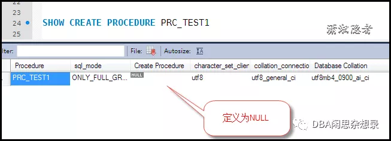

在其他RDBMS中，可以将查看某个存储过程（PROCEDURE）定义的权限单独授权给某个用户，例如在SQL Server中，可以单独将查看ProcedureName定义的权限授予UserA

```
GRANT VIEW DEFINITION ON ProcedureName TO UserA; --用具体的存储过程名和账号替换
```

那么在MySQL数据库中能否实现这个功能呢？找了很多资料，没有看到MySQL有这方面的权限，官方文档也没有涉及这样的权限，网上有个方法：可以通过授予用户查询mysql.proc这样的权限来间接实现这个功能

```
grant select on mysql.proc to usrname@'xxx.xxx.xxx.xxx';
```

个人简单测试了一下，这样授权后，发现还是有一些其他问题。

```
mysql> show create procedure prc_insert;  --没有授权前报这个错误。
ERROR 1305 (42000): PROCEDURE prc_insert does not exist
mysql> show create procedure prc_insert\G; --授权后
*************************** 1. row ***************************
           Procedure: prc_insert
            sql_mode: STRICT_TRANS_TABLES,NO_ENGINE_SUBSTITUTION
    Create Procedure: CREATE DEFINER=`root`@`localhost` PROCEDURE `prc_insert`(in  cnt int)
begin
declare i int;
set i=1;
while i < cnt do
    insert into test(id, name) select i,  CONCAT('name',i) from dual;
    
    set i = i+1;
 
end while;
end
character_set_client: utf8
collation_connection: utf8_general_ci
  Database Collation: latin1_swedish_ci
1 row in set (0.00 sec)

ERROR:
No query specified
```

**问题1：** 这样授权后，你能看到所有数据库存储过程的定义（不仅仅是某个存储过程，或某个数据库的存储过程的定义），  这里就涉及一个权限放大的问题。例如，我本来打算只授予用户A查看存储过程PRC_A的定义权限，但是那样授权后，A就能查看很多存储过程的定义，甚至还能查看一些没有访问权限数据库的存储过程的权限。严格意义上来说，这个授权是不合理的，而且是有问题的。

**问题2：** MySQL 8.0开始抛弃了mysql.proc，而且从MySQL 8.0开始，如果你要用SHOW CREATE PROCEDURE或SHOW CREATE FUNCION的话，需要有什么权限呢？。

MySQL 8.0开始，存储过程存储在mysql.routines和mysql.parameters系统表中，但是这些表无法直接访问，只能访问INFORMATION_SCHEMA.ROUTINES。像MySQL 8.0之前那样授权行不通了，


**Where are stored procedures stored?**

> Stored procedures are stored in  the mysql.routines and mysql.parameters tables, which are part of the  data dictionary. You cannot access these tables directly. Instead, query the INFORMATION_SCHEMA ROUTINES and PARAMETERS tables.  See Section 25.29, “The INFORMATION_SCHEMA ROUTINES Table”,  and Section 25.19, “The INFORMATION_SCHEMA PARAMETERS Table”. You can  also use SHOW CREATE FUNCTION to obtain information about stored  functions, and SHOW CREATE PROCEDURE to obtain information about stored  procedures. See Section 13.7.7.9, “SHOW CREATE PROCEDURE Statement”.

个人测试发现，授予alter routine后，就能查看存储过程的定义，但是这个授权也带来一个问题，授予权限的用户不仅可以查看存储过程定义，而且可以删除这个存储过程，

```
mysql> grant alter routine on procedure MyDB.prc_2 TO test@'192.168%';
Query OK, 0 rows affected (0.08 sec)

mysql>
```


**问题3：** 在MySQL 8.0, 如果用户test创建存储过程的时候，指定了DEFINER（没有指定的不会有这个问题）， 然后对于用户test2，即使授予了ALTER ROUTINE，那么它依然无法查看存储过程定义

```
CREATE DEFINER=`test`@`192.168%`  PROCEDURE PRC_TEST1(CNT  INT)
BEGIN
    DECLARE V_LOOP INT;
    SET V_LOOP = CNT;
    WHILE V_LOOP>0 DO
        INSERT INTO TEST(NAME,CREATE_DATE)  VALUES(REPEAT('A',800),DATE_ADD(NOW(),INTERVAL -RAND()*100000 MINUTE) );
        SET V_LOOP = V_LOOP - 1;
    END WHILE;
END 
```


test2用户使用命令SHOW CREATE PROCEDURE PRC_TEST1查看存储过程定义为NULL，也就是说即使授予了ALTER ROUTINE权限，但是如果存储过程有指定DEFINER，这样依然无法看到存储过程的定义



```
mysql> show grants for test2@'192.168%';
+-------------------------------------------------------------------------------+
| Grants for test2@192.168%                                                     |
+-------------------------------------------------------------------------------+
| GRANT USAGE ON *.* TO `test2`@`192.168%`                                      |
| GRANT SELECT, CREATE ROUTINE, ALTER ROUTINE ON `MyDB`.* TO `test2`@`192.168%` |
+-------------------------------------------------------------------------------+
2 rows in set (0.00 sec)
```

## 总结：

在MySQL5.7或之前版本，可以通过授予用户查询mysql.proc来间接实现查看存储过程定义的权限，在MySQL 8.0 可以通过授予用ALTER  ROUTINE的权限来间接实现查看存储过程定义的权限（如果存储过程有指定DEFINER，此方法无效），两者都有一个问题，那就是会放大权限，这个属于MySQL功能性的缺陷，短时间估计一直存在！其实对于MySQL的 存储过程，目前来说只有三种权限，而没有其它数据库VIEW DEFINITION之类的权限：

- ALTER ROUTINE 	编辑或删除存储过程
- CREATE ROUTINE 	创建存储过程
- EXECUTE		运行存储过程

## 参考资料：

*https://forums.mysql.com/read.php?60,386513,386513 http://ocelot.ca/blog/blog/2017/08/22/no-more-mysql-proc-in-mysql-8-0/*