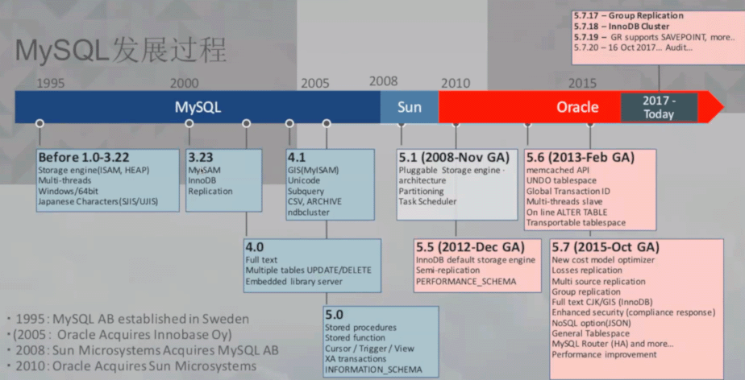

 知识体系

- hardware

  - 体系结构
  - 阵列卡
  - 硬盘
  - PCIE SSD

- OS

  - 初级SA以上水平
  - 脚本能力
  - 自动化运维能力
  - 基础安全能力

- DB

  - 索引
  - MVCC
  - 并发控制

- Other

  - 云服务
  - 其他数据库
  - 大数据，NoSQL
  - 软实力：沟通表达，情商

  

学习方法

- 手册，重点章节读一遍
- 数据库基础理论知识：事务、锁、B+树
- 边学习理论，边动手实践
- 有条件的话，边学习源码边动手实践验证
- 遇到问题时，先观察日志，自主思考可能的原因。实在无果后，提供详细信息（环境、场景、日志）向别人耐心请教。
- 多看手册及官网等靠谱只是来源，少直接网络搜索引擎

学习的误区

- 资料的搬运工
- 道听途说的经验
- 无脑迷信大佬
- 无脑迷信搜索引擎结果

提问的艺术

​	咨询具体SQL效率问题，提供

1. 执行show create table t1 
2. show index from t1
3. explain select ...  如果是update/delete 也改成select
4. show processlist

​	咨询MySQL性能问题，提供

1. 负载较高时，执行系统指令top
2. 负载较高时，执行系统指令vmstat -S m 1 20
3. 负载较高时，执行MySQL 指令 show processlist
4. 执行MySQL指令 show global variables
5. 执行MySQL指令show global status