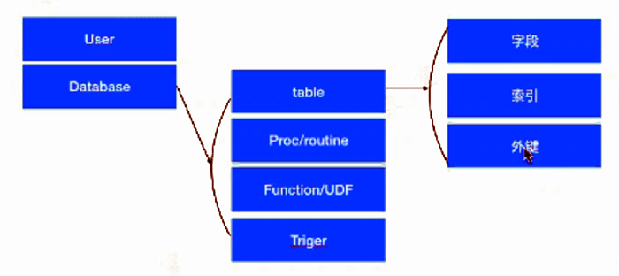

 

 

# MySQL 存储过程

缺点： 

- **MySQL没有执行计划缓存**，每次SQL存储过程都需要解析一下，导致CPU成为瓶颈。
- **MySQL每个SQL只能使用一个CPU core，也就是一个连接只能使用一个CPU core**（server层，目前InnoDB层可以使用到多核），导致CPU成为瓶颈。

好处：

- 可以适当的封装业务逻辑
- 减少前端和数据库的交互次数

 

PG存储过程属于商业行为，但存储引擎存在缺陷，对大量高并发IO存在问题，但数据量不大的复杂SQL运算（非高并发环境）较为友好。