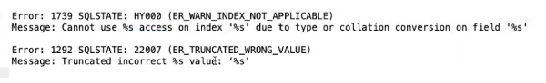

怎么一劳永逸的规避隐式转换？

 

# 实验结论

| where条件           | 结果                        | 结论                                                         |
| ------------------- | --------------------------- | ------------------------------------------------------------ |
| 整型=整型           | 无隐式转换                  |                                                              |
| 整型='字符型'       | 无隐式转换                  |                                                              |
| 字符型='字符型'     | 无隐式转换                  |                                                              |
| 字符型=整型         | 发生隐式转换                | where条件传值都加单引号''，避免隐式转换。<br>向字符串传入整型进行比较时，整型会被隐式转换为字符串，此时无法使用索引。 |
| 字符型=0            | 意外结果                    | 列中所有字符值都会匹配，此为意外结果。                       |
| 时间戳=整型         | 整型转换成日期时间          | 整型会自动转换成日期时间类型。                               |
| 时间戳='字符型'     | 无隐式转换                  |                                                              |
| 整型= Decimal浮点型 | 整型会被转换为Decimal浮点型 | 有一个参数是 decimal  类型，如果另外一个参数是 decimal 或者整数，会将整数转换为 decimal 后进行比较，如果另外一个参数是浮点数，则会把 decimal  转换为浮点数进行比较 |

 

1. 所有where条件传值都加引号，避免隐式转换发生
2. 进行条件比较时，应该保证数据类型一致

 

# 实验步骤：

- 创建一个表先：

```
mysql> create table t1 ( c1 int(11) not null, 
c2 int(10) unsigned not null, 
c3 varchar(10) default null, 
c4 int unsigned not null default '0',
dt timestamp not null default current_timestamp on update current_timestamp,
primary key (c1), 
key c2k(c2), 
key c3k(c3),
Key c4k(c4),
Key dtk(dt)
) engine=InnoDB;
Query OK, 0 rows affected, 2 warnings (0.15 sec)
```

 

- 插入一些数据：

```
mysql> select * from t1;
+----+----+------+----+---------------------+
| c1 | c2 | c3  | c4 | dt         |
+----+----+------+----+---------------------+
| 1 | 2 | a  | 0 | 2020-04-01 20:38:33 |
| 2 | 3 | b  | 0 | 2020-04-01 20:38:33 |
| 3 | 4 | c  | 0 | 2020-04-01 20:38:33 |
| 4 | 5 | d  | 0 | 2020-04-01 20:38:33 |
| 9 | 9 | 9  | 0 | 2020-04-01 20:38:33 |
| 10 | 10 | 10  | 0 | 2020-04-01 22:22:22 |
+----+----+------+----+---------------------+
6 rows in set (0.03 sec)
```

 

## S1：where 整型=整型

```
mysql> desc select * from t1 where c2=2\G
*************************** 1. row ***************************
      id: 1
 select_type: SIMPLE
    table: t1
  partitions: NULL
     type: ref
possible_keys: c2k
     key: c2k    无隐式转换
   key_len: 4
     ref: const
     rows: 1
   filtered: 100.00
    Extra: NULL
1 row in set, 1 warning (0.03 sec)
 
```

## S2：where 整型='字符型'

```
mysql> desc select * from t1 where c2='2'\G
*************************** 1. row ***************************
      id: 1
 select_type: SIMPLE
    table: t1
  partitions: NULL
     type: ref
possible_keys: c2k
     key: c2k    无隐式转换
   key_len: 4
     ref: const
     rows: 1
   filtered: 100.00
    Extra: NULL
1 row in set, 1 warning (0.05 sec)
```

 

## S3：where 字符型='字符型'

```
mysql> desc select * from t1 where c3='a'\G
*************************** 1. row ***************************
      id: 1
 select_type: SIMPLE
    table: t1
  partitions: NULL
     type: ref
possible_keys: c3k
     key: c3k    无隐式转换
   key_len: 43
     ref: const
     rows: 1
   filtered: 100.00
    Extra: NULL
1 row in set, 1 warning (0.01 sec)
 
mysql> desc select * from t1 where c3='9'\G
*************************** 1. row ***************************
      id: 1
 select_type: SIMPLE
    table: t1
  partitions: NULL
     type: ref
possible_keys: c3k
     key: c3k    无隐式转换
   key_len: 43
     ref: const
     rows: 1
   filtered: 100.00
    Extra: NULL
1 row in set, 1 warning (0.00 sec)
```

 

## S4：where 字符型='整型'

```
mysql> desc select * from t1 where c3=9\G
*************************** 1. row ***************************
      id: 1
 select_type: SIMPLE
    table: t1
  partitions: NULL
     type: ALL
possible_keys: c3k
     key: NULL    发生了隐式转换
   key_len: NULL
     ref: NULL
     rows: 5
   filtered: 20.00
    Extra: Using where
1 row in set, 3 warnings (0.01 sec)
```

 

## S5：where 字符型= 0

```
mysql> select * from t1 where c3=0;
+----+----+------+
| c1 | c2 | c3  |
+----+----+------+
| 1 | 2 | a  |
| 2 | 3 | b  |
| 3 | 4 | c  |
| 4 | 5 | d  |
+----+----+------+
4 rows in set, 4 warnings (0.01 sec)
 
mysql> show warnings;
+---------+------+---------------------------------------+
| Level  | Code | Message                |
+---------+------+---------------------------------------+
| Warning | 1292 | Truncated incorrect DOUBLE value: 'a' |
| Warning | 1292 | Truncated incorrect DOUBLE value: 'b' |
| Warning | 1292 | Truncated incorrect DOUBLE value: 'c' |
| Warning | 1292 | Truncated incorrect DOUBLE value: 'd' |
+---------+------+---------------------------------------+
4 rows in set (0.00 sec)
 
mysql> select * from t1;
+----+----+------+----+---------------------+
| c1 | c2 | c3  | c4 | dt         |
+----+----+------+----+---------------------+
| 1 | 2 | a  | 0 | 2020-04-01 20:38:33 |
| 2 | 3 | b  | 0 | 2020-04-01 20:38:33 |
| 3 | 4 | c  | 0 | 2020-04-01 20:38:33 |
| 4 | 5 | d  | 0 | 2020-04-01 20:38:33 |
| 9 | 9 | 9  | 0 | 2020-04-01 20:38:33 |
| 10 | 10 | 10  | 0 | 2020-04-01 22:22:22 |
+----+----+------+----+---------------------+
6 rows in set (0.03 sec)
```

 



 

## S6：where everything= NULL          ------错误使用

```
mysql> desc select * from t1 where c3=null\G
*************************** 1. row ***************************
      id: 1
 select_type: SIMPLE
    table: NULL
  partitions: NULL
     type: NULL
possible_keys: NULL
     key: NULL
   key_len: NULL
     ref: NULL
     rows: NULL
   filtered: NULL
    Extra: no matching row in const table
1 row in set, 1 warning (0.00 sec)
 
mysql> desc select * from t1 where c1=null\G
*************************** 1. row ***************************
      id: 1
 select_type: SIMPLE
    table: NULL
  partitions: NULL
     type: NULL
possible_keys: NULL
     key: NULL
   key_len: NULL
     ref: NULL
     rows: NULL
   filtered: NULL
    Extra: no matching row in const table
1 row in set, 1 warning (0.01 sec)
```

 

## S7：where timestamp=整型

```
mysql> desc select * from t1 where dt=20200401222222\G
*************************** 1. row ***************************
      id: 1
 select_type: SIMPLE
    table: t1
  partitions: NULL
     type: ref
possible_keys: dtk
     key: dtk    无隐式转换
   key_len: 4
     ref: const
     rows: 1
   filtered: 100.00
    Extra: NULL
1 row in set, 1 warning (0.01 sec)
 
```

## S8：where timestamp= '字符型'

```
mysql> desc select * from t1 where dt='20200401222222'\G
*************************** 1. row ***************************
      id: 1
 select_type: SIMPLE
    table: t1
  partitions: NULL
     type: ref
possible_keys: dtk
     key: dtk    无隐式转换
   key_len: 4
     ref: const
     rows: 1
   filtered: 100.00
    Extra: NULL
1 row in set, 1 warning (0.06 sec)
```

##  补充实验：

- 创建表

  ```
  CREATE TABLE `u1` (
   `c1` int NOT NULL,
   `c2` int unsigned NOT NULL,
   `c3` decimal(30,10) NOT NULL,
   PRIMARY KEY (`c1`),
   KEY `c2k` (`c2`),
   KEY `c3k` (`c3`)
  ) ENGINE=InnoDB
  ```

- 插入数据

  ```
  mysql> select * from u1;
  +----+----+---------------+
  | c1 | c2 | c3      |
  +----+----+---------------+
  | 1 | 2 | 3.0000000000 |
  | 2 | 3 | 4.0000000000 |
  | 3 | 4 | 5.0000000000 |
  | 5 | 6 | 10.0000000000 |
  +----+----+---------------+
  4 rows in set (0.00 sec)
  ```

## S9：where 整型= Decimal浮点型

```
mysql> desc select * from u1 where c2=5.1;
+----+-------------+-------+------------+------+---------------+------+---------+------+------+----------+------------------+
| id | select_type | table | partitions | type | possible_keys | key | key_len | ref | rows | filtered | Extra      |
+----+-------------+-------+------------+------+---------------+------+---------+------+------+----------+------------------+
| 1 | SIMPLE   | NULL | NULL    | NULL | NULL     | NULL | NULL  | NULL | NULL |   NULL | Impossible WHERE |
+----+-------------+-------+------------+------+---------------+------+---------+------+------+----------+------------------+
1 row in set, 1 warning (0.00 sec)
 
mysql> desc select * from u1 where c3=5.1;
+----+-------------+-------+------------+------+---------------+------+---------+-------+------+----------+-------+
| id | select_type | table | partitions | type | possible_keys | key | key_len | ref  | rows | filtered | Extra |
+----+-------------+-------+------------+------+---------------+------+---------+-------+------+----------+-------+
| 1 | SIMPLE   | u1  | NULL    | ref | c3k      | c3k | 14   | const |  1 |  100.00 | NULL |
+----+-------------+-------+------------+------+---------------+------+---------+-------+------+----------+-------+
1 row in set, 1 warning (0.00 sec)
```