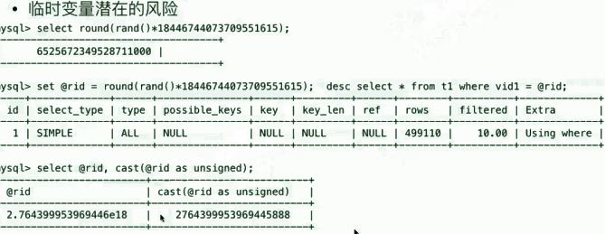

# 临时变量潜在的风险

```
mysql> set @rid = round(rand()*18446744073709551615); select @rid,cast(@rid as unsigned);
Query OK, 0 rows affected (0.00 sec)
 
+----------------------+------------------------+
| @rid         | cast(@rid as unsigned) |
+----------------------+------------------------+
| 1.084977309991938e19 |  9223372036854775808 |
+----------------------+------------------------+
1 row in set (0.00 sec)
 
 
用rand生成临时变量值作为条件时，可能会发生问题，也可能不发生问题。
 
rand()生成值为浮点型，经过round()计算后依然为浮点。
所以使用decimal浮点型和int进行条件时，int会被转换成decimal！！！
这样的话，就用不了索引了！因为对条件列做转换了。
 
```

但是有个奇怪的现象：

使用这个 round(rand()计算) 函数参与条件赋值的结果并不稳定，时而用上索引，时而用不上。

 

```
mysql> set @rid = round(rand()*11100000000); desc select * from t1 where c2 = @rid;
Query OK, 0 rows affected (0.00 sec)
 
+----+-------------+-------+------------+------+---------------+------+---------+------+------+----------+--------------------------------+
| id | select_type | table | partitions | type | possible_keys | key | key_len | ref | rows | filtered | Extra             |
+----+-------------+-------+------------+------+---------------+------+---------+------+------+----------+--------------------------------+
| 1 | SIMPLE   | NULL | NULL    | NULL | NULL     | NULL | NULL  | NULL | NULL |   NULL | no matching row in const table |
+----+-------------+-------+------------+------+---------------+------+---------+------+------+----------+--------------------------------+
1 row in set, 1 warning (0.00 sec)
 
mysql> set @rid = round(rand()*11100000000); desc select * from t1 where c2 = @rid;
Query OK, 0 rows affected (0.00 sec)
 
+----+-------------+-------+------------+------+---------------+------+---------+-------+------+----------+-------+
| id | select_type | table | partitions | type | possible_keys | key | key_len | ref  | rows | filtered | Extra |
+----+-------------+-------+------------+------+---------------+------+---------+-------+------+----------+-------+
| 1 | SIMPLE   | t1  | NULL    | ref | c2k      | c2k | 4    | const |  1 |  100.00 | NULL |
+----+-------------+-------+------------+------+---------------+------+---------+-------+------+----------+-------+
1 row in set, 1 warning (0.00 sec)
 
 
+++++++++++++++++++++++++++++++++++++++++++++++++++++++++++++++++++++++++++++++++++++++++++++++++++++++++++++++++++++++++++++++++++++++++++++++
```

使用实值去导入查询，可以验证为：**所以使用decimal浮点型和int进行条件时，int会被转换成decimal！！！**，这就说得通了一部分。

存疑：round()函数计算完，一定是就是没有小数位的数字（n.0）数据类型为decimal，此时理论上会导致where子句中int条件的数据类型隐性转换为decimal，但用实值(999.0)做测试，没有转换，只有使用真实包含小数的实值，才会发生转换。那么，使用round()函数参与条件赋值时，为何会发生隐式转换呢？ 这是缺陷么？

 

```
mysql> desc select * from t1 where c2 = 999.12378688768326;
+----+-------------+-------+------------+------+---------------+------+---------+------+------+----------+------------------+
| id | select_type | table | partitions | type | possible_keys | key | key_len | ref | rows | filtered | Extra      |
+----+-------------+-------+------------+------+---------------+------+---------+------+------+----------+------------------+
| 1 | SIMPLE   | NULL | NULL    | NULL | NULL     | NULL | NULL  | NULL | NULL |   NULL | Impossible WHERE |
+----+-------------+-------+------------+------+---------------+------+---------+------+------+----------+------------------+
1 row in set, 1 warning (0.00 sec)
 
mysql> desc select * from t1 where c2 = 999;
+----+-------------+-------+------------+------+---------------+------+---------+-------+------+----------+-------+
| id | select_type | table | partitions | type | possible_keys | key | key_len | ref  | rows | filtered | Extra |
+----+-------------+-------+------------+------+---------------+------+---------+-------+------+----------+-------+
| 1 | SIMPLE   | t1  | NULL    | ref | c2k      | c2k | 4    | const |  1 |  100.00 | NULL |
+----+-------------+-------+------------+------+---------------+------+---------+-------+------+----------+-------+
1 row in set, 1 warning (0.00 sec)
 
mysql> desc select * from t1 where c2 = 999.0;
+----+-------------+-------+------------+------+---------------+------+---------+-------+------+----------+-------+
| id | select_type | table | partitions | type | possible_keys | key | key_len | ref  | rows | filtered | Extra |
+----+-------------+-------+------------+------+---------------+------+---------+-------+------+----------+-------+
| 1 | SIMPLE   | t1  | NULL    | ref | c2k      | c2k | 4    | const |  1 |  100.00 | NULL |
+----+-------------+-------+------------+------+---------------+------+---------+-------+------+----------+-------+
1 row in set, 1 warning (0.00 sec)
 
 
```

避免方法：

<font color=red>使用cast() 函数强制转换为unsigned类型</font>

```
select cast(rand()*11100000000 as unsigned) into @rid;desc select * from t1 where c2 = @rid;
```
但是在我实验中，没什么用。除非调小乘数，否则依然时而走索引，时而不走索引。
我觉得可能存在bug ，或者有未知领域的知识。  
目前得出的结论就是 ，保险起见， 乘数别太大，然后使用cast() 函数取代round() 函数。



