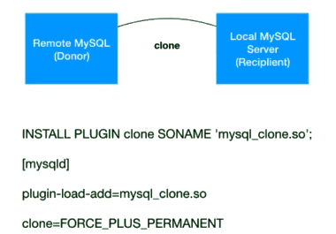

# MySQL Clone plugin (since MySQL 8.0)

[TOC]


- MySQL 8.0.17 后引入了clone plugin

  - 可备份到本地（替代xtrabackup）

    ```
    clone local data directory='${backupdir}'
    ```

  - 可以从远程备份（远程直接建立主从、MGR节点）

    ```
    clone instance 'clone_user'@remote_host:port identified by 'pwd';
    clone instance 'clone_user'@remote_host:port identified by 'pwd' data directory='${local_data_dir}'
    ```

    

- 8.0.17的几个bug：
  - `sql_require_primary_key = off  `#on则影响安装
  - `read_only = 1 `#为0则可能影响安装
  - `explicit_defaults_for_timestamp = on `  #off则可能影响安装
  - `mysqlx_port = $PORT+0` # 未配置可能影响使用。 确定配置成功的办法：error日志中能看到x_port监听启动。

# 安装：
  ```
root@localhost [(none)]>install plugin clone soname 'mysql_clone.so';
  ```

- 安装后在my.cnf配置文件中加入：
  ```
[mysqld]
plugin-load-add=mysql_clone.so
  ```

- 确认安装成功：
  ```
show plugins; 中看到clone~~~~~
| clone              | ACTIVE  | CLONE       | mysql_clone.so | GPL   |
  ```

- 备份：
  ```
root@localhost [(none)]>clone local data directory='/data/clonebackup/3307';
  ```

- 完事了。

- 试试用备份的东西起个新实例。


# 远程备份

- 权限需求

  ```
  create user 'clone' identified by 'clone';
  grant backup_admin,clone_admin on *.* to clone;
  install plugin clone soname 'mysql_clone.so';
  
  		-- clone_admin = backup_admin + shutdown_admin
  ```

- 接收节点

  ```
  set global clone_valid_donor_list='127.0.0.1:3306';
  clone instance from clone@127.0.0.1:3306 identified by 'clone';
  ```

  - 注意：
    	1. 用mysqld_safe启动服务，否则会出现`ERROR 3707:restart server failed (mysqld is not managed by supervisor process)`
     	2. mysqlx_port端口也需要正确配置，否则会出现`clone Donor plugin group_replication is not active in recipient.`

目前来说，不是十分稳定。


# clone plugin 不锁表原理：

performance_schema.log_status 专为clone plugin设计。在select调用该表期间，会对binlog加x锁，也就是访问该表的时候binlog无法写入。——写redo前会先写binlog，无法写便无法commit。（flush redo --> flush binlog --> commit）
  ```
mysql> select * from performance_schema.log_status \G
*************************** 1. row ***************************
    SERVER_UUID: f9af5ee2-eb09-11ea-af0d-0242c0a8bc51
          LOCAL: {"gtid_executed": "", "binary_log_file": "mysql-bin.000003", "binary_log_position": 155}
    REPLICATION: {"channels": []}
STORAGE_ENGINES: {"InnoDB": {"LSN": 19907124, "LSN_checkpoint": 19907124}}
1 row in set (0.02 sec)
  ```


- MySQL 8.0备份可用的锁逻辑
  - `lock instance for backup;`
  - `flush tables tb1_name[, tb2_name] ... with read lock;`
  - `unlock table;`
  - `unlock instance;`


- 利用clone plugin方式搭建从库的简单步骤

  - 源库（master）

    ```
    install plugin clone soname 'mysql_clone.so';
    create user 'clone'@'%' identified by 'clone';
    grant backup_admin on *.* to 'clone'@'%';
    ```

  - 目标库（slave）

    ```
    install plugin clone soname 'mysql_clone.so';
    set global clone_valid_donor_list='192.168.11.11:3306';
    show global variables like '%clone%';
    create user 'clone'@'%' identified by 'clone';
    grant clone_admin on *.* to 'clone'@'%';
    set global log_error_verbosity=3;
    clone instance from 'clone'@'192.168.11.11:3306' identified by 'clone';
    ...
    ...
    启动成功后
    mysql> \s
    ```

     

     


# MySQL Clone plugin 安装问题清单

如果`mysql> install plugin clone soname 'mysql_clone.so';`执行后报错如：

```
ERROR 1123 (HY000): Can't initialize function 'clone'; Plugin initialization function failed.
```

ERROR log中提示：

```
[ERROR] [MY-013272] [Clone] Plugin Clone reported: 'Client: PFS table creation failed.'
[ERROR] [MY-010202] [Clone] Plugin 'clone' init function returned error.
```

根本没法确认是什么问题，可以去查看以下几个list，当设置为此时都会导致clone 安装失败：

1. `sql_require_primary_key = on`
2. `read_only =1`
3. `explicit_defaults_for_timestamp = off`

