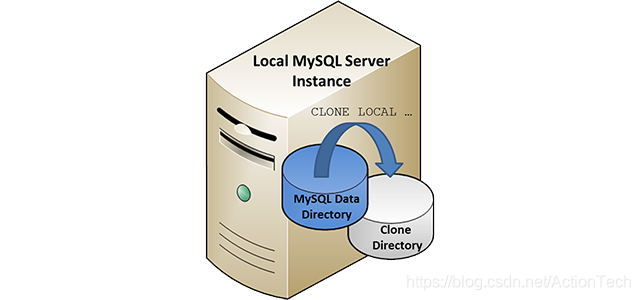
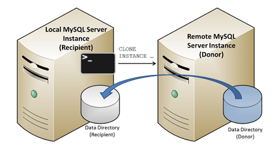

MySQL Clone Plugin 实现用SQL进行备份

张充 老叶茶馆

**导读**

作者张充，知数堂优秀学员，多年DBA经验，擅长MySQL、SQL Server。

**什么是Clone Plugin？**

  MySQL 8.0.17推出的插件，利用克隆插件，可以扩展实现：

- ​        SQL命令进行备份。
- ​        Slave节点快速搭建。
- ​        MGR节点快速扩充。

 

而克隆插件的基础功能，我的描述是：

- 可以对本身的实例的InnoDB数据，备份到本服务器的指定目录中。（本地克隆：本地备份）
- 可以将远程实例的InnoDB数据还原到当前的实例中。（远端克隆：远端备份      + 本实例自动还原）
- 可以将远程实例的InnoDB数据还原到当前的实例的其他目录中。（远端克隆：远端备份）

 

**一、安装Clone Plugin**

  **1. 每次启动MySQL进程，自动加载插件**
  ```
  [mysqld]plugin-load-add=mysql_clone.soclone=FORCE_PLUS_PERMANENT
  ```
 **2. 在已经运行中的MySQL，手动加载插件**
  ```
  INSTALL PLUGIN clone SONAME 'mysql_clone.so';
  ```
 执行INSTALL PLUGIN命令后，会注册到mysql.plugins表中，所以下次重启该实例会自动加载插件，无需再依赖plugin-load-add

 

  **3. 查看插件状态**
  ```
  SELECT PLUGIN_NAME, PLUGIN_STATUS FROM INFORMATION_SCHEMA.PLUGINS WHERE PLUGIN_NAME = 'clone';

  +*-------------+---------------+*
  | PLUGIN_NAME | PLUGIN_STATUS |
  +*-------------+---------------+*
  | clone    | ACTIVE    |
  +*-------------+---------------+*
  ```


  **4. 卸载插件**
  ```
  UNINSTALL PLUGIN clone;
  ```
  **5. 导致插件安装失败的原因**

​     如设置：set session explicit_defaults_for_timestamp = 0; 
  ```
  mysql> INSTALL PLUGIN clone SONAME 'mysql_clone.so';ERROR 1123 (HY000): Can't initialize function 'clone'; 

  Plugin initialization function failed.
  ```
**二、本地克隆 + 还原**

 本地克隆操作会将数据从启动克隆操作的MySQL服务器实例克隆到运行MySQL服务器实例的同一服务器或节点上的目录中。




 **1. 注意事项**     

  1. 只克隆innodb存储引擎的数据。非INNODB引擎的表只会生成空表。
  2. 不会克隆原实例的全部目录结构，只克隆了data目录下的相关数据。
  3. 克隆的目标目录必须不存在，克隆过程会生成该目录，所以原实例的启动账户要有建目录的权限。
  4. 克隆后的目录会自动设置：mysql:mysql
  5. 克隆目标目录不会生成原实例自定义的innodb_undo_directory
  6. 克隆不会拷贝原实例的binlog文件

 **2. 执行本地克隆（需要登录原实例）**
  1. 创建执行克隆命令的MySQL User，权限需要BACKUP_ADMIN
  ```
mysql> GRANT BACKUP_ADMIN ON *.* TO 'clone_user';
  ```

  2. 使用具有BACKUP_ADMIN的账号，登录到原实例中，执行：
  ```
mysq> clone local data directory = '/data/mysql_3307/data';Query OK, 0 rowsaffected (20.40 sec)
  ```
  3. 查看克隆的进度
  ```
mysql> SELECT STAGE, STATE, END_TIME FROM performance_schema.clone_progress;+-----------+-------------+----------------------------+
| STAGE   | STATE    | END_TIME          |
+-----------+-------------+----------------------------+
| DROP DATA | Completed  | 2020-04-06 10:45:10.212434 |
| FILE COPY | Completed  | 2020-04-06 10:45:20.605570 |
| PAGE COPY | Completed  | 2020-04-06 10:45:20.909818 |
| REDO COPY | Completed  | 2020-04-06 10:45:21.112235 |
| FILE SYNC | Completed  | 2020-04-06 10:45:30.611554 |
| RESTART  | Not Started | NULL            |
| RECOVERY | Not Started | NULL            |
+-----------+-------------+----------------------------+
  ```
 **3. 本地启动克隆实例，以3307端口启动**

**假设donor中的数据目录结构:**
  ```
 ├── data 
 ├── ib_buffer_pool 
 ├── ibdata1 
 ├── ib_logfile0 
 ├── ib_logfile1 
 ├── mybinlog.index 
 ├── mybinlog.000001 
 ├── mybinlog.000002 
 ├── mysql 
 ├── mysql.ibd 
 ├── sys  
   └── sys_config.ibd 
 ├── undolog 
   └── undo_001  
   └── undo_002
 ├── logs 
   └── slow.log 
   └── error.log
 ├── my.cnf
 └── tmp 
   └── mysql.sock
  ```
  **clone后的目录结构:**
  ```
├── #clone
│  ├── #replace_files
│  ├── #status_fix
│  ├── #view_progress
│  └── #view_status
├── ib_buffer_pool
├── ibdata1
├── ib_logfile0
├── ib_logfile1
├── mysql
├── mysql.ibd
├── sys
│  └── sys_config.ibd
├── undo_001
└── undo_002
  ```
 对比donor的原始目录结构和clone后的结构，会发现：

-  除了data外的目录都没有创建
- clone后的目录没有binlog文件
- clone后的目录undo目录缺失，但是undo文件放在了clone目录下

所以还原后想采用clone文件启动实例，用原先的my.cnf文件是无法成功的：
  ```
/usr/local/mysql8019/bin/mysqld *--defaults-file=/data/mysql_3307/my.cnf &*
..
[Note]  [MY-012905] [InnoDB] Cannot create /data/mysql_3307/data/undolog/undo_001 
...because ./undo_001 already uses Space ID=4294967279! Did you change innodb_undo_directory?
[ERROR] [MY-012930] [InnoDB] Plugin initialization aborted with error Invalid Filename.
[ERROR] [MY-010334] [Server] Failed to initialize DD Storage Engine
[ERROR] [MY-010020] [Server] Data Dictionary initialization failed. 
  ```
*# 因为克隆过程，会将自定义的**undo**目录下的**undo**文件* *#* *会与数据文件一起拷贝到一层目录下，并且不会生成原实例的自定义**undo**目录。*

**那么我的还原姿势：**

  1.  将donor的非data目录建立上(原目录：data、logs、tmp)：

  ```
mkdir /data/mysql_3307/{logs,tmp} -p
  
 # /data/mysql_3307/data目录为clone dir，已存在。
  ```
  2.  将donnor指定的innodb_undo_directory目录建立,并将undo文件移动到该目录中
  ```
mkdir /data/mysql_3307/data/undolog
mv /data/mysql_3307/data/undo_00* /data/mysql_3307/data/undolog/
  ```

  3.  授权
  ```
chown -R mysql:mysql /data/mysql_3307/
  ```

  4. 再次启动MySQL，成功
  ```
/usr/local/mysql8019/bin/mysqld --defaults-file=/data/mysql_3307/my.cnf &
  ```
**三、 远程克隆数据**

从远程的donor上，克隆数据到本地。




 

**1. 注意事项** 

1. 执行CLONE INSTANCE在非donor实例上执行。
2. 不指定DATA DIRECTORY，将先清空本地数据，再做克隆拷贝，并自动重启MySQL实例（建议mysqld_safe启动）。
3. 若指定DATA DIRECTORY，本地磁盘空间需要更多的空间（克隆数据+本地历史数据），不会自动重启MySQL实例
4. donor 和 recipient的MySQL版本要一致，并且至少8.0.17或者更高的版本。
5. donor 和 recipient的操作系统不能跨平台。
6. donor 和 recipient需要具有相同的字符集和排序规则。
7. donor 和 recipient需要设置相同的 innodb_page_size and innodb_data_file_path
8. 如果克隆了加密或者页压缩的数据，donor 和 recipient需要保持一样的文件系统块大小。
9. 克隆命令将以1MB的包大小传输，所以donor 和 recipient的 max_allowed_packet至少要设置2MB。

 

2. 执行远程克隆命令
   1. donor上创建用于克隆的MySQL用户，指定BACKUP_ADMIN权限
  ```
mysql> CREATE USER 'donor_clone_user'@'example.donor.host.com' IDENTIFIED BY 'password';

mysql> GRANT BACKUP_ADMIN on *.* to 'donor_clone_user'@'example.donor.hos
  ```

  2.donor上安装Clone Plugin插件
  ```
mysql> INSTALL PLUGIN clone SONAME 'mysql_clone.so';
  ```

  3. recipient上创建用于克隆的MySQL用户，指定CLONE_ADMIN权限
  ```
（CLONE_ADMIN包含了BACKUP_ADMIN、SHUTDOWN权限）
mysql> CREATE USER 'recipient_clone_user'@'example.recipient.host.com' IDENTIFIED BY 'password';

mysql> GRANT CLONE_ADMIN on *.* to 'recipient_clone_user'@'example.recipient.host.com';
  ```

  4. recipient上安装Clone Plugin插件 
  ```
mysql> INSTALL PLUGIN clone SONAME 'mysql_clone.so';
  ```

  5. recipient上设置donor列表参数
  ```
mysql> SET GLOBAL clone_valid_donor_list = 'example.donor.host.com:3306';
  ```

  6. recipient上执行clone命令
  ```
CLONE INSTANCE FROM 'user'@'host':portIDENTIFIED BY 'password'[DATA DIRECTORY [=] 'clone_dir'][REQUIRE [NO] SSL];
  ```


**四、 停止正在进行的克隆操作**

  执行SQL命令：KILL QUERY PROCESS_ID
  ```
mysql> SELECT * FROM performance_schema.clone_status\G
*************************** 1. row ***************************
        ID: 1
​       PID: 8
​     STATE: In Progress
BEGIN_TIME: 2019-07-15 11:58:36.767
​   END_TIME: NULL
​     SOURCE: LOCAL INSTANCE
DESTINATION: /path/to/clone_dir/
   ERROR_NO: 0
ERROR_MESSAGE:
  BINLOG_FILE:
BINLOG_POSITION: 0
GTID_EXECUTED:

mysql> kill query 8;
  ```
**五、其他注意事项**

- 克隆操作期间不允许DDL（包括TRUNCATE      TABLE）。
- 一次只能克隆一个MySQL实例。不支持在单个克隆操作中克隆多个MySQL实例。
- 远程克隆操作（在CLONE      INSTANCE语句中指定Donor的MySQL服务器实例的端口号时）不支持mysqlx_port指定的X协议端口。
- clone插件不支持MySQL配置参数的克隆。
- clone插件不支持二进制日志的克隆。
- 克隆插件仅克隆存储在InnoDB中的数据。其他存储引擎数据未克隆。存储在任何数据库（包括sys模式）中的MyISAM和CSV表都被克隆为空表。