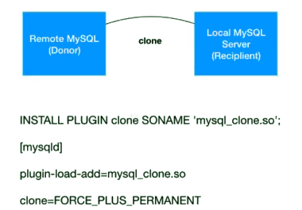

作者：陈俊聪

------

### **背景**

很神奇，5.7.17 和 8.0.17，连续两个17小版本都让人眼前一亮。前者加入了组复制(Group Replication)功能，后者加入了克隆插件(Clone Plugin)功能。今天我们实战测试一下这个新功能。

 

### **克隆插件简介**

克隆插件允许在本地或从远程 MySQL 实例克隆数据。克隆数据是存储在 InnoDB 其中的数据的物理快照，其中包括库、表、表空间和数据字典元数据。克隆的数据包含一个功能齐全的数据目录，允许使用克隆插件进行 MySQL 服务器配置。

 

### **克隆插件支持两种克隆方式**

- 本地克隆
- 远程克隆

 

### **本地克隆**

本地克隆操作将启动克隆操作的 MySQL 服务器实例中的数据克隆到同服务器或同节点上的一个目录里


 

### **远程克隆**

默认情况下，远程克隆操作会删除接受者(recipient)数据目录中的数据，并将其替换为捐赠者(donor)的克隆数据。（可选）您也可以将数据克隆到接受者的其他目录，以避免删除现有数据。



远程克隆操作和本地克隆操作克隆的数据没有区别，数据是相同的。

克隆插件支持复制。除克隆数据外，克隆操作还从捐赠者中提取并传输复制位置信息，并将其应用于接受者，从而可以使用克隆插件来配置组复制或主从复制。使用克隆插件进行配置比复制大量事务要快得多，效率更高。

 

### **实战部分**

一、本地克隆

### **安装克隆插件**

启动前

```
[mysqld]

plugin-load-add=mysql_clone.so
```

或运行中

```
INSTALL PLUGIN clone SONAME 'mysql_clone.so';
```

**|** 第二种方法会注册到元数据，所以不用担心重启插件会失效。两种方法都很好用

检查插件有没有启用

```
mysql> SELECT PLUGIN_NAME, PLUGIN_STATUS
FROM INFORMATION_SCHEMA.PLUGINS
WHERE PLUGIN_NAME LIKE 'clone';

+-------------+---------------+
| PLUGIN_NAME | PLUGIN_STATUS |
+-------------+---------------+
| clone | ACTIVE |
+-------------+---------------+


1 row in set (0.01 sec)
```

设置强制启动失败参数

```
[mysqld]
plugin-load-add=mysql_clone.so
clone=FORCE_PLUS_PERMANENT
```

**|** 如果克隆插件对你们很重要，可以设置clone=FORCE_PLUS_PERMANENT或clone=FORCE。作用是：如果插件未成功初始化，就会强制mysqld启动失败。

### **克隆需要的权限**

需要有备份锁的权限。备份锁是 MySQL 8.0 的新特性之一，比5.7版本的flush table with read lock要轻量。

```
mysql> CREATE USER clone_user@'%' IDENTIFIED by 'password';

mysql> GRANT BACKUP_ADMIN ON *.* TO 'clone_user'; # BACKUP_ADMIN是MySQL8.0 才有的备份锁的权限
```

**执行本地克隆**

```
mysql -uclone_user -ppassword -S /tmp/mysql3008.sock

mysql> CLONE LOCAL DATA DIRECTORY = '/fander/clone_dir';
```

**|** 例子中需要 MySQL 的运行用户拥有 fander 目录的rwx权限，要求 clone_dir 目录不存在

**本地克隆的步骤如下**

- DROP DATA
- FILE COPY
- PAGE COPY
- REDO COPY
- FILE SYNC

观察方法如下

```
mysql> SELECT STAGE, STATE, END_TIME FROM performance_schema.clone_progress;
+-----------+-------------+----------------------------+
| STAGE | STATE | END_TIME |
+-----------+-------------+----------------------------+
| DROP DATA | Completed | 2019-07-25 21:00:18.858471 |
| FILE COPY | Completed | 2019-07-25 21:00:19.071174 |
| PAGE COPY | Completed | 2019-07-25 21:00:19.075325 |
| REDO COPY | Completed | 2019-07-25 21:00:19.076661 |
| FILE SYNC | Completed | 2019-07-25 21:00:19.168961 |
| RESTART | Not Started | NULL |
| RECOVERY | Not Started | NULL |
+-----------+-------------+----------------------------+
7 rows in set (0.00 sec)
```

当然还有另外一个观察方法

```
mysql> set global log_error_verbosity=3;
Query OK, 0 rows affected (0.00 sec)
 
mysql> CLONE LOCAL DATA DIRECTORY = '/fander/clone6_dir';
Query OK, 0 rows affected (0.24 sec)
 
[root@192-168-199-101 data]# tailf mysql-error.err
2019-07-25T22:22:58.261861+08:00 8 [Note] [MY-013457] [InnoDB] Clone Begin Master Task by root@localhost
2019-07-25T22:22:58.262422+08:00 8 [Note] [MY-013457] [InnoDB] Clone Apply Master Loop Back
2019-07-25T22:22:58.262523+08:00 8 [Note] [MY-013457] [InnoDB] Clone Apply Begin Master Task
...
2019-07-25T22:22:58.471108+08:00 8 [Note] [MY-013458] [InnoDB] Clone Apply State FLUSH DATA:
2019-07-25T22:22:58.472178+08:00 8 [Note] [MY-013458] [InnoDB] Clone Apply State FLUSH REDO:
2019-07-25T22:22:58.506488+08:00 8 [Note] [MY-013458] [InnoDB] Clone Apply State DONE
2019-07-25T22:22:58.506676+08:00 8 [Note] [MY-013457] [InnoDB] Clone Apply End Master Task ID: 0 Passed, code: 0:
2019-07-25T22:22:58.506707+08:00 8 [Note] [MY-013457] [InnoDB] Clone End Master Task ID: 0 Passed, code: 0:
```

### **测试，起一个克隆的实例**

```
/opt/mysql8.0/bin/mysqld --datadir=/fander/clone_dir --port=3333 --socket=/tmp/mysql3333.sock --user=mysql3008user --lower-case-table-names=1 --mysqlx=OFF
 
#解释，因为我没有使用my.cnf，所以加了比较多参数
#--datadir 指定启动的数据目录
#--port 指定启动的MySQL监听端口
#--socket 指定socket路径
#--user `捐赠者`的目录权限是mysql3008user:mysql3008user,用户也是mysql3008user，我没有修改
#--lower-case-table-names=1 同`捐赠者`
#--mysqlx=OFF 不关闭的话，默认mysqlx端口会合`捐赠者`的33060重复冲突
 
#登录检查
mysql -uroot -proot -S /tmp/mysql3333.sock
mysql> show master status\G # 可见GTID是`捐赠者`的子集，所以说明`接受者`直接和`捐赠者`建主从复制是很简单的
```

二、远程克隆

### **远程克隆的前提条件和限制**

- 捐赠者和接受者都需要安装克隆插件

- 捐赠者和接受者分别需要有至少BACKUP_ADMIN/CLONE_ADMIN权限的账号

  **|** 暗示了接受者必须先启动一个数据库实例(空或有数据的实例均可，因为都会被删除)

- 克隆目标目录必须有写入权限

- 克隆操作期间不允许使用 DDL，允许并发DML。要求相同版本号，您无法MySQL 5.7和MySQL 8.0之间进行克隆，而且要求版本>=8.0.17

- 同一平台同一架构，例如linux to windows、x64 to x32 是不支持。

- 足够的磁盘空间

- 可以克隆操作一般表空间，但必须要有目录权限，不支持克隆使用绝对路径创建的一般空间。与源表空间文件具有相同路径的克隆表空间文件将导致冲突

- 远程克隆时不支持CLONE INSTANCE FROM中通过使用mysqlx的端口

- 克隆插件不支持克隆MySQL服务器配置my.cnf等

- 克隆插件不支持克隆二进制日志。

- 克隆插件仅克隆存储的数据 InnoDB。不克隆其他存储引擎数据。MyISAM并且 CSV存储在包括sys模式的任何模式中的表都被克隆为空表。

- 不支持通过MySQL router连接到捐赠者实例。

- 一些参数是必须一致的，例如innodb_page_size、innodb_data_file_path、--lower_case_table_  names

- 如果克隆加密或页面压缩数据，则捐赠者和接收者必须具有相同的文件系统块大小

- 如果要克隆加密数据，则需要安全连接

- clone_valid_donor_list 在接受者的设置必须包含捐赠者 MySQL 服务器实例的主机地址。

- 必须没有其他克隆操作正在运行。一次只允许一次克隆操作。要确定克隆操作是否正在运行，请查询该 clone_status表。

- 默认情况下，克隆数据后会自动重新启动接受者 MySQL 实例。要自动重新启动，必须在接收方上提供监视进程以检测服务器是否已关闭。否则，在克隆数据后，克隆操作将停止并出现以下错误，并且关闭接受者 MySQL 服务器实例：

```
ERROR 3707 (HY000): Restart server failed (mysqld is not managed by supervisor process).
```

**|** 此错误不表示克隆失败。这意味着必须在克隆数据后手动重新启动接受者的 MySQL 实例。

**远程克隆实战**

假设前提条件都满足，步骤如下

和本地克隆一样，远程克隆需要插件安装和用户授权。捐赠者、接受者的授权略有不同。

\1. 确保捐赠者和接受者都安装了克隆插件

```
INSTALL PLUGIN clone SONAME 'mysql_clone.so';
```

\2. 用户账号授权

捐赠者授权

```
mysql> CREATE USER clone_user@'192.168.199.101' IDENTIFIED by 'password1';

mysql> GRANT BACKUP_ADMIN ON *.* TO 'clone_user'@'192.168.199.101'; # BACKUP_ADMIN是MySQL8.0 才有的备份锁的权限
```

接受者授权

```
mysql> CREATE USER clone_user@'192.168.199.102' IDENTIFIED by 'password2';

mysql> GRANT CLONE_ADMIN ON *.* TO 'clone_user'@'192.168.199.102';
```

**|** CLONE_ADMIN权限 = BACKUP_ADMIN权限 + SHUTDOWN权限。SHUTDOWN仅限允许用户shutdown和restart mysqld。授权不同是因为，接受者需要restart mysqld。

\3. 接受者设置捐赠者列表清单

```
mysql -uclone_user -ppassword2 -h192.168.199.102 -P3008

mysql> SET GLOBAL clone_valid_donor_list = '192.168.199.101:3008';
```

**|** 这看起来是一个安全相关参数。多个实例用逗号分隔，例如“HOST1:PORT1,HOST2:PORT2,HOST3:PORT3”

接受者开始拉取克隆捐赠者数据

```
CLONE INSTANCE FROM clone_user@'192.168.199.101':3008
IDENTIFIED BY 'password1';
```

**远程克隆步骤如下**

```
mysql> SELECT STAGE, STATE, END_TIME FROM performance_schema.clone_progress;
+-----------+-----------+----------------------------+
| STAGE | STATE | END_TIME |
+-----------+-----------+----------------------------+
| DROP DATA | Completed | 2019-07-25 21:56:01.725783 |
| FILE COPY | Completed | 2019-07-25 21:56:02.228686 |
| PAGE COPY | Completed | 2019-07-25 21:56:02.331409 |
| REDO COPY | Completed | 2019-07-25 21:56:02.432468 |
| FILE SYNC | Completed | 2019-07-25 21:56:02.576936 |
| RESTART | Completed | 2019-07-25 21:56:06.564090 |
| RECOVERY | Completed | 2019-07-25 21:56:06.892049 |
+-----------+-----------+----------------------------+
7 rows in set (0.01 sec)
```

接受者如果非mysqld_safe启动的，会报错误，但不影响克隆，需要您人手启动mysqld即可。

```
ERROR 3707 (HY000): Restart server failed (mysqld is not managed by supervisor process).
```

### **实操后小结：克隆与xtrabackup的对比**

- 克隆和xtrabackup备份都属于物理热备，备份恢复原理也近似。
- 克隆在恢复实例时需要先启动一个实例并授权，而xtrabackup不需要。
- xtrabackup在backup后需要apply log，克隆是类似mysqlbackup提供的backup-and-apply-log，合并在一起做。
- xtrabackup备份文件的权限等于执行命令的人的权限，恢复实例时需要人手chown回实例权限，克隆备份后权限和原数据权限一致，无需再人手chown，方便恢复。
- xtrabackup恢复时需要在mysql中执行reset master；然后set global  gtid_purged="UUID:NUMBER",具体的UUID:NUMBER的值为备份文件中的xtrabackup_info文件的内容；克隆不需要这个操作步骤，默认克隆完就可以建立复制了。
- xtrabackup备份完一般是scp拷贝到另外一台机器恢复，走的是22端口；克隆走的是MySQL的监听端口。所以在目录权限正确的情况下，甚至根本不需要登录Linux服务器的权限。如下:

```
[root@192-168-199-103 ~]# mysql -uroot -ppassword2 -h192.168.199.102 -P3008 -e "SET GLOBAL clone_valid_donor_list = '192.168.199.101:3008';"
 
mysql: [Warning] Using a password on the command line interface can be insecure.
[root@192-168-199-103 ~]# mysql -uroot -ppassword2 -h192.168.199.102 -P3008 -e "CLONE INSTANCE FROM root@'192.168.199.101':3008 IDENTIFIED BY 'password1';"
mysql: [Warning] Using a password on the command line interface can be insecure.
```

三、利用克隆建立主从复制

克隆出来的接受者实例，可以与捐赠者建立主从复制。当然建立组复制也是可以的，鉴于篇幅的原因，不做示例有兴趣可以阅读官方文档18.4.3.1节“克隆分布式恢复”。

**|** https://dev.mysql.com/doc/refman/8.0/en/group-replication-cloning.html

传统复制时，通过以下命令查看postion位置

```
mysql> SELECT BINLOG_FILE, BINLOG_POSITION FROM performance_schema.clone_status;
+------------------+-----------------+
| BINLOG_FILE | BINLOG_POSITION |
+------------------+-----------------+
| mysql-bin.000014 | 2179 |
+------------------+-----------------+
1 row in set (0.01 sec)
```

GTID复制时，通过以下命令查看GTID位置

```
mysql> SELECT @@GLOBAL.GTID_EXECUTED;
+-------------------------------------------+
| @@GLOBAL.GTID_EXECUTED |
+-------------------------------------------+
| 990fa9a4-7aca-11e9-89fa-000c29abbade:1-11 |
+-------------------------------------------+
1 row in set (0.00 sec)
```

假设已经有如下授权，我们就可以建立复制啦

```
create user repl@'%' identified WITH 'mysql_native_password' by 'password';

GRANT REPLICATION SLAVE, REPLICATION CLIENT ON *.* TO 'repl'@'%';
```

建立GTID主从复制关系

(接受者上)

```
CHANGE MASTER TO

MASTER_HOST='192.168.199.101',

MASTER_USER='repl',

MASTER_PASSWORD='password',

MASTER_PORT=3008,

MASTER_AUTO_POSITION=1;
```

### **监控克隆操作**

检查克隆进度

```
mysql> SELECT STATE FROM performance_schema.clone_status;
+-----------+
| STATE     |
+-----------+
| Completed |
+-----------+
1 row in set (0.00 sec)
SELECT STATE, ERROR_NO, ERROR_MESSAGE FROM performance_schema.clone_status;
```

检查克隆是否出错

```
mysql> SELECT STATE, ERROR_NO, ERROR_MESSAGE FROM performance_schema.clone_status;
+-----------+----------+---------------+
| STATE | ERROR_NO | ERROR_MESSAGE |
+-----------+----------+---------------+
| Completed | 0 | |
+-----------+----------+---------------+

1 row in set (0.00 sec)
```

检查克隆次数

```
show global status like 'Com_clone'; # `捐赠者` 每次+1，`接受者` 0
```

随时可以kill掉克隆

```
使用
SELECT * FROM performance_schema.clone_status\G

或
show processlist

查看线程ID，然后kill ID
```

### **总结**

克隆功能非常有趣。他操作简单，可以用于快速搭建、恢复主从复制或组复制，可以部分取代开源热备软件xtrabackup，期待未来官方会把他做得越来越好，功能越来越丰富。