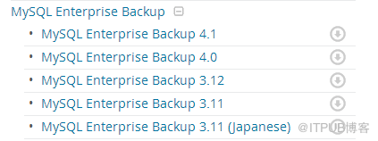
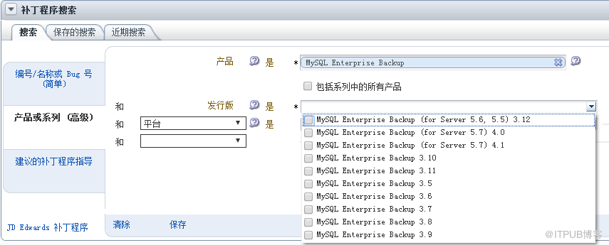

已剪辑自: http://blog.itpub.net/12679300/viewspace-2145129/

# 一、mysqlbackup工具的介绍 

#### *1.1 mysqlbackup软件的说明undefined* 

Mysql的备份方法有很多种，大部分企业当数据量很小的时候都是选择mysqldump导出数据库的方式来进行备份，但是当数据量较多的时候，就不建议用这种方法进行。

公司的Mysql数据库300GB，用mysqldump的方法进行恢复的时候，居然用了整整的一个星期，如果真正在灾难的时候需要恢复，那简直就是灾难啊。

经过网上的查找和搜索，发现mysql的备份软件确实太多，第三方的机构也有提供了相应的备份软件，ORACLE公司也提供了针对企业的备份软件MySQL Enterprise Backup简称：mysqlbackup。 

考虑到软件的生命周期和软件的文档考虑，还是使用mysqlbakcup，原因如下： 

mysqlbackup从3.5到4.1版本说明mysql公司一直在更新这个软件，这样随着mysql软件的更新备份软件也会跟着更新，避免出现bug没有解决，同时mysql dba掌握了这么技术后也可以一直延续使用，提高了学习的收益。 

 在mysql的网站里面有完整的使用手册，这些文档对于整个软件的使用至关重要；

 

#### *1.2 mysqlbackup软件的下载* 

mysqlbackup企业版在mysql的开源社区是下载不了的，需要有metalink的账号才能下载。（早期是可以下载的，估计后来用户的体验不错，需要授权购买oracle的服务才可以了）

目前我的环境都还是mysql5.6的，所以选择用3.12的版本（3.12的版本修复了几个重要的bug，建议用这个版本） 

 1.3 mysqlbackup软件的安装 

选择相应的版本进行下载，每台要进行备份的mysql服务器都需要安装这个软件。Mysql提供了两种包，安装的方法也有所不同。常用的安装步骤如下：

sudo rpm -i package_name.rpm 

tar xvzf package.tgz 

安装的目录如下：/opt/mysql/meb-3.12 

其他设置命令使用的快捷方式：ln -s /opt/mysql/meb-3.12/bin/mysqlbackup  /usr/bin/mysqlback

 二、mysqlbackup工具的介绍 

mysqlbackup和mysqldump的主要功能是备份跟还原，mysqlbackup是oracle的企业产品感觉整个产品的思路和oracle的rman很像。mysqlbackup的功能对比成oracle的expdp。

Mysqlbackup提供了备份还原一些企业的功能：提供了更快的备份方式和更快的还原方式，支持在线全备和增倍、备份的压缩、并行备份、备份的加密、数据库的还原和基于时间点的还原。

通过mysqlbackup --help可以查看相关的命令操作。 

# 三、mysqlbackup备份准备工作 

   本章介绍使用mysqlbakcup的准备工作和使用方法； 

   备份无小事，在备份之前，需要做好以下的准备工作，保证备份的正常运行。 

需要做准备的工作如下几点： 

3.1.1 备份位置和空间的配置。 

建议备份的目录和数据库文件的目录区分开，避免备份把空间撑爆了而导致系统不能使用； 

3.1.2 设置备份策略（备份频率、备份保留周期） 

同时计算下每次备份所需要的磁盘空间再根据备份策略合理安排备份的空间； 

3.1.3 创建单独的备份用户 

其他业务分开账号的使用，数据库作为重要的系统，一般都会每年变更管理密码的，这里单独使用一个避免后期还需要变更；
 备份用户所需要的基本权限

1. GRANT CREATE, INSERT, DROP,     UPDATE ON mysql.backup_progress TO 'mysqlbackup'@'localhost';

2. GRANT CREATE, INSERT, SELECT,     DROP, UPDATE ON mysql.backup_history TO 'mysqlbackup'@'localhost';

3. GRANT REPLICATION CLIENT ON     *.* TO 'mysqlbackup'@'localhost';

4. GRANT SUPER ON *.* TO     'mysqlbackup'@'localhost';

5. GRANT LOCK TABLES, SELECT,     CREATE, DROP, FILE ON *.* TO 'mysqlbackup'@'localhost' 

#### *3.2 备份库主要选项* 

  备份其实主要的内容也就是backup、restore和校验。每个阶段使用的主要参数如下： 

- Backup operations: backup,     backup-and-apply-log, backup-to-image 
- Update operations: apply-log,     apply-incremental-backup 
- Restore operations:     copy-back, copy-back-and-apply-log 
- Validation operation:     validate Single-file backup 
- operations:     image-to-backup-dir, backup-dir-to-image, list-image, extract 

在3.12.3以下的版本backup-and-apply-log这个备份的时候不能结合参数compress使用。mysqlbackup官方的文档建议使用backup-to-image选项，该方法性能更好，而且备份的文件也更小。
 备注：
 When used with the apply-log or copy-back-and-apply-log operation, uncompresses a compressed backup before applying the InnoDB log. When used with the copy-back operation,uncompresses a compressed prepared backup (created by the backup-and-apply-log command with the --compress option) before restoring it to a server (only supported for MySQL Enterprise

Backup 3.12.3 and later).

backup-to-image

Produces a single-file backup holding the backup data. In most cases, single-file backups are preferred over directory backups, which are created using the backup command.

**可以通过mysqlbackup --help会显示丰富的参数说明,这边列几个比较常见的参数** 

| 参数                     | 说明                                                         | 备注                                                         |
| ------------------------ | ------------------------------------------------------------ | ------------------------------------------------------------ |
| --backup-dir             | The directory to store the backup data.                      |                                                              |
| --backup-image           | Specifies the path name of the backup image.                 | 结合backup-to-image使用                                      |
| --compress               | Create backup in compressed format.                          | 默认级别是1                                                  |
| --compress-level         | Specifies the level of compression.                          | --compress-level=LEVEL        Specify value from  0-9.        Specify value 0 to disable  compression.        Specify value 1 for fastest  compression.        Specify value 9 for best  compression. |
| --uncompress             | Uncompress the compressed backup before an apply-log,    copy-back, or copy-back-and-apply-log operation. | 如果备份是有使用compress，还原的时候就得使用该参数           |
| --datadir                | Path to mysql server data directory.                         |                                                              |
| --defaults-file          | Only read default options from the given file.               |                                                              |
| --force                  | Force overwriting of data, log, or image files, depending on    the operation. | 进行强制覆盖                                                 |
| --incremental            | Specifies that the associated backup or backup-to-image    operation is incremental. | 增量备份选项                                                 |
| --incremental-backup-dir | Specifies the location under which to store data from an    incremental backup. | 增量备份保存位置                                             |
| --incremental-base       | The specification of base backup for --incremental option.   | 上次完整备份的位置                                           |
| --with-timestamp         | Create a subdirectory underneath the backup directory    with a name formed from the timestamp of the backup    operation. | 根据时间戳生成一个文件，因为备份的时候需要在一个空的目录保存文件，所以一般建议使用整个参数 |

 **四、****mysqlbackup****备份及还原** 

点击(此处)折叠或打开 

1. 全备的脚本

2. [root@db02 backup]#     mysqlbackup --user=mysqlbackup --password=123  --backup-dir=/backup      --with-timestamp  backup 

3. 

4. 还原的脚本

5. [root@db02 backup]#     mysqlbackup --backup-dir=/backup/2017-09-18_13-49-11 apply-log #因为在备份期间数据库还在读写，把这期间的log进行应用，达到数据的一致性

6. [root@db02 backup]#     mysqlbackup --datadir=/data/mysql --backup-dir=/backup/2017-09-18_13-49-11     copy-back 

#### **方法二：在不同的时期使用app-log** 

点击(此处)折叠或打开 

1. 全备的脚本

2. [root@db02     backup]#mysqlbackup --defaults-file=/etc/my.cnf --user=mysqlbackup     --password=123 --backup-dir=/backup --with-timestamp backup-and-apply-log     

3. 还原的脚本

4. [root@db02 backup]#     mysqlbackup --datadir=/data/mysql --backup-dir=/backup/2017-09-18_13-49-11     copy-back 

【注】backup-and-apply-log使用这个脚本，mysql官方文档有以下说明，不能用于增量备份，但是在实验中却是可以的；

backup-and-apply-log

A combination of backup and apply-log. It cannot be used for an incremental backup. 

#### *方法三：使用backup-to-image的方式 * 

这种方法是mysql官方推荐的，只有产生单个的备份二进制文件，整个备份的大小也比前面两种要小 

点击(此处)折叠或打开 

1. 全备的脚本

2. [root@db02 mysql]#     mysqlbackup --user=mysqlbackup --password=123 --backup-image=backup.mbi     --backup-dir=/backup --with-timestamp backup-to-image 

3. 

4. 还原的脚本

5. [root@db02 data]# mysqlbackup     --defaults-file=/backup/2017-09-15_17-06-07/server-my.cnf     --datadir=/data/mysql --backup-dir=/backup/2017-09-15_17-06-07 copy-back 

# 五、mysqlbackup增量备份及还原 

#### *方法一：用bakcup的方法进行的增量备份*

点击(此处)折叠或打开 

1. 备份的操作：先进行全备后进行增备

2. mysqlbackup     --defaults-file=/etc/my.cnf --user=mysqlbackup --password=123     --backup-dir=/backup --with-timestamp backup #全备

3. mysqlbackup     --defaults-file=/etc/my.cnf --user=mysqlbackup --password=123     --with-timestamp --incremental --incremental-backup-dir=/backup/     --incremental-base=dir:/backup/2017-09-18_14-51-25 backup #增量备份

4. --incremental-base 为前面全备的路径 

点击(此处)折叠或打开 

1. 还原的操作

2. mysqlbackup     --backup-dir=/backup/2017-09-18_15-25-59 apply-log #全备的库先apply-log

3. mysqlbackup     --backup-dir=/backup/2017-09-18_15-25-59     --incremental-backup-dir=/backup/2017-09-18_15-42-56     apply-incremental-backup #在步骤一的基础上继续恢复

4. mysqlbackup     --defaults-file=/etc/my.cnf --force     --backup-dir=/backup/2017-09-18_15-25-59/ --datadir=/data/mysql     copy-back-and-apply-log #拷贝然后再恢复增备的log 

#### **方法二：用image的方法进行的增量备份** 

点击(此处)折叠或打开 

1. 备份的操作：先进行全备后进行增备

2. mysqlbackup     --user=mysqlbackup --password=123 --backup-image=backup.mbi     --backup-dir=/backup --with-timestamp backup-to-image #先备份成image

3. mysqlbackup     --defaults-file=/etc/my.cnf --user=mysqlbackup --password=123     --with-timestamp --incremental --incremental-backup-dir=/backup/     --incremental-base=dir:/backup/2017-09-18_15-53-57 backup #在原来备份的基础上进行增量备份 

点击(此处)折叠或打开 

1. 还原的操作

2. mysqlbackup     --backup-dir=/backup/full     --backup-image=/backup/2017-09-18_15-53-57/backup.mbi image-to-backup-dir 先转换成方法一的备份文件，后续的步骤都跟前面一样

3. mysqlbackup     --backup-dir=/backup/full apply-log 

4. mysqlbackup     --backup-dir=/backup/full     --incremental-backup-dir=/backup/2017-09-18_15-56-13     apply-incremental-backup

5. mysqlbackup     --defaults-file=/etc/my.cnf --force --backup-dir=/backup/full     --datadir=/data/mysql copy-back-and-apply-log 

#### *6.1 关于image备份的一些操作* 

点击(此处)折叠或打开 

1. mysqlbackup     --backup-image=/backup/2017-09-18_15-53-57/backup.mbi validate 检查备份的有效性；

2. mysqlbackup     --backup-image=/backup/2017-09-18_15-53-57/backup.mbi list-image 列出备份对象

3. mysqlbackup     --backup-image=/backup/2017-09-18_15-53-57/backup.mbi extract 进行解压，直接在备份目录里面操作

4. mysqlbackup     --backup-dir=/backup/backup     --backup-image=/backup/2017-09-18_15-53-57/backup.mbi image-to-backup-dir 指定备份目录进行解压 

#### *6.2 其他* 

   关于备份的压缩：其实备份的压缩挺好用的，经过测试可以显著的节省备份的空间。虽然在上面测试的时候没有演示，实际上本人是有操作过备份压缩的，而且相对于正常的备份其实并没有消耗很多的时间；

   关于image的增量备份：image的增量备份恢复步骤相对全备麻烦了很多，在官方文档里面找了很久是不是还有更便捷的操作，但始终没有找到相关操作说明，如果知道的朋友麻烦留下言，感激不尽；

   关于增量备份：增量备份有没有必要了，其实这要看我们系统的重要性、数据增长的速度。目前我们这边最大的系统2天才产生一个G的binlog，整体数据库也不算很大，所以现在每天都是使用全备了。

  关于该软件：mysqlbackup其实还有很多的功能的，可以针对表、数据库对象进行备份。同时也可以用于搭建从库，这个功能对于数据库很大的用户是个福音，强烈对剑该功能；

  但是由于这个软件是Oracle的企业版，付费用户才能使用的，所以网上相关的资料并不多。但是有很全的官方文档。

 

来自 “ ITPUB博客 ” ，链接：http://blog.itpub.net/12679300/viewspace-2145129/，如需转载，请注明出处，否则将追究法律责任。 