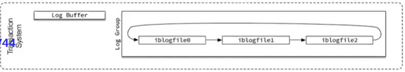

# Xtrabackup工作原理

xtrabackup实质上利用了Innodb Crash Recovery机制。

## MySQL InnoDB Crash Recovery

### InnoDB Crash Recovery 简介


	- MySQL InnoDB中会记录下数据持久到Datafile中的（日志）位置： checkpoint LSN
	- 每个变更都会将对应的日志记录为LSN
 - 数据库Crash后，首先在redo中查找checkpoint LSN的日志，然后从checkpoint后的日志开始扫描
   	- 提交commit状态的事务；
    - 如果事务为prepare状态，检查binlog是否写入成功。
      	- 如果写入成功，那么提交该事务并标记为commit
      	- 如果该事务未写入binlog，那么回滚该事务

- MySQL 5.7

  ```
  mysql> show engine innodb status \G
  ...
  
  ---
  LOG
  ---
  Log sequence number 2629935			# current_lsn -> next       
  Log flushed up to   2629935			# 写入到logfile（disk）中最大的LSN			 
  Pages flushed up to 2629935			# 当前最旧的脏页数据对应的LSN，写Checkpoint的时候直接将此LSN写入到日志文件		 
  Last checkpoint at  2629926			# 已经持久化到Datafile，小于这个LSN的值可以被覆盖了
  0 pending log flushes, 0 pending chkp writes
  10 log i/o's done, 0.00 log i/o's/second
  ...
  ```

- MySQL 8.0

  ```
  mysql> show engine innodb status \G
  ...
  ---
  LOG
  ---
  Log sequence number          19876673		# current_lsn -> next
  Log buffer assigned up to    19876673		# max assigned lsn,当前分配出去最大的LSN
  Log buffer completed up to   19876673		# 开始向log buffer中写入的LSN
  Log written up to            19876673		# 已经写入log buffer中的最大LSN
  Log flushed up to            19876673		# 写入到logfile（disk）中最大的LSN
  Added dirty pages up to      19876673		# IBP中脏页中最大的LSN
  Pages flushed up to          19876673		# 当前最旧的脏页数据对应的LSN，写Checkpoint的时候直接将此LSN写入到日志文件
  Last checkpoint at           19876673		# 已经持久化到Datafile，小于这个LSN的值可以被覆盖了
  102 log i/o's done, 7.69 log i/o's/second

  ```

  

- LSN：Log Sequence Number

  - 这个大小表示MySQL写过多少字节的Redo，LSN数字的单位为bytes。

  - 通常建议Redo单个文件可以保存一个小时的大小：

    - 间隔5秒获取LSN：

      ```
      redo_logfile_size = (t2.LSN - t1.LSN) * (60/5) * 60
      ```

    - 间隔一小时获取LSN

      ```
      redo_logfile_size(MB) = ( t2.lsn - t1.lsn ) bytes * 60 / 1024 / 1024 
      ```

    - 总redo大小建议在4GB~32GB之间
    
      ```
      total_redo = ib_logfile_size * ib_logfile_in_group
      ```
    
      > 更多LSN信息，关注8.0 storage/innobase/log/log0log.cc



### Crash Recovery 方式

事务模型：数据加载到内存，更改， 刷到redo，合并到datafile

#### 无binlog的CR方式：（类似oracle、mssql）

- redo中有三种事务状态： 
    1. committed 已提交
    2. committing（prepare） 正在提交（准备中）
    3. running（事务进行中，未提交）

无binlog情况下，InnoDB recovery时，对commited状态的事务进行恢复、合并到datafile，其他两种状态的事务回滚。

#### 有binlog的CR方式：

1. 有binlog情况下，commit动作之前，会有一个Redo XID 的动作记录写到redo，然后写data到binlog，
2. binlog写成功后，会将binlog的filename，日志写的位置position再写到redo(position也会写到pos文件里)，此时才表示该事务完成（committed）。
3. 如果只有XID，没有后面的filename和position，则表示事务为prepare状态。
4. 如果redo中已经有XID，则恢复时会先扫描最后一个binlog，看该XID是否存在。
	- 如果存在，表示这条日志已经写到binlog，那么该事务直接commit。 
	- 如果不存在，则表示事务未成功写入binlog，那么该事物回滚。


