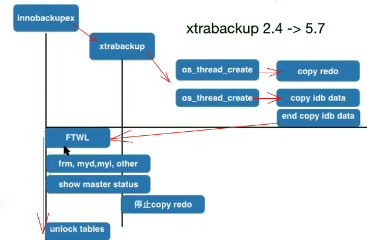

## Xtrabackup备份流程

 

## Xtrabackup备份恢复流程图

- innobackupex备份流程

  | No. | 过程 | 说明 |
  | ---- | ---- | ---- |
  | 1    | start xtrabackup_log     | copy redo |
  | 2    | copy .ibd; ibdata1     | 以16k为单位拷贝ibd文件 |
  | 3    | flush tables with read lock     | ftwrl，percona 8.0版本使用lock instance 替代 |
  | 4    | copy \*.FRM;\*.MYD;\*.MYI; misc files     | copy 非innodb的表的.FRM .MYI 等文件 MySQL8.0版本后默认没MyISam文件了 percona 8的lock instance也不支持应用于MyISam文件 |
  | 5    | get binary log position     | 获取innodb的binlog position |
  | 6    | unlock tables     | 至此，整个DB都处于静止状态。 现在unlock tables. |
  | 7    | stop and copy xtrabackup_log     | 停止copy |

## 关于lock instance：（lock instance for backup）

- 5.7 percona mysql 可以使用xtrabackup 的 --backup-locks 选项，用 backup locks替代使用ftwrl，但是要求全部使用InnoDB表。

- 8.0 MySQL 开始不再使用MyISam引擎了