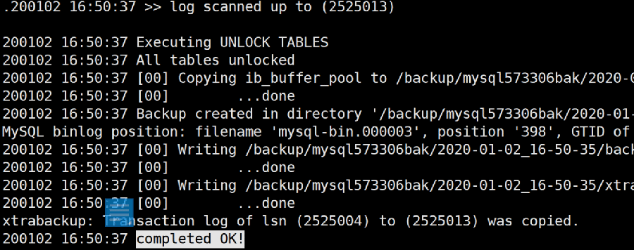
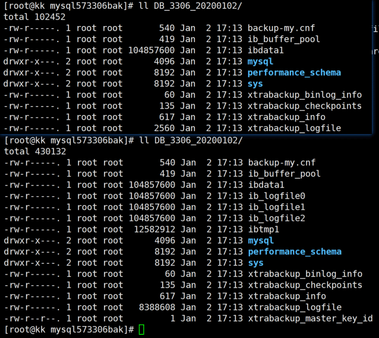

## Xtrabackup的使用：

- 无锁备份：
  ```
--no-lock
  ```
不使用FTWRL，这样的备份只对InnoDB有效，但无法准确的获取到binlog的相应position


## xtrabackup备份所需要的权限

- reload,lock tables,super,(select) ----> 一般的，这三个就够了。

- percona mysql的话，需要backup locks 权限

【更多玩法和权限需求根据官方文档补充一下】


## 备份：

**命令：**

  ```
innobackupex --defaults-file=xxxxx.cnf --no-timestamp -u root -p /data/backup/${业务名}_${端口}_${备份方式}_`date +%Y%m%d`
  ```

- 参数解释：
  - --defaults-file=xxxxx.cnf  在xtrabackup后指定要备份的MySQL的实例配置文件。

  - --no-timestamp  不使用时间戳作为文件名。

    - 不使用该参数，则自动在指定目录中创建时间戳目录名，在生产、多实例环境中可读性和可维护性很差。
    - 使用参数便不再自动创建时间戳目录名，但这样会直接在指定的目录中创建备份文件（文件是散的！）。
    - 所以，使用参数时记得手动指定一下目录名规则。


- 备份成功后【一定会】**输出completed OK!**




- 备份过程中进行的数据库数据变化，也会在备份中——也就是说，在备份结束的时间点上，数据库是一致的。

这一点和mysqldump有所不同。（因为有redo和binlog）


## 应用日志：
  ```
innobackupex --apply-log [--user-memory=nG] ${备份文件生成的目录} 
  ```

- 命令及参数解释：
  ```
  - --apply-log                --> 将committed的redo合并到datafile（crash-recovery）
  - --user-memory=nG         --> apply-log默认使用1G内存，如果需要加速，或者内存充足，可以指定参数，建议user-memory==innodb_buffer_pool_size
  ```


## 恢复：

- 要低调克制稳妥。
- 别看错机器，别看错实例。
- shutdown原始实例。
- 可以**先将真实的****data_dir mv****改名备份**，重建data_dir后执行恢复


### 恢复操作：

**命令**：
  ```
innobackupex --defaults-file=xxx.cnf --copy-back ${备份存放的目录} 
  ```
或 
  ```
innobackupex --defaults-file=xxx.cnf --move-back ${备份存放的目录}
  ```


- 命令及参数解释：

  - --defaults-file=xxx.cnf       --> 恢复的目标实例的配置文件。
  - --copy-back ${备份存放的目录}  --> 通过copy的恢复。数据库大的话，会很慢。
  - --move-back ${备份存放的目录} --> 通过move的恢复。直接移动恢复，会快很多，亲测，快多了！但是备份文件就不存在了（因为mv走了）。


- 将committed的redo合并到datafile（crash-recovery）：

    - innobackupex --apply-log ${备份文件生成的目录}  

    - 再查看备份目录，会发现多了一些文件。



  

## 备份恢复总结：

```
innobackupex --defaults-file= ${my.cnf} -S ${sock_file.sock} -u ${username} -p${password} --no-timestamp ${backup_path}/${filename}_`date +%Y%m%d`
```

```
innobackupex --apply-log ${backup_dir}
```
**# restore to local:**

  1. shutdown instance
  2. mv ${data_dir} ${data_dir}_rename / or , mv ${base_dir} ${base_dir}_rename
  3. mkdir ${data_dir} / or , mkdir ${base_dir}/(data_dir,log_dir,tmp, etc..)
  4. cp the my.cnf to new basedir
  5. innobackupex --defaults-file= ${my.cnf} --copy-back ${backup_dir}
     --# restore and save the backup files. slower
  6. innobackupex --defaults-file= ${my.cnf} --move-back ${backup_dir}     
     --# restore the backup using move files, so the backup files no longer saved.   faster
  7. chown -R mysql:mysql ${data_dir}
  8. using mysqld --defaults-file = ${my.cnf} & to startup the database instance.

**# restore to remote:**

  1. for remote restore ,or create a new database with the backup , after backup the database (step 2)
  2. scp -r ${backup_dir} ${newhost}
  3. At new host, mkdir for mysql instance (data_dir ,log,tmp ,etc..)
  4. cp or re-create my.cnf 
  5. using (step 6) to restore backup on new host.
  6. chown
  7. mysqld

### xtrabackup_info 文件需要关注

- 如果想恢复到info文件中记录的uuid的状态， 可以拿这个uuid替换 要恢复的数据库的data/auto.cnf 中的对应部分。

如果文件不存在，则创建auto.cnf
  ```
[auto]
server-uuid=xxxxxxxxx
  ```
- 如果文件中innodb_from_lsn     = 0，说明该备份为全量备份，非0则是增量备份，显然的。


- 如果xtrabackup_binlog_info xtrabackup_binlog_pos_innodb 两个文件内容不一致，以xtrabackup_binlog_info     为准。

为什么会出现不一致的现象呢？

- xtrabackup_binlog_info -----> binlog的最后位置。
- xtrabackup_binlog_pos_innodb -----> innodb log的最后位置。

如果有非事务引擎的表，那么binlog的position位置往往要比apply-log 后的pos_innodb要大不少——因为innodb记录的动作肯定少于binlog呀！

不过现在有了GTID，一切可以以GTID为准了，如果没有GTID的话，那就以binlog的position为准，显而易见的，因为binlog要比innodb记录的东西多~ 包含了非事务引擎的内容嘛！

 

## 备份注意事项

建议使用@localhost的来源创建备份账号。