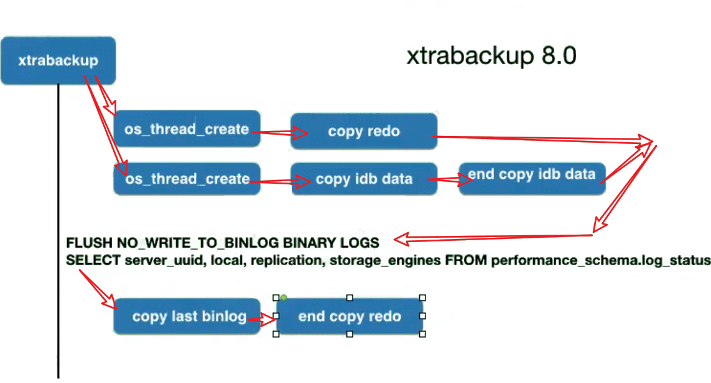

- 8.0没有锁动作，备份过程中进行DDL的话可能有隐患

- XB是基于事务一致性的备份，无法确定具体备份到哪个时间点， 能恢复到完成备份那一刻的数据库状态。

- 8.0用XB可能遇到密码验证问题， 可能需要这个包libdbi-dbd-mysql
    ```
    yum install -y libdbi-dbd-mysql
    ```
    
- Xtrabackup 8.0 命令
  
    - 查看版本

     ```
  [10:22:59] root@ms81:1 # xtrabackup --version
     xtrabackup: recognized server arguments: --datadir=/var/lib/mysql 
     xtrabackup version 8.0.11 based on MySQL server 8.0.18 Linux (x86_64) (revision id: 486c270)
   ```

   - 备份

     ```
  xtrabackup --defaults-file=${my.cnf} -S ${sockfie} --backup --target-dir=${backup_dir}
     ```
  
   - prepare log
  
     ```
     xtrabackup --prepare --target-dir=${backup_dir}
     ```
  
   - 恢复
  
     ```
     xtrabackup --defaults-file=${my.cnf} --copy-back --target-dir=${backup_dir}
     
     需要保持datadir、logs目录为空
     ```
  
     

# 备份流程探索


```
[root@ms81 ~]# xtrabackup --defaults-file=/data/mysql/mysql3306/my3306.cnf -S /data/mysql/mysql3306/tmp/mysql.sock --backup --target-dir=/tmp/bk 2>&1 | tee xb.log

[root@ms81 ~]# cat xb.log
```

​	对比备份日志，和备份生成的backup-my.cnf

| xb.log                                                       | cat /tmp/bk/backup-my.cnf                                    |
| ------------------------------------------------------------ | ------------------------------------------------------------ |
| --datadir=/data/mysql/mysql3306/data <br/>--server-id=813306 <br/>--open_files_limit=65536 <br/>--log_bin=/data/mysql/mysql3306/logs/mysql-bin <br/>**--innodb_data_file_path=ibdata1:100M:autoextend <br/>--innodb_buffer_pool_filename=ib_buffer_pool <br/>--innodb_log_files_in_group=3 <br/>**--innodb_log_file_size=100M <br/>--innodb_file_per_table=1 <br/>--innodb_open_files=65535 <br/>**--innodb_page_size=16k <br/>**--innodb_read_io_threads=4 <br/>--innodb_write_io_threads=4 <br/>--innodb_io_capacity=200 <br/>--innodb_log_buffer_size=128M <br/>--innodb_flush_log_at_trx_commit=1 <br/>--innodb_buffer_pool_size=100M <br/>--innodb_flush_method=O_DIRECT<br/>#这部分内容会生成到 ${backup_dir}/backup-my.cnf | \# This MySQL options file was generated by innobackupex.<br/>\# The MySQL server<br/>[mysqld]<br/>innodb_checksum_algorithm=crc32<br/>innodb_log_checksums=1<br/>**innodb_data_file_path=ibdata1:100M:autoextend<br/>innodb_log_files_in_group=3<br/>innodb_log_file_size=104857600<br/>innodb_page_size=16384<br/>**innodb_undo_directory=./<br/>innodb_undo_tablespaces=2<br/>server_id=814000<br/>innodb_log_checksums=ON<br/>innodb_redo_log_encrypt=OFF<br/>innodb_undo_log_encrypt=OFF<br/>**innodb_buffer_pool_filename=ib_buffer_pool<br/>**server_uuid=cf67f172-d78e-11ea-a2c1-0242c0a8bc51<br/>master_key_id=0 |


__这步有错误是因为没安装libdbi-dbd-mysql包__

```
xtrabackup: recognized client arguments: --port=3306 --socket=/data/mysql/mysql3306/tmp/mysql.sock --socket=/data/mysql/mysql3306/tmp/mysql.sock --backup=1 --target-dir=/tmp/bk

xtrabackup version 8.0.11 based on MySQL server 8.0.18 Linux (x86_64) (revision id: 486c270)

200509 11:41:16 version_check Connecting to MySQL server with DSN 'dbi:mysql:;mysql_read_default_group=xtrabackup;port=3306;mysql_socket=/data/mysql/mysql3306/tmp/mysql.sock' (using password: NO).

Failed to connect to MySQL server: DBI connect(';mysql_read_default_group=xtrabackup;port=3306;mysql_socket=/data/mysql/mysql3306/tmp/mysql.sock','',...) failed: Authentication plugin 'caching_sha2_password' cannot be loaded: /usr/lib64/mysql/plugin/caching_sha2_password.so: cannot open shared object file: No such file or directory at - line 1535.
```

**扫描redo**

```
200509 11:41:16 Connecting to MySQL server host: localhost, user: not set, password: not set, port: 3306, socket: /data/mysql/mysql3306/tmp/mysql.sock
Using server version 8.0.19
xtrabackup: uses posix_fadvise().
xtrabackup: cd to /data/mysql/mysql3306/data
xtrabackup: open files limit requested 65536, set to 65536
xtrabackup: using the following InnoDB configuration:
xtrabackup:  innodb_data_home_dir = .
xtrabackup:  innodb_data_file_path = ibdata1:100M:autoextend
xtrabackup:  innodb_log_group_home_dir = ./
xtrabackup:  innodb_log_files_in_group = 3
xtrabackup:  innodb_log_file_size = 104857600
xtrabackup: using O_DIRECT
Number of pools: 1
200509 11:41:16 Connecting to MySQL server host: localhost, user: not set, password: not set, port: 3306, socket: /data/mysql/mysql3306/tmp/mysql.sock
200509 11:41:16 >> log scanned up to (37440969)
```
**扫描表空间清单**

```
xtrabackup: Redo Log Archiving is not set up.
xtrabackup: Generating a list of tablespaces
```
**找到表空间，开始复制数据文件，同时另一线程也会复制redo**

```
Directories to scan '.;./;.'
Scanning './'
Completed space ID check of 2 files.
Allocated tablespace ID 1 for sys/sys_config, old maximum was 0
Using undo tablespace './undo_001'.
Using undo tablespace './undo_002'.
Opened 2 existing undo tablespaces.
```
**这两个数据文件是实例中非系统表空间的InnoDB表空间，这块是由[一个查询]()得出的。**

```
200509 11:41:16 [01] Copying ./ibdata1 to /tmp/bk/ibdata1
200509 11:41:17 [01]    ...done
200509 11:41:17 [01] Copying ./sys/sys_config.ibd to /tmp/bk/sys/sys_config.ibd
200509 11:41:17 [01]    ...done
200509 11:41:17 [01] Copying ./kk/k1.ibd to /tmp/bk/kk/k1.ibd
```
**另一线程复制redo，防止redo被覆写**
**复制非事务性引擎表的数据文件**

```
200509 11:41:17 [01]    ...done
200509 11:41:17 [01] Copying ./mysql.ibd to /tmp/bk/mysql.ibd
200509 11:41:17 [01]    ...done
200509 11:41:17 [01] Copying ./undo_002 to /tmp/bk/undo_002
200509 11:41:17 [01]    ...done
200509 11:41:17 [01] Copying ./undo_001 to /tmp/bk/undo_001
200509 11:41:17 [01]    ...done
200509 11:41:17 >> log scanned up to (37440969)
```
**将binlog flush到新文件 切换文件**
```
200509 11:41:17 Starting to backup non-InnoDB tables and files
200509 11:41:17 [01] Copying performance_schema/events_waits_sum_86.sdi to /tmp/bk/performance_schema/events_waits_sum_86.sdi
200509 11:41:17 [01]    ...done
200509 11:41:18 [01]    ...done
200509 11:41:18 [01] Copying mysql/slow_log.CSM to /tmp/bk/mysql/slow_log.CSM
200509 11:41:18 [01]    ...done
200509 11:41:18 [01] Copying mysql/general_log_201.sdi to /tmp/bk/mysql/general_log_201.sdi
200509 11:41:18 [01]    ...done
200509 11:41:18 [01] Copying mysql/general_log.CSV to /tmp/bk/mysql/general_log.CSV
200509 11:41:18 [01]    ...done
200509 11:41:18 [01] Copying mysql/slow_log_202.sdi to /tmp/bk/mysql/slow_log_202.sdi
200509 11:41:18 [01]    ...done
200509 11:41:18 [01] Copying mysql/general_log.CSM to /tmp/bk/mysql/general_log.CSM
200509 11:41:18 [01]    ...done
200509 11:41:18 [01] Copying mysql/slow_log.CSV to /tmp/bk/mysql/slow_log.CSV
200509 11:41:18 [01]    ...done
200509 11:41:18 Finished backing up non-InnoDB tables and files
```
**至此就完成了对last binlog 的备份**
```
200509 11:41:18 Executing FLUSH NO_WRITE_TO_BINLOG BINARY LOGS
200509 11:41:18 Selecting LSN and binary log position from p_s.log_status
200509 11:41:18 [00] Copying /data/mysql/mysql3306/logs/mysql-bin.000006 to /tmp/bk/mysql-bin.000006 up to position 195
200509 11:41:18 [00]    ...done
200509 11:41:18 [00] Writing /tmp/bk/mysql-bin.index
200509 11:41:18 [00]    ...done
200509 11:41:18 [00] Writing /tmp/bk/xtrabackup_binlog_info
200509 11:41:18 [00]    ...done
200509 11:41:18 Executing FLUSH NO_WRITE_TO_BINLOG ENGINE LOGS…
```
**扫描redo，完成end redo 备份**

```
xtrabackup: The latest check point (for incremental): '37440969'
xtrabackup: Stopping log copying thread at LSN 37440979.
```
```
200509 11:41:18 >> log scanned up to (37440989)
Starting to parse redo log at lsn = 37440603
```
**解锁表**

```
200509 11:41:19 All tables unlocked
200509 11:41:19 [00] Copying ib_buffer_pool to /tmp/bk/ib_buffer_pool
200509 11:41:19 [00]    ...done
```
**记录binlog GTID和pos信息**
```
200509 11:41:19 Backup created in directory '/tmp/bk/'
MySQL binlog position: filename 'mysql-bin.000006', position '195', GTID of the last change '9064a50b-91a5-11ea-ac56-0242c0a8bc51:1-9816'
200509 11:41:19 [00] Writing /tmp/bk/backup-my.cnf
200509 11:41:19 [00]    ...done
200509 11:41:19 [00] Writing /tmp/bk/xtrabackup_info
200509 11:41:19 [00]    ...done
xtrabackup: Transaction log of lsn (37440969) to (37440999) was copied.
200509 11:41:20 completed OK!
```

- 查看一下general log ， 看看备份过程中都发生了什么数据库动作
```
[root@ms81 logs]# cat general.log

/opt/mysql-8.0.19-linux-glibc2.12-x86_64/bin/mysqld, Version: 8.0.19 (MySQL Community Server - GPL). started with:
Tcp port: 3306 Unix socket: /data/mysql/mysql3306/tmp/mysql.sock
Time         Id Command  Argument
2020-05-09T13:00:55.188847+08:00     9827 Connect  root@localhost on using Socket
2020-05-09T13:00:55.192222+08:00     9828 Connect  root@localhost on using Socket
2020-05-09T13:00:55.192506+08:00     9828 Query   SET SESSION wait_timeout=2147483
2020-05-09T13:00:55.192772+08:00     9828 Query   SET SESSION autocommit=1
2020-05-09T13:00:55.192920+08:00     9828 Query   SET NAMES utf8
2020-05-09T13:00:55.193137+08:00     9828 Query   SHOW VARIABLES
2020-05-09T13:00:55.194735+08:00     9828 Query   SELECT COUNT(*) FROM information_schema.tables WHERE engine = 'MyISAM' OR engine = 'RocksDB'
2020-05-09T13:00:55.196338+08:00     9828 Query   SHOW ENGINES
2020-05-09T13:00:55.196610+08:00     9828 Query   SHOW ENGINE INNODB STATUS
2020-05-09T13:00:55.198731+08:00     9828 Query   SELECT PLUGIN_NAME, PLUGIN_LIBRARY FROM information_schema.plugins WHERE PLUGIN_STATUS = 'ACTIVE' AND PLUGIN_TYPE = 'KEYRING'
2020-05-09T13:00:55.207963+08:00     9828 Query   SELECT CONCAT(table_schema, '/', table_name), engine FROM information_schema.tables WHERE engine NOT IN ('MyISAM', 'InnoDB', 'CSV', 'MRG_MYISAM', 'ROCKSDB') AND table_schema NOT IN ( 'performance_schema', 'information_schema',  'mysql')
2020-05-09T13:00:55.271468+08:00     9828 Query   SELECT T2.PATH,    T2.NAME,    T1.SPACE_TYPE FROM  INFORMATION_SCHEMA.INNODB_TABLESPACES T1    JOIN INFORMATION_SCHEMA.INNODB_TABLESPACES_BRIEF T2 USING (SPACE) WHERE T1.SPACE_TYPE = 'Single' && T1.ROW_FORMAT != 'Undo'UNION SELECT T2.PATH,    SUBSTRING_INDEX(SUBSTRING_INDEX(T2.PATH, '/', -1), '.', 1) NAME,    T1.SPACE_TYPE FROM  INFORMATION_SCHEMA .INNODB_TABLESPACES T1    JOIN INFORMATION_SCHEMA .INNODB_TABLESPACES_BRIEF T2 USING (SPACE) WHERE T1.SPACE_TYPE = 'General' && T1.ROW_FORMAT != 'Undo'
```

**这个查询获取到了InnoDB非undo、非系统表空间的表空间信息。**
```
2020-05-09T13:00:55.271613+08:00     9829 Connect  root@localhost on using Socket
2020-05-09T13:00:55.272037+08:00     9829 Query   SET SESSION wait_timeout=2147483
2020-05-09T13:00:55.272341+08:00     9829 Query   SET SESSION autocommit=1
2020-05-09T13:00:55.272563+08:00     9829 Query   SET NAMES utf8
2020-05-09T13:00:55.272810+08:00     9829 Query   SHOW VARIABLES
2020-05-09T13:00:55.274597+08:00     9829 Quit
2020-05-09T13:00:57.118141+08:00     9828 Query   FLUSH NO_WRITE_TO_BINLOG BINARY LOGS
2020-05-09T13:00:57.152229+08:00     9828 Query   SELECT server_uuid, local, replication, storage_engines FROM performance_schema.log_status
```
**这个表的访问`SELECT server_uuid, local, replication, storage_engines FROM performance_schema.log_status`，会锁instance，但是会非常短暂。这是MySQL8.0的特性。**
**整个备份过程只有这一步用到了锁**
**整个备份过程并未使用lock instance for backup ， 所以xtrabackup 8.0 还是有些毛糙，备份过程中并不是十分安全。期间如果发生DDL是不可控的。**

```
2020-05-09T13:00:57.153120+08:00     9828 Query   SHOW VARIABLES
2020-05-09T13:00:57.219303+08:00     9828 Query   SHOW VARIABLES
2020-05-09T13:00:57.228696+08:00     9828 Query   FLUSH NO_WRITE_TO_BINLOG ENGINE LOGS
2020-05-09T13:00:58.270849+08:00     9828 Query   SELECT UUID()
2020-05-09T13:00:58.271186+08:00     9828 Query   SELECT VERSION()
2020-05-09T13:00:58.489300+08:00     9828 Quit
[root@ms81 logs]#
```

```
mysql> SELECT T2.PATH,    T2.NAME,    T1.SPACE_TYPE FROM  INFORMATION_SCHEMA.INNODB_TABLESPACES T1    JOIN INFORMATION_SCHEMA.INNODB_TABLESPACES_BRIEF T2 USING (SPACE) WHERE T1.SPACE_TYPE = 'Single' && T1.ROW_FORMAT != 'Undo'UNION SELECT T2.PATH,    SUBSTRING_INDEX(SUBSTRING_INDEX(T2.PATH, '/', -1), '.', 1) NAME,    T1.SPACE_TYPE FROM  INFORMATION_SCHEMA .INNODB_TABLESPACES T1    JOIN INFORMATION_SCHEMA .INNODB_TABLESPACES_BRIEF T2 USING (SPACE) WHERE T1.SPACE_TYPE = 'General' && T1.ROW_FORMAT != 'Undo';
+----------------------+----------------+------------+
| PATH         | NAME      | SPACE_TYPE |
+----------------------+----------------+------------+
| ./kk/k1.ibd     | kk/k1     | Single   |
| ./sys/sys_config.ibd | sys/sys_config | Single   |
+----------------------+----------------+------------+
2 rows in set, 2 warnings (0.00 sec)
 
```

 

- xtrabackup2.4拷贝非innoDB数据会加锁

- xtrabackup8.0拷贝非innoDB数据不加锁
  - 但是由于MySQL8.0开始全盘使用InnoDB，所以不加锁对于数据一致性来说还是有保障性的。
  - 当然了如果实例中存在非InnoDB表，那么是有隐患的——不过可以备份前手动lock instance - - 哈哈

 

 

- 应用redo(prepare)
```
[root@ms81 bk]# xtrabackup --prepare --target-dir=/tmp/bk/

xtrabackup: recognized server arguments: --innodb_checksum_algorithm=crc32 --innodb_log_checksums=1 --innodb_data_file_path=ibdata1:100M:autoextend --innodb_log_files_in_group=3 --innodb_log_file_size=104857600 --innodb_page_size=16384 --innodb_undo_directory=./ --innodb_undo_tablespaces=2 --server-id=813306 --innodb_log_checksums=ON --innodb_redo_log_encrypt=0 --innodb_undo_log_encrypt=0 --innodb_buffer_pool_filename=ib_buffer_pool

xtrabackup: recognized client arguments: --prepare=1 --target-dir=/tmp/bk/
xtrabackup version 8.0.11 based on MySQL server 8.0.18 Linux (x86_64) (revision id: 486c270)
xtrabackup: cd to /tmp/bk/
xtrabackup: This target seems to be not prepared yet.
Number of pools: 1
xtrabackup: xtrabackup_logfile detected: size=8388608, start_lsn=(37440999)
xtrabackup: using the following InnoDB configuration for recovery:
xtrabackup:  innodb_data_home_dir = .
xtrabackup:  innodb_data_file_path = ibdata1:100M:autoextend
xtrabackup:  innodb_log_group_home_dir = .
xtrabackup:  innodb_log_files_in_group = 1
xtrabackup:  innodb_log_file_size = 8388608
xtrabackup: using the following InnoDB configuration for recovery:
xtrabackup:  innodb_data_home_dir = .
xtrabackup:  innodb_data_file_path = ibdata1:100M:autoextend
xtrabackup:  innodb_log_group_home_dir = .
xtrabackup:  innodb_log_files_in_group = 1
xtrabackup:  innodb_log_file_size = 8388608
xtrabackup: Starting InnoDB instance for recovery.
xtrabackup: Using 104857600 bytes for buffer pool (set by --use-memory parameter)
PUNCH HOLE support available
Mutexes and rw_locks use GCC atomic builtins
Uses event mutexes
GCC builtin __atomic_thread_fence() is used for memory barrier
Compressed tables use zlib 1.2.7
Number of pools: 1
Using CPU crc32 instructions
Directories to scan '.;.;.'
Scanning './'
Completed space ID check of 5 files.
Initializing buffer pool, total size = 128.000000M, instances = 1, chunk size =128.000000M
Completed initialization of buffer pool
page_cleaner coordinator priority: -20
page_cleaner worker priority: -20
page_cleaner worker priority: -20
page_cleaner worker priority: -20
The log sequence number 19564428 in the system tablespace does not match the log sequence number 37440999 in the ib_logfiles!
Database was not shutdown normally!
Starting crash recovery.
Starting to parse redo log at lsn = 37440603, whereas checkpoint_lsn = 37440999
Doing recovery: scanned up to log sequence number 37441024
Log background threads are being started...
Applying a batch of 1 redo log records ...
100%
Apply batch completed!
Using undo tablespace './undo_001'.
Using undo tablespace './undo_002'.
Opened 2 existing undo tablespaces.
GTID recovery trx_no: 22685
Creating shared tablespace for temporary tables
Setting file './ibtmp1' size to 12 MB. Physically writing the file full; Please wait ...
File './ibtmp1' size is now 12 MB.
Scanning temp tablespace dir:'./#innodb_temp/'
Created 128 and tracked 128 new rollback segment(s) in the temporary tablespace. 128 are now active.
8.0.18 started; log sequence number 37441019
Allocated tablespace ID 2 for kk/k1, old maximum was 0
xtrabackup: starting shutdown with innodb_fast_shutdown = 1
FTS optimize thread exiting.
Starting shutdown...
Log background threads are being closed...
Shutdown completed; log sequence number 37441019
Number of pools: 1
xtrabackup: using the following InnoDB configuration for recovery:
xtrabackup:  innodb_data_home_dir = .
xtrabackup:  innodb_data_file_path = ibdata1:100M:autoextend
xtrabackup:  innodb_log_group_home_dir = .
xtrabackup:  innodb_log_files_in_group = 3
xtrabackup:  innodb_log_file_size = 104857600
PUNCH HOLE support available
Mutexes and rw_locks use GCC atomic builtins
Uses event mutexes
GCC builtin __atomic_thread_fence() is used for memory barrier
Compressed tables use zlib 1.2.7
Number of pools: 1
Using CPU crc32 instructions
Directories to scan '.;.;.'
Scanning './'
Completed space ID check of 5 files.
Initializing buffer pool, total size = 128.000000M, instances = 1, chunk size =128.000000M
Completed initialization of buffer pool
page_cleaner coordinator priority: -20
page_cleaner worker priority: -20
page_cleaner worker priority: -20
page_cleaner worker priority: -20
Setting log file ./ib_logfile101 size to 100 MB
Progress in MB:
 100
Setting log file ./ib_logfile1 size to 100 MB
Progress in MB:
 100
Setting log file ./ib_logfile2 size to 100 MB
Progress in MB:
 100
Renaming log file ./ib_logfile101 to ./ib_logfile0
New log files created, LSN=37441036
Starting to parse redo log at lsn = 37441036, whereas checkpoint_lsn = 37441036
Log background threads are being started...
Applying a batch of 0 redo log records ...
Apply batch completed!
Using undo tablespace './undo_001'.
Using undo tablespace './undo_002'.
Opened 2 existing undo tablespaces.
GTID recovery trx_no: 22685
Removed temporary tablespace data file: "ibtmp1"
Creating shared tablespace for temporary tables
Setting file './ibtmp1' size to 12 MB. Physically writing the file full; Please wait ...
File './ibtmp1' size is now 12 MB.
Scanning temp tablespace dir:'./#innodb_temp/'
Created 128 and tracked 128 new rollback segment(s) in the temporary tablespace. 128 are now active.
8.0.18 started; log sequence number 37441036
xtrabackup: starting shutdown with innodb_fast_shutdown = 1
FTS optimize thread exiting.
Starting shutdown...
Log background threads are being closed...
Shutdown completed; log sequence number 37441036
200509 14:15:50 completed OK!
```


- 恢复备份
```
[root@ms81 mysql]# xtrabackup --defaults-file=/data/mysql/mysql3307/my3307.cnf --copy-back --target-dir=/tmp/bk/
```