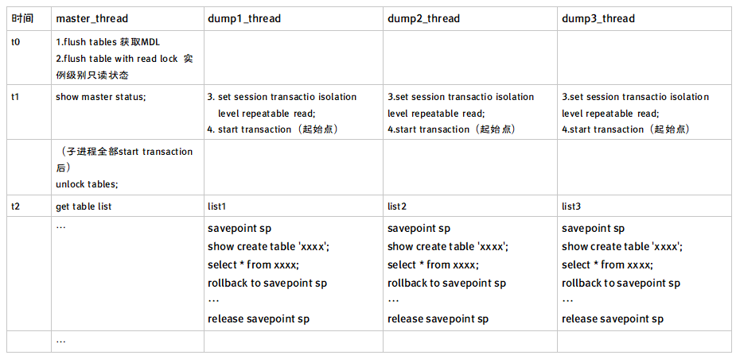

[TOC]

 

# mydumper

- mysqldump是单进程备份， mydumper是多进程备份。
- mydumper在8.0编译会存在问题，需要指定mysql5.7的mysqlconfig
- mydumper在8.0时对用户密码认证方式有需求。
    ```
    create user xx identified with mysql_native_password by 'password';
    ```
- 备份多个库需要使用正则：
	```
	--regex='(kk\.|zst\.)' -o 
	```
## 简单性能对比
```
[root@ms51 ~]# time mysqldump -S /data/mysql/mysql3306/tmp/mysql.sock -A >zabbix_full.db
real  1m51.410s
user  0m39.620s
sys   0m12.720s
 
[root@ms51 ~]# time mydumper -S /data/mysql/mysql3306/tmp/mysql.sock -o ./wokao/
real  1m14.521s
user  0m29.806s
sys   0m6.394s
```

## mydumper多进程原理
- master_thread
- dumper1_thread
- dumper2_thread

…

 

 

**mydumper是一个针对MySQL和Drizzle的高性能多线程的备份工具，备份速度远远超过mysqldump，属于逻辑备份备份，恢复时通过myloder命令工具**

下载地址：https://launchpad.net/mydumper/0.9/0.9.1/+download/mydumper-0.9.1.tar.gz

 

## 安装mydumper
```
yum install -y cmake* gcc-c++ glib2-devel mysql-devel zlib-devel pcre-devel openssl-devel
tar -zxf mydumper-0.6.2.tar.gz
cd mydumper-0.6.2
cmake .
make
make install
```

运行mydumper时有可能会提示
```
mydumper: error while loading shared libraries: libmysqlclient.so.20: cannot open shared object file: No such file or directory
```

其实mysql本身自己lib中存在这个库文件，因此创建软连接就可以
```
[root@ms51 ~]# find /opt -name libmysqlclient.so.20
/opt/mysql-5.7.30-linux-glibc2.12-x86_64/lib/libmysqlclient.so.20
[root@ms51 ~]# ln -s /opt/mysql-5.7.30-linux-glibc2.12-x86_64/lib/libmysqlclient.so.20 /usr/lib64/libmysqlclient.so.20
```

## mydumper 使用

### 备份全库
```
mydumper -u root -p -S /tmp/my10046.sock -o /data/backup/
```
### 备份zst库
```
mydumper -u root -p -S /tmp/my10046.sock -B zst -o /data/backup/
```

备份目录下会有一个metadata文件，里面记录着binlog和position号，方便以后搭建slave库

### 还原zst库
```
myloader -u root -p -S /tmp/my10046.sock -B zst -d /data/backup/
```
### 备份zst库下的t1表
```
mydumper -u root -p -S /tmp/my10046.sock -B zst -T t1 -o /data/backup/
```
### 还原t1这张表
```
myloader -u root -p -S /tmp/my10046.sock -B zst -o t1 -d /data/backup/
```
### 备份zst库下多张表
```
mydumper -u root -p -S /tmp/my10046.sock -B zst -T t1,t2 -o /data/backup/
```
### 只备份zst库下的t1表的表数据，不备份表结构
```
mydumper -u root -p -S /tmp/my10046.sock -B zst -T t1 -m -o /data/backup/
```
### 备份zst库下t1表，并进行压缩
```
mydumper -u root -p -S /tmp/my10046.sock -B zst -T t1 -c -o /data/backup/
```


```
Application Options:
 -B, --database       Database to dump
 -T, --tables-list      Comma delimited table list to dump (does not exclude regex option)
 -o, --outputdir       Directory to output files to
 -s, --statement-size    Attempted size of INSERT statement in bytes, default 1000000
 -r, --rows         Try to split tables into chunks of this many rows. This option turns off --chunk-filesize
 -F, --chunk-filesize    Split tables into chunks of this output file size. This value is in MB
 -c, --compress       Compress output files
 -e, --build-empty-files   Build dump files even if no data available from table
 -x, --regex         Regular expression for 'db.table' matching
 -i, --ignore-engines    Comma delimited list of storage engines to ignore
 -m, --no-schemas      Do not dump table schemas with the data
 -d, --no-data        Do not dump table data
 -G, --triggers       Dump triggers
 -E, --events        Dump events
 -R, --routines       Dump stored procedures and functions
 -k, --no-locks       Do not execute the temporary shared read lock. WARNING: This will cause inconsistent backups
 --less-locking       Minimize locking time on InnoDB tables.
 -l, --long-query-guard   Set long query timer in seconds, default 60
 -K, --kill-long-queries   Kill long running queries (instead of aborting)
 -D, --daemon        Enable daemon mode
 -I, --snapshot-interval   Interval between each dump snapshot (in minutes), requires --daemon, default 60
 -L, --logfile        Log file name to use, by default stdout is used
 --tz-utc          SET TIME_ZONE='+00:00' at top of dump to allow dumping of TIMESTAMP data when a server has data in different time zones or data is being moved between servers with different time zones, defaults to on use --skip-tz-utc to disable.
 --skip-tz-utc
 --use-savepoints      Use savepoints to reduce metadata locking issues, needs SUPER privilege
 --success-on-1146      Not increment error count and Warning instead of Critical in case of table doesn't exist
 --lock-all-tables      Use LOCK TABLE for all, instead of FTWRL
 -U, --updated-since     Use Update_time to dump only tables updated in the last U days
 --trx-consistency-only   Transactional consistency only
 -h, --host         The host to connect to
 -u, --user         Username with privileges to run the dump
 -p, --password       User password
 -P, --port         TCP/IP port to connect to
 -S, --socket        UNIX domain socket file to use for connection
 -t, --threads        Number of threads to use, default 4
 -C, --compress-protocol   Use compression on the MySQL connection
 -V, --version        Show the program version and exit
 -v, --verbose        Verbosity of output, 0 = silent, 1 = errors, 2 = warnings, 3 = info, default 2
```

## mydumper优点总结

- 多线程备份工具
- 支持文件压缩功能
- 支持多线程恢复
- 保证数据的一致性
- 比mysqldump备份速度和恢复速度都要快