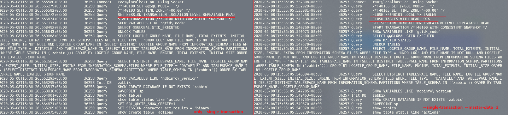
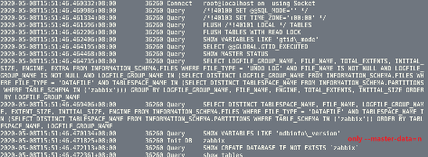

# 如何拿到一致性备份

- 一致性备份：所有的表状态都在一个时间点。

  ```
  mysqldump --single-transaction --master-data=2 -A/${DB_NAME} >DB_PORT_`date +%Y%m%d`.sql
  
  mysqldump --master-data=2 --single-transaction -A | gzip > DB_PORT_`date +%Y%m%d`.sql
  
          --master-data=2 指定这选项才会发生flush table\ftwrl
  
          --single-transaction 把事务级别调为RR，生成一致性快照，基于快照读进行备份
  ```

  这两个参数缺一不可! 传送门：[一致性备份.md](./mysqldump一致性备份.md)

- single-transaction仅仅是一致性读！

- master-data才会有ftwrl和flush tables的动作！

所谓一致性，在ftwrl动作后，全实例只读情况下获取的快照和实例正常进行中获取的快照，稳妥性肯定不同呀！





- 什么都不指定，mysqldump的动作是：

  ```
  show create database
  ...
  ```

- 只指定 --single-transaction的时候， mysqldump的动作是：

  ````
  1. sesssion isolation level 'RR'
  2. start transaction
  3. unlock tables
  4. show create database
  ...
  ```

- 只指定 --master-data 的时候， mysqldump的动作是：

  ```
  1. flush tables
  2. ftwrl
  3. show master status
  4. show create database.
  ...
  ```

  对mysqldump做help得知，指定 --master-data会默认启用--lock-all-tables，所以只指定 --master-data 的时候没有unlock是情理之中。


但是single-tansaction动作里的unlock table的动作有点莫名其妙，莫非就是为了和--master-data结合使用而存在的？