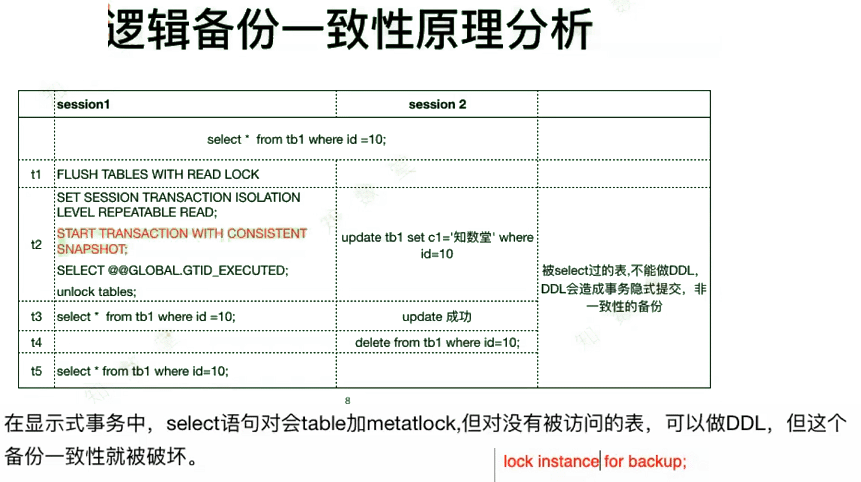

## 备份期间究竟能不能做DDL？

我测试的初衷是期望出现在mysqldump期间， 所有DDL操作被阻止（像PPT里描述的内容），但是实际测试了一下，当使用mysqldump --single-transaction (--master-data=n )时，DDL操作并不会被阻止。

查询mysqldump命令参数得知，master-data与single-transaction 连用的时候， --lock-all-tables 并不会被启用。

 

我又测试了一下， 当使用mysqldump--master-data=n 时，DDL操作会挂起。

(in which case a global read lock is only taken a short time at the beginning of the dump; don't forget to read about --single-transaction below)

我理解的是这一部分的原因， 也就是说实际上在mysqldump --single-transaction --master-data 的时候， unlock tables 之前会阻塞DDL， unlock tables 之后便不会阻塞DDL操作了。

 

 