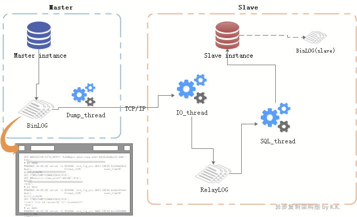
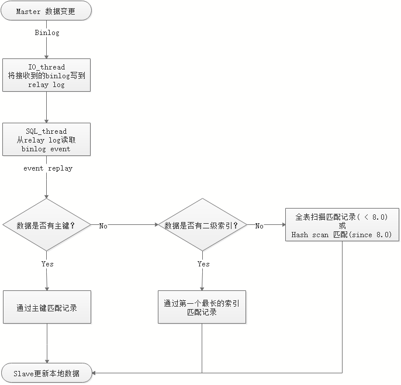

[TOC]


# 复制分类

越往下越好

- 异步复制
- 半同步复制（MySQL 5.5+）
- 增强半同步复制（MySQL 5.7+）
- Binlog Group Commit + 并行复制 （MySQL 5.7+）
- MySQL Group Replication,MGR（MySQL 5.7+）
- MySQL WriteSet （MySQL 8.0+）


# （异步）复制原理
- Binlog是复制的基础，复制是MySQL应用的核心。binlog为二进制文件，以event为记录单位。
- 所谓复制，不过就是从master读取binlog的事件(event)，然后在slave上对其进行处理、重放。



## MASTER角色

- **master instance**：主从复制里的“主”节点，复制架构中的数据来源。

- **binlog**：master instance产生的binlog，binlog为二进制文件，以event为记录单位。

- **dump_thread线程**：
- 一个slave对应一个dump_thread线程。线程启动后，可以通过show processlist查看到。
  - 当slave的io_thread启动后，master便会为此分配一个dump_thread线程通过TCP协议与slave进行通信，负责读取主节点上的binlog信息并发送给从节点：
  - 主库写binlog成功后，通知dump_thread      线程。
  - dump_thread线程会对binlog上一个读锁，读取binlog内容并发送给slave。
  - dump_thread线程读取完binlog后，便释放对binlog文件的读锁。
  - 当slave停止io_thread后，master的dump_thread依然可以show processlist查看到，直到master发生新的binlog后，dump_thread线程就消失了。

 

## SLAVE角色：

- **slave instance**：主从复制里的“从”节点，主节点的数据复制到的目标节点。
- **io_thread线程**：slave上负责接收主节点发送来的binlog，并写入到relay log。启动io_thread后便开始接收master的binlog。
- **relay-log**：master instance的binlog内容发送给slave后，由io_thread写入到relay-log，也叫relay-binlog。其格式和内容与master的binlog几乎一致。
- **sql_thread线程**：负责将relay-log里的内容重放的线程。
- **binlog(slave)**：slave instance产生的binlog，并不参与到当前的主从复制中（不过slave可以作为另一个架构里的master，这样这个binlog就作为master binlog啦）。

  

## 复制瓶颈点：

1. 主库多线程并发DML，从库一个SQL thread重放。
2. 从库并行复制（SQL thread并行）可以缓解瓶颈1，但是io_thread 和 master的连接是一个TCP的连接（only one TCP connection）。

**解决这些隐患和瓶颈：**

- 使用半同步复制来保证复制可靠性（master会在意binlog的传输结果）

- 使用并行复制机制来提升复制性能（干掉单线程重放瓶颈，让复制再快一点、更快一点！）
      我们在不远的将来，会对它们逐步探索。

  

## SQL_thread对索引的应用

```mysql
update tb1 set c3=uuid() where id=5;
```

- row格式，sql_thread重放过程中：

    - 如果有primarykey的情况下，就通过主键进行匹配；
    - 没有主键的情况下，如果有二级索引，就使用比较长的那个二级索引进行匹配；
    - 如果索引都没有，那么早期版本里就会进行全表扫描，
    - 8.0开始，会为全表建立hash，进行hash_scan。8.0.18版本中，该特性成为默认配置。

- innodb里，每个索引后面都会跟着主键，如果没有主键的情况下，innodb会产生内部隐藏的row_id。
    
    


# 半同步：

  - io_thread和主库之间保持半同步。
  - 主库通知io_thread新日志信息，由io_thread将新日志写到relay log，io_thread要给主库一个hck响应，主库收到响应后，继续往下进行。
  - 由于写入到relay log后，并不意味着sql_thread会立即无延迟的重放sql到slave datafile，所以半同步依然是有延迟的。

 

# 小结：

- 复制中包含三种线程：**dump_thread**（主库），io_thread（从库），**sql_thread**（从库）；
- **dump_thread**，负责io_thread主库有变更；
- **io_thread**，负责将主库的binlog拉到本地写入relay_log；
- **sql_thread**，负责将relay_log重放做到数据版本追随；
- 因为sql_thread 是单线程，瓶颈比较严重；io_thread 与主库并非强一致性交互，主库无法感知是否获取到日志，在半同步有所弥补；
- binlog在row格式下对索引的利用情况：有主键时用主键，无主键时用索引，索引多时用较长的联合索引做匹配。如果没有索引，早期版本全表扫，8.0开始做hash scan；
- **binlog使用row格式**；
- **记住row格式执行流程。**