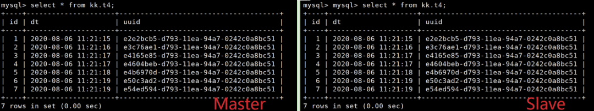

[TOC]


# Binlog格式

- binlog_format 参数

    | Property              | Value                  |
    | --------------------- | ---------------------- |
    | Command-Line  Format  | --binlog-format=format |
    | System Variable       | binlog_format          |
    | Scope                 | Global, Session        |
    | Dynamic               | Yes                    |
    | SET_VAR Hint  Applies | No                     |
    | Type                  | Enumeration            |
    | Default Value         | ROW                    |
    | Valid Values          | ROWSTATEMENTMIXED      |

- **statement**：
  
  - binlog诞生时便使用的格式，十分古老，十分简洁明了。在binlog中记录SQL语句，因此binlog体积会很小。
  - 由于binlog记录的是SQL原文，因此binlog的可读性非常好。
  - 由于binlog记录的是SQL原文，某些情况下，<u>SQL每次执行的结果都不一定相同</u>，因此在重放时就经常导致主从数据不一致。
    - 这些函数不能准确复制或不能复制：`Load_file()`、`uuid()`、`User()`、`Found_rows()`、`sysdate()`等等。

- ==**row**==：
  - 会根据实际操作的数据行的内容记录动作事件，让操作数据具备唯一性，也因此使binlog体积很大。
  - row格式会导致binlog非常大，如：`delete from tb where c1 <= 9000; `
    - statement格式会记录一条SQL：`delete from tb where c1 <= 9000;` 
    - row格式会记录**9000**条变更日志！每一次变动都会写成日志。
  - binlog里事件记录的可读性相比statement格式要差很多，无法从binlog看到执行的SQL原文（`binlog_rows_query_log_events |=ON`）。
  - 在表有主键的复杂SQL中，复制性能相比statement要更快。
  - 系统的特殊函数也可以复制
  - 更少的锁

- **mixed**：
  - 混合模式。通常记录为statement格式，但是在一些不确定的情况下，会记录为row格式。
  - 事务级别为RC时，InnoDB表会自动转为row格式记录。
  - GTID、MGR都在以row格式为基础。
  - NDB Cluster 8.0默认为mixed（不支持statement）
  - 某些情况下mixed也会导致不一致问题。

- 建议**==尽量使用row格式==。**
  - 如果非row格式，可以改

  - 先改从库`set global binlog_format='row'`

 

# **通过对比实验，体会`binlog_format`为statement和row时的区别，明白为何尽量使用row格式**

 

- 环境信息：MySQL 8.0.19，一主一从异步复制架构。
- 修改master的binlog_format为statement。（这个实验里无需调整slave的binlog_format，想想看为什么？）
	```
	mysql-master> set binlog_format=statement;		# binlog_format参数支持session和global级别，别晕。
	Query OK, 0 rows affected (0.00 sec)
	
	mysql-master> show global variables like "%binlog_format%";
	+---------------+-------+
	| Variable_name | Value |
	+---------------+-------+
	| binlog_format | ROW  |
	+---------------+-------+
	1 row in set (0.01 sec)
	
	mysql-master> show variables like "%binlog_format%";
	+---------------+-----------+
	| Variable_name | Value   |
	+---------------+-----------+
	| binlog_format | STATEMENT |
	+---------------+-----------+
	1 row in set (0.01 sec)
	
	# 建库建表用来实验。
	mysql-master> create database kk;
	Query OK, 1 row affected (0.30 sec)
	
	mysql-master> create table kk.t3 (id int auto_increment primary key,dt varchar);
	Query OK, 0 rows affected (0.74 sec)
	
	# uuid() 函数会随机生成UUID，
	mysql-master> insert into kk.t3(dt,uuid) values(sysdate(),uuid());
	Query OK, 1 row affected, 1 warning (0.08 sec)
	
	#重复插入若干次
	```


- **对比主从结果**：

  会发现主从节点发生了数据不一致的情况：id=10的时间不一致，而uuid列则完全不一致。
  
  
  
   	分析binlog和relay-log，可以看到，statement格式的binlog中记录的是完整的SQL，这样在执行一些不可控结果的函数时，二者肯定不一致。
  
  
  
- 将master的binlog_format调整为row，再次实验：

  ```
  # 建立一个新表用来测试
  mysql-master> create table kk.t4 like kk.t3;
  Query OK, 0 rows affected (0.96 sec)
  
  # 调整binlog格式为rowmysql-master> set binlog_format=row;
  Query OK, 0 rows affected (0.00 sec)
  
  # 切换一下日志，便于后面分析
  mysql-master> flush logs;
  Query OK, 0 rows affected (0.25 sec)
  
  # 插入若干次数据
  
  mysql-master> insert into kk.t4(dt,uuid) values(sysdate(),uuid());
  Query OK, 1 row affected (0.06 sec)
  ```

- **对比主从结果**：

  发现主从两库的kk.t4表数据完全一致，是插入数据不够多以至于没暴露出问题吗？

  我们去解析一下binlog和relay-log 可以发现，binlog及relay-log中这一处记录的并不是SQL语句，而是一个看不太懂的东西。

  

   

  其实就是这个看不太懂的东西使二者数据版本一致的。

  

 

 

# **对ROW格式的进一步探索**

- 事件

  row格式下，binlog中并不能看到SQL，只能看到一系列事件（event），如：

  一个insert操作在binlog中大致对应6个event：

    1.  GTID
    2. QUERY(begin)
    3. ROW_QUERY(可能没有，如：update)
    4. TABLE_MAP
    5. WRITE_ROWS
    6. XID(commit)

我们可以通过前面案例中的binlog进行观察，更多的动作对应可以自己尝试探索一下。

  

 
