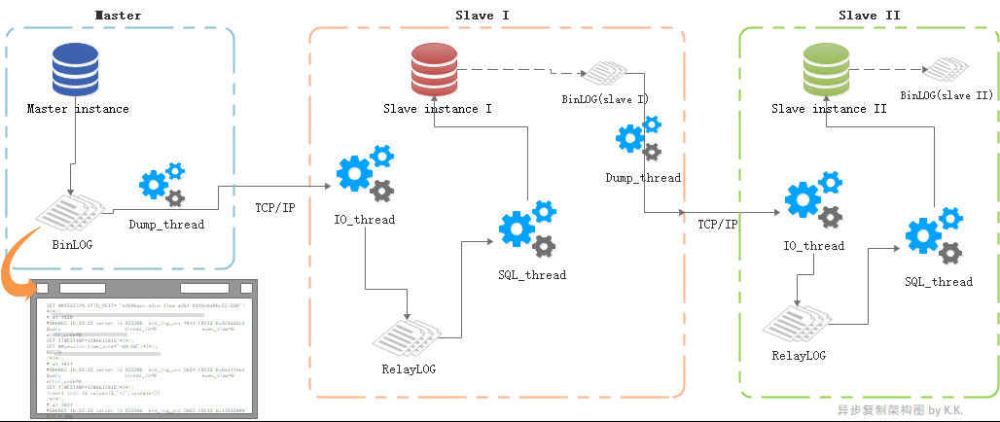
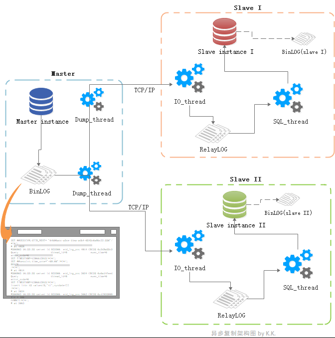
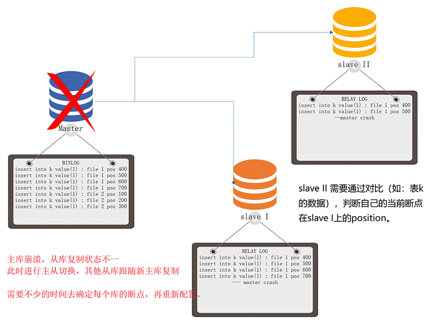
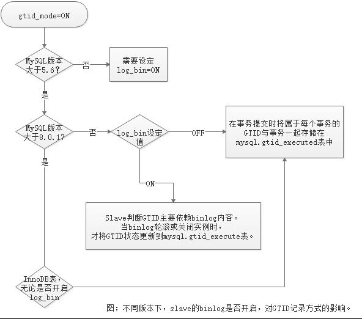

[TOC]


# GTID

- 5.6开始推出的特性。
- data_dir/auto.cnf 包含实例的uuid。
- GTID格式为：uuid:n-m ， 
- 如：d5c3b189-33d4-11ea-a48c-000c29f0aa33:1-40
- 理论上GTID是连续的，但在MGR环境中不连续；在并行复制的过程中，从库上可能不连续，但是最终一定是连续的。

# GTID的意义

使用binlog position方式配置异步复制，我们思考两个场景下的几个问题：

- 场景一： 如果在已有的一主一从架构下，再加入一个新的slave，组建成串联复制架构（如下图），我们该如何配置呢？

  

  - 获取slave I的binlog filename、position，然后在slave II上change master。

    那么问题来了，如果此时slave I的服务器发生了不可逆的灾难（比如：突然掉河里了！），slave II要直接与master进行复制，该如何处理？
  
  1. 由于slave II使用的binlog filename、position都是slave I的，因此通过show slave status 查看到的复制信息，并不能直接为本次处理提供有效信息。
  2. 通过使用mysqlbinlog 工具从slave II的relay-log中分析出与master事务的关系，然后定位到所需master 的 binlog filename和position，重新change master。  

 听起来就好麻烦？

  

- 场景二： 如果在已有的一主一从架构下，再增加一个新的slave，从而组建成一主多从的架构（如下图）。如果此时master的服务器发生了故障（比如：master着火了！），此时要调整slave I接任为新master，slave II成为新master的小跟班儿，该如何处理？

  

  

  1. 分别在slave I 和 slave II 通过 show slave status找到当前状态，然后将逻辑分析确定断点，change master到slave I，由于是相同的master，分析应该轻松一些。
  2. 如果slave的数量不是2，而是20甚至200呢？其他199个slave要变更master，要分析199次？那可真太horrible了。

 基于position方式复制下，比较头痛的问题

  

 #    GTID简介

从MySQL 5.6.5 开始，新增了基于 GTID (Global Transaction ID)的复制方式，这种方式通过事务标记来记录变更，强化了数据库的故障恢复性能。

slave连接到master之后，把自己(SQL线程)执行过的GTID(Executed_Gtid_Set) 、(IO线程)获取到的GTID(Retrieved_Gtid_Set）发给master，master把slave缺少的GTID及对应的transactions发过去补全即可。当master挂掉的时候，找出同步最成功的那台从服务器，直接把它提升为master即可。如果要指定某一台不是最新的slave提升为master， 先change到同步最成功的那台slave， 等把GTID全部补全了，就可以把它提升为新的master了。

- 格式为**`SERVER_UUID:事务ID`**

  - GTID信息包含了发起事务节点的UUID，所以通过UUID可以知道这个事务在哪个实例上提交的。

  - GTID通过事务ID标记来记录事务，具有全局一致性，可以极方便的进行复制结构上的故障转移，新主设置。很好的解决了上面这些令人头痛的问题。

- GTID 有3个变量
  - gtid_executed，用于记录已经被执行的binlog事务的GTID集合，即Executed_GTID_Set
  - gtid_purged，用于记录已经被purge的binlog事务的GTID集，属于Executed_GTID_Set的子集
  - gtid_next，产生下一个GTID的方法，有显式GTID，AUTOMATIC和ANONYMOUS三种取值方法，gtid_next的值是单个GTID。


 # 开启GTID的方式和理由


| gtid_mode=ON                | 如果MySQL版本为5.6，slave必须开启binlog   版本高于5.6，对binlog的使用会影响GTID的记录方式。   从MySQL8.0.17开始，对binlog的使用不会再影响GTID的记录方式。 |
| --------------------------- | ------------------------------------------------------------ |
| enforce_gtid_consistency=ON | 在启用基于GTID的复制之前，必须将此变量设置为ON。   ON：不允许任何事务违反GTID一致性。   只有在为语句执行二进制日志记录时，force_gtid_consistency才生效。   如果在服务器上禁用了二进制日志记录，或者由于过滤器将语句删除而未将语句写入二进制日志，则不会检查或强制执行未记录语句的GTID一致性。 |
| log_bin=ON                  | 无视版本，主库都要开。   5.7及以上版本，从库可以不开。       |
| log_slave_updates=ON        | slave将从master接收到的状态，记录到自己的binlog中。   5.6版本必须开启，5.7及以上版本不强制要求开启 |

  

 # 查看GTID

  在这里我使用了一主一从的复制结构来协助探索，下面是两个节点的信息

|             | master                                 | slave                                  |
| ----------- | -------------------------------------- | -------------------------------------- |
| ip          | ms81                                   | ms82                                   |
| port        | 4000                                   | 4000                                   |
| server_id   | 814000                                 | 824000                                 |
| server-uuid | `cf67f172-d78e-11ea-a2c1-0242c0a8bc51` | `d264643f-d78e-11ea-9a3c-0242c0a8bc52` |

  

- 查看GTID

  - 通过show master status查看本机的 Executed_Gtid_Set

    ```
    mysql> show master status;`
    +------------------+----------+--------------+------------------+-------------------------------------------+
    | File | Position | Binlog_Do_DB | Binlog_Ignore_DB | Executed_Gtid_Set       |
    +------------------+----------+--------------+------------------+-------------------------------------------+
    | mysql-bin.000003 |   3135 | |   | cf67f172-d78e-11ea-a2c1-0242c0a8bc51:1-58 |
    +------------------+----------+--------------+------------------+-------------------------------------------+
    1 row in set (0.00 sec)
    ```
    
  - 也可以通过查看全局变量@@global.gtid_executed查看本机的 Executed_Gtid_Set

    ```
    mysql> select @@global.gtid_executed;
    +-------------------------------------------+
    | @@global.gtid_executed    |
    +-------------------------------------------+
    | cf67f172-d78e-11ea-a2c1-0242c0a8bc51:1-58 |
    +-------------------------------------------+
    1 row in set (0.00 sec)
    ```

Executed_Gtid_Set里的内容就是当前实例已经执行过的GTID(集），还有一个变量`@@global.gtid_purged`，记录着当前实例已经purge的GTID集信息，可以自行查看。


- GTID的格式

    ```
    | cf67f172-d78e-11ea-a2c1-0242c0a8bc51 | :  | 1-58  |
    | ------------------------------------ | -- | ------|
    | SERVER_UUID        | :  | 事务ID |
    ```

# GTID的结构剖析

GTID由实例的SERVER-UUID和事务ID组成，事务ID随着事务的进行进行单调增加。
介绍一下SERVER_UUID

## UUID & SERVER_UUID
一个函数 uuid() ，它可以生成随机的UUID。

- UUID (Universally Unique Identifier)是"通用唯一识别码"的缩写，每个元素都可以创建不与其它人冲突的UUID，在这样的情况下，就不需考虑数据库名称重复问题。总结起来，就是避免冲突的一种辨识信息。

- SERVER_UUID，就是标识实例的UUID。<br>每个实例的SERVER_UUID默认会以文本方式保存在data_dir/auto.cnf 文件中，MySQL启动时，会自动从data_dir/auto.cnf 文件中获取SERVER_UUID值，并将这个值存储在全局变量server_uuid中。如果这个值或者这个文件不存在，那么将会生成一个新的uuid值，并将这个值保存在auto.cnf文件中。
  ```
  [18:10:07] root@ms81:data # cat auto.cnf 
  [auto]
  server-uuid=cf67f172-d78e-11ea-a2c1-0242c0a8bc51
  
  [18:10:47] root@ms82:data # cat auto.cnf 
  [auto]
  server-uuid=d264643f-d78e-11ea-9a3c-0242c0a8bc52
  ```

  - 也可以通过查看全局变量@@global.server_uuid，获得当前实例的SERVER_UUID
    ```
    master-mysql> select @@global.server_uuid;
    +--------------------------------------+
    | @@global.server_uuid     |
    +--------------------------------------+
    | cf67f172-d78e-11ea-a2c1-0242c0a8bc51 |
    +--------------------------------------+
    1 row in set (0.01 sec)

    slave-mysql> select @@global.server_uuid;
    +--------------------------------------+
    | @@global.server_uuid     |
    +--------------------------------------+
    | d264643f-d78e-11ea-9a3c-0242c0a8bc52 |
    +--------------------------------------+
    1 row in set (0.00 sec)
    ```
    
  - 主从结构里，master可以查看到slave的SERVER_UUID
    ```
    master-mysql> show slave hosts;
    +-----------+------+------+-----------+--------------------------------------+
    | Server_id | Host | Port | Master_id | Slave_UUID         |
    +-----------+------+------+-----------+--------------------------------------+
    |  824000   |      | 4000 |  814000   | d264643f-d78e-11ea-9a3c-0242c0a8bc52 |
    +-----------+------+------+-----------+--------------------------------------+
    1 row in set (0.00 sec)
    ```

搭建主从复制时，my.cnf中有一个参数：server_id，它的意义也是要求各实例间不可重复，用来区分实例。

这两个参数在主从复制中具有重要作用，**默认情况下，如果主、从库的SERVER_UUID或者server-id的值一样，将会导致主从复制报错中断。**如果通过克隆虚拟机的方式搭建主从复制，在配置复制阶段可能会出问题，很大可能就是两个实例的server-id甚至SERVER_UUID相等了。

  

## GTID可以追踪来源

GTID格式为**`SERVER_UUID:事务ID`**，通过这种方式我们也能实现事务的来源追踪。

- 当前主从复制中，slave尽职尽责的完成复制，从未有小动作干私活。

```
slave-mysql> show master status ;
+------------------+----------+--------------+------------------+-------------------------------------------+
| File       | Position | Binlog_Do_DB | Binlog_Ignore_DB | Executed_Gtid_Set       |
+------------------+----------+--------------+------------------+-------------------------------------------+
| mysql-bin.000001 |  22653   |  |      | cf67f172-d78e-11ea-a2c1-0242c0a8bc51:1-58 |
+------------------+----------+--------------+------------------+-------------------------------------------+
1 row in set (0.00 sec)
```
可以看出，虽然slave的server-uuid为d264643f-d78e-11ea-9a3c-0242c0a8bc52，但是slave自己Executed_Gtid_Set （已经执行的事务集）中，执行的是master的第1至第58个事务，并没有一个来自于自己的事务。

- 如果slave执行一些东西，会发现自己的Executed_Gtid_Set有了变化

```
slave-mysql> create database slave;
Query OK, 1 row affected (0.13 sec)

slave-mysql> show master status;
+----------+----------+--------------+------------------+--------------------------------------------+
| File     | Position | Binlog_Do_DB | Binlog_Ignore_DB | Executed_Gtid_Set        |
+----------+----------+--------------+------------------+--------------------------------------------+
| mysql-bin.000001 |  22841 | |   | cf67f172-d78e-11ea-a2c1-0242c0a8bc51:1-58,
d264643f-d78e-11ea-9a3c-0242c0a8bc52:1 |
+----------+----------+--------------+------------------+--------------------------------------------+
1 row in set (0.00 sec)

slave-mysql> select @@global.gtid_executed;
+-----------------------------------------------------------------------------------+
| @@global.gtid_executed       |
+-----------------------------------------------------------------------------------+
| cf67f172-d78e-11ea-a2c1-0242c0a8bc51:1-58,
d264643f-d78e-11ea-9a3c-0242c0a8bc52:1 |
+-----------------------------------------------------------------------------------+
1 row in set (0.00 sec)
```
因为master没有接收slave的事务变更，因此master已经执行的事务记录依然是master发起的第1到第58个事务。

```
master-mysql> select @@global.gtid_executed;
+-------------------------------------------+
| @@global.gtid_executed    |
+-------------------------------------------+
| cf67f172-d78e-11ea-a2c1-0242c0a8bc51:1-58 |
+-------------------------------------------+
1 row in set (0.00 sec)`
```
在这个实验里，create database slave; 这一个事务的GTID为d264643f-d78e-11ea-9a3c-0242c0a8bc52:1，我们可以发现，这就是标识了该事务是slave上发起的第一个事务，而因为master并未从slave上获取binlog进行复制，因此master上并没有这一个事务，在master上的gtid_executed  自然也查看不到这个GTID。

- 如果让master重新应用slave上的binlog，那么显而易见，master上的gtid_executed 也会包含这一个GTID了，试试看：

```
slave-mysql> stop slave;
Query OK, 0 rows affected (0.37 sec)

slave-mysql> show master status;
+------------------+----------+--------------+------------------+-----------------------------------------------------------------------------------+
| File | Position | Binlog_Do_DB | Binlog_Ignore_DB | Executed_Gtid_Set         |
+------------------+----------+--------------+------------------+-----------------------------------------------------------------------------------+
| mysql-bin.000001 |  22841 | |   | cf67f172-d78e-11ea-a2c1-0242c0a8bc51:1-58,
d264643f-d78e-11ea-9a3c-0242c0a8bc52:1 |
+------------------+----------+--------------+------------------+-----------------------------------------------------------------------------------+
1 row in set (0.00 sec)

master-mysql> show databases;
+--------------------+
| Database      |
+--------------------+
| information_schema |
| kk   |
| mysql |
| performance_schema |
| sys  |
+--------------------+
5 rows in set (0.00 sec)

master-mysql> show master status;
+------------------+----------+--------------+------------------+-------------------------------------------+
| File | Position | Binlog_Do_DB | Binlog_Ignore_DB | Executed_Gtid_Set       |
+------------------+----------+--------------+------------------+-------------------------------------------+
| mysql-bin.000003 |   3135 | |   | cf67f172-d78e-11ea-a2c1-0242c0a8bc51:1-58 |
+------------------+----------+--------------+------------------+-------------------------------------------+
1 row in set (0.00 sec)

# 这一步临时将master作为slave的从库，目的是同步一下slave上的binlog。
master-mysql> change master to master_host='192.168.188.82',master_port=4000,master_user='rep',master_password='rep',get_master_public_key=1,master_auto_position=1;
Query OK, 0 rows affected, 2 warnings (0.80 sec)

master-mysql> start slave;
Query OK, 0 rows affected (0.21 sec)

master-mysql> show master status;
+------------------+----------+--------------+------------------+-----------------------------------------------------------------------------------+
| File | Position | Binlog_Do_DB | Binlog_Ignore_DB | Executed_Gtid_Set         |
+------------------+----------+--------------+------------------+-----------------------------------------------------------------------------------+
| mysql-bin.000003 |   3330 | |   | cf67f172-d78e-11ea-a2c1-0242c0a8bc51:1-58,
d264643f-d78e-11ea-9a3c-0242c0a8bc52:1 |
+------------------+----------+--------------+------------------+-----------------------------------------------------------------------------------+
1 row in set (0.00 sec)

master-mysql> show databases;
+--------------------+
| Database      |
+--------------------+
| information_schema |
| kk   |
| mysql |
| performance_schema |
| slave |
| sys  |
+--------------------+
6 rows in set (0.00 sec)
```

这就可以看到，原来的master已经执行了原来slave的第一个事务，也有了名称为slave的库。

然后我们取消刚刚临时配置的主从，以便后面继续实验：
```
master-mysql> stop slave;
master-mysql> reset slave all;
slave-mysql> start slave;
```

  

# 怎么用？

## 常规主从复制
- slave在change master to 语句中直接指定master_auto_position=1，直接使用GTID自动定位功能，无需找binlog filename和position。如：
```
mysql> change master to master_host='192.168.188.81',master_port=4000,master_user='rep',master_password='rep',get_master_public_key=1,master_auto_position=1;
```

## 使用空事务方式跳过特定GTID
- 查看slave状态，并停止sql_thread重放线程
```
slave-mysql> select @@global.gtid_executed\G
*************************** 1. row ***************************
@@global.gtid_executed: cf67f172-d78e-11ea-a2c1-0242c0a8bc51:1-61,
d264643f-d78e-11ea-9a3c-0242c0a8bc52:1
1 row in set (0.00 sec)

slvae-mysql> stop slave sql_thread;
Query OK, 0 rows affected, 1 warning (0.00 sec)
```

- 查看master状态，并执行事务
```
master-mysql> select @@global.gtid_executed\G
*************************** 1. row ***************************
@@global.gtid_executed: cf67f172-d78e-11ea-a2c1-0242c0a8bc51:1-61,
d264643f-d78e-11ea-9a3c-0242c0a8bc52:1

master-mysql> select * from slave.t1;
+------+---------------+
| id  | dtl      |
+------+---------------+
|  1 | open binlog  |
|  2 | closed binlog |
|  3 | closed binlog |
|  4 | reopen binlog |
+------+---------------+
4 rows in set (0.00 sec)
```
- 执行事务，其中事务和GTID对应如下

| 事务 |GTID|
| ------------------------------------------------------------ | ------------------------------------------- |
| master-mysql> insert into slave.t1 values(5,'test');<br>Query OK,1 row affected (0.30 sec) |cf67f172-d78e-11ea-a2c1-0242c0a8bc51:1-62|
| master-mysql>   insert into slave.t1 values(6,'test');<br>Query OK,   1 row affected (0.11 sec) | cf67f172-d78e-11ea-a2c1-0242c0a8bc51:1-63|
| master-mysql>   insert into slave.t1 values(7,'test');<br>Query OK,   1 row affected (0.06 sec) | cf67f172-d78e-11ea-a2c1-0242c0a8bc51:1-64 |
| master-mysql>   insert into slave.t1 values(8,'test');<br>Query OK,   1 row affected (0.05 sec) | cf67f172-d78e-11ea-a2c1-0242c0a8bc51:1-65 |


- 进行事务后的master状态
```
master-mysql> select @@global.gtid_executed\G
*************************** 1. row ***************************
@@global.gtid_executed: cf67f172-d78e-11ea-a2c1-0242c0a8bc51:1-65,
d264643f-d78e-11ea-9a3c-0242c0a8bc52:1
```

- 接下来让slave跳过62这个事务
```
slave-mysql> stop slave sql_thread;
Query OK, 0 rows affected (0.04 sec)

slave-mysql> set gtid_next='cf67f172-d78e-11ea-a2c1-0242c0a8bc51:62';
Query OK, 0 rows affected (0.00 sec)
```

- 注入空事务
```
slave-mysql> begin ; commit;
Query OK, 0 rows affected (0.00 sec)

slave-mysql> set gtid_next=automatic;
Query OK, 0 rows affected (0.00 sec)

slave-mysql> start slave sql_thread;
Query OK, 0 rows affected (0.42 sec)

slave-mysql> select * from slave.t1;

+------+---------------+
| id  | dtl      |
+------+---------------+
|  1 | open binlog  |
|  2 | closed binlog |
|  3 | closed binlog |
|  4 | reopen binlog |
|  6 | test     |
|  7 | test     |
|  8 | test     |
+------+---------------+
7 rows in set (0.00 sec)
```

  

## 使用purge方式阻止特定GTID的事务

- 如果在复制开始前就明确要跳过某个GTID或某些个GTID，可以使用gtid_purged

- 跳过事务67-70,75,79-80
    ```
    slave-mysql> set global gtid_purged='cf67f172-d78e-11ea-a2c1-0242c0a8bc51:67-70, cf67f172-d78e-11ea-a2c1-0242c0a8bc51:75 ， cf67f172-d78e-11ea-a2c1-0242c0a8bc51:79-80';

    Query OK, 0 rows affected (0.32 sec)
    ```

| 事务 | GTID |
| ------------------------------------------------------------ | ------------------------------------------- |
| master-mysql>   insert into slave.t1 values(66,'test');<br>Query OK,   1 row affected (0.30 sec) | cf67f172-d78e-11ea-a2c1-0242c0a8bc51:1-66 |
| master-mysql>   insert into slave.t1 values(67,'test');<br>Query OK,   1 row affected (0.11 sec) | cf67f172-d78e-11ea-a2c1-0242c0a8bc51:1-67 |
| master-mysql>   insert into slave.t1 values(68,'test');<br>Query OK,   1 row affected (0.06 sec) | cf67f172-d78e-11ea-a2c1-0242c0a8bc51:1-68 |
| master-mysql>   insert into slave.t1 values(69,'test');<br>Query OK,   1 row affected (0.05 sec) | cf67f172-d78e-11ea-a2c1-0242c0a8bc51:1-69 |
| …                                                          | …                                         |
| master-mysql>   insert into slave.t1 values(81,'test');<br>Query OK,   1 row affected (0.05 sec) | cf67f172-d78e-11ea-a2c1-0242c0a8bc51:1-81 |

 结果可以自行实验一下。


 # GTID的原理探索

 - 事务ID是单调增加的，因此GTID是单调增加的。
  - 理论上GTID是连续的，但在MGR环境中不连续（分段）；在并行复制的过程中，从库上可能不连续，但是最终一定是连续的。这块后续会探索，不用理会。
  - GTID非常适合多节点复制环境，在单节点或一主一从时优势并不明显，但是从一主二从开始，具有相当的优势。
  - 使用GTID复制要求主从节点都开启GTID
  - 如果master没有将事务写入binlog（例如，由于该事务已被滤除或该事务为只读），则不会为其分配GTID。
  - 复制的事务保留与原始服务器上分配给该事务的GTID相同的GTID。      
  - 即使复制的事务未写入slave的二进制日志或在slave上被过滤掉，GTID也会保留，但是事务内容为空。

  

 - GTID方式具有自动跳过功能，意味着在主服务器上提交的事务只能在从服务器上应用一次，这有助于确保一致性。服务器将忽略执行具有相同GTID的后续事务，不会引发任何错误，也不会执行事务中的任何语句。

  

## GTID的执行过程

1. 当一个事务在master执行并提交时，分配GTID并在事务提交时将其作为Gtid_log_event写入binlog。
     1. 如果为事务分配了GTID，则将GTID添加到gtid_executed系统变量（@@GLOBAL.gtid_exected）中，gtid_executed包含所有已提交GTID事务集。
     2. 每当binlog轮滚或实例关闭时，服务器都会将前一个binlog file中的所有事务的GTID写入mysql.gtid_executed表。
2. binlog传输到slave,并存储到relaylog后，slave读取这个GTID值并赋值给系统变量gtid_next，即告诉slave，必须使用该GTID值作为下一个事务。

3. 如果在slave上启用了binlog，则在提交时将该事务GTID作为Gtid_log_event写入slave的binlog，原子地将GTID保留。
     1. 每当binlog轮滚或实例关闭时，服务器都会将前一个binlog file中的所有事务的GTID写入mysql.gtid_executed表。
     2. 这种场景下mysql.gtid_executed表中的记录存在滞后性，最新的记录存在于当前活动的binlog中。
4. 如果在slave上禁用了binlog，则通过将GTID直接写入mysql.gtid_executed表来自动保留GTID。
     1. MySQL自动在事务中附加一个语句以将GTID插入mysql.gtid_executed表中。
     2. 在这种情况下，mysql.gtid_executed表是在slave上应用的事务的完整记录。
     3. 从MySQL 8.0开始，此操作对于DDL语句和DML语句都是这种原子的。
5. sql线程从relay log中获取GTID，然后对比slave的binlog，如果slave未启用binlog就对比slave的mysql.gtid_executed表，检查是否有该GTID。
     1. 如果有记录，说明该GTID的事务已经执行，slave会自动跳过该事务。
     2. 如果没有记录，会先检查其他session是否持有该GTID，确认不被重复执行后，slave就会执行该GTID事务，并记录该GTID到自身的binlog或mysql.gtid_executed表。
6. 在解析过程中会判断是否有主键，如果没有就用二级索引，如果没有就用全部扫描，MySQL8.0的话会使用hash-scan。
7. 在slave上被过滤掉的事务的GTID也会保留。
     1. 如果在slave上启用了binlog，则过滤的事务将作为Gtid_log_event写入二进制日志，但是事务内容是仅包含BEGIN和COMMIT语句的空事务。
     2. 如果禁用了binlog，则将过滤掉的事务的GTID写入mysql.gtid_executed表。保留被过滤的事务的GTID，可以确保主从间的事务状态一致。

 

# 不同版本对gtid_exected记录方式的变化

 - 5.6版本的GTID复制模式，slave的gtid_executed只记录在binlog中，所以必须开启log_slave_updates参数，因为需要在binlog找到同步复制的信息，否则启动会报错。

  - 在5.7开始，同步复制的信息记录在了mysql.gtid_executed表，不再必须开启log_slave_updates参数。

  - 5.7至8.0.17之前的版本，slave是否开启binlog对gtid_exected的持久化记录方式有影响：

      - slave启用binlog后，gtid_exected系统变量中的GTID集是所应用事务的完整记录，但mysql.gtid_executed表不是完整记录，因为最新历史记录仍在当前二进制文件中日志文件（待日志轮滚或实例关闭时才会写入mysql.gtid_executed表，但是日志轮滚后又会有新的记录产生）。
    - 如果slave禁用binlog，或者禁用了log_slave_updates，服务器将在事务提交时将事务GTID与事务一起记录在mysql.gtid_executed表中，这种情况下gtid_exected系统变量中的GTID集和mysql.gtid_executed表都是所应用事务的完整记录。

- 8.0.17版本开始，对于DDL语句和DML语句都是原子的，也就是说，无论slave是否开启binlog，服务器都会在事务提交时将事务GTID与事务一起记录在mysql.gtid_executed表中，从此gtid_exected系统变量中的GTID集和mysql.gtid_executed表都是所应用事务的完整记录。（对于DDL语句和DML语句都是原子的）

  

  

  

  

  

## mysql.gtid_executed表的压缩

了解了mysql.gtid_executed表的功能后，可以预见的是，在大量事务进行后，势必造成mysql.gtid_executed表占用大量存储空间并造成查询瓶颈。而通常情况下，gtid_executed集中的值存在相当的连续性，这些数据原理上可以进行压缩（如将1,2,3,4….99这100条记录压缩为1-100这1条记录），从而节省出存储空间。

- 通过设置gtid_executed_compression_period系统参数，控制在达到一定事务数后对mysql.gtid_executed表进行压缩，从而控制压缩率。
  - 该参数默认值为1000，也就是默认情况下每1000个事务处理后将对mysql.gtid_executed表进行压缩。
  - 将参数设置为0会禁止压缩，这样的话gtid_executed表可能占用大量存储空间。

  

- 当启用binlog时，gtid_executed_compression_period设定不生效，在每次binlog轮滚时都会自动压缩mysql.gtid_executed表。
  - MySQL 8.0.17之前的版本中，启用了binlog后的压缩是通过在轮滚binlog来触发的。
  - MySQL 8.0.20版本中，压缩是由线程启动触发的。

  

 mysql.gtid_executed表的压缩由一个名为thread / sql / compress_gtid_table的专用前台线程执行。该线程无法从SHOW PROCESSLIST查看，但可以在**performance_schema.threads**表中找到：
```
mysql> SELECT * FROM performance_schema.threads WHERE NAME LIKE '%gtid%'\G
*************************** 1. row ***************************
          THREAD_ID: 26
               NAME: thread/sql/compress_gtid_table
               TYPE: FOREGROUND
     PROCESSLIST_ID: 1
   PROCESSLIST_USER: NULL
   PROCESSLIST_HOST: NULL
     PROCESSLIST_DB: NULL
PROCESSLIST_COMMAND: Daemon
   PROCESSLIST_TIME: 1033194
  PROCESSLIST_STATE: Suspending
   PROCESSLIST_INFO: NULL
   PARENT_THREAD_ID: 1
               ROLE: NULL
       INSTRUMENTED: YES
            HISTORY: YES
    CONNECTION_TYPE: NULL
       THREAD_OS_ID: 7638
1 row in set (0.00 sec)
```


# 重置GTID
使用`RESET MASTER`语句重置GTID执行记录。
发出RESET MASTER时，将执行以下重置操作：

- gtid_purged系统变量的值设置为空字符串（''）。
- gtid_exected系统变量的全局值（而不是会话值）设置为空字符串。
- mysql.gtid_executed表被清除（请参见mysql.gtid_executed表）。
- 如果服务器启用了二进制日志记录，则将删除现有的二进制日志文件并清除二进制日志索引文件。
请注意，即使服务器是禁用了二进制日志记录的复制从属服务器，RESET MASTER也是重置GTID执行历史记录的方法。 

==谨慎使用RESET MASTER==，以避免丢失任何所需的GTID执行历史记录和二进制日志文件。

- 在发出RESET MASTER之前，请确保已备份服务器的二进制日志文件和二进制日志索引文件（如果有），并获取并保存保存在gtid_executed系统变量的全局值中的GTID集（例如，通过发出SELECT  @@ GLOBAL.gtid_exected语句并保存结果）。
- 如果要从该GTID集中删除不需要的事务，请使用mysqlbinlog检查事务的内容，以确保它们没有值，不包含任何必须保存或复制的数据，并且不会导致服务器上的数据更改。

==RESET SLAVE对GTID执行历史没有影响==。


# GTID自动定位
GTID取代了先前为确定开始，slave直接从复制数据流中获得与master同步所需的所有信息，不再需要file position。

要使用基于GTID的复制，在`CHANGE MASTER TO语句`中不要使用`MASTER_LOG_FILE`和`MASTER_LOG_POS`选项，只需要启用`MASTER_AUTO_POSITION`选项即可实现自动定位复制。

# GTID的限制
- create 语句限制和解法
  - `create table xxx as select`的语句，其实会被拆分为两部分，create语句和insert语句，但是如果想一次搞定，MySQL会抛出如下的错误。
  ```
  mysql> create table test_new as select *from test;
  ERROR 1786 (HY000): Statement violates GTID consistency: CREATE TABLE ... SELECT.
  ```
  
  - 这种场景下可以使用 like语法，将create table xxx as select 的方式可以拆分成两部分：
    - `create table test_new like test;`
    - `insert into test_new select * from test;`
  

# 验证探索
- 如果没有将事务写入二进制日志（例如，由于该事务已被滤除或该事务为只读），则不会在master上为其分配GTID。
  - master 建表并插入数据
  ```
  master-mysql> create table slave.t1(id int,dtl varchar(100));
  Query OK, 0 rows affected (0.61 sec)
   
  master-mysql> insert into slave.t1 values(1,'open binlog');
  Query OK, 1 row affected (0.34 sec)
  ```

  - 查看gtid变化
  ```
  master-mysql> show master status;
  +------------------+----------+--------------+------------------+-----------------------------------------------------------------------------------+
  | File | Position | Binlog_Do_DB | Binlog_Ignore_DB | Executed_Gtid_Set         |
  +------------------+----------+--------------+------------------+-----------------------------------------------------------------------------------+
  | mysql-bin.000005 |   802 | |   | cf67f172-d78e-11ea-a2c1-0242c0a8bc51:1-60,
  d264643f-d78e-11ea-9a3c-0242c0a8bc52:1 |
  +------------------+----------+--------------+------------------+-----------------------------------------------------------------------------------+
  1 row in set (0.00 sec)
  ```

  - master会话级别禁用binlog记录
  ```
  master-mysql> set session sql_log_bin=0;
  Query OK, 0 rows affected (0.00 sec)
  ```

  - master插入数据并查看GTID变化
  ```
  master-mysql> insert into slave.t1 values(2,'closed binlog');
  Query OK, 1 row affected (0.03 sec)

  master-mysql> show master status;
  +------------------+----------+--------------+------------------+-----------------------------------------------------------------------------------+
  | File | Position | Binlog_Do_DB | Binlog_Ignore_DB | Executed_Gtid_Set         |
  +------------------+----------+--------------+------------------+-----------------------------------------------------------------------------------+
  | mysql-bin.000005 |   802 | |   | cf67f172-d78e-11ea-a2c1-0242c0a8bc51:1-60,
  d264643f-d78e-11ea-9a3c-0242c0a8bc52:1 |
  +------------------+----------+--------------+------------------+-----------------------------------------------------------------------------------+
  1 row in set (0.00 sec)

  master-mysql> insert into slave.t1 values(3,'closed binlog');
  Query OK, 1 row affected (0.03 sec)
  ```

  - 可以发现GTID没有变化
  ```
  master-mysql> show master status;
  +------------------+----------+--------------+------------------+-----------------------------------------------------------------------------------+
  | File | Position | Binlog_Do_DB | Binlog_Ignore_DB | Executed_Gtid_Set         |
  +------------------+----------+--------------+------------------+-----------------------------------------------------------------------------------+
  | mysql-bin.000005 |   802 | |   | cf67f172-d78e-11ea-a2c1-0242c0a8bc51:1-60,
  d264643f-d78e-11ea-9a3c-0242c0a8bc52:1 |
  +------------------+----------+--------------+------------------+-----------------------------------------------------------------------------------+
  1 row in set (0.00 sec)
  ```

  - 查看master上的表数据
  ```
  master-mysql> select * from slave.t1;
  +------+---------------+
  | id  | dtl      |
  +------+---------------+
  |  1 | open binlog  |
  |  2 | closed binlog |
  |  3 | closed binlog |
  +------+---------------+
  3 rows in set (0.00 sec)
  ```

  - 查看slave上的表数据
  ```
  slave-mysql> select * from t1;
  +------+-------------+
  | id  | dtl     |
  +------+-------------+
  |  1 | open binlog |
  +------+-------------+
  1 row in set (0.00 sec)
  ```

  - 查看slave上的GTID变化
  ```
  slave-mysql> show master status;
  +------------------+----------+--------------+------------------+-----------------------------------------------------------------------------------+
  | File | Position | Binlog_Do_DB | Binlog_Ignore_DB | Executed_Gtid_Set         |
  +------------------+----------+--------------+------------------+-----------------------------------------------------------------------------------+
  | mysql-bin.000003 |   816 | |   | cf67f172-d78e-11ea-a2c1-0242c0a8bc51:1-60,
  d264643f-d78e-11ea-9a3c-0242c0a8bc52:1 |
  +------------------+----------+--------------+------------------+-----------------------------------------------------------------------------------+
  1 row in set (0.00 sec)
  ```

  - 从master binlog中挖掘一下
    略。
<br>
  - 恢复记录binlog
  ```
  master-mysql> set sql_log_bin=1;
  Query OK, 0 rows affected (0.00 sec)
  ```

  - 插入数据，并查看GTID
  ```
  master-mysql> insert into slave.t1 values(4,'reopen binlog');
  Query OK, 1 row affected (0.40 sec)
  ```

  - GTID 继续增长
  ```
  master-mysql> show master status;
  +------------------+----------+--------------+------------------+-----------------------------------------------------------------------------------+
  | File | Position | Binlog_Do_DB | Binlog_Ignore_DB | Executed_Gtid_Set         |
  +------------------+----------+--------------+------------------+-----------------------------------------------------------------------------------+
  | mysql-bin.000005 |   1165 | |   | cf67f172-d78e-11ea-a2c1-0242c0a8bc51:1-61,
  d264643f-d78e-11ea-9a3c-0242c0a8bc52:1 |
  +------------------+----------+--------------+------------------+-----------------------------------------------------------------------------------+
  1 row in set (0.00 sec)
  ```
  - 查看slave的GTID，也复制过来了
  ```
  slave-mysql> show master status;
  +------------------+----------+--------------+------------------+-----------------------------------------------------------------------------------+
  | File | Position | Binlog_Do_DB | Binlog_Ignore_DB | Executed_Gtid_Set         |
  +------------------+----------+--------------+------------------+-----------------------------------------------------------------------------------+
  | mysql-bin.000003 |   1186 | |   | cf67f172-d78e-11ea-a2c1-0242c0a8bc51:1-61,
  d264643f-d78e-11ea-9a3c-0242c0a8bc52:1 |
  +------------------+----------+--------------+------------------+-----------------------------------------------------------------------------------+
  1 row in set (0.00 sec)
  ```
  - slave上也看到了同步
  ```
  slave-mysql> select * from t1;
  +------+---------------+
  | id  | dtl      |
  +------+---------------+
  |  1 | open binlog  |
  |  4 | reopen binlog |
  +------+---------------+
  2 rows in set (0.00 sec)
  ```

# 问题
-  如果master已经使用了很久，数据量很大甚至有可能并未启用binlog，该如何搭建主从复制？这种情况下新建的slave如何能和master同步起来？ 使用备份
-  如果master已经使用了很久，尽管数据量很大，但是其中只有一个数据量并不大的数据库十分重要，这种情况下如何搭建主从复制？ 使用复制过滤
-  主从GTID一致时，主从库的数据状态真的就一致吗？使用pt-ost