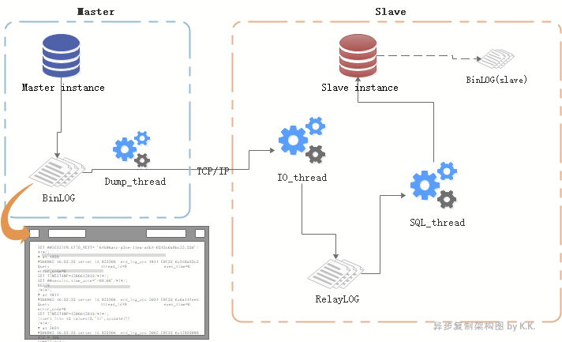

# 异步复制(Asynchronous repliaction)

MySQL默认的复制就是异步复制。

- Binlog是复制的基础，复制是MySQL应用的核心。binlog为二进制文件，以event为记录单位。
- 所谓复制，不过就是从master读取binlog的事件(event)，然后在slave上对其进行处理、重放。
  

## MASTER角色

- **master instance**：主从复制里的“主”节点，复制架构中的数据来源。

- **binlog**：master instance产生的binlog，binlog为二进制文件，以event为记录单位。

- **dump_thread线程**：
- 一个slave对应一个dump_thread线程。线程启动后，可以通过show processlist查看到。
  - 当slave的io_thread启动后，master便会为此分配一个dump_thread线程通过TCP协议与slave进行通信，负责读取主节点上的binlog信息并发送给从节点：
  - 主库写binlog成功后，通知dump_thread      线程。
  - dump_thread线程会对binlog上一个读锁，读取binlog内容并发送给slave。
  - dump_thread线程读取完binlog后，便释放对binlog文件的读锁。
  - 当slave停止io_thread后，master的dump_thread依然可以show processlist查看到，直到master发生新的binlog后，dump_thread线程就消失了。

 

## SLAVE角色：

- **slave instance**：主从复制里的“从”节点，主节点的数据复制到的目标节点。

- **io_thread线程**：slave上负责接收主节点发送来的binlog，并写入到relay log。启动io_thread后便开始接收master的binlog。

- **relay-log**：master instance的binlog内容发送给slave后，由io_thread写入到relay-log，也叫relay-binlog。其格式和内容与master的binlog几乎一致。

- **sql_thread线程**：负责将relay-log里的内容重放的线程。

- **binlog(slave)**：slave instance产生的binlog，并不参与到当前的主从复制中（不过slave可以作为另一个架构里的master，这样这个binlog就作为master binlog啦）。

  

## 复制瓶颈点：

    1. 主库多线程并发DML，从库一个SQL thread重放。
    2. 从库并行复制（SQL thread并行）可以缓解瓶颈1，但是io_thread 和 master的连接是一个TCP的连接（only one TCP connection）。

**解决这些隐患和瓶颈：**

- 使用半同步复制来保证复制可靠性（master会在意binlog的传输结果）

- 使用并行复制机制来提升复制性能（干掉单线程重放瓶颈，让复制再快一点、更快一点！）
      我们在不远的将来，会对它们逐步探索。