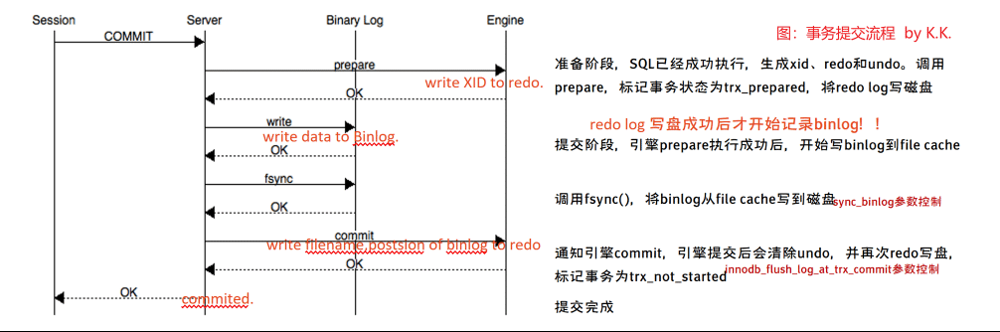
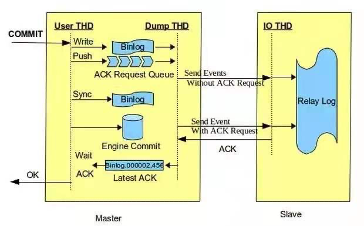
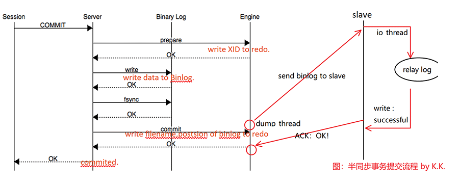

# 半同步复制(Semi-synchronous replication)

- MySQL 5.5开始推出的半同步复制。

- MySQL 5.6开始支持 after commit 方式
  - 概括一句话就是：确认至少有一个slave节点收到binlog后再继续。（IO_thread接收到即可）

理解半同步复制原理需要先理解[事务两阶段提交流程](..\..\5.MySQL体系结构\1.MySQL体系结构\2.server层服务层SQL层\5.事务提交流程.md)

 

半同步复制流程：

- 原理：

事务提交→写binlog→引擎层提交&等待ACK确认（确认写入relay log）信号→接收到确认信号→返回提交成功→继续后续事务处理。

- master将每个事务写入binlog ,传递到slave写入relay log，同时主库提交事务。
- master等待slave反馈收到relay log，只有收到ACK后master才将commit OK结果反馈给客户端。

  即主库commit时,先保证了binlog日志写入了从库relay log后主库才OK给客户端.此方法影响了主库性能。

- dump_thread线程工作任务分析:

  - mysql5.6版本之前，dump_thread 线程很忙很忙： 

    1. master dump thread 发送binlog events 给 slave 的IO thread，等待 slave 的ack反馈 

    2. slave 接受binlog events 写入relay log ，返回 ack 消息给master dump thread 

    3. master dump thread 收到ack消息，给session返回commit ok，然后继续发送写一个事务的binlog
  
  - mysql5.7之后新增ack线程，dump_thread可以专注于发发发发发了：

    1. master dump thread 发送binlog events 给 slave 的IO thread，开启ack线程等待 slave 的ack反馈，dump 线程继续向slaveIO thread发送下一个事务的binlog。 

    2. slave 接受binlog events 写入relay log ，返回 ack 消息给master ack线程，然后给session返回commit ok。

 

- 从半同步原理可以发现，半同步存在四个问题：
    1. 影响主库性能：如果slave性能不佳，或复制延迟较大，在slave答复ACK之前，对于主库而言，这段时间都是在等待。这样便影响了主库性能。
    2. 幻读问题1：如果事务A在主库已完成提交（事务已写入redo和binlog并完成引擎层提交），此时会等待slave的ACK消息。在binlog传输、relaylog落盘、sql_thread应用到从库的时间段里（此时master处于waiting slave dump状态），事务B在主库可以读取到A已提交数据（事务A自己在主库却看不到这个提交数据）。
    3. 幻读问题2（数据丢失问题）：接幻读问题1，如果事务A在主库提交事务后，binlog未发送成功到slave，此时发生主从failover的话，事务B会发现刚刚能查询到的数据消失了。
    4. 幻读问题3（数据重复提交）：接幻读问题1，如果事务A在主库提交事务后，binlog成功发送到slave，此时发生主从failover的话，事务B不会察觉到刚刚查询到的事务有变化，但是事务A却迟迟未收到提交反馈，如果事务A重试提交，那么库中会出现两次同样的数据——这时事务B再看可能就一脸懵逼了。

 

- 幻读问题1、2可以用下面场景来概括：
	比如有如下场景，客户端提交了一个事务，master把binlog发送给slave，在发送的期间，网络出现波动，此时Binlog Dump线程发送就会卡住，要等待slave把binlog写到本地的relay-log里，然后给master一个反馈，等待的时间以rpl_semi_sync_master_timeout参数为准，默认为10秒。在这等待的10秒钟里，在其他会话里，查看刚才的事务是可以看见的，此时一旦master发生宕机，由于binlog没有发送给slave，前端app切到slave查看，就会发现刚才已提交的事务不见了。

 

 

 

 