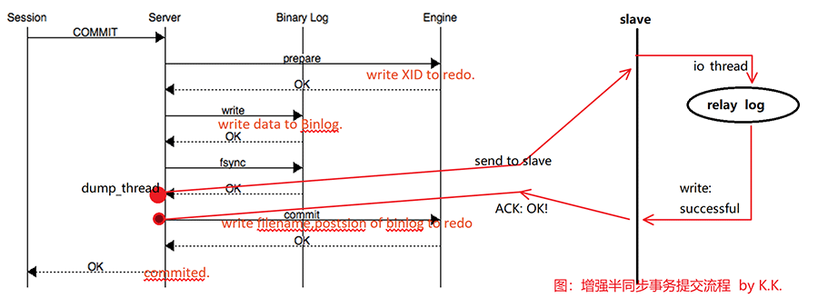
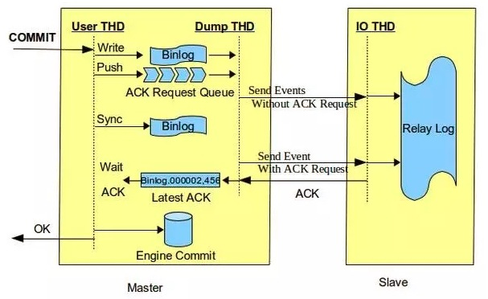
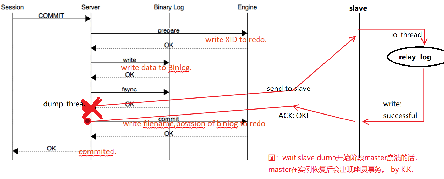

# 增强半同步复制 lossless semi-sync replication

MySQL5.7开始支持，也称为无损复制（lossless）

after sync

- 解决 after commit 方式的不足。
- ~~但是增强半同步不是完美的，也存在幽灵事务的问题。~~

 

- 注意：

  - 理解增强半同步复制原理需要先理解[事务两阶段提交流程](..\..\5.MySQL体系结构\1.MySQL体系结构\2.server层服务层SQL层\5.事务提交流程.md)，而后再理解[半同步复制原理](./02. 半同步复制原理( after commit ).md)，最后再来理解增强版同步原理。
  - ~~在理解后面**增强半同步幽灵事务**前，需要理解[MySQL Crash Recovery原理](..\..\5.MySQL体系结构\1.MySQL体系结构\2.server层服务层SQL层\6.MySQL Crash Recovery 流程.md)。~~

- 原理

事务提交→写binlog→等待ACK确认信号（确认写入relay log）→接收到确认信号→引擎层提交→返回提交成功，继续后续事务处理

避免了幻读问题。

- master 将每个事务写入binlog , 传递到slave写入relay log。
- master等待slave 反馈接收到relay     log的ack之后，再提交事务并且返回commit OK结果给客户端。 
- 即使主库crash，所有在主库上已经提交的事务都能保证已经同步到slave的relay     log中。
- 此方法中存储引擎可以批量提交,降低了对主库性能的影响。

## 增强半同步实际流程图

> 解惑增强半同步为什么是真正无损的同步方式

- 解析：

  - User Thread 串行执行动作，写入binlog cache后，直接发起push，将binlog推给slave，这个事件不需要slave返回ack。

  - 但是如果此时slave宕机，push动作不成功，user thread后续动作便无法继续。

  - push动作发起成功后，串行任务到下一环节，开始对binlog进行sync操作以落盘。

    > 因此，并不会发生“~~如果master在刚完成 binlog写，准备进入wait slave dump阶段时崩溃，此时该事务在流程中是处于prepare状态的，而slave不会收到该事务的任何记录，client也不会收到该事务的任何反馈。~~”
    >
    > 因为主库完成binlog写的时候，前面已经完成push了。
    >
    > 这个push动作发生时，主库上实际是有个极其短暂的事务阻塞，这个极其短暂的事务阻塞，使得高并发场景下会堆积很多*<u>**相互之间不冲突**</u>*的事务提交，而这就是后面章节 [并行复制MTS：binlog group commit](../4.并行复制MTS：减少复制延迟/02.并行复制(MTS)配置&MTS优化.md) 的引发契机——这样才能源源不断的将事务堆积，而同一时间堆积的事务last_committed就相同啦~ 这就提高了slave在replay阶段的并行能力，更加的提升了应用性能。

  - 主库等待ack响应，收到响应后执行引擎层提交。
  
    > 如果push后，slave在relay log 落盘阶段或之后的阶段出了问题，导致无法给予ack响应（这种时候slave基本就是坏了，否则bin log会重试发送并反馈落盘。），此时如果发生主从崩溃，拉起主库后，master会CR后将事务提交，而slave已经崩溃（否则，可以重试发送binlog，并给予ack应答），此时的主从不一致是由于硬件崩溃，slave节点报废，也不存在幽灵事务的相对概念了。

 

> **增强半同步的幽灵事务是个错误结论。**
>
> 以下是错误原文
>
> >  ~~增强半同步的幽灵事务问题~~
> >
> >  ~~增强半同步还是有一个漏洞，就是幽灵事务：~~
> >
> >  ~~~~
> >
> >  ~~幽灵事务：~~
> >
> >  ​	~~**本段需要了解MySQL Crash Recovery 原理：**~~
> >
> >  > ~~有binlog情况下，commit动作之前，会有一个**Redo XID 的动作记录写到redo，然后写data到binlog，binlog写成功后，会将binlog的filename，日志写的位置position再写到redo(position也会写到pos文件里)，此时才表示该事务完成（committed）。如果只有XID，没有后面的filename和position，则表示事务为prepare状态。~~
> >
> >  > ~~如果redo中已经有XID，则恢复时会先扫描最后一个binlog，看该XID是否存在。如果存在，表示这条日志已经写到binlog，那么该事务直接commit。 如果不存在，则表示事务未成功写入binlog，那么该事物回滚。~~
> >
> >  ~~~~ 
> >
> >  1. ~~由事务提交流程得知，事务commit后，会先在redo中记录XID，然后写binlog，完成写binlog后会进行增强半同步复制，接收到ACK响应后，写binlog filename和position到redo，完成引擎层提交，回复client以完成事务。~~
> >  2. ~~如果master在刚完成 binlog写，准备进入wait slave dump阶段时崩溃，此时该事务在流程中是处于prepare状态的，而slave不会收到该事务的任何记录，client也不会收到该事务的任何反馈。~~
> >  3. ~~当master进行实例恢复时，该事务符合“redo中存在XID、binlog存在XID（binlog完成写），那么该事务直接提交”判断，因此该事务被直接提交到引擎层。~~
> >  4. ~~问题来了，slave从始至终未收到关于该事务的任何信息，client也从未得到master的commit ok消息，但master中确实多了这一个事务。~~
> >
> >  ~~幽灵事务是绝对不应该出现在业务中的。~~
> >
> >  
>
> 

 

 

 

 

 

 