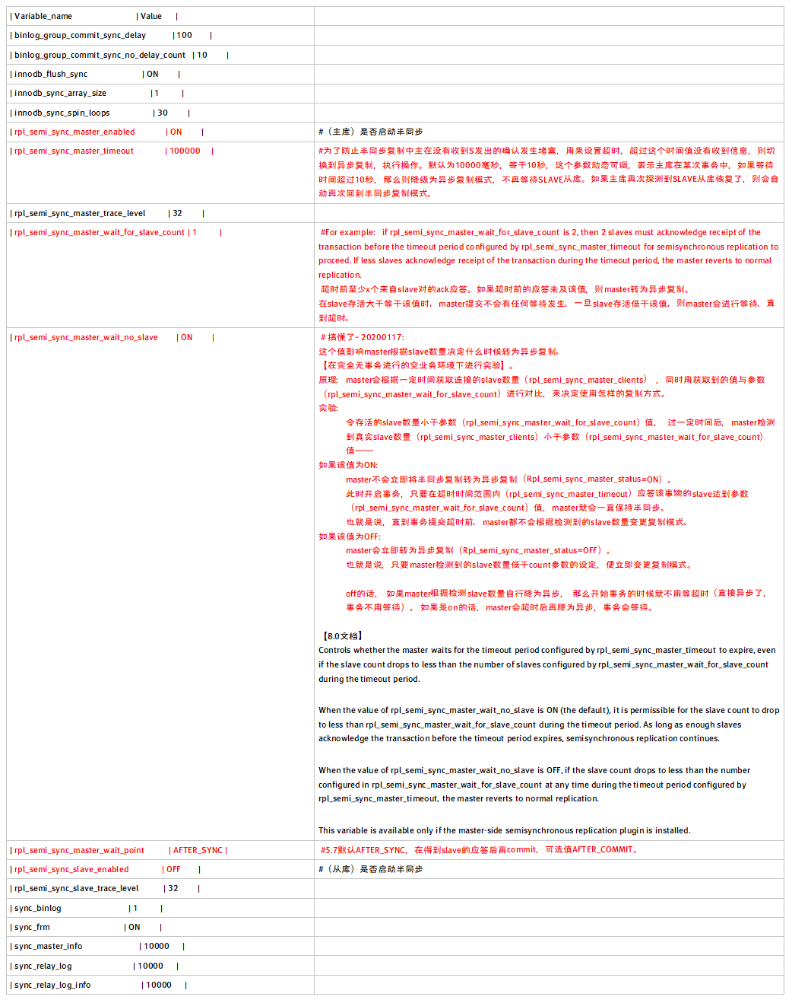

# 环境信息

|role| ip|port|hostname|
|-|-|-|-|
|master| 192.168.188.101|4306|mysqlvm1 |
| | | | |
|slave|192.168.188.201|4306|mysqlvm1-1|
| | |5306| |
| | |6306| |
| | |7306| |

 

# MySQL版本

5.7.26

 

# 前置条件

已配置好主从复制。

 

# 配置增强半同步

## 1.加载lib，所有主从节点都要配置。

```
主库：install plugin rpl_semi_sync_master soname 'semisync_master.so';
从库：install plugin rpl_semi_sync_slave soname 'semisync_slave.so';     
```

ps：可以一起装。建议一起装，因为会有主从切换的情景。

## 2.查看，确保所有节点都成功加载。

```
mysql> show plugins;
| rpl_semi_sync_master    | ACTIVE  | REPLICATION    | semisync_master.so | GPL   |
| rpl_semi_sync_slave    | ACTIVE  | REPLICATION    | semisync_slave.so | GPL   |
 
```

## 3.启用半同步

### 1.先启用从库上的参数，最后启用主库的参数。

```
从库：set global rpl_semi_sync_slave_enabled = {0|1};  # 1：启用，0：禁止
主库：
set global rpl_semi_sync_master_enabled = {0|1};  # 1：启用，0：禁止
set global rpl_semi_sync_master_timeout = N;    # 单位为ms
 
```

PS：配置文件加载库： #官方手册建议这样写入配置文件，但是——

风险！：endbled写入配置文件的话，会使实例启动后立即进入半同步模式，如果发生长时间断连的实例重新运行启动，有可能导致主库被拖垮。

建议！：[文末]长时间断开的从库，重新连接后，要等待追完全部事务后，手动开启半同步模式，而不是启动后直接切换，防止冲击主库。

```
[mysqld]
rpl_semi_sync_master_enabled=1
rpl_semi_sync_master_timeout=1000
 
[mysqld]
rpl_semi_sync_slave_enabled=1
```


### 2.从库重启io_thread

```
stop slave io_thread;
start slave io_thread;
此时在主库会发现

mysql> show global status like "%sync%"; 
```

|  Variable_name                 | Value |                                                           |
| ------------------------------------------------------------ | ------------------------------------------------------------ | ------------------------------------------------------------ |
|  Innodb_data_fsyncs              | 141  |                                                           |
|  Innodb_data_pending_fsyncs          | 0   |                                                           |
|  Innodb_os_log_fsyncs             | 87  |                                                           |
|  Innodb_os_log_pending_fsyncs         | 0   |                                                           |
| Rpl_semi_sync_master_clients        | 2   |#支持和注册半同步复制的已连Slave数。                       |
| Rpl_semi_sync_master_net_avg_wait_time   | 0    |# master等待slave回复的平均等待时间，单位毫秒。            |
| Rpl_semi_sync_master_net_wait_time     | 0   |# master总的等待时间。                                     |
| Rpl_semi_sync_master_net_waits       | 0   |# master等待slave回复的的总的等待次数，即半同步复制的总次数，不管失败还是成功，不算半同步失败后的异步复制。 |
| Rpl_semi_sync_master_no_times       | 1   |# master关闭半同步复制的次数。                            |
| Rpl_semi_sync_master_no_tx         | 8   |# master没有收到slave的回复而提交的次数，可以理解为master等待超时的次数，即半同步模式不成功提交数量。 |
| Rpl_semi_sync_master_status        | ON  |# ON是活动状态（半同步），OFF是非活动状态（异步），用于表示主服务器使用的是异步复制模式，还是半同步复制模式。 |
|  Rpl_semi_sync_master_timefunc_failures    | 0   |                                                           |
| Rpl_semi_sync_master_tx_avg_wait_time   | 0    |# master花在每个事务上的平均等待时间。                    |
|  Rpl_semi_sync_master_tx_wait_time       | 0   |# master总的等待时间。                                     |
|  Rpl_semi_sync_master_tx_waits         | 0   |# master等待成功的次数，即master没有等待超时的次数，也就是成功提交的次数 |
|  Rpl_semi_sync_master_wait_pos_backtraverse | 0   |# master提交后来的先到了，而先来的还没有到的次数。         |
| Rpl_semi_sync_master_wait_sessions     | 0   |# 前有多少个session因为slave的回复而造成等待。             |
|  Rpl_semi_sync_master_yes_tx          | 0   |# master成功接收到slave的回复的次数，即半同步模式成功提交数量。 |
| Rpl_semi_sync_slave_status         | OFF  |# Slave上的半同步复制状态，ON表示已经被启用，OFF表示非活动状态。 |

### 3.主库参数详解

  [半同步rpl_semi_sync_master_wait_no_slave参数研究实验](05.半同步rpl_semi_sync_master_wait_no_slave参数研究实验.md )

```
mysql> show global variables like '%sync%';
```




|  Variable_name                | Value   |
| ------------------------------------------------------------ | ------------------------------------------------------------ |
|  binlog_group_commit_sync_delay        | 100    |
|  binlog_group_commit_sync_no_delay_count   | 10     |
|  innodb_flush_sync              | ON     |
|  innodb_sync_array_size            | 1     |
|  innodb_sync_spin_loops            | 30     |
| rpl_semi_sync_master_enabled       | ON     |
| rpl_semi_sync_master_timeout       | 100000   |
|  rpl_semi_sync_master_trace_level       | 32     |
| rpl_semi_sync_master_wait_for_slave_count | 1     |
| rpl_semi_sync_master_wait_no_slave    | ON     |
| rpl_semi_sync_master_wait_point      | AFTER_SYNC |
| rpl_semi_sync_slave_enabled        | OFF    |
|  rpl_semi_sync_slave_trace_level       | 32     |
|  sync_binlog                 | 1     |
|  sync_frm                   | ON     |
|  sync_master_info               | 10000   |
|  sync_relay_log                | 10000   |
|  sync_relay_log_info             | 10000   |


### 4.维护

- 从上面得知，如果slave无法连接，那么master会等待至超时后，将该slave转为异步模式；当从库重新连接后，在rpl_semi_sync_master_wait_no_slave=ON时（默认），从库会自动转换为半同步模式。
- 长时间断开的从库，重新连接后，要等待追完全部事务后，手动开启半同步模式，而不是启动后直接切换。

 

从库断开后的重连维护：

```
start slave io_thread;

#查看 Retrieved_Gtid_Set、Executed_Gtid_Set，前者应该接收到master的gtid，后者没有
show slave status \G

start slave sql_thread;

#查看 Retrieved_Gtid_Set、Executed_Gtid_Set，此时二者相同，追到master的GTID。
show slave status \G

#开启半同步
set rpl_semi_sync_slave_enabled = 1;

stop io_thread;

start io_thread;
```