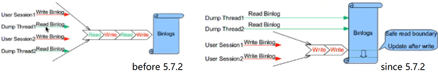

# 先说结论

 

## 异步复制

没什么保障，不顾及slave是否正确的接收、完成了复制。

 

## 半同步

 

5.5版本的半同步严重影响性能。

之后的版本对性能影响减少（master开启了双线程：dump thread & ack thread 来接收应答，消除了诸多的wait）

但是半同步会出现读不一致的情况——在slave的ack未接收到的时候，client从master上能读到该事务（slave上读不到）半同步会在 ack之前， 发生不一致的问题——从master能读到提交的数据，在slave读不到。

 

## 增强半同步

 

5.7.2是一个分水岭，对binlog的读写不再是一条串行队列，从而显著的改变了一主多从时，多从的数量导致的主节点性能问题——多少从都没事了。

 增强半同步在commit之前便进行同步操作，之后才提交引擎层。所以避免了幻读。

~~但是当binlog写好，开始等待slave返回ack信号时，如果主库崩溃，可能会发生幽灵事务：~~

~~master 在红线crash的话， master恢复后， 扫redo，提交commit的事务，对于preper的事务再扫描binlog，检查是否存在xid，存在的话便提交该事务——该事务在从库上可能未必提交。 这样的话， 主库上的事务会多一个，此时slave和client都不知道该事物的发生（二者在最后T1：OK才知道之前提交的事务结束，而不知这个幽灵事务）~~

~~云厂商的解决原则：启用增强半同步后，如果在主从切换期间主库crash，那么直接放弃主库，在从库上重建master，避免幽灵事务产生。~~

> ~~*不过，在库较大的场景下，这种方式代价会十分巨大，耗时也并不轻松，而此时新master再次崩溃的话，那代价更加恐怖——实际上，幽灵事务只是极个别的一些事务罢了，可以思考一下，借鉴MHA的切换思路：切换，拉起，拉平事务GTID，成为新master，来以十分微小的代价恢复一个节点的运行。但是这种方式有一定的局限性，就是——client提交失败的事务又重试提交给了新master，且事务之间并没有update动作，否则事务没法追平。*~~
>
> ~~*这就需要解析出binlog后和业务确认是否可以追平了……emm 扯上业务的事情仿佛就变得复杂了起来。/感谢月月的指导，哈哈哈 20210218/*~~

~~如何判断是否产生了幽灵事务——将old master拉起来， show master status 与new master 对比GTID ，通常多出1个事务。 这便是幽灵事务。~~

> ~~（这的意思是，在并发数为1的时候，实例恢复可能多出1个幽灵事务。实际上，每一个并发通常会造成一个事务恢复的幽灵事务，也就是说，幽灵事务大约等于崩溃前的数据库并发数量。）~~