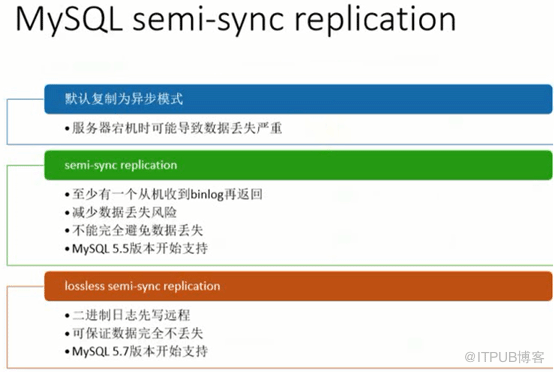
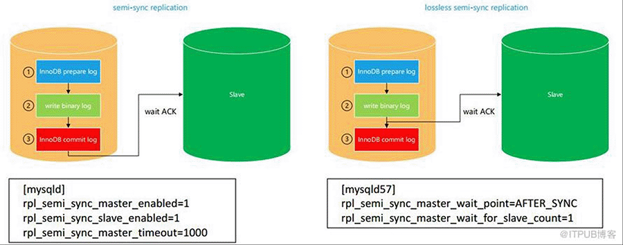
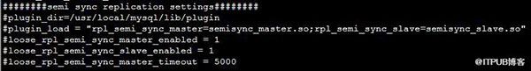
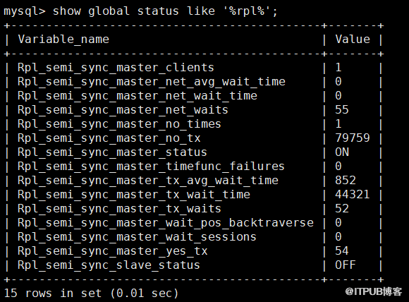

 **首先要明白事务提交的三个阶段，这里不再赘述。** 



**半同步复制：主上已经提交了，但是日志还没来得及传到备库，这时候宕机了，在半同步看来，主库其他会话看来是透明的，看到的是他提交了的数据，但是如果这时候切换到slave，slave上又没有提交，没有看到这部分数据，这就矛盾了。而增强版同步，alter_sync，日志没有传输到备库，主库这时候也没有提交，这时候服务挂掉了，主库其他会话看到的是未提交的数据，并且也没有传输到备库，所以数据不存在丢失一说。**




 **无损复制，已经写了二进制，但是没有提交挂掉了，但是主从数据一致，因为虽然没有提交，但是已经写了二进制，并且已经传到slave。 


 半同步复制的搭建，半同步复制是需要安装插件的：** 

**可以在参数文件中，指定每次启动都加载plugin_load，也可以直接安装插件。** 

**手动：** 
```
install plugin rpl_semi_sync_master SONAME 'semisync_master.so'; 

install plugin rpl_semi_sync_slave SONAME 'semisync_slave.so'; 
```


**配置文件：** 




 loose_rpl_semi_sync_master_enabled=1 #表示开启 

loose_rpl_semi_sync_slave_enabled=1 #表示开启 

loose_表示没有这个参数就忽略掉。 




当半自动复制的延迟超过5秒就变成异步复制，备库的IO线程追到5秒内，就自动又变成半同步复制。wait ACK表示IO线程接收到，并不是SQL线程应用完。 
 可以增加超时时间提高数据安全性，保证数据完全不丢失，但是这也带来了应用响应的问题，也就是强制半同步复制。 

 5.7增强半同步 
 rpl_semi_sync_master_wait_point=AFTER_SYNC 开启无损复制 
 rpl_semi_sync_master_wait_for_slave_count=1 至少有1个从库收到说的就是这个参数。 


**MTS multi- threaded** **slave（ 并行复制 ）5.7建议必须使用：** 

  slave-parallel-type=LOGICAL_CLOCK 

【DATABASE】DATABASE的并行复制，每个Coordinator线程对应一个数据库。DATABASE不再建议使用，【LOGICAL_CLOCK 】主库上怎么并行的从库上也是怎么并行。那么有一个问题主库group commit那么从库也能通过并行复制也能完成组提交吗？是的，因为组提交的事务之间互相不冲突， 

  slave-parallel-workers=32或者16 

MTS仍然为一个IO线程接收 state为 *Waiting for master to send event ；* SQL线程应用时候是System lock，等待时state为 *waiting for an event from Coordinator* 

**在IO bond的情况下，开启MTS性能提升非常明显，纯OLTP环境下开启16或者32并行数，主库性能提升5倍左右。** 

来自 “ ITPUB博客 ” ，链接：http://blog.itpub.net/29990276/viewspace-2057817/，如需转载，请注明出处，否则将追究法律责任。 