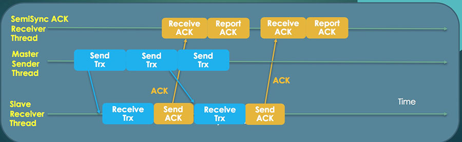

MySQL 5.7 半同步复制增强

已剪辑自: https://www.cnblogs.com/mao3714/p/8777470.html

MySQL默认的复制都是异步的，在服务器崩溃时丢失事务是使用异步复制不可避免的结果。而5.5之后推出的一项新功能：半同步复制，可以限制事务丢失的数量。

MySQL5.7在5.6/5.5的基础上增强了几点功能：

**1）无数据丢失**

MySQL5.6/5.5**半同步复制的原理**：提交事务的线程会被锁定，直到至少一个Slave收到这个事务，由于**事务在被提交到存储引擎之后才被发送到Slave上**，所以事务的丢失数量可以下降到最多每线程一个。因为事务是在被提交之后才发送给Slave的，当Slave没有接收成功，并且Master挂了，会导致主从不一致：主有数据，从没有数据。如下面的情况：（**AFTER_COMMIT）**

 客户端执行一个事务，master**接收到之后提交后并把事务发送给slave**，在发送的期间网络出现波动，但要等待slave把binlog写到本地的relay-log，然后给master一个返回信息，等待以rpl_semi_sync_master_timeout参数设置的超时为准（默认为10秒）响应。在这**等待的10秒里，其他会话查可以看到Master上的事务**，此时一旦master发生宕机，由于事务没有发送给slave，而master已经提交了，导致数据不一致。
 **例子：**
 A客户端执行的事务将字段Z从0修改为1。
 1.A提交事务到master
 2.master写binlog
 3.master **commit事务到存储引擎，再把事务发送给slave
** 4.master commit成功了！
 **说明：**此时还未收到slave确认，A还在等待slave的响应，但是另外客户端B已经可以看到字段Z为1了。假如此时master崩溃，如果slave实际收到刚才的事务仅仅是master未收到确认，那么此时slave的数据还是正确的也是Z=1，客户端切换到slave后，都看到Z=1，但是如果slave没有实际收到刚才的事务，那么此时slave上的z=0，导致主从数据不一直。

 MySQL5.7在Master事务提交的时间方面做了改进（[rpl_semi_sync_master_wait_point](https://dev.mysql.com/doc/refman/5.7/en/server-system-variables.html#sysvar_rpl_semi_sync_master_wait_point)：AFTER_COMMIT\AFTER_SYNC），**事务是在提交之前发送给Slave（默认，after_sync）**，当Slave没有接收成功，并且Master宕机了，不会导致主从不一致，因为此时主还没有提交，所以主从都没有数据。MySQL5.7也支持和MySQL5.5\5.6一样的机制：**事务提交之后再发给Slave（after_commit）**。如下面的情况：**(AFTER_SYNC)**

客户端执行一个事务，master**接收到之后就把事务发送给slave，slave收到事务之后，然后给master一个返回信息，master再提交事务**。在slave返回信息的时间里（以rpl_semi_sync_master_timeout参数为准，默认为10秒），**其他会话查看不到Master上的最新事务**，因为master都还没提交事务，此时一旦master发生宕机，由于事务没有发送给slave，并且master也没有提交数据，主从数据都没有更改，所以不会出现数据不一致。
 **例子：
** A客户端执行的事务讲字段Z从0修改为1。
 1.A提交事务到master
 2.master写binlog
 3.master发送事务给slave，**不提交！
** 4.master等待slave确认
 **此时z=0，没有任何客户端能看到z=1的结果，因为master还没提交。
 5.master收到slave确认，master开始commit到存储引擎
** 6.master commit成功了！master返回结果给客户端
 **说明：**假如第4步时master崩溃，客户端切换到slave，如果slave接收到事务，并响应master，那么此时主从的z=1，如果slave未接收到事务和响应，那么此时z=0，无论哪种状态，对于所有客户端数据库都是一致，事务都没有丢失。

 参数[**rpl_semi_sync_master_wait_point**](https://dev.mysql.com/doc/refman/5.7/en/server-system-variables.html#sysvar_rpl_semi_sync_master_wait_point)**：**该参数控制半同步复制在哪个点（提交后再等待响应还是响应后再提交）等待slave的响应，默认AFTER_SYNC（slave响应后再提交），可选值有AFTER_COMMIT（提交后再等待响应）。

**after_commit**：master把每一个事务写到二进制日志并保存到磁盘上，并且**提交（commit）事务，再把事务发送给从库，开始等待slave的应答**。响应后master返回结果给客户端，客户端才可继续。

 **after_sync** ：master把每一个事务写到二进制日志并保存磁盘上，并且把事务发送给从库，开始等待slave的应答。**确认slave响应后，再提交（commit）事务到存储引擎**，并返回结果给客户端，客户端才可继续。

**总之，**MySQL5.7是在Master收到Slave应答之后才Commit事务，MySQL5.6/5.5是在Master Commit之后才等待Slave的应答。MySQL5.7半同步的好处就是在确认事务复制到Slave之前，并发的其他线程看不到当前事务的数据。当Master故障时，要么提交的事务已经复制到Slave，要么全部都没提交，这样就保证了数据的一致性，推荐阅读[MySQL 5.7 深度解析: 半同步复制技术](http://www.actionsky.com/docs/archives/129)。 

**2）更快的半同步复制。**

MySQL5.5/5.6的半同步复制是一个单工通讯方式，master把事务发送完毕后，要接收和处理slave的应答，处理完应答之后才能继续发送下一个事务，示意图如下：

MySQL5.7的半同步复制**创建了单独的应答接收线程**，变成了双工模式，发送和接收互不影响。因为有了相应的线程处理，发送效率得到大幅提升，相比MySQL5.5/5.6延迟会小很多，性能得到大幅提升。示意图如下：

**注意：**MySQL5.7单独的应答接收线程在开启半同步复制的时候默认就创建了，不需要额外的设置。

**3）等待多个Slave应答。**

在半同步复制中，Master发送事务默认至少有一个Slave得到响应才能继续下一个事务。MySQL5.7之后用户可以设置应答的Slave数量，并且可以通过参数[**rpl_semi_sync_master_wait_for_slave_count**](https://dev.mysql.com/doc/refman/5.7/en/server-system-variables.html#sysvar_rpl_semi_sync_master_wait_for_slave_count)**：该变量控制slave应答的数量，默认是1，表示master接收到几个slave应答后才commit。在多从的环境下，设置大于1可以提高数据的可靠性。**

**4）半同步复制的**[**建立**](https://dev.mysql.com/doc/refman/5.7/en/replication-semisync-installation.html)**、**[**监控**](https://dev.mysql.com/doc/refman/5.7/en/replication-semisync-monitoring.html)**。**

 如何**建立**半同步复制：可以看[官方文档](https://dev.mysql.com/doc/refman/5.7/en/replication-semisync-installation.html)或则之前写的[初识 MySQL 5.5、5.6 半同步复制](http://www.cnblogs.com/zhoujinyi/archive/2012/12/11/2811699.html)

 

 

**主上执行：**
 mysql> **INSTALL PLUGIN rpl_semi_sync_master SONAME 'semisync_master.so';**
 Query OK, 0 rows affected (0.07 sec)

 mysql> **SET GLOBAL rpl_semi_sync_master_enabled=1;**
 Query OK, 0 rows affected (0.00 sec)
 为了保证重启后继续生效，需要在配置文件里加入：**rpl_semi_sync_master_enabled = 1

 从上执行：**
 mysql> **INSTALL PLUGIN rpl_semi_sync_slave SONAME 'semisync_slave.so';**
 Query OK, 0 rows affected (0.04 sec)

 mysql> **SET GLOBAL rpl_semi_sync_slave_enabled = 1;**
 Query OK, 0 rows affected (0.00 sec)
 为了保证重启后继续生效，需要在配置文件里加入：**rpl_semi_sync_slave_enabled = 1**

 开启复制：设置好半同步复制的插件和开启半同步功能之后，复制模式就默认用半同步了
 mysql> CHANGE MASTER TO MASTER_HOST='10.0.3.141',MASTER_USER='repl',MASTER_PASSWORD='Repl_123456',MASTER_LOG_FILE='mysql-bin-3306.000001',MASTER_LOG_POS=154;
 Query OK, 0 rows affected, 2 warnings (0.30 sec)

 mysql> start slave;
 Query OK, 0 rows affected (0.01 sec)

 **开启成功后，slave的error log里会出现：半同步复制是跟 IO_THREAD 有直接关系，跟 SQL_THREAD 没关系。也就是说SLAVE 从库接收完二进制日志后给 master 主库一个确认，并不管relay-log中继日志是否正确执行完。即使SQL线程报错了，半同步复制还是不会切换成异步复制
** [Note] Slave I/O thread: **Start semi-sync** replication to master '[repl@10.0.3.141:3306](mailto:repl@10.0.3.141:3306)' in log 'mysql-bin-3306.000001' at position 154 

 

 

如何**监控**半同步复制：可以看[官方文档](https://dev.mysql.com/doc/refman/5.6/en/replication-semisync-monitoring.html)或则之前写的[初识 MySQL 5.5、5.6 半同步复制](http://www.cnblogs.com/zhoujinyi/archive/2012/12/11/2811699.html)

 

 

**主上：**
 mysql> show variables like 'rpl_semi%';
 +-------------------------------------------+------------+
 | Variable_name               | Value   |
 +-------------------------------------------+------------+
 | rpl_semi_sync_master_enabled       | ON     |
 | rpl_semi_sync_master_timeout       | 10000   |
 | rpl_semi_sync_master_trace_level     | 32     |
 | rpl_semi_sync_master_wait_for_slave_count | 1     |
 | rpl_semi_sync_master_wait_no_slave    | ON     |
 | rpl_semi_sync_master_wait_point      | AFTER_SYNC |
 +-------------------------------------------+------------+ 
 6 rows in set (0.00 sec)

 mysql> show global status like 'rpl_semi%';
 +--------------------------------------------+-------+
 | Variable_name               | Value |
 +--------------------------------------------+-------+
 | Rpl_semi_sync_master_clients        | 1   |
 | Rpl_semi_sync_master_net_avg_wait_time   | 0   |
 | Rpl_semi_sync_master_net_wait_time     | 0   |
 | Rpl_semi_sync_master_net_waits       | 0   |
 | Rpl_semi_sync_master_no_times       | 0   |
 | Rpl_semi_sync_master_no_tx         | 0   |
 | Rpl_semi_sync_master_status        | ON  |
 | Rpl_semi_sync_master_timefunc_failures   | 0   |
 | Rpl_semi_sync_master_tx_avg_wait_time   | 0   |
 | Rpl_semi_sync_master_tx_wait_time     | 0   |
 | Rpl_semi_sync_master_tx_waits       | 0   |
 | Rpl_semi_sync_master_wait_pos_backtraverse | 0   |
 | Rpl_semi_sync_master_wait_sessions     | 0   |
 | Rpl_semi_sync_master_yes_tx        | 0   |
 +--------------------------------------------+-------+
 14 rows in set (0.00 sec)

 **从上：**
 mysql> show variables like 'rpl_semi%';
 +---------------------------------+-------+
 | Variable_name          | Value |
 +---------------------------------+-------+
 | rpl_semi_sync_slave_enabled   | ON  |
 | rpl_semi_sync_slave_trace_level | 32  |
 +---------------------------------+-------+
 2 rows in set (0.00 sec)

 mysql> show global status like 'rpl_semi%';
 +----------------------------+-------+
 | Variable_name       | Value |
 +----------------------------+-------+
 | Rpl_semi_sync_slave_status | ON  |
 +----------------------------+-------+
 1 row in set (0.00 sec) 

 

 

半同步成功开启之后，在主上show processlist可以看到：

**Waiting for semi-sync ACK from slave;** 

**针对上面的参数和变量说明：**

 

 

**主上：**
 [**rpl_semi_sync_master_enabled**](https://dev.mysql.com/doc/refman/5.7/en/server-system-variables.html#sysvar_rpl_semi_sync_master_enabled)**：表示主上是否开启半同步复制功能，可以动态修改。可选值：ON\OFF**[**
 rpl_semi_sync_master_timeout**](https://dev.mysql.com/doc/refman/5.7/en/server-system-variables.html#sysvar_rpl_semi_sync_master_timeout)**：为了防止半同步复制中主在没有收到S发出的确认发生堵塞，用来设置超时，超过这个时间值没有收到信息，则切换到异步复制，执行操作**。默认为10000毫秒，等于10秒，这个参数动态可调，表示主库在某次事务中，如果等待时间超过10秒，那么则降级为异步复制模式，不再等待SLAVE从库。如果主库再次探测到，SLAVE从库恢复了，则会自动再次回到半同步复制模式。可以设置成1000，即1秒。
 [**rpl_semi_sync_master_wait_for_slave_count**](https://dev.mysql.com/doc/refman/5.7/en/server-system-variables.html#sysvar_rpl_semi_sync_master_wait_for_slave_count)**：控制slave应答的数量，默认是1，表示master接收到几个slave应答后才commit。**
 [**rpl_semi_sync_master_wait_no_slave**](https://dev.mysql.com/doc/refman/5.7/en/server-system-variables.html#sysvar_rpl_semi_sync_master_wait_no_slave) **：当一个事务被提交，但是Master没有Slave连接，这时M不可能收到任何确认信息，但M会在时间限制范围内继续等待。如果没有Slave链接，会切换到异步复制。是否允许master每个事务提交后都要等待slave的接收确认信号。默认为on，每一个事务都会等待。如果为off，则slave追赶上后，也不会开启半同步复制模式，需要手工开启。
** [**rpl_semi_sync_master_wait_point**](https://dev.mysql.com/doc/refman/5.7/en/server-system-variables.html#sysvar_rpl_semi_sync_master_wait_point)**：该参数表示半同步复制的主在哪个点等待从的响应，默认AFTER_SYNC**，**在得到slave的应答后再commit**，可选值AFTER_COMMIT。

 **从上：**
 [**rpl_semi_sync_slave_enabled**](https://dev.mysql.com/doc/refman/5.7/en/server-system-variables.html#sysvar_rpl_semi_sync_slave_enabled)**：表示从上是否开启半同步复制功能，可以动态修改。可选值：ON\OFF** 

 

 

**Rpl_semi_sync_master_clients** ：说明支持和注册半同步复制的已连Slave数。
 Rpl_semi_sync_master_net_avg_wait_time ：master等待slave回复的平均等待时间，单位毫秒。
 Rpl_semi_sync_master_net_wait_time ：master总的等待时间。
 **Rpl_semi_sync_master_net_waits** ：master等待slave回复的的总的等待次数，即半同步复制的总次数，不管失败还是成功，不算半同步失败后的异步复制。
 **Rpl_semi_sync_master_no_times** ：master关闭半同步复制的次数。 
 **Rpl_semi_sync_master_no_tx** ：master没有收到slave的回复而提交的次数，可以理解为master等待超时的次数，即半同步模式不成功提交数量。
 **Rpl_semi_sync_master_status** ：ON是活动状态（半同步），OFF是非活动状态（异步），用于表示主服务器使用的是异步复制模式，还是半同步复制模式。
 **Rpl_semi_sync_slave_status** ：Slave上的半同步复制状态，ON表示已经被启用，OFF表示非活动状态。
 Rpl_semi_sync_master_tx_avg_wait_time ：master花在每个事务上的平均等待时间。 
 Rpl_semi_sync_master_tx_wait_time ：master总的等待时间。
 Rpl_semi_sync_master_tx_waits ：master等待成功的次数，即master没有等待超时的次数，也就是成功提交的次数
 Rpl_semi_sync_master_wait_pos_backtraverse ：master提交后来的先到了，而先来的还没有到的次数。
 Rpl_semi_sync_master_wait_sessions ：前有多少个session因为slave的回复而造成等待。
 **Rpl_semi_sync_master_yes_tx** ：master成功接收到slave的回复的次数，即半同步模式成功提交数量。  

 

 

**总之，**关于半同步复制的测试说明可以看[初识 MySQL 5.5、5.6 半同步复制](http://www.cnblogs.com/zhoujinyi/archive/2012/12/11/2811699.html)这篇文章。**半同步复制的好处：**半同步复制可以有效的限制事务丢失的数量，更好的保证数据的安全和一致性；**半同步复制的坏处：**更新、插入、删除的速度要比异步复制要慢，因为**多了一个"从返回信息给主"的步骤**。要是出现异常：网络问题或则数据库问题，半同步复制和异步复制就会来回切换，导致主库的更新、插入、删除操作会受到影响。

...