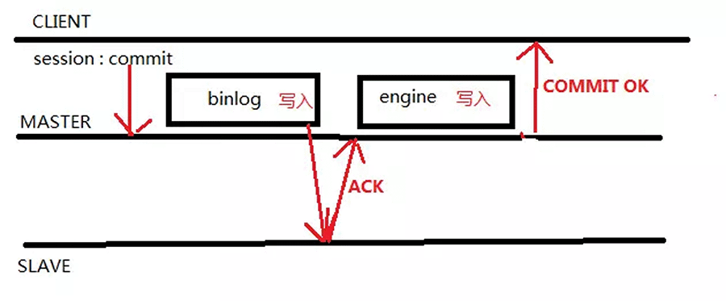
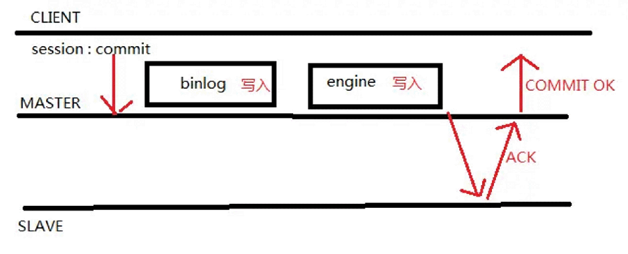

已剪辑自: https://www.jianshu.com/p/3bfb0bfb8b34

  今天主要剖析一下MySQL 5.7增强半同步的AFTER SYNC和AFTER COMMIT的区别。
   如果我们生产库对数据的一致性要求比较高，那么我们一般会开启了半同步复制，但在MySQL5.5/5.6里，会存在数据不一致的风险。比如有如下场景，客户端提交了一个事务，master把binlog发送给slave，在发送的期间，网络出现波动，此时Binlog Dump线程发送就会卡住，要等待slave把binlog写到本地的relay-log里，然后给master一个反馈，等待的时间以rpl_semi_sync_master_timeout参数为准，默认为10秒。在这等待的10秒钟里，在其他会话里，查看刚才的事务是可以看见的，此时一旦master发生宕机，由于binlog没有发送给slave，前端app切到slave查看，就会发现刚才已提交的事务不见了。盗用两张图讲解一下两者的区别。

- AFTER SYNC
             after     sync是MySQL5.7官方新加的用以解决MySQL5.6半同步缺陷的选项，也是官方推荐的方式。下面我结合图来说明一下AFTER     SYNC是怎么回事。
             

   实际上，客户端发出commit请求后，在主库上写入binlog并推送给slave，slave接收到binlog并写入relaylog，发送ACK确认已经接收binlog后，master在引擎层commit，客户端接收commit完成，此时其他会话才可以看见已提交的数据。
   故障分析：假设master在接收ACK确认时宕机，因为在引擎层并没有提交，HA切换到从库，因为binlog已经写入从库的relaylog，因此不会造成数据丢失，个人认为是目前比较完美的解决方式。

- AFTER COMMIT
             

image

   after commit是MySQL5.6半同步参数，区别于after sync，after sync是在接收ack确认以后主库在引擎层做提交，而after commit是先在引擎层做提交后等待ACK确认。因此，在写入数据后并且在从库确认之前，其他的客户端可以看到在这一事务。
   故障分析：
 **1.binlog 未发送到从库:
**   **事务B获取到事务A提交的内容， 此时宕机故障切换到slave，事务B获取到的内容却丢失了。事务A commit没有收到反馈信息(则需要业务判断了)。
 2.binlog 已经发送给从库 :
**   **事务B获取到事务A提交的内容，故障切换到salve ，B仍然获取到A提交的内容，没毛病。事务A commit没有收到反馈信息，若重新执行该事务，则相当于执行两次A事务(则需要业务判断了)。**

**dump thread过程分析:**

- mysql5.6版本之前：
             \1. master dump thread 发送binlog     events 给 slave 的IO thread，等待 slave 的ack反馈
             \2. slave 接受binlog events     写入relay log ，返回 ack 消息给master dump thread
             \3. master dump thread     收到ack消息，给session返回commit ok，然后继续发送写一个事务的binlog。

 

- mysql5.7之后新增ack线程：
             \1. master dump thread 发送binlog     events 给 slave 的IO thread，开启ack线程等待 slave 的ack反馈，dump 线程继续向slaveIO     thread发送下一个事务的binlog。
             \2. slave 接受binlog events     写入relay log ，返回 ack 消息给master ack线程，然后给session返回commit ok。

#### *过程总结:*

1.Master在收到slave的应答后才Commit事务--after_sync(5.6上Master在commit后，才等待Slave的应答--after commit).
 因此在确认事务复制到Slave上之前，并发的事务看不到当前事务的数据.当Master出现故障时,所有已经提交的事务都复制到了Slave上.
 2.缺省采用无数据丢失的应答等待机制after_sync。用户也可以选择使用5.6的应答等待机制after_commit

设置方法:

mysql> SET rpl_semi_sync_master_wait_point= AFTER_SYNC;

Master接收到N个slave的应答后，才commit 事务.
 用户可以设置应答Slave的数量:

mysql> SET GLOBAL rpl_semi_sync_master_wait_for_slave_count= N；