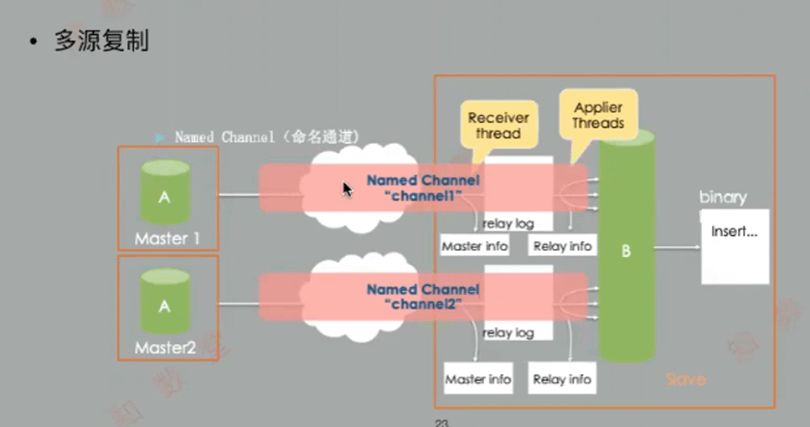

# 启用多源复制的要求：

- matser:
    ```
    master_into_repository=TABLE
    ```
- slave:
    ```
    relay_log_info_repository=TABLE
    ```
- 扩展参数：更方便管理
    ```
    GTID_mode=ON
    binlog_format=row 
    ```


## 配置多源复制：
```
change master to … for channel ${channel_name};
```

- 5.7的功能不完善，8.0的才好用

 

