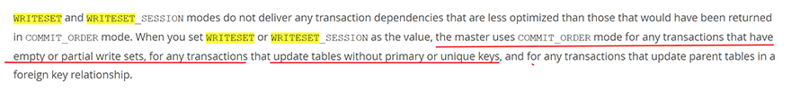
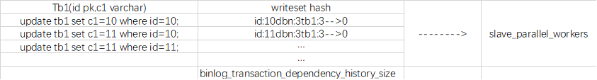

[TOC]

# WriteSet

- 5.7可以适当调整参数`binlog_group_commit_sync_delay`以提高主库并行度，同时设置`binlog_group_commit_sync_no_delay_count`在已满足度要求时主动提交，尽量减小延迟。

- 8.0的设计是针对从库，<u>主库开启writeset后</u>，即使主库在串行提交的事务，只要不互相冲突，在slave上也可以并行回放。这就是WriteSet特性。

- 如果主库配置了binlog group commit，从库开了writeset，会优先使用writeset。

## 参数

- `binlog_transaction_dependency_tracking`= *COMMIT_ORDER|WRITESET|WRITESET_SESSSION*
  - commit_order为默认值，slave必须搭配使用主库binlog group      commit（降级），如果主库没配置binlog group commit，那就用不了并行。

  - master设置为writeset/writeset_session时，slave会优先使用writeset。

  - 设置为writeset_session时，基于会话级别的writeset。只有不同会话里的binlog会并行，同一个会话里的binlog不会并行。

  - transaction_write_set_extraction=xxxhash64     （hash方法）

  - binlog_transaction_dependency_history_size     （hash长度，默认25000个事务）

  - slave-preserve-commit-order可为1，也可为0。

    > （后面这些删除线内容为错误认知，仅做警示）~~否则writeset不工作。*这个参数在**writeset**与**5.7**MTS的group* *commit**互斥哦！*＝1保证从库上按照主库提交顺序去重放binlog ，在writeset下主从 结构 是不需要的，writeset 本身就没有按照 主上的顺序执行，它是说这个数据之间没有影响 可以并行的 我就去执行，有影响就不去执行 ，通过gtid方式来判断，当你用writeset 实际上已经放弃了一个跟主库完全一样的顺序。这时间改成等于1，变成一个顺序的，等于单进程执行了~~。

    > （后面这些删除线内容也是错误认知，仅做警示。master依然需要开启参数。）~~writeset本可以不依赖master的commit order ， 但当对无pk的表做update事务时，会使用order commit的方式记录， 所以master开启logical clock 还是有必要的。~~

    > 

### slave启用writeset的基础配置：

- `binlog_transaction_dependency_tracking`= *WRITESET*|*WRITESET_SESSSION* 

- ~~`slave-preserve-commit-order`=0~~

- `slave_parallel_type`=LOGICAL_CLOCK  #为支持无主键update时的order comit，需要开启logical clock与主库开启binlog group commit设置配合，否则没意义。

- `slave_parallel_workers`=4-8

 

 

### hash加密逻辑：

​	基于slave上的并行复制优化，依赖于日志中`commit timestamps`或是`writesets`并行回放事务。

需要使用到函数`rpl_write_set_handler.cc:add_pke()`（在binlog_write_row中调用）

算法为：

> 非唯一索引名称+分隔符+库名+分隔符+库名长度+表名+分隔符+表名长度+索引字段1数值+分隔符+索引字段1长度[+ 索引字段2数值+分隔符+索引字段2长度...]

> (gdb) p pke
>` $1 = "PRIMARY^1^/~2~test^1^/~2~4jj10^1^/~2~\200\000\000$^1^/~2~4"`
>
> 主键PRIMARY + 分隔符 + 库名 test + 分隔符 + 库名长度 4 + 表名 jj10 + 表名长度 4 + 主键值 0x80 00 00 24 + 分隔符 + int字段类型长度 4

每个表都有唯一的key

hash队列中，存有hash和该hash是否被apply的标记。

同一时间的并发数取决于参数【`slave_parallel_workers`】

60s清理一次hash队列里已经被apply的标记项，压缩一次writeset。

 

并发线程里有执行失败的话，那么复制会停下来，不再继续。每次获取任务前，都要对每批任务做状态同步，只有批次内全部任务成功，才会继续。

图例：

