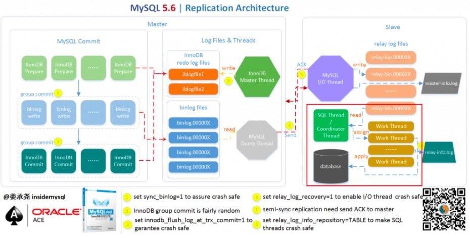

# 一、MySQL 5.6并行复制架构

从MySQL 5.6.3版本开始就支持所谓的并行复制了，但是其并行只是基于schema的，也就是基于库的。

如果用户的MySQL数据库实例中存在多个schema，对于从机复制的速度的确可以有比较大的帮助。

但在一般的MySQL使用中，一库多表比较常见，所以MySQL 5.6的并行复制对真正用户来说属于雷声大雨点小，不太合适生产使用。

 

MySQL 5.6并行复制的架构如下所示：

 

- 在MySQL5.6版本之前，Slave服务器上有两个线程I/O线程和SQL线程。

  - I/O线程负责接收二进制日志（更准确的说是二进制日志的event），
  - SQL线程进行回放二进制日志。

 

- 如果在MySQL 5.6版本开启并行复制功能，那么SQL线程就变为了coordinator（协调者）线程，coordinator线程主要负责两部分的内容：

  1. 若判断可以并行执行，那么选择worker线程执行事务的二进制日志。
  2. 若判断不可以并行执行，如该操作是DDL，亦或者是事务跨schema操作，则等待所有的worker线程执行完成之后，再执行当前的日志。

 

- 这意味着coordinator线程并不是仅将日志发送给worker线程，自己也可以回放日志，但是所有可以并行的操作交付由worker线程完成。coordinator线程与worker是典型的生产者与消费者模型。

 

上述机制实现了基于schema的并行复制存在两个问题：

- 首先是crash safe功能不好做，因为可能之后执行的事务由于并行复制的关系先完成执行，那么当发生crash的时候，这部分的处理逻辑是比较复杂的。从代码上看，5.6这里引入了Low-Water-Mark标记来解决该问题，从设计上看（WL#5569），其是希望借助于日志的幂等性来解决该问题，不过5.6的二进制日志回放还不能实现幂等性。
- 另一个最为关键的问题是这样设计的并行复制效果并不高，如果用户实例仅有一个库，那么就无法实现并行回放（因为是基于库的，一个库是不存在并行的），甚至性能会比原来的单线程更差。而单库多表是比多库多表更为常见的一种情形。