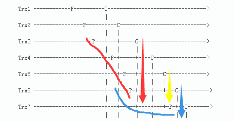
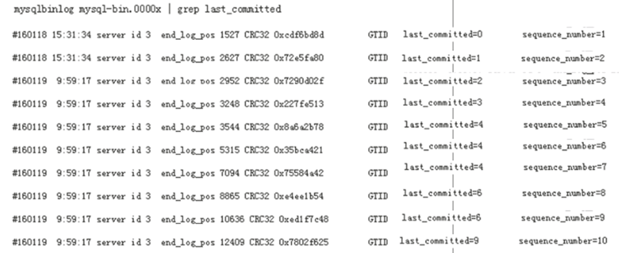

已剪辑自: https://blog.csdn.net/joy0921/article/details/80130768

### MySQL 5.7并行复制初理解

我们知道MySQL 5.7并行复制引入了两个值last_committed和sequence_number。last_committed表示事务提交的时候，上次事务提交的编号，在主库上同时提交的事务设置成相同的last_committed。如果事务具有相同的last_committed，表示这些事务都在一组内，可以进行并行的回放。这个机制也是Commit-Parent-Based SchemeWL#6314中的实现方式。不过之后，官方对这种模式做了改进，所以最新的并行回放机制和WL#6314有了不同，详情见Lock-Based SchemeWL#7165。

下面介绍一下旧模式Commit-Parent-Based SchemeWL#6314和新模式Lock-Based SchemeWL#7165的不同之处，以及改进的地方。

### Commit-Parent-Based Scheme WL#6314

**Commit-Parent-Based Scheme****简介**

- 在master上，有一个全局计数器（global     counter）。在每一次存储引擎完成提交之前，计数器值就会增加。
- 在master上，在事务进入prepare阶段之前，全局计数器的当前值会被储存在事务中。这个值称为此事务的commit-parent（last_committed）。
- 在master上，commit-parent会在事务的开头被储存在binlog中。
- 在slave上，如果两个事务有同一个commit-parent，他们就可以并行被执行。     

此commit-parent就是我们在binlog中看到的last_committed。如果commit-parent相同，即last_committed相同，则被视为同一组，可以并行回放。

**Commit-Parent-Based Scheme****的问题**

一句话：Commit-Parent-Based Scheme会降低复制的并行程度。


**解释一下图：**

- 水平虚线表示事务按时间顺序往后走。
- P表示事务在进入prepare阶段之前读到的commit-parent值的那个时间点。可以简单的视为加锁时间点。
- C表示事务增加了全局计数器（global counter）的值的那个时间点。可以简单的视为释放锁的时间点
- P对应的commit-parent（last_commited）是取自所有已经执行完的事务的最大的C对应的sequence_number。举例来说： 

t1-1,last_committed=0, sequence_number=1

t2-1,last_committed=0, sequence_number=2

t3-1,last_committed=0, sequence_number=3

t5-1,last_committed=0, sequence_number=4

t2-2,last_committed=4, sequence_number=5

t4-1,last_committed=4, sequence_number=6

t7-1,last_committed=4, sequence_number=7

t8-1,last_committed=4, sequence_number=8

 

- Trx4的P对应的commit-parent（last_commited）取自所有已经执行完的事务的最大的C对应的sequence_number，也就是Trx1的C对应的sequence_number。因为这个时候Trx1已经执行完，但是Trx2还未执行完。 
- Trx5的P对应的commit-parent（last_commited）取自所有已经执行完的事务的最大的C对应的sequence_number，也就是Trx2的C对应的sequence_number；Trx6的P对应的commit-parent（last_commited）取自所有已经执行完的事务的最大的C对应的sequence_number，也就是Trx2的C对应的sequence_number。所以Trx5和Trx6具有相同的commit-parent（last_commited），在进行回放的时候，Trx5和Trx6可以并行回放。

由图可见，Trx5 和 Trx6可以并发执行，因为他们的commit-parent是相同的，都是由Trx2设定的。但是，Trx4和Trx5不能并发执行, Trx6和Trx7也不能并发执行。

我们可以注意到，在同一时段，Trx4和Trx5、Trx6和Trx7分别持有他们各自的锁，事务互不冲突。所以，如果在slave上并发执行，也是不会有问题的。

根据以上例子，可以得知：

- Trx4、Trx5和Trx6在同一时间持有各自的锁，但Trx4无法并发执行。
- Trx6和Trx7在同一时间持有各自的锁，但Trx7无法并发执行。

但是，实际上，Trx4是可以和Trx5、Trx6并行执行，Trx6可以和Trx7并行执行。 

如果能实现这个，那么并行复制的效果会更好。所以官方对并行复制的机制做了改进，提出了一种新的并行复制的方式：Lock-Based Scheme。

### Lock-Based Scheme WL#7165

实现：如果两个事务在同一时间持有各自的锁，就可以并发执行。

**Lock-Based Scheme****简介**

首先，定义了一个称为lock interval的概念，含义：一个事务持有锁的时间间隔。

- 当存储引擎提交，第一把锁释放，lock     interval结束。
- 当最后一把锁获取，lock interval开始。

假定：最后一把锁获取是在binlog_prepare阶段。

假设有两个事务：Trx1、Trx2。Trx1先于Trx2。那么，当且仅当Trx1、Trx2的lock interval有重叠，则可以并行执行。换言之，当且仅当Trx1结束自己的lock interval要早于Trx2开始自己的lock interval，则不能并行执行。


- L表示lock     interval的开始点

- - 对于L（lock      interval的开始点），MySQL会把global.max_committed_timestamp分配给一个变量，并取名叫transaction.last_committed。

- C表示lock     interval的结束

- - 对于C（lock      interval的结束点），MySQL会给每个事务分配一个逻辑时间戳（logical      timestamp），命名为：transaction.sequence_number。

此外，MySQL会获取全局变量global.max_committed_transaction，含义：所有已经结束lock interval的事务的最大的sequence_number。

transaction.sequence_number和transaction.last_committed这两个时间戳都会存放在binlog中。

根据以上分析，我们可以得出在slave上执行事务的条件：

如果所有正在执行的事务的最小的sequence_number大于一个事务的transaction.last_committed，那么这些事务就可以并发执行。

[因为last_committed值是上一组最后一个sequence_number，因此本组的sequence_number最小值肯定大于last_committed，下一组的last_committed肯定大于前一组sequence_number的最小值（因为等于sequence_number最大值）]()

换言之：slave的work线程不能开始执行一个事务，直到这个事务的last_committed值小于所有其他正在执行事务的sequence_number。

根据以上分析，回过头来看前面的那幅图：



可以看到Trx3、Trx4、Trx5、Trx6四个事务可以并发执行。因为Trx3的sequence_number（C点）大于Trx4、Trx5、Trx6的last_committed（P点），所以可以并发执行。


 

当Trx3、Trx4、Trx5执行完成之后，Trx6和Trx7可以并发执行。因为Trx6的sequence_number大于Trx7的last_committed（两者的lock interval存在重叠）。Trx5和Trx7不能并发执行，因为：Trx5的sequence_number小于Trx7的last_committed，即两者的lock interval不存在重叠。

综上所述，可以有三种方法来判断slave上事务是否可以并行执行：

- 假设有两个事务：Trx1、Trx2。Trx1先于Trx2。那么，当且仅当Trx1、Trx2的lock     interval有重叠，则可以并行执行。
- 如果所有正在执行的事务的最小的sequence_number（C）大于一个事务的transaction.last_committed（P），那么这些事务就可以并发执行。

[因为last_committed值是上一组最后一个sequence_number（最后一个说法不严谨，根据特性，实际上是与本组第一个P存在时间间隙的上一组C的那个事务的sequence，也就是说，如果前一组的后几个事务与当前组的前几个事务存在lock interval重叠，那么前一组的这几个事务再向前一个事务的sequence才是当前组的last_committed），因此本组的sequence_number最小值肯定大于last_committed，下一组的last_committed肯定大于前一组sequence_number的最小值（因为等于sequence_number最大值）](1.并行复制（MTS）原理（完整版）.md)

- slave     的work线程不能开始执行一个事务，直到这个事务的last_committed值小于所有其他正在执行事务的sequence_number。

这一段写的不像人话，可以传送门：[从库多线程复制分发原理]( 1.并行复制（MTS）原理（完整版）.md) 更好理解。

由上分析，新模式Lock-Based Scheme机制的并发度比旧模式Commit-Parent-Based Scheme的并发度要好。 
 下面举一个例子，详细描述基于Lock-Based Scheme并行复制的整个过程。

**Lock-Based Scheme****例子**



第一个事务，last_committed=0,sequence_number=1。第一个work线程会接手这个事务并开始工作。

第二个事务，last_committed=1, sequence_number=2。直到第一个事务完成，这个事务才能开始。因为last_committed=1不小于正在执行执行事务的sequence_number=1。所以这两个事务只能串行。

第三个事务，last_committed=2, sequence_number=3。和之前情况一样，只有等到sequence_number=2的事务完成才能开始。

第四个事务，last_committed=3 sequence_number=4。同样如此。

虽然前四个事务可能会被分配到不同的work线程，但实际上他们是串行的，就像单线程复制那样。

当sequence_number=4的事务完成，last_committed=4的三个事务就可以并发执行。

last_committed=4 sequence_number=5 
 last_committed=4 sequence_number=6 
 last_committed=4 sequence_number=7

一旦前两个执行完成，下面这两个可以开始执行：

last_committed=6 sequence_number=8 
 last_committed=6 sequence_number=9

当sequence_number=7正在执行的时候，sequence_number=8和sequence_number=9这两个也可以并发执行。

这三个事务的结束没有前后顺序的限制。因为这三个事务的lock interval有重叠，因此可以并发执行，所以事务之间并不会相互影响。

等到前面的事务均完成之后，下面这个事务才可以进行：

last_committed=9 sequence_number=10

 

**Lock-Based Scheme****往前的并发度计算**

从上面的描述，可以发现，如果sequence_number - last_committed的差值越大，并发度会越高。如果差值为1，那么这个事务必须等到前面的事务完成才能开始执行。如果差值为2，那么这个事务可以和前面的一个事务并发执行。

和后面的事务是否能并发进行，这个当前事务是无法判断的；当前事务只能与前面事务的sequence_number比较，得出自己是否可以并发执行。

我们可以通过以下命令粗略查看并发度：

```
mysqlbinlog mysql-bin.000124 | grep -o 'last_committed.*' | sed 's/=/ /g' | awk '{print $4-$2}' | sort -g | uniq -c 854 1 1846 2 2573 3 3145 4 3628 5 4076 6 4591 7 5192 8 5741 9 6371 10 ……
……
```

差值为1的有854个，只是表示这854个事务的sequence_number - last_committed=1，必须等到所有前面的事务完成之后才能开始；但，并不表示不能和后面的事务并发执行。比如，上面的那个例子： 

last_committed=4 sequence_number=5 
 last_committed=4 sequence_number=6 
 last_committed=4 sequence_number=7

sequence_number=5的这个事务只是表明必须等到前面事务完成，此事务才能开始执行；但它可以和后面的另两个事务并发执行。

我们也可以通过以下的方式来优化并行复制的work数：

https://www.percona.com/blog/2016/02/10/estimating-potential-for-mysql-5-7-parallel-replication/

### 引申：slave_preserve_commit_order参数

这个参数设置为yes是为了确保，在slave上事务的提交顺序与relay log中一致。

但是经过测试，这个参数在MySQL 5.7.18中设置之后，也无法保证slave上事务提交的顺序与relay log一致。

在MySQL 5.7.19设置后，slave上事务的提交顺序与relay log中一致。 

For multi-threaded slaves, enabling this variable ensures that transactions are externalized on the slave in the same order as they appear in the slave’s relay log. Setting this variable has no effect on slaves for which multi-threading is not enabled. All replication threads (for all replication channels if you are using multiple replication channels) must be stopped before changing this variable. –log-bin and –log-slave-updates must be enabled on the slave. In addition –slave-parallel-type must be set to LOGICAL_CLOCK.

### 参考

作者：韩杰 
 来源：沃趣科技（woqutech）