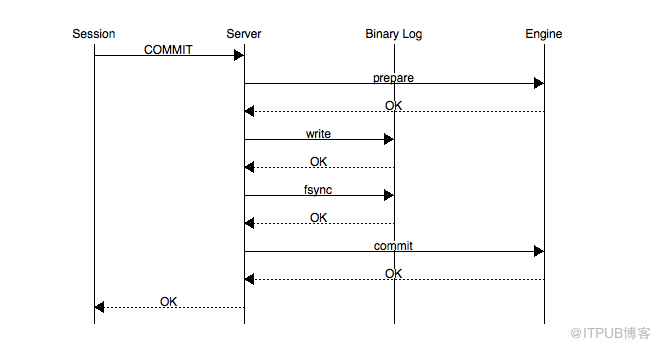
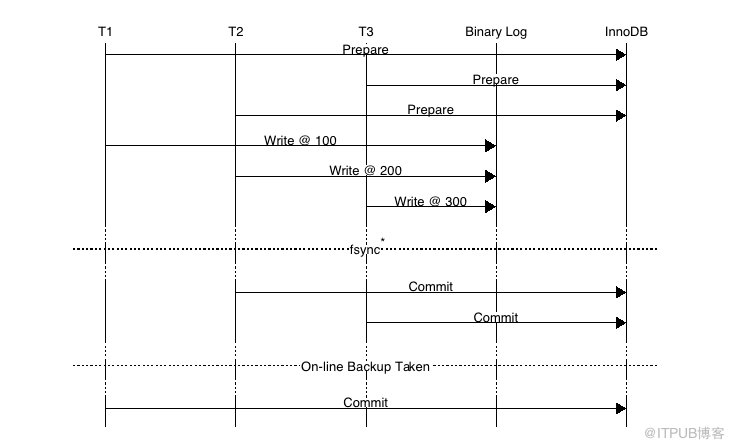
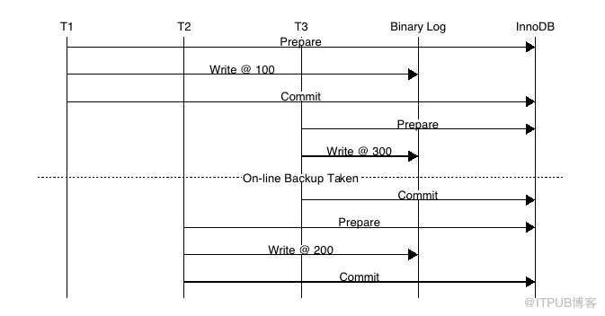

原创 [MySQL](http://blog.itpub.net/mysql/) 作者：[沃趣科技](http://blog.itpub.net/28218939/) 时间：2016-01-13 13:12:19 27199 0

**并发复制（Parallel Replication）** **系列** **一 : Binary Log Group Commit**

 

作者：沃趣科技MySQL数据库工程师  麻鹏飞

 

MySQL Binary log在MySQL 5.1版本后推出主要用于主备复制的搭建，我们回顾下MySQL 在开启/关闭 Binary Log功能时是如何工作的 。

MySQL**没有开启**Binary log的情况下： 

-  InnoDB存储引擎通过redo和undo日志可以safe     crash recovery数据库，当数据crash recovery时，通过redo日志将所有**已经在存储引擎内部提交的事务应用redo log恢复**，所有已经prepared但是**没有commit的transactions**将会应用**undo log做roll     back**。然后客户端连接时就能看到已经提交的数据存在数据库内，未提交被回滚地数据需要重新执行。

MySQL**开启**Binary log 的情况下：

- 为了保证存储引擎和MySQL数据库上层的二进制日志保持一致（**因为备库通过二进制日志重放主库提交的事务，假设主库存储引擎已经提交而二进制日志没有保持一致，则会使备库数据丢失造成主备数据不一致**），引入二阶段提交（two     phase commit or 2pc）

 

**图1 二阶段提交**

 MySQL二阶段提交流程：

​      Storage Engine（InnoDB） transaction prepare阶段：即sql语句已经成功执行并生成redo和undo的内存日志

​      Binary log日志提提交

- write()将binary     log内存日志数据写入文件系统缓存
- fsync()将binary     log 文件系统缓存日志数据永久写入磁盘

​      Storage Engine(InnoDB)内部提交

- commit阶段在存储引擎内提交(     innodb_flush_log_at_trx_commit控制)使undo和redo永久写入磁盘

  开启Binary log的MySQL在crash recovery时：

- 当事务在**prepare阶段crash**，数据库recovery的时候该事务未写入Binary     log并且存储引擎未提交，将该事务**roll back**。
- 当事务在**Binary log日志已经fsync()永久写入二进制日志时crash**，但是存储引擎**未来得及commit**,此时MySQL数据库recovery的时候将会从二进制日志的Xid（MySQL数据库内部分布式事务XA）中获取提交的信息重新**将该事务重做并commit**使存储引擎和二进制日志始终保持一致。

 

以上提到单个事务的二阶段提交过程，能够保证存储引擎和binary log日志保持一致，但是**在并发的情况下怎么保证存储引擎和Binary Log提交的顺序一致**？当多个事务并发提交的情况，如果Binary Log和存储引擎顺序**不一致**会造成什么影响？

 **图2 InnoDB存储引擎提交的顺序与MySQL上层的二进制日志顺序不同**

如上图：事务按照**T1、T2、T3**顺序开始执行，将二进制日志（按照T1、T2、T3顺序）写入日志文件系统缓存，调用fsync()进行一次group commit将日志文件永久写入磁盘，但是**存储引擎**提交的顺序为**T2、T3、T1****。**当T2、T3提交事务之后做了一个On-line的backup程序新建一个slave来做replication，那么事务T1在slave机器restore MySQL数据库的时候发现**未在**存储引擎内提交，T1事务被roll back，此时主备数据不一致(搭建Slave时，change master to的日志偏移量记录T3在事务位置之后)。

结论：MySQL数据库上层二进制日志的写入顺序和存储引擎InnoDB层的事务提交顺序一致，用于备份及恢复需要，如xtrabackup和innobackpex工具。

   

为了解决以上问题，在早期的MySQL版本，通过prepare_commit_mutex 锁保证MySQ数据库上层二进制日志和Innodb存储引擎层的事务提交顺序一致。

 

**图3 通过prepare_commit_mutex保证存储引擎和二进制日志顺序提交顺序一致**

 

图3可以看出在prepare_commit_mutex，只有当上一个事务commit后释放锁，下一个事务才可以进行prepara操作，并且在每个transaction过程中**Binary log没有fsync()的调用**。由于内存数据写入磁盘的开销很大，如果频繁fsync()把日志数据永久写入磁盘数据库的性能将会急剧下降。此时MySQL 数据库提供sync_binlog参数来设置多少个binlog日志产生的时候调用一次fsync()把二进制日志刷入磁盘来提高整体性能，该参数的设置作用：

- sync_binlog=0，二进制日志fsync()的操作基于操作系统。
- sync_binlog=1，每一个transaction     commit都会调用一次fsync()，此时能保证数据最安全但是性能影响较大。
- sync_binlog=N，当数据库crash的时候至少会丢失N-1个transactions。

图3 所示MySQL开启Binary log时使用prepare_commit_mutex和sync_log保证二进制日志和存储引擎顺序保持一致（通过sync_binlog来控制日志的刷新频率），prepare_commit_mutex的锁机制造成高并发提交事务的时候性能非常差而且二进制日志也无法group commit。

那么如何保证MySQL开启Binary Log日志后使**二****进制日志写入顺序和存储引擎提交顺序保持一致**并且能够进行二进制日志的**Group Commit**？

MySQL 5.6 引入BLGC（Binary Log Group Commit）,二进制日志的提交过程分成三个阶段，Flush stage、Sync stage、Commit stage。

那么事务提交过程简化为：

**存储引擎（InnoDB) Prepare  ---->  数据库上层(Binary Log)  Flush Stage  ---->  Sync Stage  ---->  调存储引擎（InnoDB）Commit stage**.

每个stage阶段都有各自的队列，使每个session的事务进行排队。当一个线程注册了一个空队列，该线程就视为该队列的leader，后注册到该队列的线程为follower，leader控制队列中follower的行为。leader同时带领当前队列的所有follower到下一个stage去执行，当遇到下一个stage并非空队列，此时leader可以变成follower到此队列中（注：follower的线程不可能变成leader）

 

 

 **图4: 二进制日志三阶段提交过程**

在 Flush stage：所有已经注册线程都将写入binary log缓存

在Sync stage ：binary log缓存的数据将会sync到磁盘，当sync_binlog=1时所有该队列事务的二进制日志缓存永久写入磁盘

在 Commit stage:leader根据顺序调用存储引擎提交事务。

当一组事务在进行Commit阶段时，其他新的事务可以进行Flush阶段，从而使group commit不断生效。那么为了提高group commit中一组队列的事务数量，MySQL用binlog_max_flush_queue_time来控制在Flush stage中的等待时间，让Flush队列在此阶段多等待一些时间来增加这一组事务队列的数量使该队列到Sync阶段可以一次fysn()更多的事务。

 

MySQL 5.7 Parallel replication实现主备多线程复制基于主库Binary Log Group Commit, 并在Binary log日志中标识同一组事务的last_commited=N和该组事务内所有的事务提交顺序。为了增加一组事务内的事务数量提高备库组提交时的并发量引入了binlog_group_commit_sync_delay=N 和binlog_group_commit_sync_no_delay_count=N (**注：binlog_max_flush_queue_time 在MySQL的5.7.9及之后版本不再生效**)参数，MySQL等待binlog_group_commit_sync_delay毫秒直到达到binlog_group_commit_sync_no_delay_count事务个数时，将进行一次组提交。

 

Reference:http://mysqlmusings.blogspot.kr/2012/06/binary-log-group-commit-in-mysql-56.html

 

来自 <http://blog.itpub.net/28218939/viewspace-1975809/> 

 