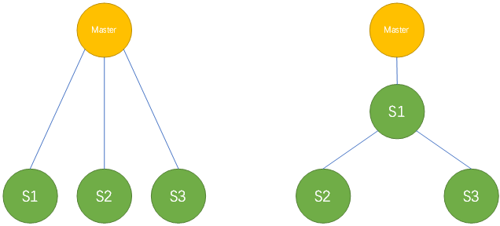
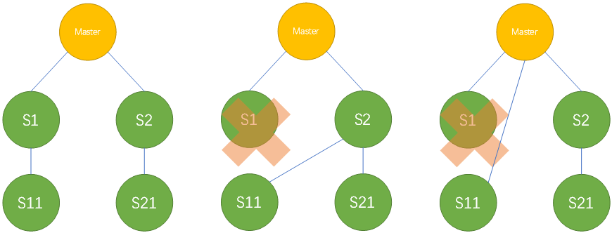

> 复制管理技能：
>
> ​	**1.复制架构调整**
>
> ​	2.在线最小影响添加新的slave
>
> ​	3.复制延迟的排查和处理
>
> ​	4.保证主从数据一致性
>
> ​	5.利用主从架构实现数据快速闪回

[TOC]

 

# 复制架构调整 


## 一主多从调整为级联复制



 

### 非GTID的传统复制情况：

[传送门：实验_非GTID一主多从调整为级联复制](..\8.复制搭建实验\5.2.实验：非GTID 一主多从变级联架构.md)

首先，==希望S1，S2，S3能够停在同一个pos位置==。

- 方法：

    1. S1，S2，S3 执行 stop slave     sql_thread，停止sql_thread。
    2. Master查看 show master status，获取master当前的log_file_name、log_pos。
    3. Slave上执行 start slave     sql_thread until     MASTER_LOG_FILE=<master_log_file>,MASTER_LOG_POS=<master_log_pos>

 

- 另类的办法，使slave们停在同一个pos位置。

  - master上执行：

    ```
    set sql_log_bin=0;
    
    create table just_for_test(id int);
    
    set sql_log_bin=1;
    
    drop table just_for_test;
    ```

    此时slave就会因为drop报错而停止复制。

 

- 在传统复制情况下，如何判断slaves停止的位置是一样的呢？

  > show slave status 中，对比 relay_master_log_file，和exec_master_log_pos。

 

- 在并行复制环境下， 可用下面方法使slave准确停止
  - `start slave until sql_after_mts_gaps;`
  - 或先关闭并行复制。

 

### GTID方式复制的情况：

[传送门：实验_GTID一主多从调整为级联复制](..\8.复制搭建实验\5.3.实验：GTID 一主多从变级联架构.md)

首先，保证级联后的slave的gtid小于slave1.

- 方法：

    1.s2,s3 stop slave;

    2.s2,s3 change master to s1 ,auto_position=1;

    3.s2,s3 start slave;

完活。GTID和传统模式简直是两个世界。

 

## 一主多从级联架构，级联从节点切换到另一个级联主节点

 




### GTID模式

可以直接auto_pos。


### 非GTID的传统模式：

- 要保证这个参数开启。
  
    这个参数的作用是：将远程的日志都写在本地。
    
    ```
    mysql> show variables like '%log_slave_updates%';
    +-------------------+-------+
    | Variable_name   | Value |
    +-------------------+-------+
    | log_slave_updates | ON  |
    +-------------------+-------+
    1 row in set (0.01 sec)
    ```


- 同理，slave做了 reset slave all，也这么搞：

  -  非GTID的话——log_slave_updates=ON时，可以去slave上解析binlog。

    1. 在slave的binlog中确认server id， 并找到slave上最后一个事务的set timestamp——这个时间戳在整个复制架构中的任何一个节点上都不会有变化。
    2. 可以根据slave binlog中事务的时间值， 去master上找文件时间接近该值的binlog文件，并查看该binlog文件，查找从库事务的断点的binlog_pos位置。
    3. S11可以依据找到的binlog_pos 位置，与master进行复制追加。追加后再根据需要，决定是否更改到从S2上进行复制。
    4. 变更到从S2上复制——试想一下：
       1. S11追平master之后，根据S11的位置，事务内容和时间点，去S2上继续挖日志？得到file和pos？
       2. 我的天啊…… 还是GTID好。

    > 用什么来说明sql_thread执行到的位置？
    >
    >   show slave status \G
    >
    > ​    -- Relay_master_log_file 
    >
    > ​    -- Exec_master_log_pos


## 级联复制改为一主多从

### GTID模式

应该不用多说了，太简单了。

 

### 非GTID的传统模式

- 设想(已证实可行)：
  1. 级联复制S1 stop slave sql_thread
  2. 等待后续级联节点追平S1
  3. 后续级联节点根据S1的slave status，进行change master
  4. 启动所有slave

 

[传送门：实验_非GTID级联复制变为一主多从](..\8.复制搭建实验\5.4.实验：非GTID 级联复制架构变为一主多从（M-nS）.md)