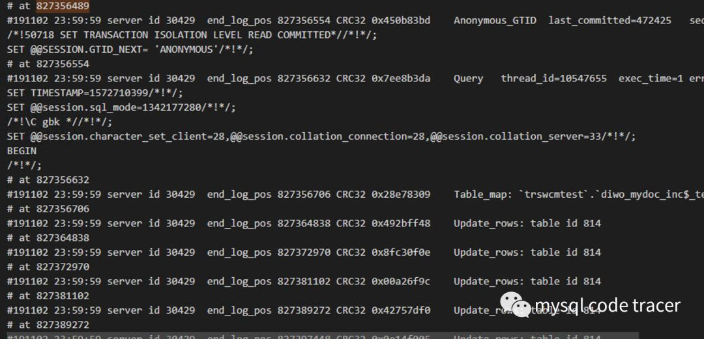
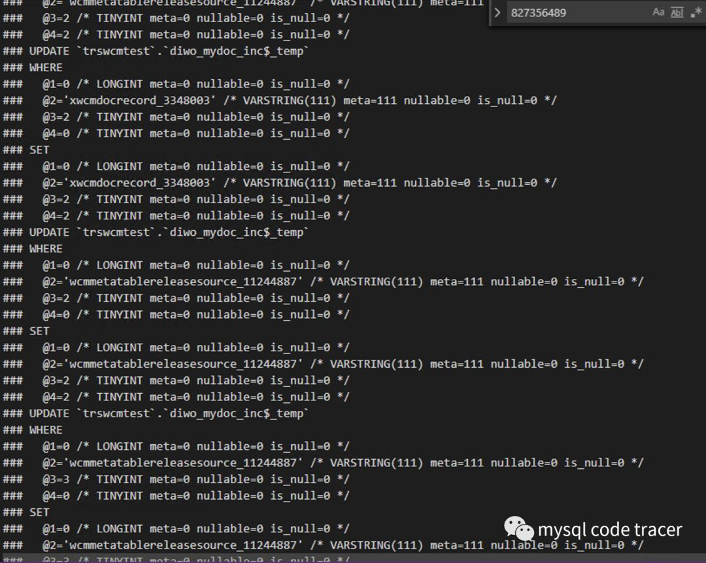

## 【工作笔记】一则主从同步延迟处理 

**一、问题描述**

今天收到主从延迟告警（周末睡了一晚上没看到告警，略显尴尬😓），赶紧看下从库状态

[14:50:56 root@mysql3306.sock][(none)]> show slave status\G

*************************** 1. row *************************** 

Slave_IO_State: Waiting for master to send event

Master_Host: 10.100.63.10

Master_User: repl

Master_Port: 3306

Connect_Retry: 60

Master_Log_File: mysql-bin.000383

Read_Master_Log_Pos: 132069756

Relay_Log_File: mlfslave164-relay-bin.000684

Relay_Log_Pos: 827356702 Relay_Master_Log_File: mysql-bin.000382

Slave_IO_Running: Yes  Slave_SQL_Running: Yes

Replicate_Do_DB:

Replicate_Ignore_DB:

Replicate_Do_Table:

Replicate_Ignore_Table:  Replicate_Wild_Do_Table: Replicate_Wild_Ignore_Table:

Last_Errno: 0

Last_Error:

Skip_Counter: 0

Exec_Master_Log_Pos: 827356489

Relay_Log_Space: 1205833440

Until_Condition: None

Until_Log_File:

Until_Log_Pos: 0

Master_SSL_Allowed: No

Master_SSL_CA_File:

Master_SSL_CA_Path:

Master_SSL_Cert:  Master_SSL_Cipher:

Master_SSL_Key: Seconds_Behind_Master: 50064Master_SSL_Verify_Server_Cert: No

Last_IO_Errno: 0

Last_IO_Error:

Last_SQL_Errno: 0

Last_SQL_Error: Replicate_Ignore_Server_Ids:

Master_Server_Id: 30429

Master_UUID: d04dc0aa-ca9f-11e8-ba14-d094660e5c57

Master_Info_File: mysql.slave_master_info

SQL_Delay: 0

SQL_Remaining_Delay: NULL  Slave_SQL_Running_State: Reading event from the relay log

Master_Retry_Count: 86400

Master_Bind:  Last_IO_Error_Timestamp: Last_SQL_Error_Timestamp:

Master_SSL_Crl:

Master_SSL_Crlpath:

Retrieved_Gtid_Set:  Executed_Gtid_Set:

Auto_Position: 0  Replicate_Rewrite_DB:

Channel_Name:

Master_TLS_Version:1 row in set (0.00 sec)

 

 

 

**二、问题诊断**

**2.1 初步判断**

show几次slave status的结果看到Exec_Master_Log_Pos都处于位置827356489，所以很容易就可以判断出处于大事务了。

**2.2 解析binlog**

通过解析主库的binlog一探究竟，

 

**2.3 pstack**

再看下pstack结果

看到sql_thread处于row_search_mvcc状态，到这里其实基本上可以判断出由于表没有主键或者没有合适的索引造成的主从延迟。

Thread 217 (Thread 0x7fdf4af5c700 (LWP 180191)):#0

sel_restore_position_for_mysql (same_user_rec=0x7fdf4af5bb48, pcur=0x7fe0546e2718, moves_up=1, mtr=0x7fdf4af5aad0, latch_mode=1) at /export/home/pb2/build/sb_0-29016441-1528454776.43/mysql-5.7.23/storage/innobase/row/row0sel.cc:3760#1

0x00000000011396b6 in row_search_mvcc (buf=0x7fe05451c5b0 "", mode=PAGE_CUR_G, prebuilt=0x7fe0546e2508, match_mode=0, direction=1) at /export/home/pb2/build/sb_0-29016441-1528454776.43/mysql-5.7.23/storage/innobase/row/row0sel.cc:5069#2

0x000000000104af2e in ha_innobase::general_fetch (this=0x7fe054c79c60, buf=0x7fe05451c5b0 "", direction=1, match_mode=0) at /export/home/pb2/build/sb_0-29016441-1528454776.43/mysql-5.7.23/storage/innobase/handler/ha_innodb.cc:9021#3

0x000000000081b9fa in handler::ha_rnd_next (this=<optimized out>, buf=0x7fe05451c5b0 "") at /export/home/pb2/build/sb_0-29016441-1528454776.43/mysql-5.7.23/sql/handler.cc:2947#4

0x0000000000ecd461 in Rows_log_event::do_table_scan_and_update (this=0x7fe04954d970, rli=0x7fe048085f30) at /export/home/pb2/build/sb_0-29016441-1528454776.43/mysql-5.7.23/sql/log_event.cc:10804#5

0x0000000000edb4f2 in Rows_log_event::do_apply_event (this=0x7fe04954d970, rli=0x7fe048085f30) at /export/home/pb2/build/sb_0-29016441-1528454776.43/mysql-5.7.23/sql/log_event.cc:11270#6

0x0000000000f2dbb5 in slave_worker_exec_job_group (worker=0x7fe048085f30, rli=0x7fe01409f450) at /export/home/pb2/build/sb_0-29016441-1528454776.43/mysql-5.7.23/sql/rpl_rli_pdb.cc:2666#7

0x0000000000f199b3 in handle_slave_worker (arg=0x7fe048085f30) at /export/home/pb2/build/sb_0-29016441-1528454776.43/mysql-5.7.23/sql/rpl_slave.cc:6180#8

0x0000000000fc79a4 in pfs_spawn_thread (arg=0x7fe04800dfa0) at /export/home/pb2/build/sb_0-29016441-1528454776.43/mysql-5.7.23/storage/perfschema/pfs.cc:2190#9

0x00007feddcd23dd5 in start_thread () from /lib64/libpthread.so.0#10 0x00007feddb7dbead in clone () from /lib64/libc.so.6

**2.4 根因确定**

我们再看下对应的表的表结果，从binlog可以看到更新的表为diwo_mydoc_inc$_temp，表结构如下：

[20:29:34 root@mysql3306.sock][trswcmtest]> show create table diwo_mydoc_inc$_temp\G

*************************** 1. row ***************************    

Table: diwo_mydoc_inc$_tempCreate 

Table: CREATE TABLE `diwo_mydoc_inc$_temp` ( `SEQ_ID` bigint(20) NOT NULL DEFAULT '0', `viewkey` varchar(37) NOT NULL, 

`SQL_TYPE` tinyint(4) NOT NULL, 

`TRS_FLAG` tinyint(4) NOT NULL) ENGINE=InnoDB DEFAULT CHARSET=utf8

1 row in set (0.00 sec)

果然，如我们所料，表上没有主键，也没有任何索引。

好了，到这里主从延迟的原因已经找到，那么该如何解决呢？

**三、解决办法**

**3.1 继续等待**

这是一种很无奈的方式，啥都不做

 

[20:32:28 root@mysql3306.sock][trswcmtest]> pager cat - |grep "row lock"

PAGER set to 'cat - |grep "row lock"'

[20:32:35 root@mysql3306.sock][trswcmtest]> show engine innodb status\G

 0 lock struct(s), heap size 1136, 0 row lock(s)

 0 lock struct(s), heap size 1136, 0 row lock(s)

 0 lock struct(s), heap size 1136, 0 row lock(s)

 0 lock struct(s), heap size 1136, 0 row lock(s)

 0 lock struct(s), heap size 1136, 0 row lock(s)

 0 lock struct(s), heap size 1136, 0 row lock(s)

 0 lock struct(s), heap size 1136, 0 row lock(s)

 0 lock struct(s), heap size 1136, 0 row lock(s)

 0 lock struct(s), heap size 1136, 0 row lock(s)

1 row in set (0.00 sec)

 

通过这种方式查看行锁的数量，可以估算出大概还需要多少时间完成binlog应用（当时太匆忙，忘记截图了），故障当时粗略估算还需要5个小时才能应用完，果断使用了第二种方法。

 

**3.2 重启、建索引**

此时如果按正常shutdown或者stop slave的方式来停止复制需要的时间可能已经不止一点半点了，过段kill -9 `pid of mysqld`，启动时添加参数`— skip-slave-start`保证slave启动时不开启复制。

观察表diwo_mydoc_inc$_temp的数据分布，发现viewkey字段来源于另外两张表的”表名”+唯一键，SQL_TYPE字段标识了SQL的类型，那么我们可以对viewkey建立索引，且区分度较高。

- set     sql_log_bin=0;
- create     index idx_viewkey on diwo_mydoc_inc$_temp(viewkey);

建立索引以后，再开启复制，2分钟以后就追上了主库，可见复制还是很给力的。

**3.3 修改slave_rows_search_algorithms**

slave_rows_search_algorithms默认值为TABLE_SCAN,INDEX_SCAN，我们可以设置HASH_SCAN来加速binlog event在应用过程中的row定位。HASH_SCAN提高性能的两个条件如下：

1. 表中没有任何索引或者有索引且本条update/delete的数据关键字重复值较多
2. 一个update/delete语句删除了大量的数据，形成了很多个8K左右的UPDATE_ROW_EVENT/DELETE_ROW_EVENT。update/delete只修改少量的数据（比如每个语句修改一行数据）并不能提高性能

**四、思考**

到这里，问题已解决大半，但是给我们的警示还得牢记于心

1. 大事务，主从复制造成延迟的罪魁祸首
2. 无主键、唯一键，主从延迟的催化剂，建议每个表还是保留自增主键以提高复制性能
3. 本文给出了快速诊断主从延迟的思路及方法，建议新手朋友们可以学习一下这个套路 