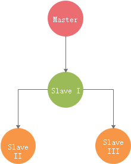

[TOC]

# 实验：搭建级联复制（M-S-S）架构的主从

## 实验环境

| 192.168.188.101  | mysqlvm1   | master |
| ------------------ | ------------ | -------- |
|                  | 4306       | master |
| 192.168.188.201  | mysqlvm1-1 | slave  |
|                  | 5306       | S1     |
|                  | 6306       | S2     |

ps:级联复制在5.7版本之后意义不大了，多个slave并不会再影响master性能。 

## 实验设想：

```
通过master进行xtrabackup 全库备份， 并利用备份配置M-S， 再进行一些事务后，对S再建立S ，形成M-S-S架构的主从。
为后面的复制架构调整提供实验环境。
```




### 首先配置master


#### 初始化master

```
[root@mysqlvm1 ~]# ./mysql_onekey_3.1.sh /opt/mysql-5.7.26-linux-glibc2.12-x86_64 4306
 
mysql> alter user user() identified by 'mysql';
Query OK, 0 rows affected (0.04 sec)
 
mysql> show variables like '%server_id%';
+----------------+----------+
| Variable_name | Value  |
+----------------+----------+
| server_id   | 10244306 |
| server_id_bits | 32    |
+----------------+----------+
2 rows in set (0.00 sec)
 
mysql> show variables like '%gtid_mode%';
+----------------------------------+-----------+
| Variable_name          | Value   |
+----------------------------------+-----------+
| gtid_mode            | ON    |
+----------------------------------+-----------+
1 rows in set (0.01 sec)
 
```

#### 制造数据

```
mysql> create table name ( id int, name varchar(30),dtl varchar(100));
Query OK, 0 rows affected (0.05 sec)
 
mysql> create table kk (id int auto_increment primary key, name varchar(30),dtl varchar(100));
Query OK, 0 rows affected (0.05 sec)
 
mysql> insert into kk ( name, dtl) values ('aa','aaaa');
Query OK, 1 row affected (0.07 sec)
 
mysql> insert into kk ( name, dtl) values ('bb','bbbb');
Query OK, 1 row affected (0.01 sec)
 
mysql> insert into kk (name) values ('cc');
Query OK, 1 row affected (0.05 sec)
 
mysql> insert into kk (name) values ('dd');
Query OK, 1 row affected (0.03 sec)
 
mysql> insert into kk (name) values ('ee');
Query OK, 1 row affected (0.04 sec)
 
mysql> insert into kk (name) values ('ff');
Query OK, 1 row affected (0.05 sec)
 
mysql> insert into kk (name) values ('gg');
Query OK, 1 row affected (0.05 sec)
 
mysql> select * from kk;
+----+------+------+
| id | name | dtl |
+----+------+------+
| 1 | aa  | aaaa |
| 2 | bb  | bbbb |
| 3 | cc  | NULL |
| 4 | dd  | NULL |
| 5 | ee  | NULL |
| 6 | ff  | NULL |
| 7 | gg  | NULL |
+----+------+------+
7 rows in set (0.00 sec)
 
 
```


### 使用xtrabackup 对master进行全备份

并传输给slave服务器

```
[root@mysqlvm1 ~]# innobackupex --defaults-file=/data/mysql/mysql4306/my4306.cnf  --no-timestamp -uroot -pmysql --stream=tar ./ | ssh 192.168.188.201 " gzip - > /data/backup/mss_bk_`date +%Y%m%d` " 
```


### 在slave上对备份进行恢复，通过恢复创建第一个slave:5306

```
[root@mysqlvm1-1 backup]# ll
total 1412
-rw-r--r--. 1 root root 715742 Mar 2 23:12 mss_bk_20200302
[root@mysqlvm1-1 backup]# mkdir mss
[root@mysqlvm1-1 backup]# tar zxf mss_bk_20200302 -C mss
[root@mysqlvm1-1 backup]# cd mss
[root@mysqlvm1-1 mss]# ls
backup-my.cnf ib_buffer_pool ibdata1 mysql performance_schema rrpp sys xtrabackup_binlog_info xtrabackup_checkpoints xtrabackup_info xtrabackup_logfile
[root@mysqlvm1-1 mss]# innobackupex --apply-log ./
[root@mysqlvm1-1 mysql]# mkdir -pv /data/mysql/mysql5306/{data,logs,tmp}
mkdir: created directory ‘/data/mysql/mysql5306’
mkdir: created directory ‘/data/mysql/mysql5306/data’
mkdir: created directory ‘/data/mysql/mysql5306/logs’
mkdir: created directory ‘/data/mysql/mysql5306/tmp’
 
```


#### 这块根据需要，手动创建配置文件，执行xtrabackup恢复

```
[root@mysqlvm1-1 mysql5306]# innobackupex --defaults-file=/data/mysql/mysql5306/my5306.cnf --copy-back /data/backup/mss
```


#### 记录一下xtrabackup的binlog位置

```
[root@mysqlvm1-1 mss]# cat xtrabackup_binlog_info 
mysql-bin.000003    3220    b2d9c2f7-5c95-11ea-8b82-000c29f0aa33:1-14
```


### 启动恢复的mysql5306实例，开始配置第一个M-S

```
[root@mysqlvm1-1 data]# chown mysql.mysql -R ./*

[root@mysqlvm1-1 mysql5306]# mysqld --defaults-file=/data/mysql/mysql5306/my5306.cnf &

mysql> root@localhost:mysql.sock [(none)]>show variables like '%server_id%';
+----------------+----------+
| Variable_name | Value  |
+----------------+----------+
| server_id   | 10245306 |
| server_id_bits | 32    |
+----------------+----------+
2 rows in set (0.00 sec)
```


#### 主库创建复制用户

```
mysql> create user 'repm'@'%' identified by 'repm';
Query OK, 0 rows affected (0.04 sec)
 
mysql> grant replication slave on *.* to 'repm'@'%';
Query OK, 0 rows affected (0.04 sec)
```


#### 从库配置主从

```
root@localhost:mysql.sock [(none)]>show master status;
+------------------+----------+--------------+------------------+------------------------------------------+
| File       | Position | Binlog_Do_DB | Binlog_Ignore_DB | Executed_Gtid_Set            |
+------------------+----------+--------------+------------------+------------------------------------------+
| mysql-bin.000001 |   154 |       |         | b2d9c2f7-5c95-11ea-8b82-000c29f0aa33:1-3 |
+------------------+----------+--------------+------------------+------------------------------------------+
1 row in set (0.00 sec)
 
root@localhost:mysql.sock [(none)]>reset master;
Query OK, 0 rows affected (0.00 sec)
 
root@localhost:mysql.sock [(none)]>set global gtid_purged='b2d9c2f7-5c95-11ea-8b82-000c29f0aa33:1-14';
Query OK, 0 rows affected (0.00 sec)
 
root@localhost:mysql.sock [(none)]>show master status;
+------------------+----------+--------------+------------------+-------------------------------------------+
| File       | Position | Binlog_Do_DB | Binlog_Ignore_DB | Executed_Gtid_Set             |
+------------------+----------+--------------+------------------+-------------------------------------------+
| mysql-bin.000001 |   154 |       |         | b2d9c2f7-5c95-11ea-8b82-000c29f0aa33:1-14 |
+------------------+----------+--------------+------------------+-------------------------------------------+
1 row in set (0.00 sec)
 
root@localhost:mysql.sock [(none)]>change master to master_host='192.168.188.101',master_port=4306,master_user='repm',master_password='repm',master_auto_position=1;
Query OK, 0 rows affected, 2 warnings (0.01 sec)
 
root@localhost:mysql.sock [(none)]>start slave;
 
root@localhost:mysql.sock [(none)]>show slave status\G
*************************** 1. row ***************************
        Slave_IO_State: Waiting for master to send event
         Master_Host: 192.168.188.101
         Master_User: repm
         Master_Port: 4306
        Connect_Retry: 60
       Master_Log_File: mysql-bin.000003
     Read_Master_Log_Pos: 3669
        Relay_Log_File: mysqlvm1-1-relay-bin.000002
        Relay_Log_Pos: 863
    Relay_Master_Log_File: mysql-bin.000003
       Slave_IO_Running: Yes
      Slave_SQL_Running: Yes
       Replicate_Do_DB: 
     Replicate_Ignore_DB: 
      Replicate_Do_Table: 
    Replicate_Ignore_Table: 
   Replicate_Wild_Do_Table: 
 Replicate_Wild_Ignore_Table: 
          Last_Errno: 0
          Last_Error: 
         Skip_Counter: 0
     Exec_Master_Log_Pos: 3669
       Relay_Log_Space: 1075
       Until_Condition: None
        Until_Log_File: 
        Until_Log_Pos: 0
      Master_SSL_Allowed: No
      Master_SSL_CA_File: 
      Master_SSL_CA_Path: 
       Master_SSL_Cert: 
      Master_SSL_Cipher: 
        Master_SSL_Key: 
    Seconds_Behind_Master: 0
Master_SSL_Verify_Server_Cert: No
        Last_IO_Errno: 0
        Last_IO_Error: 
        Last_SQL_Errno: 0
        Last_SQL_Error: 
 Replicate_Ignore_Server_Ids: 
       Master_Server_Id: 10244306
         Master_UUID: b2d9c2f7-5c95-11ea-8b82-000c29f0aa33
       Master_Info_File: mysql.slave_master_info
          SQL_Delay: 0
     SQL_Remaining_Delay: NULL
   Slave_SQL_Running_State: Slave has read all relay log; waiting for more updates
      Master_Retry_Count: 86400
         Master_Bind: 
   Last_IO_Error_Timestamp: 
   Last_SQL_Error_Timestamp: 
        Master_SSL_Crl: 
      Master_SSL_Crlpath: 
      Retrieved_Gtid_Set: b2d9c2f7-5c95-11ea-8b82-000c29f0aa33:15-16
      Executed_Gtid_Set: b2d9c2f7-5c95-11ea-8b82-000c29f0aa33:1-16
        Auto_Position: 1
     Replicate_Rewrite_DB: 
         Channel_Name: 
      Master_TLS_Version: 
1 row in set (0.00 sec)
 
```


### 主库上进行事务处理，检查从库是否完成

```
mysql> insert into name select * from kk;
Query OK, 7 rows affected (0.03 sec)
Records: 7 Duplicates: 0 Warnings: 0
 
 
root@localhost:mysql.sock [(none)]>select * from rrpp.name;
+------+------+------+
| id  | name | dtl |
+------+------+------+
|  1 | aa  | aaaa |
|  2 | bb  | bbbb |
|  3 | cc  | NULL |
|  4 | dd  | NULL |
|  5 | ee  | NULL |
|  6 | ff  | NULL |
|  7 | gg  | NULL |
+------+------+------+
7 rows in set (0.00 sec)
```


### 主从配置增强半同步

1. 加载lib，所有主从节点都要配置。
    - 主库
        ```
        install plugin rpl_semi_sync_master soname 'semisync_master.so';
        ```

     - 从库
         ```
         install plugin rpl_semi_sync_slave soname 'semisync_slave.so';
         ```

     - ps：可以一起装。建议一起装，因为会有主从切换的情景。


2. 查看，确保所有节点都成功加载。
    ```
    mysql> show plugins;
    ...
    | rpl_semi_sync_master    | ACTIVE  | REPLICATION    | semisync_master.so | GPL   |
    | rpl_semi_sync_slave    | ACTIVE  | REPLICATION    | semisync_slave.so | GPL   |
    ```


3. 启用半同步
   
    1. 先启用从库上的参数，最后启用主库的参数。
    
       ```
       从库：set global rpl_semi_sync_slave_enabled = {0|1};  # 1：启用，0：禁止
       
       主库：
       set global rpl_semi_sync_master_enabled = {0|1};  # 1：启用，0：禁止
       set global rpl_semi_sync_master_timeout = N;    # 单位为ms
       ```

    2. 从库重启io_thread
        ```
        stop slave io_thread;
        start slave io_thread;
        ```
    
   3. 主库查看
        ```
        mysql> show global status like '%sync%';
        +--------------------------------------------+-------+
        | Variable_name               | Value |
        +--------------------------------------------+-------+
        | Innodb_data_fsyncs             | 147  |
        | Innodb_data_pending_fsyncs         | 0   |
        | Innodb_os_log_fsyncs            | 86  |
        | Innodb_os_log_pending_fsyncs        | 0   |
        | Rpl_semi_sync_master_clients        | 1   |
        | Rpl_semi_sync_master_net_avg_wait_time   | 0   |
        | Rpl_semi_sync_master_net_wait_time     | 0   |
        | Rpl_semi_sync_master_net_waits       | 0   |
        | Rpl_semi_sync_master_no_times       | 0   |
        | Rpl_semi_sync_master_no_tx         | 0   |
        | Rpl_semi_sync_master_status        | ON  |
        | Rpl_semi_sync_master_timefunc_failures   | 0   |
        | Rpl_semi_sync_master_tx_avg_wait_time   | 0   |
        | Rpl_semi_sync_master_tx_wait_time     | 0   |
        | Rpl_semi_sync_master_tx_waits       | 0   |
        | Rpl_semi_sync_master_wait_pos_backtraverse | 0   |
        | Rpl_semi_sync_master_wait_sessions     | 0   |
        | Rpl_semi_sync_master_yes_tx        | 0   |
        | Rpl_semi_sync_slave_status         | OFF  |
        +--------------------------------------------+-------+
        19 rows in set (0.00 sec)
        ```


### 接下来开始基于第一个Slave配置第二个Slave


#### 执行一个循环，令主库持续有事务产生

这才能更明显的体验到一致性备份和gtid_purged的效果

```
while :
do
echo "insert into rrpp.kk(name) values('a');" | mysql -S /data/mysql/mysql4306/tmp/mysql.sock -pmysql
sleep 10
done
```


#### 对slave5306 通过xtrabackup 进行全库备份

```
#这块命令写错了，导致路径使用了时间戳。
[root@mysqlvm1-1 ~]# innobackupex --defaults-file=/data/mysql/mysql5306/my5306.cnf --no-timestam -uroot -pmysql /data/backup/s_bk_`date +%Y%m%d`
```

#### 使用slave5306的备份创建slave 6306
``` 
[root@mysqlvm1-1 mysql]# mkdir -pv mysql6306/{data,logs,tmp}

[root@mysqlvm1-1 mysql]# ll mysql5306/
total 16
drwxr-xr-x. 6 mysql mysql 4096 Mar 3 00:11 data
drwxr-xr-x. 2 mysql mysql  92 Mar 2 23:42 logs
-rw-r--r--. 1 mysql mysql 8385 Mar 2 23:26 my5306.cnf
drwxr-xr-x. 2 mysql mysql  47 Mar 2 23:41 tmp

[root@mysqlvm1-1 mysql]# cp mysql5306/my5306.cnf mysql6306/my6306.cnf

[root@mysqlvm1-1 mysql]# vi mysql6306/my6306.cnf

[root@mysqlvm1-1 mysql]# chown -R mysql.mysql mysql6306/

[root@mysqlvm1-1 s_bk_20200303]# innobackupex --apply-log /data/backup/s_bk_20200303/2020-03-03_00-11-15/

[root@mysqlvm1-1 s_bk_20200303]# innobackupex --defaults-file=/data/mysql/mysql6306/my6306.cnf --copy-back /data/backup/s_bk_20200303/2020-03-03_00-11-15/

[root@mysqlvm1-1 mysql6306]# chown -R mysql.mysql /data/mysql/mysql6306/

[root@mysqlvm1-1 mysql6306]# cat /data/backup/s_bk_20200303/2020-03-03_00-11-15/xtrabackup_binlog_info 
mysql-bin.000001    5670    b2d9c2f7-5c95-11ea-8b82-000c29f0aa33:1-32

```

#### 启动slave6306
```
[root@mysqlvm1-1 mysql6306]# mysqld --defaults-file=/data/mysql/mysql6306/my6306.cnf &

[root@mysqlvm1-1 mysql6306]# mysql -S /data/mysql/mysql6306/tmp/mysql.sock -pmysql

root@localhost:mysql.sock [(none)]>show slave status\G      
#这是slave1原本的配置
*************************** 1. row ***************************
        Slave_IO_State: 
         Master_Host: 192.168.188.101
         Master_User: repm
         Master_Port: 4306
        Connect_Retry: 60
       Master_Log_File: mysql-bin.000003
     Read_Master_Log_Pos: 194
        Relay_Log_File: mysqlvm1-1-relay-bin.000003
        Relay_Log_Pos: 5224
    Relay_Master_Log_File: mysql-bin.000003
       Slave_IO_Running: No
      Slave_SQL_Running: No

root@localhost:mysql.sock [(none)]>show master status;
+------------------+----------+--------------+------------------+-------------------------------------------+
| File       | Position | Binlog_Do_DB | Binlog_Ignore_DB | Executed_Gtid_Set             |
+------------------+----------+--------------+------------------+-------------------------------------------+
| mysql-bin.000001 |   154 |       |         | b2d9c2f7-5c95-11ea-8b82-000c29f0aa33:1-14 |
+------------------+----------+--------------+------------------+-------------------------------------------+
1 row in set (0.00 sec)


```

### 此时的slave 1(5306)

```
root@localhost:mysql.sock [rrpp]>show master status;
+------------------+----------+--------------+------------------+-------------------------------------------+
| File       | Position | Binlog_Do_DB | Binlog_Ignore_DB | Executed_Gtid_Set             |
+------------------+----------+--------------+------------------+-------------------------------------------+
| mysql-bin.000001 |  19442 |       |         | b2d9c2f7-5c95-11ea-8b82-000c29f0aa33:1-76 |
+------------------+----------+--------------+------------------+-------------------------------------------+
1 row in set (0.00 sec)
```

### 继续配置slave2(6306)

```
root@localhost:mysql.sock [(none)]>reset slave;
Query OK, 0 rows affected (0.01 sec)

root@localhost:mysql.sock [(none)]>reset master;
Query OK, 0 rows affected (0.00 sec)

root@localhost:mysql.sock [(none)]>show master status;
+------------------+----------+--------------+------------------+-------------------+
| File       | Position | Binlog_Do_DB | Binlog_Ignore_DB | Executed_Gtid_Set |
+------------------+----------+--------------+------------------+-------------------+
| mysql-bin.000001 |   154 |       |         |          |
+------------------+----------+--------------+------------------+-------------------+
1 row in set (0.00 sec)

root@localhost:mysql.sock [(none)]>set global gtid_purged='b2d9c2f7-5c95-11ea-8b82-000c29f0aa33:1-32';
Query OK, 0 rows affected (0.00 sec)

root@localhost:mysql.sock [(none)]>
root@localhost:mysql.sock [(none)]>show master status;
+------------------+----------+--------------+------------------+-------------------------------------------+
| File       | Position | Binlog_Do_DB | Binlog_Ignore_DB | Executed_Gtid_Set             |
+------------------+----------+--------------+------------------+-------------------------------------------+
| mysql-bin.000001 |   154 |       |         | b2d9c2f7-5c95-11ea-8b82-000c29f0aa33:1-32 |
+------------------+----------+--------------+------------------+-------------------------------------------+
1 row in set (0.00 sec)

root@localhost:mysql.sock [(none)]>change master to master_host='192.168.188.201',master_port=5306,master_user='repm',master_password='repm',master_auto_position=1;
Query OK, 0 rows affected, 2 warnings (0.01 sec)


root@localhost:mysql.sock [(none)]>show slave status\G
*************************** 1. row ***************************
        Slave_IO_State: 
         Master_Host: 192.168.188.201
         Master_User: repm
         Master_Port: 5306
        Connect_Retry: 60
       Master_Log_File: 
     Read_Master_Log_Pos: 4
        Relay_Log_File: mysqlvm1-1-relay-bin.000001
        Relay_Log_Pos: 4
    Relay_Master_Log_File: 
       Slave_IO_Running: No
      Slave_SQL_Running: No

root@localhost:mysql.sock [(none)]>start slave;
Query OK, 0 rows affected (0.00 sec)

root@localhost:mysql.sock [(none)]>show slave status\G
*************************** 1. row ***************************
        Slave_IO_State: Waiting for master to send event
         Master_Host: 192.168.188.201
         Master_User: repm
         Master_Port: 5306
        Connect_Retry: 60
       Master_Log_File: mysql-bin.000001
     Read_Master_Log_Pos: 25076
        Relay_Log_File: mysqlvm1-1-relay-bin.000002
        Relay_Log_Pos: 12308
    Relay_Master_Log_File: mysql-bin.000001
       Slave_IO_Running: Yes
      Slave_SQL_Running: Yes
       Replicate_Do_DB: 
     Replicate_Ignore_DB: 
      Replicate_Do_Table: 
    Replicate_Ignore_Table: 
   Replicate_Wild_Do_Table: 
 Replicate_Wild_Ignore_Table: 
          Last_Errno: 0
          Last_Error: 
         Skip_Counter: 0
     Exec_Master_Log_Pos: 17564
       Relay_Log_Space: 20032
       Until_Condition: None
        Until_Log_File: 
        Until_Log_Pos: 0
      Master_SSL_Allowed: No
      Master_SSL_CA_File: 
      Master_SSL_CA_Path: 
       Master_SSL_Cert: 
      Master_SSL_Cipher: 
        Master_SSL_Key: 
    Seconds_Behind_Master: 235
Master_SSL_Verify_Server_Cert: No
        Last_IO_Errno: 0
        Last_IO_Error: 
        Last_SQL_Errno: 0
        Last_SQL_Error: 
 Replicate_Ignore_Server_Ids: 
       Master_Server_Id: 10245306
         Master_UUID: 3fb25310-5c9c-11ea-bf20-000c2950e14e
       Master_Info_File: mysql.slave_master_info
          SQL_Delay: 0
     SQL_Remaining_Delay: NULL
   Slave_SQL_Running_State: Waiting for dependent transaction to commit
      Master_Retry_Count: 86400
         Master_Bind: 
   Last_IO_Error_Timestamp: 
   Last_SQL_Error_Timestamp: 
        Master_SSL_Crl: 
      Master_SSL_Crlpath: 
      Retrieved_Gtid_Set: b2d9c2f7-5c95-11ea-8b82-000c29f0aa33:33-94
      Executed_Gtid_Set: b2d9c2f7-5c95-11ea-8b82-000c29f0aa33:1-75
        Auto_Position: 1
     Replicate_Rewrite_DB: 
         Channel_Name: 
      Master_TLS_Version: 
1 row in set (0.00 sec)


```

### 在slave 1 查看

```
root@localhost:mysql.sock [rrpp]>select count(*) from kk;
+----------+
| count(*) |
+----------+
|    91 |
+----------+
1 row in set (0.00 sec)
```

### 在slave 2 查看

```
root@localhost:mysql.sock [rrpp]>select count(*) from kk;
+----------+
| count(*) |
+----------+
|    91 |
+----------+
1 row in set (0.00 sec)
```

- 这就配置完了。

- 不过在这里发现， slave2开启增强半同步后， 在slave 1中也看不到。对于slave1来讲，既承担master，又承担slave，这块的参数看后面的学习吧。

    ```
    slave1：

    root@localhost:mysql.sock [rrpp]>show global status like '%sync%';
    +--------------------------------------------+-------+
    | Variable_name               | Value |
    +--------------------------------------------+-------+
    | Innodb_data_fsyncs             | 1204 |
    | Innodb_data_pending_fsyncs         | 0   |
    | Innodb_os_log_fsyncs            | 675  |
    | Rpl_semi_sync_master_no_tx         | 0   |
    | Rpl_semi_sync_master_status        | OFF  |
    | Rpl_semi_sync_slave_status         | ON  |
    +--------------------------------------------+-------+
    19 rows in set (0.00 sec)
    ```
- 已解决：
  - slave 1 要设置 
      ```
      set global rpl_semi_sync_master_enabled=1;
      set global rpl_semi_sync_slave_enabled=1;
      ```

  - slave 2要设置：
      ```
      set global rpl_semi_sync_slave_enabled=1;
      ```

  - 再从slave 1上查看， 便会发现
      ```
      root@localhost:mysql.sock [(none)]>show global status like '%semi%';
      +--------------------------------------------+-------+
      | Variable_name               | Value |
      +--------------------------------------------+-------+
      | Rpl_semi_sync_master_clients        | 1   |
      | Rpl_semi_sync_master_net_avg_wait_time   | 0   |
      | Rpl_semi_sync_master_net_wait_time     | 0   |
      | Rpl_semi_sync_master_net_waits       | 4   |
      | Rpl_semi_sync_master_no_times       | 0   |
      | Rpl_semi_sync_master_no_tx         | 0   |
      | Rpl_semi_sync_master_status        | ON  |
      | Rpl_semi_sync_master_timefunc_failures   | 0   |
      | Rpl_semi_sync_master_tx_avg_wait_time   | 505  |
      | Rpl_semi_sync_master_tx_wait_time     | 2022 |
      | Rpl_semi_sync_master_tx_waits       | 4   |
      | Rpl_semi_sync_master_wait_pos_backtraverse | 0   |
      | Rpl_semi_sync_master_wait_sessions     | 0   |
      | Rpl_semi_sync_master_yes_tx        | 4   |
      | Rpl_semi_sync_slave_status         | ON  |
      +--------------------------------------------+-------+
      15 rows in set (0.01 sec)
      ```


# 实验结论

- 经过了春节的散漫过后，发现xtrabackup、增强半同步、复制相关的知识都生疏了，借着本次实验，找一找之前学习的感觉。
- 今天听架构设计配置课程时，一度因为M-S-S架构的实验产生了些许疑惑，通过本次实验，可以发现，GTID环境下，无论M后面串了多少S，或是并了多少S，所有节点的标尺都是GTID，这样的实验总结，应该会为后面要开始的复制架构调整课程产生些许铺垫和帮助——只要GTID存在，那么无论chang master 到哪一个，都是一样跑。