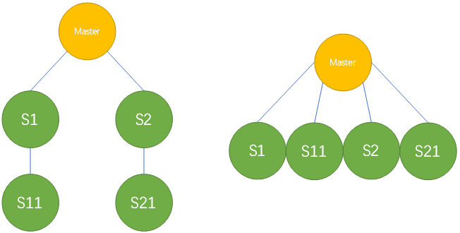

[TOC]

# 实验：非GTID 级联复制架构变为一主多从（M-nS）

- GTID模式应该不用多说了，太简单了。

- 非GTID的传统模式：
  - 设想：
    1. 级联复制S1 stop slave sql_thread
    2. 等待后续级联节点追平S1
    3. 后续级联节点根据S1的slave status，进行change master
    4. 启动所有slave



## 环境信息

|  192.168.188.101  |  3000  |  master   |
| ----------------- | ------ | --------- |
|                   |  7100  |  slave1   |
|                   |  7110  |  slave11  |
|                   |  7200  |  slave2   |
|                   |  7210  |  slave21  |

## 实验设想

|  192.168.188.101  |  3000  |  master  |
| ----------------- | ------ | -------- |
|                   |  7100  |  slave1  |
|                   |  7110  |  slave3  |
|                   |  7200  |  slave2  |
|                   |  7210  |  slave4  |


## 记录下master的pos

```
mysql> show master status;
+------------------+----------+--------------+------------------+--------------------------------------------+
| File       | Position | Binlog_Do_DB | Binlog_Ignore_DB | Executed_Gtid_Set             |
+------------------+----------+--------------+------------------+--------------------------------------------+
| mysql-bin.000001 |  349717 |       |         | 9d909434-5d3b-11ea-9363-000c29f0aa33:1-972 |
+------------------+----------+--------------+------------------+--------------------------------------------+
1 row in set (0.00 sec)
```

记下来，这个pos就是slave开始复制的位置。


## 通过xtrabackup备份创建从库

```
[root@mysqlvm1 ~]# innobackupex --defaults-file=/data/mysql/mysql3000/my3000.cnf -uroot -pmysql --no-timestamp /data/backup/mds_`date +%Y%m%d`

[root@mysqlvm1 mysql]# mkdir -pv mysql7{1,2}{0,1}0/{logs,data,tmp}
 
cp mysql3000/my3000.cnf mysql7100/my7100.cnf
cp mysql3000/my3000.cnf mysql7110/my7110.cnf
cp mysql3000/my3000.cnf mysql7200/my7200.cnf
cp mysql3000/my3000.cnf mysql7210/my7210.cnf
 
[root@mysqlvm1 mysql]# vi mysql7100/my7100.cnf mysql7110/my7110.cnf mysql7200/my7200.cnf mysql7210/my7210.cnf
 
[root@mysqlvm1 mysql]# innobackupex --apply-log /data/backup/mds_20200303/
 
 innobackupex --defaults-file=/data/mysql/mysql7100/my7100.cnf --copy-back /data/backup/mds_20200303/
 innobackupex --defaults-file=/data/mysql/mysql7110/my7110.cnf --copy-back /data/backup/mds_20200303/
 innobackupex --defaults-file=/data/mysql/mysql7210/my7210.cnf --copy-back /data/backup/mds_20200303/
 innobackupex --defaults-file=/data/mysql/mysql7200/my7200.cnf --copy-back /data/backup/mds_20200303/
 
[root@mysqlvm1 mysql]# pwd
/data/mysql
[root@mysqlvm1 mysql]# chown mysql.mysql -R ./*
```


### 启动从库，并配置级联主从架构

```
[root@mysqlvm1 ~]# mysqld --defaults-file=/data/mysql/mysql7100/my7100.cnf &
[1] 9726
[root@mysqlvm1 ~]# mysqld --defaults-file=/data/mysql/mysql7110/my7110.cnf &
[2] 9754
[root@mysqlvm1 ~]# mysqld --defaults-file=/data/mysql/mysql7210/my7210.cnf &
[3] 9782
[root@mysqlvm1 ~]# mysqld --defaults-file=/data/mysql/mysql7200/my7200.cnf &
[4] 9810
```


#### 思路

由于当前master的pos已经被记录，且通过xtrabackup恢复后，从库master都为初始值（无binlog），那么将7110 配置给7100 ， 7210配置给7200，然后再将7100和7200配置到master，完成级联主从架构的配置。


##### 配置7110

- S1（7100）的日志位置，用来配置S11（7110）的master。

```
[7100]mysql> show master status;
+------------------+----------+--------------+------------------+-------------------+
| File       | Position | Binlog_Do_DB | Binlog_Ignore_DB | Executed_Gtid_Set |
+------------------+----------+--------------+------------------+-------------------+
| mysql-bin.000001 |   154 |       |         |          |
+------------------+----------+--------------+------------------+-------------------+
1 row in set (0.01 sec)
```
- 配置S11的master
```
[7110]mysql> change master to master_host='192.168.188.101',master_port=7100,master_user='rep',master_password='rep',master_log_file='mysql-bin.000001',master_log_pos=154;
Query OK, 0 rows affected, 2 warnings (0.07 sec)
```

- 开启半同步
```
[7110]mysql> set global rpl_semi_sync_slave_enabled=1;
Query OK, 0 rows affected (0.00 sec)
 
[7110]mysql> start slave;
Query OK, 0 rows affected (0.06 sec)
```

- 完成S11-S1的复制架构配置。

``` 
[7110]mysql> show slave status\G
*************************** 1. row ***************************
        Slave_IO_State: Waiting for master to send event
         Master_Host: 192.168.188.101
         Master_User: rep
         Master_Port: 7100
        Connect_Retry: 60
       Master_Log_File: mysql-bin.000001
     Read_Master_Log_Pos: 154
        Relay_Log_File: mysqlvm1-relay-bin.000002
        Relay_Log_Pos: 320
    Relay_Master_Log_File: mysql-bin.000001
       Slave_IO_Running: Yes
      Slave_SQL_Running: Yes
         Skip_Counter: 0
     Exec_Master_Log_Pos: 154
       Relay_Log_Space: 530
    Seconds_Behind_Master: 0
Master_SSL_Verify_Server_Cert: No
        Last_IO_Errno: 0
        Last_IO_Error: 
        Last_SQL_Errno: 0
        Last_SQL_Error: 
 Replicate_Ignore_Server_Ids: 
       Master_Server_Id: 10247100
         Master_UUID: de034ce4-5d63-11ea-b53b-000c29f0aa33
       Master_Info_File: mysql.slave_master_info
          SQL_Delay: 0
     SQL_Remaining_Delay: NULL
   Slave_SQL_Running_State: Slave has read all relay log; waiting for more updates
1 row in set (0.03 sec)
```

##### 配置7210

​      同理。

##### 主库开始自动事务

​	此时突然想到，应该让master继续产生事务才好玩。

```
[root@mysqlvm1 m4s_20200303]# while : ;do echo "insert into m4s.tb1(infos) values(substring(MD5(RAND()),1,20));" |mysql -S /data/mysql/mysql3000/tmp/mysql.sock -pmysql ;sleep 10 ;done 
```

##### 配置7100

​    根据刚开始拿到的master pos信息mysql-bin.000001 |  349717 配置S1的复制

```
[7100]mysql> change master to master_host='192.168.188.101',master_port=3000,master_user='rep',master_password='rep',master_log_file='mysql-bin.000001',master_log_pos=349717;
Query OK, 0 rows affected, 2 warnings (0.11 sec)
 
[7100]mysql> show master status;
+------------------+----------+--------------+------------------+-------------------+
| File       | Position | Binlog_Do_DB | Binlog_Ignore_DB | Executed_Gtid_Set |
+------------------+----------+--------------+------------------+-------------------+
| mysql-bin.000001 |   154 |       |         |          |
+------------------+----------+--------------+------------------+-------------------+
1 row in set (0.04 sec)
 
[7100]mysql> set global rpl_semi_sync_slave_enabled=1;
Query OK, 0 rows affected (0.00 sec)
 
[7100]mysql> set global rpl_semi_sync_master_enabled=1;
Query OK, 0 rows affected (0.00 sec)
```

- 启动复制，开始追master
```
[7100]mysql> start slave;
Query OK, 0 rows affected (0.07 sec)
 
[7100]mysql> show master status;
+------------------+----------+--------------+------------------+----------------------------------------------+
| File       | Position | Binlog_Do_DB | Binlog_Ignore_DB | Executed_Gtid_Set              |
+------------------+----------+--------------+------------------+----------------------------------------------+
| mysql-bin.000001 |   4769 |       |         | 9d909434-5d3b-11ea-9363-000c29f0aa33:973-985 |
+------------------+----------+--------------+------------------+----------------------------------------------+
1 row in set (0.10 sec)
```

- 此时查询master、7100、7110
```
mysql> select count(*) from m4s.tb1;
+----------+
| count(*) |
+----------+
|   993 |
+----------+
1 row in set (0.04 sec)
```

##### 配置7200

​    同理，与7100配置方式一样。

##### 完成配置

- master可以看到有两个半同步client啦~ （S1 和 S2）

```
[master]mysql> show global status like '%semi%';
+--------------------------------------------+--------+
| Variable_name                              | Value  |
+--------------------------------------------+--------+
| Rpl_semi_sync_master_clients               | 2      |
| Rpl_semi_sync_master_net_avg_wait_time     | 0      |
| Rpl_semi_sync_master_net_wait_time         | 0      |
| Rpl_semi_sync_master_net_waits             | 1296   |
| Rpl_semi_sync_master_no_times              | 1      |
| Rpl_semi_sync_master_no_tx                 | 173    |
| Rpl_semi_sync_master_status                | ON     |
| Rpl_semi_sync_master_timefunc_failures     | 0      |
| Rpl_semi_sync_master_tx_avg_wait_time      | 695    |
| Rpl_semi_sync_master_tx_wait_time          | 581087 |
| Rpl_semi_sync_master_tx_waits              | 835    |
| Rpl_semi_sync_master_wait_pos_backtraverse | 0      |
| Rpl_semi_sync_master_wait_sessions         | 0      |
| Rpl_semi_sync_master_yes_tx                | 835    |
| Rpl_semi_sync_slave_status                 | OFF    |
+--------------------------------------------+--------+
15 rows in set (0.00 sec)
```

- S1可以看到自己有一个半同步client （S11） ，并且自己也是半同步的client。
```
[7100]mysql> show global status like '%semi%';
+--------------------------------------------+-------+
| Variable_name               | Value |
+--------------------------------------------+-------+
| Rpl_semi_sync_master_clients        | 1   |
| Rpl_semi_sync_master_net_avg_wait_time   | 0   |
| Rpl_semi_sync_master_net_wait_time     | 0   |
| Rpl_semi_sync_master_net_waits       | 1   |
| Rpl_semi_sync_master_no_times       | 0   |
| Rpl_semi_sync_master_no_tx         | 0   |
| Rpl_semi_sync_master_status        | ON  |
| Rpl_semi_sync_master_timefunc_failures   | 0   |
| Rpl_semi_sync_master_tx_avg_wait_time   | 533  |
| Rpl_semi_sync_master_tx_wait_time     | 533  |
| Rpl_semi_sync_master_tx_waits       | 1   |
| Rpl_semi_sync_master_wait_pos_backtraverse | 0   |
| Rpl_semi_sync_master_wait_sessions     | 0   |
| Rpl_semi_sync_master_yes_tx        | 1   |
| Rpl_semi_sync_slave_status         | ON  |
+--------------------------------------------+-------+
15 rows in set (0.00 sec)
```

- S2可以看到自己有一个半同步client （S21） ，并且自己也是半同步的client。
```
[7200]mysql> show global status like '%semi%';
+--------------------------------------------+-------+
| Variable_name               | Value |
+--------------------------------------------+-------+
| Rpl_semi_sync_master_clients        | 1   |
| Rpl_semi_sync_master_net_avg_wait_time   | 0   |
| Rpl_semi_sync_master_net_wait_time     | 0   |
| Rpl_semi_sync_master_net_waits       | 1   |
| Rpl_semi_sync_master_no_times       | 0   |
| Rpl_semi_sync_master_no_tx         | 0   |
| Rpl_semi_sync_master_status        | ON  |
| Rpl_semi_sync_master_timefunc_failures   | 0   |
| Rpl_semi_sync_master_tx_avg_wait_time   | 273  |
| Rpl_semi_sync_master_tx_wait_time     | 273  |
| Rpl_semi_sync_master_tx_waits       | 1   |
| Rpl_semi_sync_master_wait_pos_backtraverse | 0   |
| Rpl_semi_sync_master_wait_sessions     | 0   |
| Rpl_semi_sync_master_yes_tx        | 1   |
| Rpl_semi_sync_slave_status         | ON  |
+--------------------------------------------+-------+
15 rows in set (0.00 sec)
```

 

# 开始实验

## 重述思路：

1. 级联复制S1实例 stop slave sql_thread

2. 等待后续级联节点S11追平S1

3. 后续级联节点S11根据S1的slave status里的exec_pos 和filename，进行change master to Master，附带pos和filename

4. 启动S11 slave， 此时S11应该和Master进行了复制

5. 启动S1 slave sql_thread，此时S1和S11已经是平行关系，不再是级联。

6. 同理，S2级联分支也从步骤1-5做一遍。

 

### 1. 停止S1（7100）实例的slave sql_thread

```
[7100]mysql> stop slave sql_thread;
Query OK, 0 rows affected (0.01 sec)
 
获取到S1的master status，主要是为了拿file和pos，来确认S11已经追平了S1。
 
[7100]mysql> show master status;
+------------------+----------+--------------+------------------+-----------------------------------------------+
| File       | Position | Binlog_Do_DB | Binlog_Ignore_DB | Executed_Gtid_Set               |
+------------------+----------+--------------+------------------+-----------------------------------------------+
| mysql-bin.000001 |  23939 |       |         | 9d909434-5d3b-11ea-9363-000c29f0aa33:973-1039 |
+------------------+----------+--------------+------------------+-----------------------------------------------+
1 row in set (0.00 sec)
 
获取到S1 rep master的file和pos，用来为S11 change master 提供依据。
 
[7100]mysql> show slave status\G
*************************** 1. row ***************************
        Slave_IO_State: Waiting for master to send event
         Master_Host: 192.168.188.101
         Master_User: rep
         Master_Port: 3000
        Connect_Retry: 60
       Master_Log_File: mysql-bin.000001
     Read_Master_Log_Pos: 374197
        Relay_Log_File: mysqlvm1-relay-bin.000003
        Relay_Log_Pos: 12240
    Relay_Master_Log_File: mysql-bin.000001
       Slave_IO_Running: Yes
      Slave_SQL_Running: No
          Last_Errno: 0
          Last_Error: 
         Skip_Counter: 0
     Exec_Master_Log_Pos: 373837          --------# 应该用这个！
       Relay_Log_Space: 25216
```

 

### 2. 查看S11（7110）实例的复制状态

```
[7110]mysql> show master status;
+------------------+----------+--------------+------------------+-----------------------------------------------+
| File       | Position | Binlog_Do_DB | Binlog_Ignore_DB | Executed_Gtid_Set               |
+------------------+----------+--------------+------------------+-----------------------------------------------+
| mysql-bin.000001 |  23939 |       |         | 9d909434-5d3b-11ea-9363-000c29f0aa33:973-1039 |
+------------------+----------+--------------+------------------+-----------------------------------------------+
1 row in set (0.00 sec)
 
[7110]mysql> show slave status\G
*************************** 1. row ***************************
        Slave_IO_State: Waiting for master to send event
         Master_Host: 192.168.188.101
         Master_User: rep
         Master_Port: 7100
        Connect_Retry: 60
       Master_Log_File: mysql-bin.000001
     Read_Master_Log_Pos: 23939
        Relay_Log_File: mysqlvm1-relay-bin.000002
        Relay_Log_Pos: 24105
    Relay_Master_Log_File: mysql-bin.000001
       Slave_IO_Running: Yes
      Slave_SQL_Running: Yes
     Exec_Master_Log_Pos: 23939
       Relay_Log_Space: 24315
       Master_Server_Id: 10247100
         Master_UUID: de034ce4-5d63-11ea-b53b-000c29f0aa33
       Master_Info_File: mysql.slave_master_info
          SQL_Delay: 0
     SQL_Remaining_Delay: NULL
   Slave_SQL_Running_State: Slave has read all relay log; waiting for more updates
 
至此，确定S11已经追平了S1，可以开始调整S11了。
```

### 3. 调整7110的change master

```
停止S11的slave
[7110]mysql> stop slave;
Query OK, 0 rows affected (0.01 sec)
 
根据之前查到的S1的停止pos，为S11配置change master
 
[7110]mysql> change master to master_host='192.168.188.101',master_port=3000,master_user='rep',master_password='rep',master_log_file='mysql-bin.000001',master_log_pos=374197;
Query OK, 0 rows affected, 2 warnings (0.01 sec)
Exec_Master_Log_Pos: 373837   --------# 应该用这个！但是竟然也过了……好神奇。


启动slave，可以看到已经变更完成。
 
[7110]mysql> start slave;
Query OK, 0 rows affected (0.00 sec)
 
[7110]mysql> show slave status\G
*************************** 1. row ***************************
        Slave_IO_State: Waiting for master to send event
         Master_Host: 192.168.188.101
         Master_User: rep
         Master_Port: 3000
        Connect_Retry: 60
       Master_Log_File: mysql-bin.000001
     Read_Master_Log_Pos: 383197
        Relay_Log_File: mysqlvm1-relay-bin.000002
        Relay_Log_Pos: 9320
    Relay_Master_Log_File: mysql-bin.000001
       Slave_IO_Running: Yes
      Slave_SQL_Running: Yes
     Exec_Master_Log_Pos: 383197
       Relay_Log_Space: 9530
       Until_Condition: None
       Master_Server_Id: 10243000
         Master_UUID: 9d909434-5d3b-11ea-9363-000c29f0aa33
       Master_Info_File: mysql.slave_master_info
          SQL_Delay: 0
     SQL_Remaining_Delay: NULL
   Slave_SQL_Running_State: Slave has read all relay log; waiting for more updates
      Master_Retry_Count: 86400
1 row in set (0.01 sec)
 
```

### 4. 检查一下master、7110、7100的数据

```
[master]mysql> select count(*) from m4s.tb1;
+----------+
| count(*) |
+----------+
|   1072 |
+----------+
1 row in set (0.00 sec)
 
[7100]mysql> select count(*) from m4s.tb1;
+----------+
| count(*) |
+----------+
|   1037 |
+----------+
1 row in set (0.00 sec)
 
[7110]mysql> select count(*) from m4s.tb1;
+----------+
| count(*) |
+----------+
|   1072 |
+----------+
1 row in set (0.00 sec)
 
说明S11和master已经好上了~
 
```

### 5. S1（7100）启动slave sql_thread

```
[7100]mysql> start slave sql_thread;
Query OK, 0 rows affected, 1 warning (0.00 sec)
 
此时看master，发现3个半同步client了噢
 
[master]mysql> show global status like '%semi%';
+--------------------------------------------+--------+
| Variable_name               | Value |
+--------------------------------------------+--------+
| Rpl_semi_sync_master_clients        | 3   |
| Rpl_semi_sync_master_net_avg_wait_time   | 0   |
| Rpl_semi_sync_master_net_wait_time     | 0   |
| Rpl_semi_sync_master_net_waits       | 1474  |
| Rpl_semi_sync_master_no_times       | 1   |
| Rpl_semi_sync_master_no_tx         | 173  |
| Rpl_semi_sync_master_status        | ON   |
| Rpl_semi_sync_master_timefunc_failures   | 0   |
| Rpl_semi_sync_master_tx_avg_wait_time   | 683  |
| Rpl_semi_sync_master_tx_wait_time     | 629093 |
| Rpl_semi_sync_master_tx_waits       | 920  |
| Rpl_semi_sync_master_wait_pos_backtraverse | 0   |
| Rpl_semi_sync_master_wait_sessions     | 0   |
| Rpl_semi_sync_master_yes_tx        | 920  |
| Rpl_semi_sync_slave_status         | OFF  |
+--------------------------------------------+--------+
15 rows in set (0.00 sec)
```

### 6.同理同理，调整S21（7210）和S2（7200）的配置

停止S2的slave

```
[7200]mysql> stop slave sql_thread;
Query OK, 0 rows affected (0.01 sec)
 
[7200]mysql> select count(*) from m4s.tb1;
+----------+
| count(*) |
+----------+
|   1099 |
+----------+
1 row in set (0.00 sec)
 
[7200]mysql> show master status;
+------------------+----------+--------------+------------------+-----------------------------------------------+
| File       | Position | Binlog_Do_DB | Binlog_Ignore_DB | Executed_Gtid_Set               |
+------------------+----------+--------------+------------------+-----------------------------------------------+
| mysql-bin.000001 |  45949 |       |         | 9d909434-5d3b-11ea-9363-000c29f0aa33:973-1101 |
+------------------+----------+--------------+------------------+-----------------------------------------------+
1 row in set (0.00 sec)
 
[7200]mysql> show slave status\G
*************************** 1. row ***************************
        Slave_IO_State: Waiting for master to send event
         Master_Host: 192.168.188.101
         Master_User: rep
         Master_Port: 3000
        Connect_Retry: 60
       Master_Log_File: mysql-bin.000001
     Read_Master_Log_Pos: 397597
        Relay_Log_File: mysqlvm1-relay-bin.000003
        Relay_Log_Pos: 34200
    Relay_Master_Log_File: mysql-bin.000001
       Slave_IO_Running: Yes
      Slave_SQL_Running: No
     Exec_Master_Log_Pos: 396157
       Relay_Log_Space: 48616
       Until_Condition: None
       Master_Server_Id: 10243000
         Master_UUID: 9d909434-5d3b-11ea-9363-000c29f0aa33
1 row in set (0.00 sec)
 
确认S21已经追平S2
 
[7210]mysql> show master status;
+------------------+----------+--------------+------------------+-----------------------------------------------+
| File       | Position | Binlog_Do_DB | Binlog_Ignore_DB | Executed_Gtid_Set               |
+------------------+----------+--------------+------------------+-----------------------------------------------+
| mysql-bin.000001 |   45949 |       |         | 9d909434-5d3b-11ea-9363-000c29f0aa33:973-1101 |
+------------------+----------+--------------+------------------+-----------------------------------------------+
1 row in set (0.00 sec)
 
[7210]mysql> stop slave;
Query OK, 0 rows affected (0.00 sec)
```

- 根据前面查询的信息为S21 change master
    ```
    [7210]mysql> change master to master_host='192.168.188.101',master_port=3000,master_user='rep',master_password='rep',master_log_file='mysql-bin.000001',master_log_pos=396157;
    Query OK, 0 rows affected, 2 warnings (0.01 sec)
    ```

- 启动S21的slave
    ```
    [7210]mysql> start slave;
    Query OK, 0 rows affected (0.01 sec)

    [7210]mysql> show slave status\G
    *************************** 1. row ***************************
            Slave_IO_State: Waiting for master to send event
             Master_Host: 192.168.188.101
             Master_User: rep
             Master_Port: 3000
            Connect_Retry: 60
           Master_Log_File: mysql-bin.000001
         Read_Master_Log_Pos: 400117
            Relay_Log_File: mysqlvm1-relay-bin.000002
            Relay_Log_Pos: 4280
        Relay_Master_Log_File: mysql-bin.000001
           Slave_IO_Running: Yes
          Slave_SQL_Running: Yes
         Exec_Master_Log_Pos: 400117
           Relay_Log_Space: 4490
           Master_Server_Id: 10243000
             Master_UUID: 9d909434-5d3b-11ea-9363-000c29f0aa33
           Master_Info_File: mysql.slave_master_info
              SQL_Delay: 0
         SQL_Remaining_Delay: NULL
       Slave_SQL_Running_State: Slave has read all relay log; waiting for more updates
          Master_Retry_Count: 86400
             Master_Bind: 
       Last_IO_Error_Timestamp: 
       Last_SQL_Error_Timestamp: 
            Master_SSL_Crl: 
          Master_SSL_Crlpath: 
          Retrieved_Gtid_Set: 9d909434-5d3b-11ea-9363-000c29f0aa33:1102-1112
          Executed_Gtid_Set: 9d909434-5d3b-11ea-9363-000c29f0aa33:973-1112
            Auto_Position: 0
         Replicate_Rewrite_DB: 
             Channel_Name: 
          Master_TLS_Version: 
    1 row in set (0.00 sec)
    ```

- 对比一下S21和master
    ```
    [7210]mysql> select count(*) from m4s.tb1;
    +----------+
    | count(*) |
    +----------+
    |   1125 |
    +----------+
    1 row in set (0.00 sec)

    [master]mysql> select count(*) from m4s.tb1;
    +----------+
    | count(*) |
    +----------+
    |   1125 |
    +----------+
    1 row in set (0.00 sec)

    [7210]mysql> show master status;
    +------------------+----------+--------------+------------------+-----------------------------------------------+
    | File       | Position | Binlog_Do_DB | Binlog_Ignore_DB | Executed_Gtid_Set               |
    +------------------+----------+--------------+------------------+-----------------------------------------------+
    | mysql-bin.000001 |  56954 |       |         | 9d909434-5d3b-11ea-9363-000c29f0aa33:973-1132 |
    +------------------+----------+--------------+------------------+-----------------------------------------------+
    1 row in set (0.00 sec)

    [master]mysql> show master status;
    +------------------+----------+--------------+------------------+---------------------------------------------+
    | File       | Position | Binlog_Do_DB | Binlog_Ignore_DB | Executed_Gtid_Set              |
    +------------------+----------+--------------+------------------+---------------------------------------------+
    | mysql-bin.000001 |  407317 |       |         | 9d909434-5d3b-11ea-9363-000c29f0aa33:1-1132 |
    +------------------+----------+--------------+------------------+---------------------------------------------+
    1 row in set (0.00 sec)
    ```

- 对比成功，接下来启动S2的sql_thread
    ```
    [7200]mysql> start slave sql_thread;
    Query OK, 0 rows affected (0.00 sec)
    ```

- master再看一下，这回4个半同步client了
    ```
    [master]mysql> show global status like '%semi%';
    +--------------------------------------------+--------+
    | Variable_name               | Value |
    +--------------------------------------------+--------+
    | Rpl_semi_sync_master_clients        | 4   |
    | Rpl_semi_sync_master_net_avg_wait_time   | 0   |
    | Rpl_semi_sync_master_net_wait_time     | 0   |
    | Rpl_semi_sync_master_net_waits       | 1707  |
    | Rpl_semi_sync_master_no_times       | 1   |
    | Rpl_semi_sync_master_no_tx         | 173  |
    | Rpl_semi_sync_master_status        | ON   |
    | Rpl_semi_sync_master_timefunc_failures   | 0   |
    | Rpl_semi_sync_master_tx_avg_wait_time   | 706  |
    | Rpl_semi_sync_master_tx_wait_time     | 697624 |
    | Rpl_semi_sync_master_tx_waits       | 987  |
    | Rpl_semi_sync_master_wait_pos_backtraverse | 0   |
    | Rpl_semi_sync_master_wait_sessions     | 0   |
    | Rpl_semi_sync_master_yes_tx        | 987  |
    | Rpl_semi_sync_slave_status         | OFF  |
    +--------------------------------------------+--------+
    15 rows in set (0.00 sec)
    ```
数据对比就不做了， 因为一样。


实验结束，设想成立！