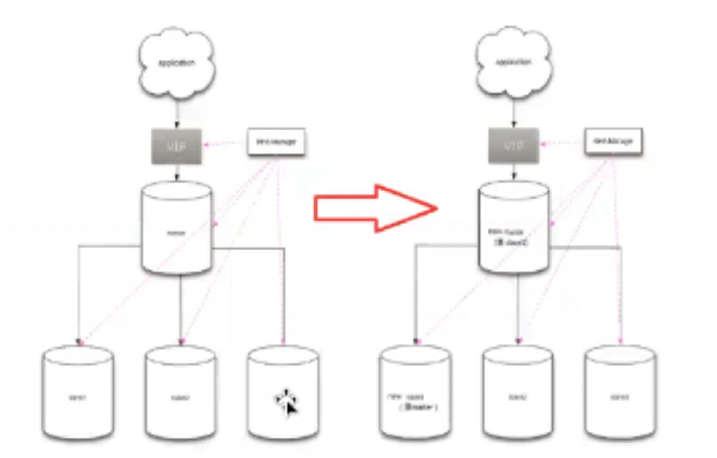

[TOC]

# MHA 切换原理

## MHA failover原理

不考虑binlogserver，大致流程为：

1. 确定master是不是死掉了

2. 在slave上二次探测master是不是死掉了

3. master存活的话，拉取master上的binlog。死掉的话跳过这一步

4. 识别含有最新更新的slave

5. 应用slave之间差异的relay_log。

   > 原则为：谁的relay_log最多，就用谁的relay_log。这时候slave的数据是一致的

6. 应用master上拉取的binlog

   > 当slave上数据一致了，就用slave上的pos找master上的binlog位置

7. 建立新的master
8. change master to 新master


## MHA 在线不丢数据切换

### 自动切换原理

剪辑传送门： [在线切换](剪辑：MySQL高可用架构MHA原理与搭建.md)

- MHA在线切换的大概过程：

    1. 检测复制设置和确定当前主服务器
    2. 确定新的主服务器 
    3. 阻塞写入到当前主服务器
    4. 等待所有从服务器赶上复制
    5. 授予写入到新的主服务器
    6. 重新设置从服务器 

- 注意，在线切换的时候应用架构需要考虑以下两个问题： 

    1. 自动识别master和slave的问题（master的机器可能会切换），如果采用了vip的方式，基本可以解决这个问题。 
    2. 负载均衡的问题（可以定义大概的读写比例，每台机器可承担的负载比例，当有机器离开集群时，需要考虑这个问题）


- 为了保证数据完全一致性，在最快的时间内完成切换，MHA的在线切换必须满足以下条件才会切换成功，否则会切换失败。

    1. 所有slave的IO线程都在运行 
    2. 所有slave的SQL线程都在运行 
    3. 所有的show slave status的输出中`Seconds_Behind_Master`参数小于或者等于`running_updates_limit`秒，如果在切换过程中不指定`running_updates_limit`,那么默认情况下`running_updates_limit`为1秒。 
    4. 在master端，通过show processlist输出，没有一个更新花费的时间大于running_updates_limit秒。

    - 通常使用在需要对Maaster进行维护等场景时，Master在计划内下线。

- 在线切换会调用master_ip_online_change_script定义的脚本，这个脚本可以定义几件事：

    1. 把服务account密码修改（拒绝应用系统以服务account登录数据库）
    2. 停掉所有连接进数据库的连接
    3. 将master设置为`read_only=1` & `super_read_only=1`;
    > 早期版本没有super_read_only参数，当具备super权限的账户访问数据库时，read_only=1形同虚设，依然可以被该账户写操作。
    
    4. 确认所有slave都正常工作，且都已经追上master的binlog。
    5. 如果存在延迟，是不允许切换的，需要处理好回退。
       - 或者注意一下，先别改密码。
       - 这个延迟也可以通过--running_updates_limit定义

    6. 根据参数定义，决定是否把原来的master作为一个新的slave，加入到主从复制。
    7. 把其他slave都连接到新的master上
    8. 新的master是否有服务account？（修复）
    9. 新库上是不是接管vip

 



 

 

### 手动切换

如果是手动切换的话，逻辑其实是一样的：

1. master drop  vip
2. master change service account     password
3. master kill application     connections
4. slave 追master
5. 选择新的master角色
6. 其他slave 进行change master，切换到新master
7. 新master接管vip
8. 原master是否加入复制集群中


## master_ip_failover  脚本分析

### Phase 2

```
/etc/masterha/master_ip_failover --orig_master_host=192.168.188.202 --orig_master_ip=192.168.188.202 --orig_master_port=3306 --command=stopssh --ssh_user=root
```

### Phase 3.3

```
/etc/masterha/master_ip_failover --command=start --ssh_user=root --orig_master_host=192.168.188.202 --orig_master_ip=192.168.188.202 --orig_master_port=3306 --new_master_host=192.168.188.201 --new_master_ip=192.168.188.201 --new_master_port=3306 --new_master_user='kk'  --new_master_password=xxx

**Set read_only=0 on the new master.**
```


### /etc/masterha/master_ip_failover

```
sub main {
if ( $command eq "stop" || $command eq "stopssh" ) {

# $orig_master_host, $orig_master_ip, $orig_master_port are passed.
# If you manage master ip address at global catalog database,
# invalidate orig_master_ip here.
my $exit_code = 1;
eval {

# updating global catalog, etc
$exit_code = 0;
};
if ($@) {
warn "Got Error: $@\n";
exit $exit_code;
}
exit $exit_code;
}

elsif ( $command eq "start" ) {

# all arguments are passed.
# If you manage master ip address at global catalog database,
# activate new_master_ip here.
# You can also grant write access (create user, set read_only=0, etc) here.
my $exit_code = 10;
eval {
my $new_master_handler = new MHA::DBHelper();
↑需要关注

# args: hostname, port, user, password, raise_error_or_not
$new_master_handler->connect( $new_master_ip, $new_master_port,
$new_master_user, $new_master_password, 1 );
↑需要关注

## Set read_only=0 on the new master
$new_master_handler->disable_log_bin_local();
↑需要关注

print "Set read_only=0 on the new master.\n";
$new_master_handler->disable_read_only();

## Creating an app user on the new master
#print "Creating app user on the new master..\n";
#FIXME_xxx_create_user( $new_master_handler->{dbh} );
$new_master_handler->enable_log_bin_local();
$new_master_handler->disconnect();
↑需要关注

## Update master ip on the catalog database, etc
&add_vip();
$exit_code = 0;
};
if ($@) {
warn $@;

# If you want to continue failover, exit 10.
exit $exit_code;
}
exit $exit_code;
}
elsif ( $command eq "status" ) {

# do nothing
exit 0;
}
else {
&usage();
exit 1;
}
}
```

> [root@mysqlvm1-4 ~]# rpm -ql mha4mysql-manager
>
> /usr/bin/masterha_check_repl
> /usr/bin/masterha_check_ssh
> /usr/bin/masterha_check_status
> /usr/bin/masterha_conf_host
> /usr/bin/masterha_manager
> /usr/bin/masterha_master_monitor
> /usr/bin/masterha_master_switch
> /usr/bin/masterha_secondary_check
> /usr/bin/masterha_stop
> /usr/share/man/man1/masterha_check_repl.1.gz
> /usr/share/man/man1/masterha_check_ssh.1.gz
> /usr/share/man/man1/masterha_check_status.1.gz
> /usr/share/man/man1/masterha_conf_host.1.gz
> /usr/share/man/man1/masterha_manager.1.gz
> /usr/share/man/man1/masterha_master_monitor.1.gz
> /usr/share/man/man1/masterha_master_switch.1.gz
> /usr/share/man/man1/masterha_secondary_check.1.gz
> /usr/share/man/man1/masterha_stop.1.gz
> /usr/share/perl5/vendor_perl/MHA/Config.pm
> /usr/share/perl5/vendor_perl/MHA/**<font color=red>DBHelper.pm</font>**
> /usr/share/perl5/vendor_perl/MHA/FileStatus.pm
> /usr/share/perl5/vendor_perl/MHA/HealthCheck.pm
> /usr/share/perl5/vendor_perl/MHA/ManagerAdmin.pm
> /usr/share/perl5/vendor_perl/MHA/ManagerAdminWrapper.pm
> /usr/share/perl5/vendor_perl/MHA/ManagerConst.pm
> /usr/share/perl5/vendor_perl/MHA/ManagerUtil.pm
> /usr/share/perl5/vendor_perl/MHA/MasterFailover.pm
> /usr/share/perl5/vendor_perl/MHA/MasterMonitor.pm
> /usr/share/perl5/vendor_perl/MHA/MasterRotate.pm
> /usr/share/perl5/vendor_perl/MHA/SSHCheck.pm
> /usr/share/perl5/vendor_perl/MHA/Server.pm
> /usr/share/perl5/vendor_perl/MHA/ServerManager.pm


### /usr/share/perl5/vendor_perl/MHA/DBHelper.pm
    会发现mha的秘密——所有的命令都在这里配置！ 
    所以就知道每一动作调用了什么参数，参数的定义是什么。

```
……
use constant Unset_Readonly_SQL => "SET GLOBAL read_only=0";

use constant Set_Readonly_SQL => "SET GLOBAL read_only=1";
……
```


## 关于MHA的arping动作的目的

- 绑定vip后可以进行一下arping，作为arp广播
    ```
    arping -c 5 -s $ip $gateway
    ```

- 多个设备同时进行arping广播时， 最后完成arping的那个设备广播，会被网关记录生效。（最后发起广播的生效）