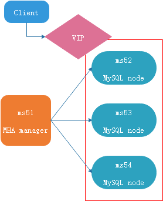

[TOC]

# 环境信息

| hostname | hostIP            | 角色                |
| -------- | ----------------- | ------------------- |
| ms51     | 192.168.188.51/24 | mha-manager,nomysql |
| ms52     | 192.168.188.52/24 | node                |
| ms53     | 192.168.188.53/24 | node                |
| ms54     | 192.168.188.54/24 | node                |
| --       | 192.168.188.50/32 | vip                 |

 

# 配置主从复制

步骤略。

```
mysql> create user rep@'%' identified by "rep";
mysql> grant replication slave on *.* to rep@'%';
mysql> install plugin rpl_semi_sync_master soname 'semisync_master.so';install plugin rpl_semi_sync_slave soname 'semisync_slave.so';
mysql> set global rpl_semi_sync_slave_enabled=1;


mysql> show slave hosts;
...

mysql> set global rpl_semi_sync_master_enabled=1;
```


# 安装MHA

> github
>
> https://github.com/yoshinorim/mha4mysql-node
>
> https://github.com/yoshinorim/mha4mysql-manager

- 可能会用到epel源
- 理论上集群内每一个节点都要安装mha-node
- manager角色需要先安装mha-node，再安装mha-manager
- 不过现在多数时候只使用mha的切换逻辑，并不需要mha-node对binlog做什么，因此在这种场景下，只需要mha-manager安装部署node和manager包， 就可以管理其他DB，其他DB节点无需安装node。


## 安装依赖

```
[ms51]# yum install epel-release 

[ms51]# yum install perl-DBD-MySQL \
perl-Config-Tiny \
perl-Log-Dispatch \
perl-Parallel-ForkManager \
perl-Time-HiRes

# 装manager之前一定要装node，不然会缺失依赖。
[ms51]# yum localinstall mha4mysql-node-0.58-0.el7.centos.noarch.rpm
[ms51]# yum localinstall mha4mysql-manager-0.58-0.el7.centos.noarch.rpm
```

### 查看manager的安装情况

```
root@ms51:mha # rpm -ql mha4mysql-manager
/usr/bin/masterha_check_repl
/usr/bin/masterha_check_ssh
/usr/bin/masterha_check_status
/usr/bin/masterha_conf_host
/usr/bin/masterha_manager
/usr/bin/masterha_master_monitor
/usr/bin/masterha_master_switch
/usr/bin/masterha_secondary_check
/usr/bin/masterha_stop
/usr/share/man/man1/masterha_check_repl.1.gz
/usr/share/man/man1/masterha_check_ssh.1.gz
/usr/share/man/man1/masterha_check_status.1.gz
/usr/share/man/man1/masterha_conf_host.1.gz
/usr/share/man/man1/masterha_manager.1.gz
/usr/share/man/man1/masterha_master_monitor.1.gz
/usr/share/man/man1/masterha_master_switch.1.gz
/usr/share/man/man1/masterha_secondary_check.1.gz
/usr/share/man/man1/masterha_stop.1.gz
/usr/share/perl5/vendor_perl/MHA/Config.pm
/usr/share/perl5/vendor_perl/MHA/DBHelper.pm
/usr/share/perl5/vendor_perl/MHA/FileStatus.pm
/usr/share/perl5/vendor_perl/MHA/HealthCheck.pm
/usr/share/perl5/vendor_perl/MHA/ManagerAdmin.pm
/usr/share/perl5/vendor_perl/MHA/ManagerAdminWrapper.pm
/usr/share/perl5/vendor_perl/MHA/ManagerConst.pm
/usr/share/perl5/vendor_perl/MHA/ManagerUtil.pm
/usr/share/perl5/vendor_perl/MHA/MasterFailover.pm
/usr/share/perl5/vendor_perl/MHA/MasterMonitor.pm
/usr/share/perl5/vendor_perl/MHA/MasterRotate.pm
/usr/share/perl5/vendor_perl/MHA/SSHCheck.pm
/usr/share/perl5/vendor_perl/MHA/Server.pm
/usr/share/perl5/vendor_perl/MHA/ServerManager.pm

```

# 配置

1. 节点间配置SSH互信

   ```
   [16:46:09] root@ms51:~ # ssh-keygen
   [16:46:26] root@ms51:~ # ssh-copy-id -i ~/.ssh/id_rsa.pub ms52
   [16:46:36] root@ms51:~ # ssh-copy-id -i ~/.ssh/id_rsa.pub ms53
   [16:46:44] root@ms51:~ # ssh-copy-id -i ~/.ssh/id_rsa.pub ms54
   
   [16:47:44] root@ms52:~ # ssh-keygen && ssh-copy-id -i ~/.ssh/id_rsa.pub ms51 && ssh-copy-id -i ~/.ssh/id_rsa.pub ms53 && ssh-copy-id -i ~/.ssh/id_rsa.pub ms54
   
   [16:45:25] root@ms53:~ # ssh-keygen && ssh-copy-id -i ~/.ssh/id_rsa.pub ms51 && ssh-copy-id -i ~/.ssh/id_rsa.pub ms52 && ssh-copy-id -i ~/.ssh/id_rsa.pub ms54
   
   [16:44:43] root@ms54:~ # ssh-keygen && ssh-copy-id -i ~/.ssh/id_rsa.pub ms51 && ssh-copy-id -i ~/.ssh/id_rsa.pub ms52 && ssh-copy-id -i ~/.ssh/id_rsa.pub ms53
   
   ```

2. 在manager节点上编写配置文件 app1.conf

   > 配置文件内容可以参考wiki
   >
   > [Configuration](.\mha4mysql-manager_wiki\Configuration.md)
>
   > The below is an example configuration file.
   >
   > `manager_host$ cat /etc/app1.cnf`
   >     
   >
   >     [server default]
   >     # mysql user and password
   >     user=root
   >     password=mysqlpass
   >     # working directory on the manager
   >     manager_workdir=/var/log/masterha/app1
   >     # manager log file
   >     manager_log=/var/log/masterha/app1/app1.log
   >     # working directory on MySQL servers
   >     remote_workdir=/var/log/masterha/app1
   >     
   >     [server1]
   >     hostname=host1
   >     
   >     [server2]
   >     hostname=host2
   >     
   >     [server3]
   >     hostname=host3
   >
   > 
   
   ```
   # /data/mha/app1/app1.conf
   [server default]
   manager_workdir=/data/mha/app1
   manager_log=/data/mha/app1/app1.log
   # node上存放脚本什么的需要用到。
   remote_workdir=/data/mha/app1
   
   [server1]
   hostname=192.168.188.52
   port=3307
   candidate_master = 1
   check_repl_delay = 1 
   #master_binlog_dir =/data/mysql/mysql3307/logs
   
   [server2]
   hostname=192.168.188.53
   port=3307
   candidate_master = 1
   check_repl_delay = 1 
   #master_binlog_dir =/data/mysql/mysql3307/logs
   
   [server3]
   hostname=192.168.188.54
   port=3307
   candidate_master = 1
   check_repl_delay = 1 
   #master_binlog_dir =/data/mysql/mysql3307/logs
   
   ```
   
3. 在manager节点上编写配置文件default.conf

   > ### Global Configuration Example:
   >
   > > Global configuration file (/etc/masterha\_default.cnf)
   >
   >     [server default]
   >     user=root
   >     password=rootpass
   >     ssh_user=root
   >     master_binlog_dir= /var/lib/mysql
   >     remote_workdir=/data/log/masterha
   >     secondary_check_script= masterha_secondary_check -s remote_host1 -s remote_host2
   >     ping_interval=3
   >     master_ip_failover_script=/script/masterha/master_ip_failover
   >     shutdown_script= /script/masterha/power_manager
   >     report_script= /script/masterha/send_master_failover_mail
   >

   ```
   # /data/mha/app1/default.conf
   [server default]
   #MySQL的用户和密码
   user=root
   password=''
   
   #系统ssh用户
   ssh_user=root
   
   #复制用户
   repl_user=rep
   repl_password=rep
   
   
   #监控
   ping_interval=1
   #shutdown_script=""
   
   #切换调用的脚本
   master_ip_failover_script= /data/mha/app1/master_ip_failover
   master_ip_online_change_script= /data/mha/app1/master_ip_online_change
   ```

4. 通过模板配置master_ip_failover、master_ip_online_change

   > 模板在wiki，或源码包中，需要定义内容。
   >
   > 也可以直接用已经改好的。
   >
   > 配置好后需要给两脚本+x权限。
   >
   > 

5. 在所有node节点上配置自定义脚本init_vip.sh、drop_vip.sh

   > 配置好后需要给+x权限

   ```
   # init_vip.sh
   vip="192.168.188.50/32"
   /sbin/ip addr add $vip dev eth0
   
   # drop_vip.sh
   vip="192.168.188.50/32"
   /sbin/ip addr del $vip dev eth0
   ```

   

6. 检测节点SSH互信情况

   ```
   [17:24:15] root@ms51:app1 # masterha_check_ssh --global_conf=/data/mha/app1/default.conf --conf=/data/mha/app1/app1.conf
   ```

   > [17:24:15] root@ms51:app1 # masterha_check_ssh --global_conf=/data/mha/app1/default.conf --conf=/data/mha/app1/app1.conf
   > Wed Nov 11 17:24:25 2020 - [info] Reading default configuration from /data/mha/app1/default.conf..
   > Wed Nov 11 17:24:25 2020 - [info] Reading application default configuration from /data/mha/app1/app1.conf..
   > Wed Nov 11 17:24:25 2020 - [info] Reading server configuration from /data/mha/app1/app1.conf..
   > Wed Nov 11 17:24:25 2020 - [info] Starting SSH connection tests..
   > Wed Nov 11 17:24:26 2020 - [debug] 
   > Wed Nov 11 17:24:25 2020 - [debug]  Connecting via SSH from root@192.168.188.52(192.168.188.52:22) to root@192.168.188.53(192.168.188.53:22)..
   > Wed Nov 11 17:24:25 2020 - [debug]   ok.
   > Wed Nov 11 17:24:25 2020 - [debug]  Connecting via SSH from root@192.168.188.52(192.168.188.52:22) to root@192.168.188.54(192.168.188.54:22)..
   > Wed Nov 11 17:24:25 2020 - [debug]   ok.
   > Wed Nov 11 17:24:26 2020 - [debug] 
   > Wed Nov 11 17:24:25 2020 - [debug]  Connecting via SSH from root@192.168.188.53(192.168.188.53:22) to root@192.168.188.52(192.168.188.52:22)..
   > Wed Nov 11 17:24:26 2020 - [debug]   ok.
   > Wed Nov 11 17:24:26 2020 - [debug]  Connecting via SSH from root@192.168.188.53(192.168.188.53:22) to root@192.168.188.54(192.168.188.54:22)..
   > Wed Nov 11 17:24:26 2020 - [debug]   ok.
   > Wed Nov 11 17:24:27 2020 - [debug] 
   > Wed Nov 11 17:24:26 2020 - [debug]  Connecting via SSH from root@192.168.188.54(192.168.188.54:22) to root@192.168.188.52(192.168.188.52:22)..
   > Wed Nov 11 17:24:26 2020 - [debug]   ok.
   > Wed Nov 11 17:24:26 2020 - [debug]  Connecting via SSH from root@192.168.188.54(192.168.188.54:22) to root@192.168.188.53(192.168.188.53:22)..
   > Wed Nov 11 17:24:26 2020 - [debug]   ok.
   > Wed Nov 11 17:24:27 2020 - [info] All SSH connection tests passed successfully.

7. 检查MySQL复制情况

   ```
   [root@mysqlvm1-4 masterha]# masterha_check_repl --global_conf=/data/mha/app1/default.conf --conf=/data/mha/app1/app1.conf
   ```

   > [11:06:20] root@ms51:app1 # masterha_check_repl --global_conf=/data/mha/app1/default.conf --conf=/data/mha/app1/app1.conf
   > Thu Nov 12 11:06:37 2020 - [info] Reading default configuration from /data/mha/app1/default.conf..
   > Thu Nov 12 11:06:37 2020 - [info] Reading application default configuration from /data/mha/app1/app1.conf..
   > Thu Nov 12 11:06:37 2020 - [info] Reading server configuration from /data/mha/app1/app1.conf..
   > Thu Nov 12 11:06:37 2020 - [info] MHA::MasterMonitor version 0.58.
   > Thu Nov 12 11:06:39 2020 - [info] GTID failover mode = 1
   > Thu Nov 12 11:06:39 2020 - [info] Dead Servers:
   > Thu Nov 12 11:06:39 2020 - [info] Alive Servers:
   > Thu Nov 12 11:06:39 2020 - [info]   192.168.188.52(192.168.188.52:3307)
   > Thu Nov 12 11:06:39 2020 - [info]   192.168.188.53(192.168.188.53:3307)
   > Thu Nov 12 11:06:39 2020 - [info]   192.168.188.54(192.168.188.54:3307)
   > Thu Nov 12 11:06:39 2020 - [info] Alive Slaves:
   > Thu Nov 12 11:06:39 2020 - [info]   192.168.188.53(192.168.188.53:3307)  Version=5.7.30-log (oldest major version between slaves) log-bin:enabled
   > Thu Nov 12 11:06:39 2020 - [info]     GTID ON
   > Thu Nov 12 11:06:39 2020 - [info]     Replicating from 192.168.188.52(192.168.188.52:3307)
   > Thu Nov 12 11:06:39 2020 - [info]     Primary candidate for the new Master (candidate_master is set)
   > Thu Nov 12 11:06:39 2020 - [info]   192.168.188.54(192.168.188.54:3307)  Version=5.7.30-log (oldest major version between slaves) log-bin:enabled
   > Thu Nov 12 11:06:39 2020 - [info]     GTID ON
   > Thu Nov 12 11:06:39 2020 - [info]     Replicating from 192.168.188.52(192.168.188.52:3307)
   > Thu Nov 12 11:06:39 2020 - [info]     Primary candidate for the new Master (candidate_master is set)
   > Thu Nov 12 11:06:39 2020 - [info] Current Alive Master: 192.168.188.52(192.168.188.52:3307)
   > Thu Nov 12 11:06:39 2020 - [info] Checking slave configurations..
   > Thu Nov 12 11:06:39 2020 - [info]  read_only=1 is not set on slave 192.168.188.53(192.168.188.53:3307).
   > Thu Nov 12 11:06:39 2020 - [info]  read_only=1 is not set on slave 192.168.188.54(192.168.188.54:3307).
   > Thu Nov 12 11:06:39 2020 - [info] Checking replication filtering settings..
   > Thu Nov 12 11:06:39 2020 - [info]  binlog_do_db= , binlog_ignore_db= 
   > Thu Nov 12 11:06:39 2020 - [info]  Replication filtering check ok.
   > Thu Nov 12 11:06:39 2020 - [info] GTID (with auto-pos) is supported. Skipping all SSH and Node package checking.
   > Thu Nov 12 11:06:39 2020 - [info] Checking SSH publickey authentication settings on the current master..
   > Thu Nov 12 11:06:39 2020 - [info] HealthCheck: SSH to 192.168.188.52 is reachable.
   > Thu Nov 12 11:06:39 2020 - [info] 
   > 192.168.188.52(192.168.188.52:3307) (current master)
   >  +--192.168.188.53(192.168.188.53:3307)
   >  +--192.168.188.54(192.168.188.54:3307)
   >
   > Thu Nov 12 11:06:39 2020 - [info] Checking replication health on 192.168.188.53..
   > Thu Nov 12 11:06:39 2020 - [info]  ok.
   > Thu Nov 12 11:06:39 2020 - [info] Checking replication health on 192.168.188.54..
   > Thu Nov 12 11:06:39 2020 - [info]  ok.
   > Thu Nov 12 11:06:39 2020 - [info] Checking master_ip_failover_script status:
   > Thu Nov 12 11:06:39 2020 - [info]   /data/mha/app1/master_ip_failover --command=status --ssh_user=root --orig_master_host=192.168.188.52 --orig_master_ip=192.168.188.52 --orig_master_port=3307 
   > Thu Nov 12 11:06:39 2020 - [info]  OK.
   > Thu Nov 12 11:06:39 2020 - [warning] shutdown_script is not defined.
   > Thu Nov 12 11:06:39 2020 - [info] Got exit code 0 (Not master dead).
   >
   > MySQL Replication Health is OK.

8. 检测通过后就可以准备启动MHA manager了

   1. 首先在当前master上绑定vip

      ```
      [11:14:27] root@ms52:mha # /data/mha/app1/init_vip.sh 
      [11:14:57] root@ms52:mha # ip a
      1: lo: <LOOPBACK,UP,LOWER_UP> mtu 65536 qdisc noqueue state UNKNOWN group default qlen 1000
          link/loopback 00:00:00:00:00:00 brd 00:00:00:00:00:00
          inet 127.0.0.1/8 scope host lo
             valid_lft forever preferred_lft forever
      38: eth0@if39: <BROADCAST,MULTICAST,UP,LOWER_UP> mtu 1500 qdisc noqueue state UP group default 
          link/ether 02:42:c0:a8:bc:34 brd ff:ff:ff:ff:ff:ff link-netnsid 0
          inet 192.168.188.52/24 brd 192.168.188.255 scope global eth0
             valid_lft forever preferred_lft forever
          inet 192.168.188.50/32 scope global eth0
             valid_lft forever preferred_lft forever
      ```

   2. 在manager节点上，以nohup方式启动MHA manager

      ```
      nohup masterha_manager --global_conf=/data/mha/app1/default.conf --conf=/data/mha/app1/app1.conf &
      ```

   

# 配置增强的MHA manager

- 配置MHA manager 守护脚本

  ```
  # mha_protect.sh
  ########################################################################
  # File Name: mha_protect.sh
  # Excute: nohup sh mha_protect.sh &
  # Created Time: Thu Jul 12 EST 2018      
  #########################################################################
  #!/bin/sh
  while true;
  do
  	mha_check_result=`masterha_check_status --conf=/data/mha/app1/app1.conf | grep "stopped" `
  	# if is running.
  	if [ "$mha_check_result" == "1" ];then
  		echo "$mha_check_result"
  		bash ""$*mha_health_check_secondary.sh" > "$mhalog"/MHA_Check_`date "+%Y%m%d%H%M%S"`.log 2>&1
  	fi
  	
  	sleep 20
  done 
  ```

- 配置vip检查脚本

  ```
  # **mha_health_check_secondary.sh**
  #!/bin/bash
  
  server1="172.XXX.XXX.XXX" ##此处请输入Server1的IP
  server2="172.XXX.XXX.XXX" ##此处请输入Server2的IP
  server3="172.XXX.XXX.XXX" ##此处请输入Server3的IP
  vip="172.XXX.XXX.XXX"   ##此处请输入已配置的VIP
  mysql_username=用户    ##此处数据用户名
  mysql_password=密码    ## 此处输入用户名相应的密码
  
  mha_conf=/etc/masterha/app1.conf
  # Part:: String SQL
  sql_change_master=""
  mysql_status=""
  slave_status=""
  master_status=""
  
  # 通过匹配vip的方式来确定master的node
  ipaddr1=`ssh root@"$server1" ip addr | grep "inet 192" | awk -F '[/]' '{print $1}' | awk '{print $2}' | grep "$vip"`
  ipaddr2=`ssh root@"$server2" ip addr | grep "inet 192" | awk -F '[/]' '{print $1}' | awk '{print $2}' | grep "$vip"`
  ipaddr3=`ssh root@"$server3" ip addr | grep "inet 192" | awk -F '[/]' '{print $1}' | awk '{print $2}' | grep "$vip"`
  
  
  
  if [ "$ipaddr1" = "$vip" ];then
    masterip=$server1
      echo masterip 在server1 $server1 上
  fi
  if [ "$ipaddr2" = "$vip" ];then
    masterip=$server2
      echo masterip 在server2 $server2 上
  fi
  
  
  echo "master ip: $masterip"
  ###当所有node的vip检查结果都为空时，说明VIP设置有问题，需要发出提醒至管理员检查
  
  
  ## start ## 查看app1.conf mha 配置文件server的信息
  conf_server1=`grep "server1" $mha_conf`
  conf_server2=`grep "server2" $mha_conf`
  
  
  echo "conf_server1: $conf_server1 conf_server2 :$conf_server2 "
  ## end ## 查看app1.conf mha 配置文件server的信息
  
  # 生成master mysql的[change master]SQL命令
  sql_change_master="CHANGE MASTER TO MASTER_HOST='$masterip', MASTER_USER='$mysql_username', MASTER_PASSWORD='$mysql_password',TER_PORT=3306,MASTER_AUTO_POSITION=1;"
  
  # --------------------------
  # function
  
  # 对指定主机执行Linux命令
  function do_linux_by_ssh() {
      # variable
      func_str_ip="$1"
      func_str_user="$2"
      func_str_command="$3"
      # action
      ssh $func_str_user@$func_str_ip "$func_str_command"
  }
  
  function do_sql() {
      # variable
      func_str_ip="$1"
      func_str_sql="$2"
      # action
      mysql -u $mysql_username -h $func_str_ip -p"$mysql_password" -e "$func_str_sql" -P3306
  }
  function mysql_stop_up() {
    # 判断MySQL服务状态
    # variable
      func_str_ip="$1"
      mysql_status=`do_linux_by_ssh "$func_str_ip" "root" "service mysqld status" | grep -c 'not running'`
    if [ "$mysql_status" = 1 ] ;then
        do_linux_by_ssh "$func_str_ip" "root" "service mysqld start" > /dev/null
    fi
    sleep 20
    mysql_status=`do_linux_by_ssh "$func_str_ip" "root" "service mysqld status" | grep -c 'running'`
    echo ${mysql_status}
  }
  function mysql_slave_up() {
    # variable
      func_str_ip="$1"
      slave_status=`do_sql "$func_str_ip" "show slave status \G;" 2> /dev/null | grep "Last_IO_Errno" | wc -l`
    if [[ $slave_status == 0 ]]
      then
        do_sql "$func_str_ip" "set global read_only=1;set global relay_log_purge=0;"
        do_sql "$func_str_ip" "$sql_change_master"
        do_sql "$func_str_ip" "start slave;"
      fi
    slave_status=`do_sql "$func_str_ip" "show slave status \G;" 2> /dev/null | grep "Last_IO_Errno: 0" | wc -l`
    echo ${slave_status}
  }
  
  ## MHA集群为2个数据节点，所以下面只循环判断server1、server2，同样如果是三个节点，则copy相关代码，修改if添加即可。
  
  #if server1 down
  if [ "$conf_server1" != "[server1]" ] ;then 
    #if myql status was dead , auto systemctl start mysqld
    echo "check server1 mysql status start"
    mysqlstatus=`mysql_stop_up "$server1"`
    echo "server1 mysql status : $mysqlstatus"
    if [ "$mysqlstatus" = 1 ] ; then 
      echo "server1 slave up start"
       slave_status=`mysql_slave_up "$server1"`
       echo "server1 slave status :$slave_status server1: $server1"
       if [ "$slave_status" = 1 ] ; then
         echo "write server1 app1.conf start"
             echo -e "\n[server1]\nhostname=$server1\nport=3306" >> /etc/masterha/app1.conf
       fi
       mha_check_result=`masterha_check_status --conf=/etc/masterha/app1.conf | grep "stopped" | wc -l`
       if [ "$mha_check_result" = 1 ] ;then
            nohup masterha_manager --conf=/etc/masterha/app1.conf --remove_dead_master_conf --ignore_last_failover < /dev/null > /etc/masterha/mhalog/manager.log 2>&1 & > /dev/null
       fi
     fi
   fi  
   conf_server1=`grep "server1" /etc/masterha/app1.conf`
   
   #if server2 down
   echo "$conf_server2":"$server2"
   
   if [ "$conf_server2" != "[server2]" ] ;then 
     #if server2 myql status was dead , auto systemctl start mysqld
     echo "server2 mysql stop status start"
     mysqlstatus=`mysql_stop_up "$server2"`
     echo "server2 ysql_stop_up status: $mysqlstatus"
     if [ "$mysqlstatus" = 1 ] ; then 
       slave_satus=`mysql_slave_up "$server2"`
       echo "server2 slave_status is : $slave_satus"
       if [ "$slave_satus" = 1 ] ; then
         echo "write server2 in app1.conf start"
         echo -e "\n[server2]\nhostname=$server2\nport=3306" >> /etc/masterha/app1.conf
       fi
       mha_check_result=`masterha_check_status --conf=/etc/masterha/app1.conf | grep "stopped" | wc -l`
       echo "$mha_check_result"
       if [ "$mha_check_result" = 1 ] ;then
         nohup masterha_manager --conf=/etc/masterha/app1.conf --remove_dead_master_conf --ignore_last_failover < /dev/null > /etc/masterha/mhalog/manager.log 2>&1 & > /dev/null
       fi
     fi
   fi  
   conf_server2=`grep "server2" /etc/masterha/app1.conf`
   
   mha_check_result=`masterha_check_status --conf=/etc/masterha/app1.conf | grep "stopped" | wc -l`
   if [ "$conf_server1" = "[server1]" ] && [ "$conf_server2" = "[server2]" ];then
     if [ "$mha_check_result" = "1" ];then
       nohup masterha_manager --conf=/etc/masterha/app1.conf --remove_dead_master_conf --ignore_last_failover < /dev/null > /etc/masterha/mhalog/manager.log 2>&1 & > /dev/null
     fi
   fi 
  ```

  