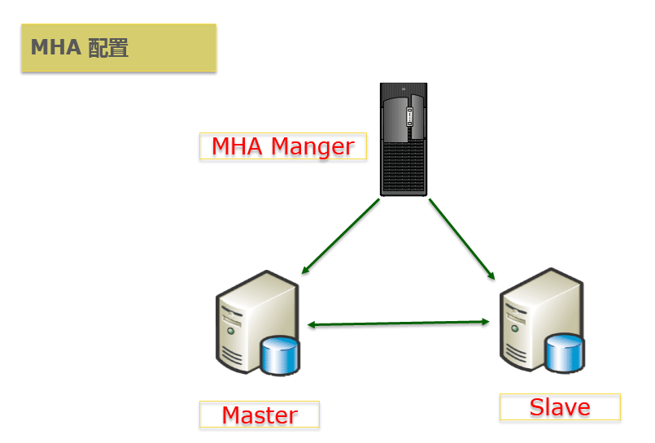
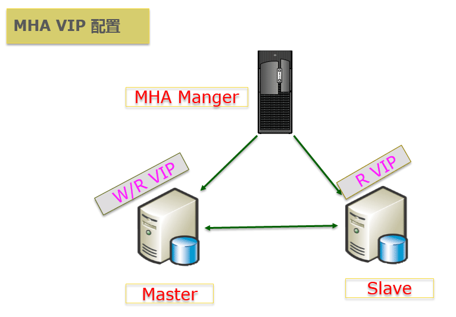
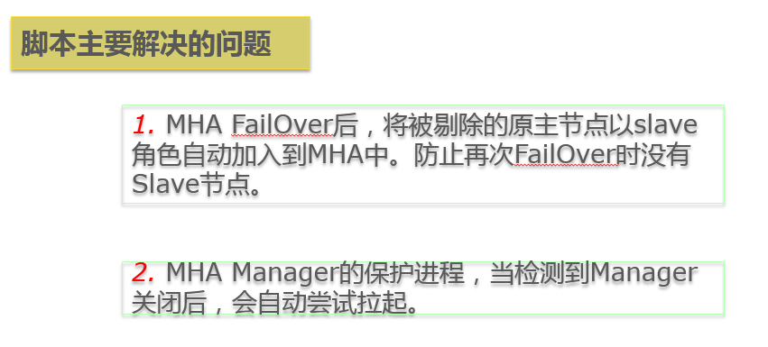
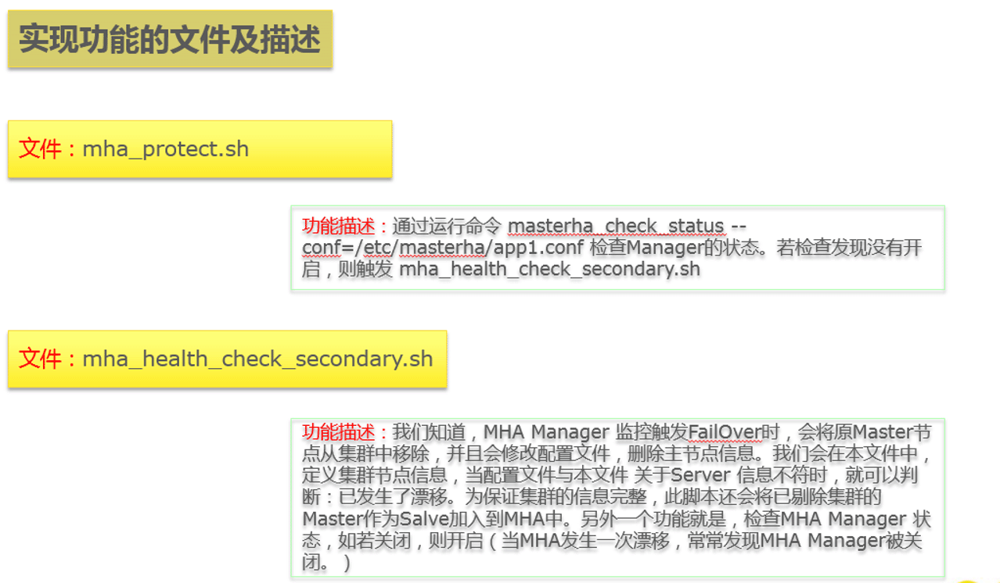
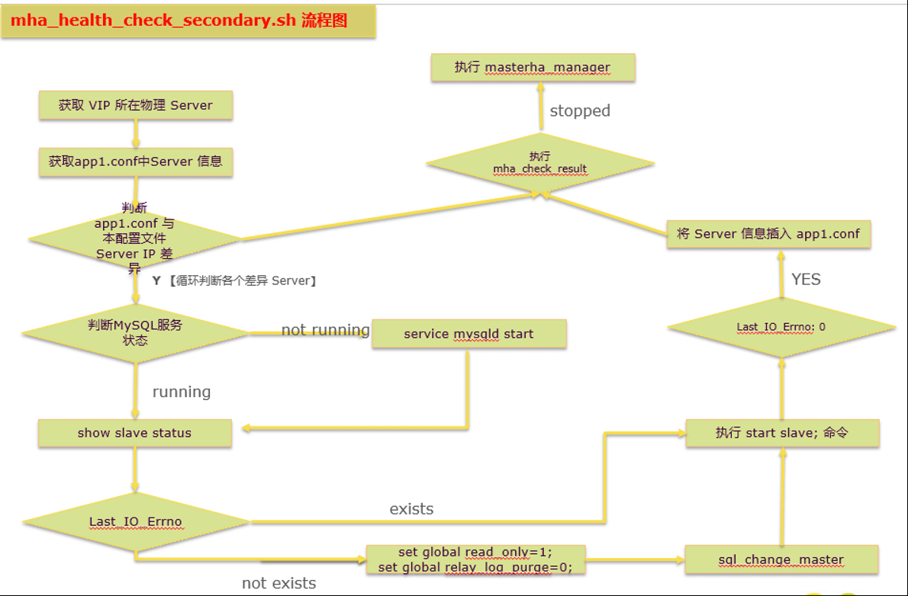

# [MySQL MHA FailOver后，原Master节点自动以Slave角色加入集群的研究与实现 ](https://www.cnblogs.com/xuliuzai/p/9850753.html)

MHA是一套MySQL高可用管理软件，除了检测Master宕机后，提升候选Slave为New Master之外（漂虚拟*IP*），还会自动让其他Slave与New Master 建立复制关系。MHA Manager可以单独部署在一台独立的机器上，并管理多个master-slave集群。当自动Failover完成后，MHA Manager服务器上的masterha_manager 进程自动退出。（Currently MHA Manager process does not run as a daemon. If failover completed successfully or the master process was killed by accident, the manager stops working. --官方文档）

## 面临的问题

我们知道开启MHA Manager监控，当MHA 发生自动漂移时，会将老的主库的ip将会从配置文件中移除。那么怎么可以自动将原Master 节点自动以Slave角色添加到集群中来是运维同学面临的问题。

并且大多数情况下，MHA FailOver 后，MHA Manager 监控进程也会关闭。所以很有必要再开启一个关于MHA Manager的保护进程。

 

## 背景知识 

 

为简化MHA 配置，测试环境由一主一从一监控构成。



 

注意：主节点、辅助节点 之间 相互SSH 免密码登入。MHA Manger 到主、副节点之间 需要满足免密码登入（满足单向即可）



 

在**主节点**上虚拟出了 可**读/写**的IP；在**从节点**上虚拟出**只读**的IP。程序访问使用虚拟IP。

工具包主要功能

| 工具包                  | 功能描述                                                     |
| ----------------------- | ------------------------------------------------------------ |
| masterha_check_ssh      | 检查MHA的SSH配置状况                                         |
| masterha_check_repl     | 检查MySQL各节点复制状态                                      |
| masterha_manger         | 开启 MHA Manager                                             |
| masterha_check_status   | 检测当前MHA Manager运行状态                                  |
| master_ip_failover      | 自动切换时管理vip的脚本，主要是VIP的漂移。                   |
| master_ip_online_change | 手动执行mysql master  switchover时执行的切换脚本,含有管理vip的脚本 |
| masterha_master_switch  | 控制故障转移（可手动）                                       |

 

安装MHA Manager软件包后，路径/usr/local/bin上会出现以上工具包。

## 解决方案探究

脚本主要解决的问题



 实现功能的文件及描述



 

 主要文件mha_health_check_secondary.sh的处理逻辑

 



 

## 实现代码 

文件mha_protect.sh的主要代码
```
# mha_protect.sh
########################################################################
# File Name: mha_protect.sh
# Excute: nohup sh mha_protect.sh &
# Created Time: Thu Jul 12 EST 2018      
#########################################################################
#!/bin/sh
while true;
do
  mha_check_result=`masterha_check_status --conf=/etc/masterha/app1.conf | grep "stopped" | wc -l`  
   if [ "$mha_check_result" == "1" ];then
     echo "$mha_check_result"
     sh /etc/masterha/mha_health_check_vip.sh > /etc/masterha/mhalog/MHA_Check_`date "+%Y%m%d%H%M%S"`.log 2>&1
	fi
 
	sleep 20
done 
```


此文件中，调用MHA的配置文件的参数为 /etc/masterha/app1.conf。执行mha_health_check_secondary.sh产生的log位于路径 /etc/masterha/mhalog下面，文件以MHA_Check_时间命名。

 

文件**mha_health_check_secondary.sh** 中的主要代码
```
# **mha_health_check_secondary.sh**
#!/bin/bash

server1="172.XXX.XXX.XXX" ##此处请输入Server1的IP
server2="172.XXX.XXX.XXX" ##此处请输入Server2的IP
vip="172.XXX.XXX.XXX"   ##此处请输入已配置的VIP
mysql_username=用户    ##此处数据用户名
mysql_password=密码    ## 此处输入用户名相应的密码

mha_conf=/etc/masterha/app1.conf
# Part:: String SQL
sql_change_master=""
mysql_status=""
slave_status=""
master_status=""

#if has vip , master server ip 
ipaddr1=`ssh root@"$server1" ip addr | grep "inet 172" | awk -F '[/]' '{print $1}' | awk '{print $2}' | grep "$vip"`
ipaddr2=`ssh root@"$server2" ip addr | grep "inet 172" | awk -F '[/]' '{print $1}' | awk '{print $2}' | grep "$vip"`

###此处应该添加一个判断当 ipaddr1 和 ipaddr2 都为 空时，说明，VIP设置有问题，退出需要告知管理员，去检查

if [ "$ipaddr1" = "$vip" ];then
  masterip=$server1
    echo masterip 在server1 $server1 上
fi
if [ "$ipaddr2" = "$vip" ];then
  masterip=$server2
    echo masterip 在server2 $server2 上
fi

echo "master ip: $masterip"

## start ## 查看app1.conf mha 配置文件server的信息
conf_server1=`grep "server1" $mha_conf`
conf_server2=`grep "server2" $mha_conf`


echo "conf_server1: $conf_server1 conf_server2 :$conf_server2 "
## end ## 查看app1.conf mha 配置文件server的信息

# 生成master mysql的[change master]SQL命令
sql_change_master="CHANGE MASTER TO MASTER_HOST='$masterip', MASTER_USER='$mysql_username', MASTER_PASSWORD='$mysql_password',TER_PORT=3306,MASTER_AUTO_POSITION=1;"

# --------------------------
# function

# 对指定主机执行Linux命令
function do_linux_by_ssh() {
    # variable
    func_str_ip="$1"
    func_str_user="$2"
    func_str_command="$3"
    # action
    ssh $func_str_user@$func_str_ip "$func_str_command"
}

function do_sql() {
    # variable
    func_str_ip="$1"
    func_str_sql="$2"
    # action
    mysql -u $mysql_username -h $func_str_ip -p"$mysql_password" -e "$func_str_sql" -P3306
}
function mysql_stop_up() {
  # 判断MySQL服务状态
  # variable
    func_str_ip="$1"
    mysql_status=`do_linux_by_ssh "$func_str_ip" "root" "service mysqld status" | grep -c 'not running'`
  if [ "$mysql_status" = 1 ] ;then
      do_linux_by_ssh "$func_str_ip" "root" "service mysqld start" > /dev/null
  fi
  sleep 20
  mysql_status=`do_linux_by_ssh "$func_str_ip" "root" "service mysqld status" | grep -c 'running'`
  echo ${mysql_status}
}
function mysql_slave_up() {
  # variable
    func_str_ip="$1"
    slave_status=`do_sql "$func_str_ip" "show slave status \G;" 2> /dev/null | grep "Last_IO_Errno" | wc -l`
  if [[ $slave_status == 0 ]]
    then
      do_sql "$func_str_ip" "set global read_only=1;set global relay_log_purge=0;"
      do_sql "$func_str_ip" "$sql_change_master"
      do_sql "$func_str_ip" "start slave;"
    fi
  slave_status=`do_sql "$func_str_ip" "show slave status \G;" 2> /dev/null | grep "Last_IO_Errno: 0" | wc -l`
  echo ${slave_status}
}

## MHA集群为2个数据节点，所以下面只循环判断server1、server2，同样如果是三个节点，则copy相关代码，修改if添加即可。

#if server1 down
if [ "$conf_server1" != "[server1]" ] ;then 
  #if myql status was dead , auto systemctl start mysqld
  echo "check server1 mysql status start"
  mysqlstatus=`mysql_stop_up "$server1"`
  echo "server1 mysql status : $mysqlstatus"
  if [ "$mysqlstatus" = 1 ] ; then 
    echo "server1 slave up start"
     slave_status=`mysql_slave_up "$server1"`
     echo "server1 slave status :$slave_status server1: $server1"
     if [ "$slave_status" = 1 ] ; then
       echo "write server1 app1.conf start"
           echo -e "\n[server1]\nhostname=$server1\nport=3306" >> /etc/masterha/app1.conf
     fi
     mha_check_result=`masterha_check_status --conf=/etc/masterha/app1.conf | grep "stopped" | wc -l`
     if [ "$mha_check_result" = 1 ] ;then
          nohup masterha_manager --conf=/etc/masterha/app1.conf --remove_dead_master_conf --ignore_last_failover < /dev/null > /etc/masterha/mhalog/manager.log 2>&1 & > /dev/null
     fi
   fi
 fi  
 conf_server1=`grep "server1" /etc/masterha/app1.conf`
 
 #if server2 down
 echo "$conf_server2":"$server2"
 
 if [ "$conf_server2" != "[server2]" ] ;then 
   #if server2 myql status was dead , auto systemctl start mysqld
   echo "server2 mysql stop status start"
   mysqlstatus=`mysql_stop_up "$server2"`
   echo "server2 ysql_stop_up status: $mysqlstatus"
   if [ "$mysqlstatus" = 1 ] ; then 
     slave_satus=`mysql_slave_up "$server2"`
     echo "server2 slave_status is : $slave_satus"
     if [ "$slave_satus" = 1 ] ; then
       echo "write server2 in app1.conf start"
       echo -e "\n[server2]\nhostname=$server2\nport=3306" >> /etc/masterha/app1.conf
     fi
     mha_check_result=`masterha_check_status --conf=/etc/masterha/app1.conf | grep "stopped" | wc -l`
     echo "$mha_check_result"
     if [ "$mha_check_result" = 1 ] ;then
       nohup masterha_manager --conf=/etc/masterha/app1.conf --remove_dead_master_conf --ignore_last_failover < /dev/null > /etc/masterha/mhalog/manager.log 2>&1 & > /dev/null
     fi
   fi
 fi  
 conf_server2=`grep "server2" /etc/masterha/app1.conf`
 
 mha_check_result=`masterha_check_status --conf=/etc/masterha/app1.conf | grep "stopped" | wc -l`
 if [ "$conf_server1" = "[server1]" ] && [ "$conf_server2" = "[server2]" ];then
   if [ "$mha_check_result" = "1" ];then
     nohup masterha_manager --conf=/etc/masterha/app1.conf --remove_dead_master_conf --ignore_last_failover < /dev/null > /etc/masterha/mhalog/manager.log 2>&1 & > /dev/null
   fi
 fi 
```


此文件中，调用MHA的配置文件的参数为 /etc/masterha/app1.conf。

masterha_manager 监控所产生的log存放在 /etc/masterha/mhalog/manager.log 中。

 

**感谢：以上代码实现主要是由同事Fly Chen完成。**

**本文版权归作者所有，未经作者同意不得转载,谢谢配合！！！**


[](https://www.cnblogs.com/xuliuzai/p/9850753.html?from=singlemessage)