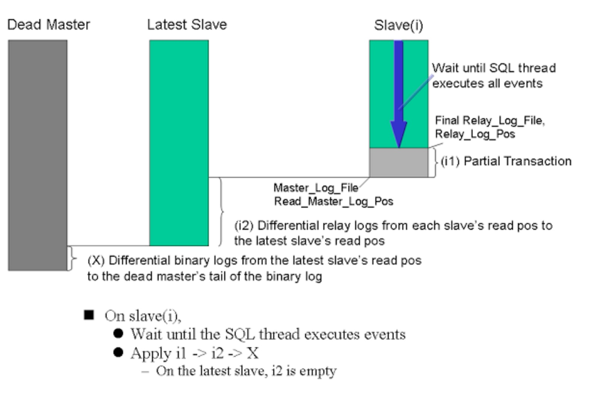
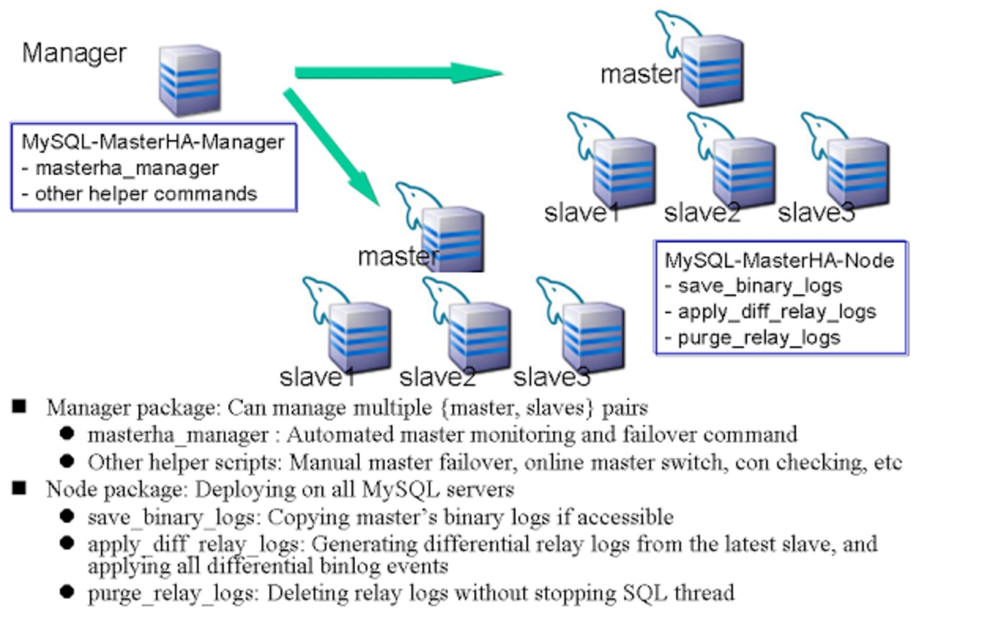

## 一、概况

MHA 提供自动master故障转移以及在最短的时间内（10~30秒）提升slave为new master
MHA 解决了切换后的数据不一致问题
所有的这些操作都是没有任何负载和影响的，并且对存在的环境不需要做任何改动，简单易用

除了failover之外，MHA还支持在线master切换，非常安全和高效，大概只需要（0.5 ~ 2秒）的阻塞写时间

MHA提供了如下功能：

- master自动监控，故障转移一体化(Automated master monitoring and failover)

```
MHA 可以在一个复制group中监控master的状态，如果挂了，就可以自动的做failover
MHA 通过所有slave的差异relay-log来保证数据的一致性
MHA 在做故障转移，日志补偿这些动作的时候，通常只需要10~30秒
通常情况下，MHA会选择最新的slave作为new master，但是你也可以指定哪些是候选maser，那么新master选举的时候，就从这些host里面挑
导致复制环境中断的一致性问题，在MHA中是不会发生的，请放心使用
```

- 手工-交互式 master故障转移（Interactive manually initiated Master Failover）

```
MHA可以配置成 手工-交互式方式进行故障转移，不支持监控master的状态
```

- 非交互式 master故障转移 （Non-interactive master failover）

```
非交互式，自动的故障转移，不提供监控master状态功能，监控可以交给其他组件做（如：Pacemaker heartbeat）
```

- 在线master切换 （Online switching master to a different host）

```
如果你有更快，更好的master，计划要将老master替换成新的master，那么这个功能特别适合这样的场景
这不是master真的挂掉了，只是我们有很多需求要进行master例行维护
```

## 二、其他的HA解决方案

- **人工切换与修复**

```
MySQL的复制基本上是异步复制或者半同步复制
当master crash了，很有可能某些slave还没有获取最新的relay log，那么就意味着这些slave的数据不在同一个时间点
然而人工解决一致性问题是非常困难和复杂的。
一旦数据一致性问题没有解决，复制环境是会报错，无法工作的，这一白白的浪费了N个小时，损失会非常严重
```

- **一主一从架构**

```
M(RW)
 |        --(master crash)-->   M(RW), promoted from S
S(R)


如果只有一主一从，那么做故障切换确实是非常简单，但是这一的架构会满足业务需求吗？

* 第一、 无法扩展读

在很多种情况下，人们会将复杂查询，备份，分析查询，批量job放在slave，来减少对master的负担
这些操作，都会严重影响服务器的性能
如果只有一个slave，那么假如slave挂了，master就要承担这些操作，将会严重影响到master的正常业务

* 第二、 高可用的问题

如果master挂了，只有一个slave（new master）可用，那么就会产生另一个问题，单点故障
为了在搭建一个slave，你需要在master上做online backup，在新的机器上restore，然后立马start slave
但是这样的操作，会花掉你好几个小时的时间哦
在一些苛刻的环境下，是不允许让master单点那么长时间的
另一方面，在master上online backup会给master的性能带来非常大的影响，这样也是不可行的

* 第三、 扩展性问题

假设你想多搭建一台机器作为灾备机器（另一个数据中心），怎么办呢？
因为你只允许一个slave，所以以上需求是不可能实现的


总之，单maseter，单slave 在大多数场景下是不可行的
```

- **一主多从**

```
      M(RW)-----M2(R)                      M(RW), promoted from M2
       |                                          |
  +----+----+          --(master crash)-->   +-x--+--x-+
 S(R)     S2(R)                             S(?)      S(?)
                                          (From which position should S restart replication?)


很直接的问题，master挂后，其他的slave如何挂载呢？
```

- **~~Pacemaker + DRBD~~**

- **MySQL Cluster**

> 不支持InnoDB引擎，不考虑

- **半同步复制架构**

```
5.5，5.6 半同步复制，只能减少数据丢失的风险，不能保证完全不丢失数据
5.7 的lossless 复制，可以保证完全不丢失数据, 但是会有新的问题，lossless 有可能降级，lossless不负责master选举，不负责监控master，不负责数据一致性
```

- **Global Transaction ID**

```
没错，Global Transaction ID 天生就是为了HA而产生的。
MHA + GTID 可以非常好的解决HA的问题，GTID支持多层级的复制故障转移，MHA不行
MHA 0.56 开始，就可以支持GTID了
```

- **mysqlfailover,mysqlrpladmin**

```
官方的failover工具，只支持GTID，有局限性
官方的failover工具，由于刚出来不久，很多bug，很多方案都不成熟
```

## 三、MHA架构

> 当master crash了，MHA恢复的过程如下图



> MHA 是由 MHA Manager 和 MHA Node 组合而成



MHA Manager 主要是用来监控master，控制故障转移等功能

MHA Node 具有很多failover的帮助脚本，比如：解析MySQL binary/relay logs，定位差异日志等

当MHA Manager 做故障转移的时候，MHA Manager 通过ssh 连接到 MHA Node节点，然后执行Node中需要用到的命令

> 自定义扩展

MHA 有很多扩展的点。

下面有一些sample

- secondary_check_script : 多路由，多链路的二次检测功能
- master_ip_failover_script :修改master ip
- shutdown_script : 强制关闭master，防止脑裂
- report_script : 发送一些报告
- init_conf_load_script : 导入一些初始化配置参数
- master_ip_online_change_script : 修改master ip，这不是给failover用的，是给在线切换用的 online_master_switch

## 四、MHA的优点

- **master failover 和 slave promotion 非常快速**
- **master crash 不会导致数据不一致**
- **不需要修改复制的任何设置，简单易部署**
- **不需要增加很多额外的机器来部署MHA**
- **没有任何性能影响**
- **跨存储引擎，支持任何引擎**

## 五、MHA工作流程

### 5.1 MHA如何监控master和故障转移

> 下面的流程，就是masterha_manager做的事情

#### 5.1.1 验证复制设置以及确认当前master状态

- 连接所有hosts，MHA自动来确认当前master是哪个，配置文件中无需指定哪个是master
- 如果其中有任何一个slave挂了，脚本立即退出，停止监控
- 如果有一些必要的脚本没有在MHA Node节点安装，那么MHA在这个阶段终止，且停止监控

#### 5.1.2 监控master

- 监控master，直到master 挂了

这个阶段，MHA不会监控slave. Stopping/Restarting/Adding/Removing操作在slave上，不会影响当前的MHA 监控进程
当你添加或者删除slave的时候，请更新好配置文件，最好重启MHA

#### 5.1.3 检测master是否失败

- 如果MHA Manger三次间隔时间都没办法连接master server，就会进入这个阶段
- 如果你设置了 secondary_check_script ，那么MHA会调用脚本做二次检测来判断master是否是真的挂了

> 接下来的步骤，就是masterha_master_switch 的工作流程

#### 5.1.4 再次验证slave的配置

- 如果发现任何不合法的复制配置（有些slave的master不是同一个），那么MHA会停止监控，且报错。可以设置ignore_fail忽略

这一步是处于安全考虑。 很有可能，复制的配置文件已经被改掉了，所以double check 是比较推荐的做法

- 检查最后一次failover（故障转移）的状态

如果上一次的failover报错，或者上一次的failover结束的太近（默认3天），MHA停止监控，停止failover，那么在masterha_manager命令中设置ignore_last_failover，wait_on_failover_error来改变这一检测

这么做，也是出于安全考虑。频繁的failover，检查下是否网络出问题，或者其他错误呢？

#### 5.1.5 关掉失败的master的服务器（可选）

- 如果在配置文件中定义了 master_ip_failover_script and/or shutdown_script ，MHA 会调用这些的脚本
- 关闭dead master，避免脑裂（值得商榷）

#### 5.1.6 恢复一台新master

- 从crashed master服务器上保存binlog到Manager（如果可以的话）
  - 如果dead master可以SSH的话，拷贝binary logs 从最新的slave上的end_log_pos(Read_Master_Log_Pos)位置开始拷贝
- 选举新master
  - 根据配置文件的设置来决定选举谁
  - 如果想设置一些候选master，设置 candidate_master=1
  - 如果想设置一些host，永远都不会选举，设置no_master=1
- 确认最新的slave （这台slave拥有最新的relay-log）
- 恢复和提升新master
  - 根据老master binlog生成差异日志
  - 应用日志到new master
  - 如果这一步发生错误（如：duplicate key error），MHA停止恢复，并且其余的slave也停止恢复

#### 5.1.7 让这台新master可用

- 如果定义了 master_ip_failover_script 在配置文件中，MHA会调用它
  - 你可以在这里做任何你想做的事情，激活ip，创建用户

#### 5.1.8 恢复其他slave

- 并行的生成差异日志给到其余slave
- 并行的应用日志到其他slave
- slave上 change master 到 new master
- 这一步如果报错（duplicate key error on slave 3），MHA也不会停止。失败的slave 不会同步新master，但是其他恢复成功的slave可以start slave

#### 5.1.9 通知（可选）

- 如果你在配置中定义了 report_script， MHA会调用它
  - 可以发邮件
  - 可以停止备份计划任务
  - etc

#### 5.1.10 流程图

### 5.2 MHA如何在线快速切换master

> 下面的步骤，就是masterha_master_switch --master_state=alive 做的事情

#### 5.2.1  验证复制设置以及确认当前master状态

- 连接配置文件中列出的所有hosts，MHA自动来确认当前master是哪个，配置文件中无需指定哪个是master
- 执行 flush tables 命令在master上（可选）. 这样可以缩短FLUSH TABLES WITH READ LOCK 的时间
- 既不监控master，也不会failover
- 检查下面的条件是否满足
  - IO线程是否在所有slave上都是running
  - SQL线程是否在所有slave上都是running
  - Seconds_Behind_Master 是否低于2秒（--running_updates_limit=N）
  - master上是否没有长的更新语句大于2秒

#### 5.2.2  确认新master

- 新master 需要设置： --new_master_host 参数
- 原来的master和新的master 必须要有同样的复制过滤条件（binlog-do-db and binlog-ignore-db）

#### 5.2.3  当前master停写

- 如果你在配置中定义了master_ip_online_change_script，MHA会调用它
  - 可以通过设置SET GLOBAL read_only=1 来完美的阻止写入
- 在老master上执行 FLUSH TABLES WITH READ LOCK 来阻止所有的写（--skip_lock_all_tables 可以忽略这一步）

#### 5.2.4  等待其他slave追上当前master，同步无延迟

- 调用这个函数MASTER_LOG_POS（）

#### 5.2.5  确保新master可写

- 执行SHOW MASTER STATUS 来确定新master的  binary log 文件名和position
- 如果设置了 master_ip_online_change_script，会调用它
  - 可以创建写权限的用户
  - SET GLOBAL read_only=0

#### 5.2.6  让其他slave指向新master

- 并行执行CHANGE MASTER, START SLAVE

#### 5.2.7  流程图

## 五、重要的命令

> masterha_manager: master监控， 自动化failover
> masterha_master_switch：人工failover or 非交互式master failover or 在线maser切换
> masterha_check_status
> masterha_check_repl
> masterha_stop
> masterha_conf_host
> masterha_ssh_check： 检查ssh配置
> purge_relay_logs  ： 删除老的relay-log，不用担心复制延迟

### 5.1 masterha_manager

> 控制MHA Manager的命令

执行下列命令可以开启MHA Manager

```
# masterha_manager --conf=/etc/conf/masterha/app1.cnf
```

- masterha_manager 相关参数

```
* --conf=(配置文件的全路径)
    应用&局部配置文件

* --global_conf=(全局配置文件的全路径)
    全局配置文件。默认是： /etc/masterha_default.cnf

* --manager_workdir, --workdir
    MHA Manger的工作目录，会产生一系列状态文件在这里面。如果不设置，默认的是： /var/tmp

* --manager_log, --log_output
    MHA Manger会产生日志相关的文件在这个目录中。如果不设置，会打印到STDOUT/STDERR。
    如果是人工failover（interactive failover），MHA会忽略--manager_log，直接打印到STDOUT/STDERR
```

- MHA Manager 监控master方面的指定参数

```
* --wait_on_monitor_error=(seconds)
    这个功能主要用在自动监控和failover上
    如果在监控期间发生了错误，masterha_manager 会等待wait_on_monitor_error=N 秒，然后退出，默认是0
    如果遇到错误，在restart 监控前最好还是等等

* --ignore_fail_on_start
    默认情况下，如果一个或者多个slave down掉了，master monitor 进程就会停掉，就算你设置了ignore_fail
    如果设置了--ignore_fail_on_start参数，ignore_fail标记了slave挂掉也不会让master monitor进程停掉
```

- failover 指定参数

```
* --wait_on_monitor_error=(seconds)
    这个功能主要用在自动监控和failover上
    如果在监控期间发生了错误，masterha_manager 会等待wait_on_monitor_error=N 秒，然后退出，默认是0
    如果遇到错误，在restart 监控前最好还是等等

* --ignore_fail_on_start
    默认情况下，如果一个或者多个slave down掉了，master monitor 进程就会停掉，就算你设置了ignore_fail
    如果设置了--ignore_fail_on_start参数，ignore_fail标记了slave挂掉也不会让master monitor进程停掉

* --last_failover_minute=(minutes)
    如果上一次failover刚刚才完成（默认8小时），那么MHA manager 这次将不会进行failover
    这个参数主要是为了避免 ping-pong failover问题
    如果设置了 --ignore_last_failover，将忽略这个限制

* --remove_dead_master_conf
    设置了这个参数后，如果MHA failover结束后，MHA Manager会自动在配置文件中删除 dead master的相关项
    如果不设置，由于dead master的配置还存在文件中，那么当MHA failover后，当再次restart MHA manager后，会报错（there is a dead slave previous dead master）
```

### 5.2 masterha_master_switch

> 1. Manual Failover 人工交互式failover
> 2. Non-Interactive Failover 人工非交互式failover
> 3. Scheduled(Online) Master Switch 在线例行master切换

masterha_manager 不仅仅failover，还会monitor master。
masterha_master_switch 只做failover，不做master的monitor。
masterha_master_switch 除了failover外，还可以做master在线切换。

- 5.2.1 Manual Failover 人工交互式failover

```
$ masterha_master_switch --master_state=dead --conf=/etc/app1.cnf --dead_master_host=host1
```

相关参数如下：

```
* --master_state=dead
    这个value可能的取值是：‘dead’ or ‘alive’。
    如果设置为alive，就是在线master切换了，这样的场景，master必须是活着的

* --dead_master_host=(hostname)
    Dead master的主机信息，包括 --dead_master_ip，--dead_master_port

* --new_master_host=(hostname)
    New master的主机信息，这个参数是可选项，如果你想特意指定某台机器作为new master，就设置这个参数
    如果new_master_host没有设置，那么选举master的规则参考automated master failover（ candidate_master parameter ）

* --interactive=(0|1)
    交互式failover，设置为1（默认）
    非交互式failover，设置为0

* --skip_change_master(0.56)
    只会完成日志补偿，不会进行change master和start slave
    如果你想double check slave是否成功的恢复完成，那么设置该参数对你特别有用

* --skip_disable_read_only
    如果设置了这个参数，那么新master 将还会是 只读状态
    如果你想手动开启新master的写权限，那么这个参数特别有用

* --last_failover_minute=(minutes)
    同 masterha_manager 里面的参数一样

* --ignore_last_failover
    同 masterha_manager 里面的参数一样

* --wait_on_failover_error=(seconds)
    同 masterha_manager 里面的参数一样。
    这个参数，只对自动或者非交互式的failover有用，如果--interactive=0 没有设置，那么这个参数将不起作用

* --remove_dead_master_conf
    同 masterha_manager 里面的参数一样
```

masterha_master_switch 默认是交互式的，你需要手动敲 “yes”

```
Starting master switch from host1(192.168.0.1:3306) to host2(192.168.0.2:3306)? (yes/NO): yes
```

如果你没有设置new_master_host,那么选举过程也将是人工的

```
Starting master switch from host1(192.168.0.1:3306) to host2(192.168.0.2:3306)? (yes/NO): no
Continue? (yes/NO): yes
Enter new master host name: host5
Master switch to gd1305(10.17.1.238:3306). OK? (yes/NO): yes
```

在上面的例子中，host5 将会是新的master（前提是host5 必须开启binlog，并且大版本号不能高于其他slave）
下面的命令和上面有同样的效果

```
$ masterha_master_switch --master_state=dead --conf=/etc/app1.cnf --dead_master_host=host1 --new_master_host=host5
```

下面的参数是MHA 0.56的参数

```
* --wait_until_gtid_in_sync(0|1)
    这是基于GTID的参数
    如果设置为1（默认）： MHA会等待，直到所有slave追上新master的gtid
    如果设置为0： 那么MHA不会等待slave追上新master

* --skip_change_master
    MHA 不会执行 CHANGE MASTER

* --skip_disable_read_only
    MHA 忽略在new master上执行 SET GLOBAL read_only=0

* --ignore_binlog_server_error
    MHA忽略任何binlog server的错误
```

- 5.2.2 Non-Interactive Failover 非交互式failover

如果在masterha_master_switch中设置了 --interactive=0 ， 那么它将是自动failover（非交互式）

```
$ masterha_master_switch --master_state=dead --conf=/etc/conf/masterha/app1.cnf --dead_master_host=host1 --new_master_host=host2 --interactive=0
```

这个masterha_master_switch 非交互failover操作，就跟masterha_manager内部跑的failover一样
如果你发现自己的master挂了，但是又没有用masterha_manager监控，那么执行这个masterha_master_switch --interactive=0 特别有用
如果没有用masterha_manager监控，但是有其他的监控（Pacemaker），那么配合这个masterha_master_switch --interactive=0 特别有用

- 5.2.3 Scheduled(Online) Master Switch 在线master切换

MySQL 的例行维护，需要在线切换master，这个场景特别有用

```
$ masterha_master_switch --master_state=alive --conf=/etc/app1.cnf --new_master_host=host2
```

--master_state=alive 必须指定

当下面条件都满足时，可以进行online 切换

```
* IO 线程在running 状态
* SQL 线程在running 状态
* Seconds_Behind_Master 小于等于--running_updates_limit设置的秒数
* 在master上，没有超过--running_updates_limit设置的秒数的 update query存在
```

其他重要参数

```
* --new_master_host=(hostname)
    指定每台机器为新master

* --orig_master_is_new_slave
    当master切换后，原来的老master切换后，会成为新的slave
    默认情况下，这个参数是关闭的，也就是原来的老master不会出现在新的复制环境中
    如果你要设置--orig_master_is_new_slave，那么必须在配置文件中设置repl_password参数，因为它不知道新master的复制密码

* --running_updates_limit=(seconds)
    如果当前master上的执行的写query超过这个值，或者slave 落后master超过这个值，master switch操作会终止
    默认是1秒

* --remove_orig_master_conf
    设置后，master 切换后，原来master的相关信息在配置文件中会被删除
    默认这个参数不生效，不会在配置中删除相关信息

* --skip_lock_all_tables
    如果设置这个参数，那么在切换过程中，不会对老master 进行FLUSH TABLES WITH READ LOCK
```

### 5.3 masterha_check_status

主要是用来检查MHA manager中对master的monitor是否正确

```
$ masterha_check_status --conf=/path/to/app1.cnf
  app1 (pid:8368) is running(0:PING_OK), master:host1
$ echo $?
  0
```

如果监控master的线程正常，会返回0

### 5.4 masterha_check_repl

检查复制环境是否ok

```
manager_host$ masterha_check_repl --conf=/etc/app1.cnf

MySQL Replication Health is OK.
```

如果检测到失败，会返回错误

```
* 复制过滤规则不同，SQL线程有错误，复制环境中存在多个master
* IO线程stopped状态
* SQL线程stopped状态
* 复制延迟太长（--seconds_behind_master=(seconds)）
```

masterha_check_repl的一些参数，可以加到配置文件中

```
* --seconds_behind_master=(seconds)
    masterha_check_repl 会检测延迟，如果超过这个描述，会报错
    默认是 30秒

* --skip_check_ssh
    通过masterha_check_ssh 去检测ssh的环境
    如果设置了该参数，可以忽略SSH的检测
```

### 5.5 masterha_stop

可以通过如下命令，关闭MHA manager进程

```
manager_host$ masterha_stop --conf=/etc/app1.cnf
Stopped app1 successfully.
```

关闭manager，并不会关闭掉MySQL server
如果关闭不掉怎么办呢？ 加上--abort 参数，他会发送 sigkill（-9）强行关闭
如果manager的状态是 FAILOVER_RUNNING，那么manager 不会被关闭，这是出于安全考虑
你当然也可以自动kill掉manager进程，但是要确保它不是处在failover阶段

### 5.6 masterha_conf_host

> 用于添加和删除配置文件中的条目

```
# masterha_conf_host --command=add --conf=/etc/conf/masterha/app1.cnf --hostname=db101
```

执行上述命令后，配置文件中新增了如下条目

```
[server_db101]
hostname=db101
```

可以通过--param 添加很多参数，用；分号 分隔

```
# masterha_conf_host --command=add --conf=/etc/conf/masterha/app1.cnf --hostname=db101 --block=server100 --params="no_master=1;ignore_fail=1"
```

执行上述命令后，配置文件中新增了如下条目

```
[server100]
hostname=db101
no_master=1
ignore_fail=1
```

当然也可以删除某些条目

```
# masterha_conf_host --command=delete --conf=/etc/conf/masterha/app1.cnf --block=server100
```

- 重点参数

```
* --command=(add|delete)
    增加或者删除一个block

* --conf=(config file path)
    局部配置的全局路径

* --hostname=(hostname)
    主机名

* --block=(block_name)
    配置文件中的一个block
    当--add时，block name 必须在配置文件中不存在
    当--delete时，block name 必须在配置文件中存在
    当--block不指定时，名字默认为： server$hostname

* --params=(key1=value1;key2=value2;...)
    参数list
```

### 5.7 masterha_ssh_check

检查所有MHA需要要到的机器之间的SSH互信

```
# masterha_check_ssh --conf=/etc/app1.cnf

  Sat May 14 14:42:19 2011 - [warn] Global configuration file /etc/masterha_default.cnf not found. Skipping.
  Sat May 14 14:42:19 2011 - [info] Reading application default configurations from /etc/app1.cnf..
  Sat May 14 14:42:19 2011 - [info] Reading server configurations from /etc/app1.cnf..
  Sat May 14 14:42:19 2011 - [info] Starting SSH connection tests..
  Sat May 14 14:42:19 2011 - [debug]  Connecting via SSH from root@host1(192.168.0.1) to root@host2(192.168.0.2)..
  Sat May 14 14:42:20 2011 - [debug]   ok.
  Sat May 14 14:42:20 2011 - [debug]  Connecting via SSH from root@host1(192.168.0.1) to root@host3(192.168.0.3)..
  Sat May 14 14:42:20 2011 - [debug]   ok.
  Sat May 14 14:42:21 2011 - [debug]  Connecting via SSH from root@host2(192.168.0.2) to root@host1(192.168.0.1)..
  Sat May 14 14:42:21 2011 - [debug]   ok.
  Sat May 14 14:42:21 2011 - [debug]  Connecting via SSH from root@host2(192.168.0.2) to root@host3(192.168.0.3)..
  Sat May 14 14:42:21 2011 - [debug]   ok.
  Sat May 14 14:42:22 2011 - [debug]  Connecting via SSH from root@host3(192.168.0.3) to root@host1(192.168.0.1)..
  Sat May 14 14:42:22 2011 - [debug]   ok.
  Sat May 14 14:42:22 2011 - [debug]  Connecting via SSH from root@host3(192.168.0.3) to root@host2(192.168.0.2)..
  Sat May 14 14:42:22 2011 - [debug]   ok.
  Sat May 14 14:42:22 2011 - [info] All SSH connection tests passed successfully.
```

如果你使用了masterha_secondary_check 做二次验证，那么这里面提到的机器也必须SSH互信

MHA恢复slave是并行的，也就意味着恢复需要开启多个ssh通道，所以为了安全和谨慎，在/etc/ssh/sshd_config（默认10）提高MaxStartups 的数量，然后重启sshd，或者reload

### 5.8 purge_relay_logs

> 默认情况下，如果SQL线程执行完relay-log，relay logs就会被自动删除。但是这些relay-logs 也许还会用来恢复其他的slave，所以你需要关闭自动删除relay-logs的purge线程，然后自己阶段性的来删除
> 如果是你自己来删的话，必须考虑repl 延迟问题

MHA Node 上有一个命令purge_relay_logs可以帮你安全的删除relay log
purge_relay_logs帮你做了很多事情，创建硬连接，执行SET GLOBAL relay_log_purge=1，等几秒让其切换到新的relay log，然后执行SET GLOBAL relay_log_purge=0

purge_relay_logs 需要连接MySQL server，所以需要很多认证的参数

```
* --user
    MySQL用户名，默认root

* --password
    MySQL 密码，默认为空

* --host
    MySQL的hostname，默认127.0.0.1，必须传递正确的host

* --port
    MySQL 的端口，默认3306

* --workdir
    relay log硬连接创建和删除的目录
    这个目录最好不要跨OS分区，relay log 在哪个分区，workdir就设置在哪个分区。如果跨分区，会报错Invalid cross-device link

* --disable_relay_log_purge
    如果MySQL里面的参数relay_log_purge设置为1，那么这个脚本不会做任何工作
    如果这个脚本设置了 --disable_relay_log_purge参数，那么它会主动去关闭MySQL的参数relay_log_purge=0
```

- 计划任务调度purge_relay_logs

/usr/bin/purge_relay_logs 可以在不阻塞SQL线程的前提下删除relay logs
所以，我们需要定期的来删除relay，必须每天一次，没半天一次等等
通过如下计划任务可以做到

```
[app@slave_host1]$ cat /etc/cron.d/purge_relay_logs
# purge relay logs at 5am
0 5 * * * app /usr/bin/purge_relay_logs --user=root --password=PASSWORD --disable_relay_log_purge >> /var/log/masterha/purge_relay_logs.log 2>&1
```

最好让slave删除relay log不要在同一时间点，假如需要恢复，那么这个时间点所有relay logs都被删除了就不好了

## 六、核心参数详解

### 6.1  参数矩阵图

| 参数名                         | 是否必须？ | 参数作用域       | 默认值                                   | 例子                                                         |
| ------------------------------ | ---------- | ---------------- | ---------------------------------------- | ------------------------------------------------------------ |
| hostname                       | yes        | Local Only       | -                                        | hostname=mysql_server1, hostname=192.168.0.1, etc            |
| ip                             | No         | Local Only       | gethostbyname($hostname)                 | ip=192.168.1.3                                               |
| port                           | No         | Local/App/Global | 3306                                     | port=3306                                                    |
| ssh_connection_timeout         | No         | Local/App/Global | 5                                        | ssh_connection_timeout=20                                    |
| ssh_options                    | No         | Local/App/Global | ""(empty string)                         | ssh_options="-i /root/.ssh/id_dsa2"                          |
| candidate_master               | No         | Local Only       | 0                                        | candidate_master=1                                           |
| no_master                      | No         | Local Only       | 0                                        | no_master=1                                                  |
| ignore_fail                    | No         | Local Only       | 0                                        | ignore_fail=1                                                |
| skip_init_ssh_check            | No         | Local Only       | 0                                        | skip_init_ssh_check=1                                        |
| skip_reset_slave               | No         | Local/App/Global | 0                                        | skip_reset_slave=1                                           |
| user                           | No         | Local/App/Global | root                                     | user=mysql_root                                              |
| password                       | No         | Local/App/Global | ""(empty string)                         | password=rootpass                                            |
| repl_user                      | No         | Local/App/Global | Master_User value from SHOW SLAVE STATUS | repl_user=repl                                               |
| repl_password                  | No         | Local/App/Global | - (current replication password)         | repl_user=replpass                                           |
| disable_log_bin                | No         | Local/App/Global | 0                                        | disable_log_bin=1                                            |
| master_pid_file                | No         | Local/App/Global | ""(empty string)                         | master_pid_file=/var/lib/mysql/master1.pid                   |
| ssh_user                       | No         | Local/App/Global | current OS user                          | ssh_user=root                                                |
| remote_workdir                 | No         | Local/App/Global | /var/tmp                                 | remote_workdir=/var/log/masterha/app1                        |
| master_binlog_dir              | No         | Local/App/Global | /var/lib/mysql                           | master_binlog_dir=/data/mysql1,/data/mysql2                  |
| log_level                      | No         | App/Global       | info                                     | log_level=debug                                              |
| manager_workdir                | No         | App              | /var/tmp                                 | manager_workdir=/var/log/masterha                            |
| client_bindir                  | No         | App              | -                                        | client_bindir=/usr/mysql/bin                                 |
| client_libdir                  | No         | App              | -                                        | client_libdir=/usr/lib/mysql                                 |
| manager_log                    | No         | App              | STDERR                                   | manager_log=/var/log/masterha/app1.log                       |
| check_repl_delay               | No         | App/Global       | 1                                        | check_repl_delay=0                                           |
| check_repl_filter              | No         | App/Global       | 1                                        | check_repl_filter=0                                          |
| latest_priority                | No         | App/Global       | 1                                        | latest_priority=0                                            |
| multi_tier_slave               | No         | App/Global       | 0                                        | multi_tier_slave=1                                           |
| ping_interval                  | No         | App/Global       | 3                                        | ping_interval=5                                              |
| ping_type                      | No         | App/Global       | SELECT                                   | ping_type=CONNECT                                            |
| secondary_check_script         | No         | App/Global       | null                                     | secondary_check_script= masterha_secondary_check -s remote_dc1 -s remote_dc2 |
| master_ip_failover_script      | No         | App/Global       | null                                     | master_ip_failover_script=/usr/local/custom_script/master_ip_failover |
| master_ip_online_change_script | No         | App/Global       | null                                     | master_ip_online_change_script= /usr/local/custom_script/master_ip_online_change |
| shutdown_script                | No         | App/Global       | null                                     | shutdown_script= /usr/local/custom_script/master_shutdown    |
| report_script                  | No         | App/Global       | null                                     | report_script= /usr/local/custom_script/report               |
| init_conf_load_script          | No         | App/Global       | null                                     | report_script= /usr/local/custom_script/init_conf_loader     |

- Local Scope

```
每个server域的参数
在application 配置文件(app.cnf)中：[server_xxx] 下面写的参数
```

- App Scope

```
每个{master,slave}对的参数
这些参数在application配置(app.cnf)中： [server_default] 写的参数
```

- Global Scope

```
所有{master,slave}对的参数
这些参数在global 配置(masterha_default.cnf)中：[server_default]写的参数
```

### 6.2 核心参数详解

- hostname

```
目标MySQL服务器的 hostname 或者 ip
这个参数必须配置在 application 配置文件的[server_xxx]下面
```

- ssh_connection_timeout

```
0.54开始支持，默认5秒，以前是硬编码
```

- ssh_options

```
0.53开始支持，SSH命令额外的参数
```

- candidate_master

```
候选master，如果设置为1，那么这台机器被选举为新master的机会就越大（还要满足：binlog开启，无大延迟）
如果你设置了N台机器都为candidate_master=1，那么优先选举的顺序为：  从上到下
([server_xxx]). [server_1]
([server_xxx]). [server_2]
([server_xxx]). [server_3]
```

- no_master

```
如果对某台机器设置了no_master=1 ， 那么这台机器永远都不可能成为新master
如果没有master选举了，那么MHA会退出
```

- ignore_fail

```
默认情况下，如果slave有问题（无法通过mysql，ssh连接，sql线程停止等等），MHA 将停止failover
如果你不想让MHA manager停止，可以设置ignore_fail=1
```

- skip_init_ssh_check

```
跳过SSH检测
```

- skip_reset_slave

```
0.56才支持的参数，failover后，不执行reset slave all
```

- user，password，repl_user，repl_password，ssh_user

```
* user
    默认root，MySQL 的用户名，如果是root，因为要执行很多命令如：STOP SLAVE, CHANGE MASTER, RESET SLAVE

* password
    user的密码

* repl_user
    复制线程的用户名（最好加上）

* repl_password
    复制线程的密码（最好加上），尤其是--orig_master_is_new_slave之后，老master要change master到新master，它不知道密码

* ssh_user
    操作系统的用户名（Manager，Node），因为要应用，解析各种日志，最好权限大点，默认是MHA manager上的当前OS 用户
```

- disable_log_bin

```
在slave上应用差异relay log的时候，可以不记录到binlog日志中
```

- remote_workdir

```
MHA Node的工作目录，默认 /var/tmp
```

- master_binlog_dir

```
master上产生binlog的binlog 目录。默认是：/var/lib/mysql,/var/log/mysql
```

- manager_workdir

```
MHA Manager的工作目录，默认： /var/tmp
```

- manager_log

```
MHA manager 的日志目录，如果不设置，就是标准输出，和标准错误输出
```

- check_repl_delay

```
默认情况下，如果slave落后master100M左右的relay log，MHA会放弃选择这个slave作为new master
如果设置check_repl_delay=0，MHA会忽略这个限制
如果你想让某个candidate_master=1特定的slave成为maseter，那么这个参数特别有用
```

- check_repl_filter

```
如果过滤规则不一样，MHA停止monitor和failover
可以通过设置check_repl_filter=0忽略，但是要特别小心这么做
```

- ping_interval

```
MHA manager多久去ping SQL 一次master
如果三次间隔都没反应，那么MHA认为master挂了
默认3秒
如果MHA Manager连不上Master是因为too many connection错误或者认证失败，这些将不会认为master挂了
```

- secondary_check_script

一般来讲，　非常推荐使用更多网络上机器是不同路由策略上的机器来检查MySQL　Master是否存活。
默认情况下，只有MHA Manager通过一个路由来检查Master是否存活。这个也是不推荐的。
MHA可以通过外部secondary_check_script配置的脚本来做到从多个路由策略下进行检查.

```
secondary_check_script = masterha_secondary_check -s remote_host1 -s remote_host2
```

在大多数场景下，内置的masterha_secondary_check都可以允许良好

Manager-(A)->remote_host1-(B)->master_host
Manager-(A)->remote_host2-(B)->master_host

在所有的路由中，如果A成功，B失败，那么MHA认为master就真的挂了，其他情况，一律认为master还是活的

通常来讲，remote_host1，remote_host2，应该和MHA manager在不同的网段中

MHA会调用secondary_check_script声明的脚本并自动带上一些参数。
masterha_secondary_check在很多场景都是适用的，但是你也可以自已实现这个程序带有更多的功能。

```
* –user=(在远程机器上使用的SSH用户名。　ssh_user的值将被使用)
* –master_host = (master的hostname)
* –master_ip = (master的ip地址)
* –master_port = ( master的端口号)
```

注意：内置的masterha_secondary_check脚本依赖于的Perl的IO::Socket::INET(Perl 5.6.0中是默认支持包含这个模块)。
masterha_secondary_check需要通过ssh连接到远程的机器上，所以需要manager到远程机器上建立public key信任。
另外masterha_secondary_check是通过和Master建立TCP的连接测试Master是否存活，所以mysql设置的max_connections不起作用。
但每次TCP连接成功后，MySQL的Aborted_connects 值都会加1

- master_ip_failover_script

MHA 不做vip 漂移动作，这些事情你必须自己做

```
master_ip_failover_script= /usr/local/sample/bin/master_ip_failover
```

MHA manager会调用master_ip_failover_script三次

```
* 第一次：检查阶段
    --command=status
    --ssh_user=(current master's ssh username)
    --orig_master_host=(current master's hostname)
    --orig_master_ip=(current master's ip address)
    --orig_master_port=(current master's port number)

* 第二次：当前master 关闭阶段
    --command=stop or stopssh
    --ssh_user=(dead master's ssh username, if reachable via ssh)
    --orig_master_host=(current(dead) master's hostname)
    --orig_master_ip=(current(dead) master's ip address)
    --orig_master_port=(current(dead) master's port number)

* 第三次：新master激活阶段
    --command=start
    --ssh_user=(new master's ssh username)
    --orig_master_host=(dead master's hostname)
    --orig_master_ip=(dead master's ip address)
    --orig_master_port=(dead master's port number)
    --new_master_host=(new master's hostname)
    --new_master_ip=(new master's ip address)
    --new_master_port(new master's port number)
    --new_master_user=(new master's user)
    --new_master_password(new master's password)
```

在当前master shutdown阶段，你可以调用shutdown_script 关闭当前master
在当前master shutdown阶段，你可以删除dead master在配置文件中
在新master激活阶段，你可以指定虚拟ip在新master上，并且可以更改数据库路由设置
在新master激活阶段，你可以新增和更改新maser的记录
另外，你可以做任何事情让应用可写新master，例如：SET GLOBAL read_only=0，创建用户，权限

但是，默认的MHA manager参数是空，不会做任何事情

- master_ip_online_changes_script

这个参数有点类似于master_ip_failover_script,但这个参数不用于master　故障转意，只使用到master在线的切换

```
* 冻结当前master写的阶段

--command=stop or stopssh
--orig_master_host=(current master's hostname)
--orig_master_ip=(current master's ip address)
--orig_master_port=(current master's port number)
--orig_master_user=(current master's user)
--orig_master_password=(current master's password)
--orig_master_ssh_user=(from 0.56, current master's ssh user)
--orig_master_is_new_slave=(from 0.56, notifying whether the orig master will be new slave or not)

* new master赋予写权限阶段

--command=start
--orig_master_host=(orig master's hostname)
--orig_master_ip=(orig master's ip address)
--orig_master_port=(orig master's port number)
--new_master_host=(new master's hostname)
--new_master_ip=(new master's ip address)
--new_master_port(new master's port number)
--new_master_user=(new master's user)
--new_master_password=(new master's password)
--new_master_ssh_user=(from 0.56, new master's ssh user)
```

MHA在冻结写的切换过程中会在Master上执行FlUSH TABLES WITH READ LOCK,在这个优雅的切换过程不会有任何写入的。
在新的Ｍaster在开始授权写的过程中，你可以做和master_ip_failover_script一样的事情。　例如：　创建用户及权限，　执行set global read_only=0
如果脚本执行exit code不是0 或是10, MHA　Manager异常退出并发不会继续进行master切换。

默认这个参数是空的，所以MHA Manager在默认情况下什么也不做。

- ~~shutdown_script~~
- ~~report_script~~
- ~~init_conf_load_script~~