[TOC]

# MHA简介

MHA（Master High Availability）目前在MySQL高可用方面是一个相对成熟的解决方案，它由日本DeNA公司youshimaton（现就职于Facebook公司）开发，是一套优秀的作为MySQL高可用性环境下故障切换和主从提升的高可用软件。在MySQL故障切换过程中，MHA能做到在0~30秒之内自动完成数据库的故障切换操作，并且在进行故障切换的过程中，MHA能在最大程度上保证数据的一致性，以达到真正意义上的高可用。

该软件由两部分组成：MHA Manager（管理节点）和MHA Node（数据节点）。MHA Manager可以单独部署在一台独立的机器上管理多个master-slave集群，也可以部署在一台slave节点上。MHA Node运行在每台MySQL服务器上，MHA Manager会定时探测集群中的master节点，当master出现故障时，它可以自动将最新数据的slave提升为新的master，然后将所有其他的slave重新指向新的master。整个故障转移过程对应用程序完全透明。

在MHA自动故障切换过程中，MHA试图从宕机的主服务器上保存二进制日志，最大程度的保证数据的不丢失，但这并不总是可行的。例如，如果主服务器硬件故障或无法通过ssh访问，MHA没法保存二进制日志，只进行故障转移而丢失了最新的数据。使用MySQL 5.5的半同步复制，可以大大降低数据丢失的风险。MHA可以与半同步复制结合起来。如果只有一个slave已经收到了最新的二进制日志，MHA可以将最新的二进制日志应用于其他所有的slave服务器上，因此可以保证所有节点的数据一致性。

目前MHA主要支持一主多从的架构，要搭建MHA,要求一个复制集群中必须最少有三台数据库服务器，一主二从，即一台充当master，一台充当备用master，另外一台充当从库，因为至少需要三台服务器，出于机器成本的考虑，淘宝也在该基础上进行了改造，目前淘宝TMHA已经支持一主一从。（出自：《深入浅出MySQL(第二版)》）

# MHA架构： 

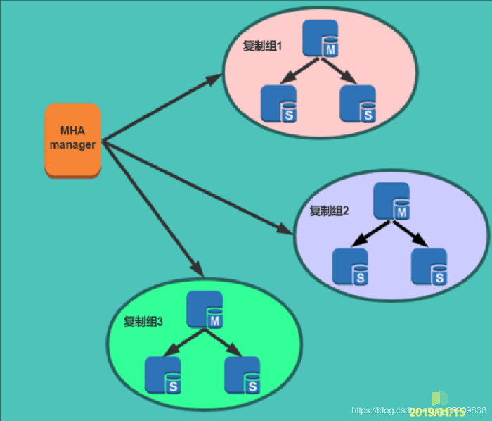

MHA工作原理总结为以下几条：
1. 从宕机崩溃的master保存二进制日志事件（binlog events）;
2. 识别含有最新更新的slave;
3. 应用差异的中继日志(relay log) 到其他slave;
4. 应用从master保存的二进制日志事件(binlog events);
5. 提升一个slave为新master;
6. 使用其他的slave连接新的master进行复制。

> Git介绍：https://github.com/yoshinorim/mha4mysql-manager/wiki

## 基本环境

| 操作系统       | CentOS Linux release 7.5.1804 (Core)     |
| -------------- | ---------------------------------------- |
| 数据库版本     | 5.7.21-log MySQL  Community Server (GPL) |
| MHA版本        | 0.58                                     |
| keepalived版本 | keepalived-1.2.12                        |
| 虚拟ip         | 10.238.162.100                           |

- 因资源有限，将MHA manager安装在了MySQL     master节点上，生产上不可以这样做。MHA     Manager可以单独部署在一台独立的机器上管理多个master-slave集群，也可以部署在一台slave节点上

### 服务器信息 

| 角色             | IP            | 主机名  | server_id | 网卡   | 功能       |
| ---------------- | ------------- | ------- | --------- | ------ | ---------- |
| MHA manager      | 10.238.162.31 | Master  |           |        | 监控复制组 |
| master           | 10.238.162.31 | Master  | 101       | ens160 | 接受写请求 |
| candidate master | 10.238.162.33 | Slave01 | 330602    | ens160 | 接受读请求 |
| slave            | 10.238.162.34 | Slave02 | 330604    | ens160 | 接受读请求 |

###  实验架构如下

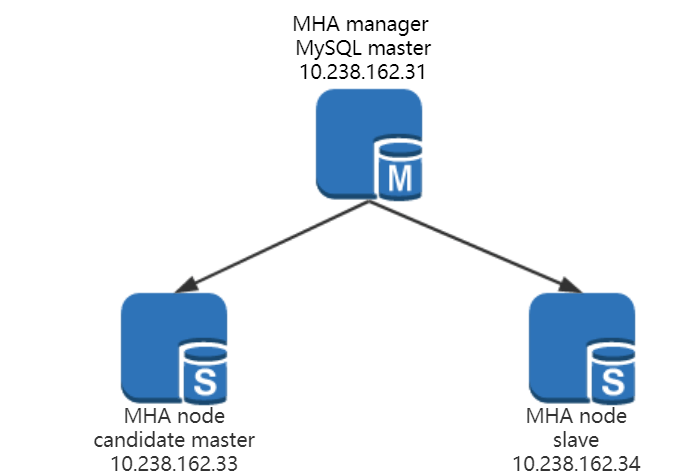

### 涉及的主要配置文件和脚本所在路径

| /etc/mha/app1.cnf                      | MHA配置文件                                         |
| -------------------------------------- | --------------------------------------------------- |
| /etc/keepalived/keepalived.conf        | keepalived配置文件                                  |
| /usr/local/bin/master_ip_failover      | 自动故障转移脚本 分为keepalived引入VIP和脚本引入VIP |
| /usr/local/bin/master_ip_online_change | 手动故障转移脚本                                    |
| /root/purge_relay_log.sh               | 自动清除relay log脚本                               |

 

## MHA安装配置

### 配置主从复制

主从环境的搭建不在具体演示，大家应该都是轻车熟路，很快就能搭建好一套一主两从的MySQL主从环境。

但需要注意的几点：

- 不要将read_only=1写进从库的配置文件，因为主库宕机时，从库要提升为主库接受写请求 mysql -e"set global     read_only=1"

- 主从节点复制的过滤规则要相同，即binlog_do_db 与     binlog_ignore_db 参数主从配置需要相同

- 从节点需要修改配置参数 relay_log_purge=0 ,即关闭中继日志的清除

- 采用命令方式将从库设为只读，不要将该参数写进配置文件中

  ```
  mysql -e"set global read_only=1"
  ```

- 关闭中继日志的清除

  ```
  mysql -e"set global relay_log_purge=0"
  ```


### 安装MHA node

所有节点（数据库master，slave，MHA manager节点）都需要安装MHA node。因为MHA manager也需要依赖MHA node。

- 下载MHA-node 
  
> https://github.com/yoshinorim/mha4mysql-node/releases

- 安装依赖，这里遇到的报错大多事因为没有安装依赖环境

  ```
  yum install -y perl-DBD-MySQL perl-ExtUtils-MakeMaker perl-CPAN
  ```

- 解压

  ```
  tar zxf mha4mysql-node-0.58.tar.gz
  ```

- 移动到/usr/local/mha4mysql-node-0.58目录下

  ```
  mv mha4mysql-node-0.58 /usr/local/mha4mysql-node-0.58
  ```

- 编译

  ```
  cd /usr/local/mha4mysql-node-0.58
  perl Makefile.PL
  ```

- make并安装

  ```
  make
  
  make install
  ```

  

安装完成后 会在/usr/local/bin/生成以下脚本文件，Node脚本说明：(这些工具通常由MHA Manager的脚本触发，无需人为操作)

| save_binary_logs      | 保存和复制master的二进制日志                            |
| --------------------- | ------------------------------------------------------- |
| apply_diff_relay_logs | 识别差异的中继日志事件并将其差异的事件应用于其他的slave |
| filter_mysqlbinlog    | 去除不必要的ROLLBACK事件（MHA已不再使用这个工具）       |
| purge_relay_logs      | 清除中继日志（不会阻塞SQL线程）                         |


### 安装MHA manager

只需要在10.238.162.31节点安装MHA-manager

- 下载MHA-manager 

  > https://github.com/yoshinorim/mha4mysql-manager/releases

- 安装依赖包

  ```
  yum install perl-DBD-MySQL perl-Config-Tiny perl-Log-Dispatch perl-Parallel-ForkManager -y
  ```

- 解压

  ```
  tar -zxf mha4mysql-manager-0.58.tar.gz
  ```

- 移动目录

  ```
  mv mha4mysql-manager-0.58 /usr/local/mha4mysql-manager-0.58
  ```

-  编译安装

  ```
  cd /usr/local/mha4mysql-manager-0.58/
  perl Makefile.PL
  
  make
  make install
  ```


安装完成后，在/usr/local/bin会多出以下相关的命令脚本：

| masterha_check_repl      | 检查MySQL复制健康状况        |
| ------------------------ | ---------------------------- |
| masterha_check_ssh       | 检查ssh健康状况              |
| masterha_check_status    | 检测当前MHA运行状态          |
| masterha_conf_host       | 添加或者删除配置的server信息 |
| masterha_manager         | 启动MHA                      |
| masterha_master_monitor  | 检测master是否宕机           |
| masterha_master_switch   | 控制故障转移（自动或者手动） |
| masterha_secondary_check | /如果从manager节点发现       |
| masterha_stop            | 停止MHA                      |


在/usr/local/mha4mysql-manager-0.58/samples/scripts 目录下会有相关脚本

| master_ip_failover      | 自动切换时vip管理的脚本，不是必须，如果我们使用keepalived的，我们可以自己编写脚本完成对vip的管理，比如监控mysql，如果mysql异常，我们停止keepalived就行，这样vip就会自动漂移 |
| ----------------------- | ------------------------------------------------------------ |
| master_ip_online_change | 在线切换时vip的管理，不是必须，同样可以可以自行编写简单的shell完成 |
| power_manager           | 故障发生后关闭主机的脚本，不是必须                           |
| send_report             | 因故障切换后发送报警的脚本，不是必须，可自行编写简单的shell完成 |

> 安装部分参考Git文档 https://github.com/yoshinorim/mha4mysql-manager/wiki/Installation


### 配置节点互信 

后面为方便阐述，用31代表10.238.162.33服务器。

- 所有节点

  ```
  mkdir ~/.ssh
  cd ~/.ssh
  ```

- 生成公钥和私钥文件，一直回车使用默认即可

  ```
  ssh-keygen -t rsa
  ```

  

- 10.238.162.33服务器上，将生成的公钥复制到**10.238.162.31下

  ```
  scp id_rsa.pub root@10.238.162.31:/root/.ssh/id_rsa.pub_node1
  ```

  

- 10.238.162.34服务器上，将生成的公钥复制到10.238.162.31下

  ```
  scp id_rsa.pub  root@10.238.162.31:/root/.ssh/id_rsa.pub_node2
  ```

  

- 10.238.162.31**服务器上，将**31**，**33**，**34**服务器的公钥追加到认证文件中*

  ```
  cat id_rsa.pub id_rsa.pub_node1 id_rsa.pub_node2 >> authorized_keys
  ```

  

- 10.238.162.31服务器上，将认证文件scp到33和34服务器一份

  ```
  scp authorized_keys root@10.238.162.33:/root/.ssh/
  
  scp authorized_keys root@10.238.162.34:/root/.ssh/
  ```

- 所有节点 验证ssh免密登录，第一次可能需要输入yes，后续不需要输入密码


###  配置MHA

为保证MHA正常工作，需要配置MHA的配置文件，为参数设置合理正确的值，这些参数包括服务器IP，数据库用户名密码，工作目录与日志等。

MHA manager有两个配置文件模板，在路径 $MHA_BASE/samples/conf/ 下的app1.cnf 和 masterha_default.cnf。

- app1.cnf 是对某个复制组的配置文件。

- masterha_default.cnf 是MHA manager的全局配置文件，可以通过这一个配置文件管理多个复制组。

> app1.cnf配置文件，这里先注释掉故障切换脚本，修改好脚本后再打开注释。

 

- 创建数据库监控用户：

  ```
  GRANT ALL PRIVILEGES ON *.* TO 'mha'@'%' identified by '123456';
  
  flush privileges;
  ```

  ```
  cp /usr/local/mha4mysql-manager-0.58/samples/conf/app1.cnf /etc/mha/
  
  # vim /etc/mha/app1.cnf
  
  [server default]
  
  #mha manager日志文件
  manager_log=/server/mha/app1/manager.log
  
  #manager工作目录
  manager_workdir=/server/mha/app1
  
  #master节点存放binlog日志路径,以便MHA找到binlog，这里就是MySQL的数据目录
  master_binlog_dir=/server/mysql_data
  
  #发生切换时slave节点binlog日志存放路径
  remote_workdir=/server/mha_tmp
  
  #自动切换脚本
  master_ip_failover_script=/usr/local/bin/master_ip_failover
  
  #手动切换脚本
  master_ip_online_change_script=/usr/bin/master_ip_online_change
  
  #一旦MHA到31的监控之间出现问题，MHA Manager将会尝试从33和34登录到31。
  secondary_check_script=/usr/local/bin/masterha_secondary_check -s 10.238.162.33 -s 10.238.162.34 --user=root --port=22 --master_host=10.238.162.31 --master_port=3306
  
  #监控主节点时间间隔
  ping_interval=3
  
  #设置故障发生后关闭故障主机脚本（该脚本的主要作用是关闭主机放在发生脑裂,这里没有使用）
  #shutdown_script=""
  
  #数据库监控用户
  user=mha
  password=123456
  
  #复制用户
  repl_password=repl
  repl_user=repl
  
  #ssh登录用户
  ssh_user=root
  
   
  
  [server1]
  hostname=10.238.162.31
  port=3306
  [server2]
  
  #设置为候选master，如果设置该参数以后，发生主从切换以后将会将此从库提升为主库，即使这个主库不是集群中事件最新的slave
  candidate_master=1
  
  #默认情况下如果一个slave落后master 100M的relay logs的话，MHA将不会选择该slave作为一个新的master，因为对于这个slave的恢复需要花费很长时间，通过设置check_repl_delay=0,MHA触发切换在选择一个新的master的时候将会忽略复制延时，这个参数对于设置了candidate_master=1的主机非常有用，因为这个候选主在切换的过程中一定是新的master
  
  check_repl_delay=0
  hostname=10.238.162.33
  port=3306
  
  [server3]
  hostname=10.238.162.34
  port=3306
  ```


### 检查状态

检查ssh状态，成功！

```
masterha_check_ssh --conf=/etc/mha/app1.cnf
```
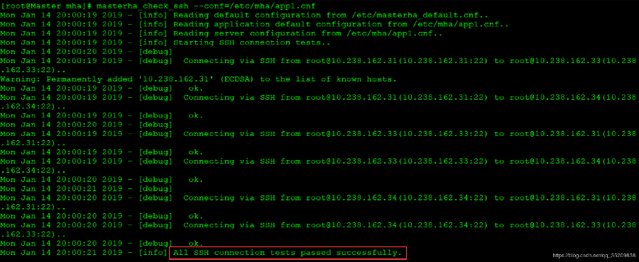

### 检查集群的健康状态

失败原因大该有以下几点，这个总结下：

1. 写binlog和复制过滤规则主从必须相同。

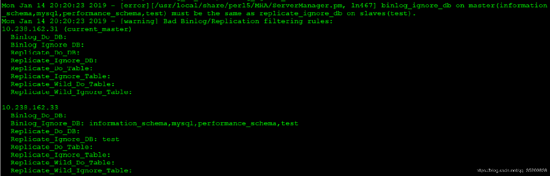

2. 找不到命令问题，解决方法，为命令建立软连接。

   ```
   ln -s /usr/local/mysql/bin/mysqlbinlog /usr/local/bin/
   
   ln -s /usr/local/mysql/bin/mysql /usr/local/bin/
   ```

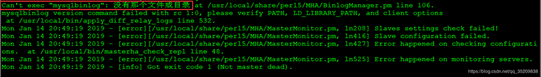


masterha_check_repl --conf=/etc/mha/app1.cnf

  ```
[root@Master ~]#  masterha_check_repl --conf=/etc/mha/app1.cnf 

Mon Jan 14 20:56:21 2019 - [info] Reading default configuration from /etc/masterha_default.cnf.. 

Mon Jan 14 20:56:21 2019 - [info] Reading application default configuration from /etc/mha/app1.cnf.. 
Mon Jan 14 20:56:21 2019 - [info] Reading server configuration from /etc/mha/app1.cnf.. 
Mon Jan 14 20:56:21 2019 - [info] MHA::MasterMonitor version 0.58. 
Mon Jan 14 20:56:23 2019 - [info] GTID failover mode = 0 
Mon Jan 14 20:56:23 2019 - [info] Dead Servers: 
Mon Jan 14 20:56:23 2019 - [info] Alive Servers: 
Mon Jan 14 20:56:23 2019 - [info]  10.238.162.31(10.238.162.31:3306) 
Mon Jan 14 20:56:23 2019 - [info]  10.238.162.33(10.238.162.33:3306) 
Mon Jan 14 20:56:23 2019 - [info]  10.238.162.34(10.238.162.34:3306) 
Mon Jan 14 20:56:23 2019 - [info] Alive Slaves: 
Mon Jan 14 20:56:23 2019 - [info]  10.238.162.33(10.238.162.33:3306)  Version=5.7.21-log (oldest major version between slaves) log-bin:enabled 
Mon Jan 14 20:56:23 2019 - [info]   Replicating from 10.238.162.31(10.238.162.31:3306) 
Mon Jan 14 20:56:23 2019 - [info]  10.238.162.34(10.238.162.34:3306)  Version=5.7.21-log (oldest major version between slaves) log-bin:enabled 
Mon Jan 14 20:56:23 2019 - [info]   Replicating from 10.238.162.31(10.238.162.31:3306) 
Mon Jan 14 20:56:23 2019 - [info] Current Alive Master: 10.238.162.31(10.238.162.31:3306) 
Mon Jan 14 20:56:23 2019 - [info] Checking slave configurations.. 
Mon Jan 14 20:56:23 2019 - [info]  read_only=1 is not set on slave 10.238.162.33(10.238.162.33:3306). 
Mon Jan 14 20:56:23 2019 - [info]  read_only=1 is not set on slave 10.238.162.34(10.238.162.34:3306). 
Mon Jan 14 20:56:23 2019 - [warning]  relay_log_purge=0 is not set on slave 10.238.162.34(10.238.162.34:3306). 
Mon Jan 14 20:56:23 2019 - [info] Checking replication filtering settings.. 
Mon Jan 14 20:56:23 2019 - [info]  binlog_do_db= , binlog_ignore_db=  
Mon Jan 14 20:56:23 2019 - [info]  Replication filtering check ok. 
Mon Jan 14 20:56:23 2019 - [info] GTID (with auto-pos) is not supported 
Mon Jan 14 20:56:23 2019 - [info] Starting SSH connection tests.. 
Mon Jan 14 20:56:25 2019 - [info] All SSH connection tests passed successfully. 
Mon Jan 14 20:56:25 2019 - [info] Checking MHA Node version.. 
Mon Jan 14 20:56:26 2019 - [info]  Version check ok. 
Mon Jan 14 20:56:26 2019 - [info] Checking SSH publickey authentication settings on the current master.. 
Mon Jan 14 20:56:26 2019 - [info] HealthCheck: SSH to 10.238.162.31 is reachable. 
Mon Jan 14 20:56:26 2019 - [info] Master MHA Node version is 0.58. 
Mon Jan 14 20:56:26 2019 - [info] Checking recovery script configurations on 10.238.162.31(10.238.162.31:3306).. 
Mon Jan 14 20:56:26 2019 - [info]  Executing command: save_binary_logs --command=test --start_pos=4 --binlog_dir=/server/mysql_data --output_file=/server/mha_tmp/save_binary_logs_test --manager_version=0.58 --start_file=mysql-bin.000010  
Mon Jan 14 20:56:26 2019 - [info]  Connecting to root@10.238.162.31(10.238.162.31:22)..   Creating /server/mha_tmp if not exists..   ok.  Checking output directory is accessible or not..   ok.  Binlog found at /server/mysql_data, up to mysql-bin.000010 
Mon Jan 14 20:56:27 2019 - [info] Binlog setting check done. 
Mon Jan 14 20:56:27 2019 - [info] Checking SSH publickey authentication and checking recovery script configurations on all alive slave servers.. 
Mon Jan 14 20:56:27 2019 - [info]  Executing command : apply_diff_relay_logs --command=test --slave_user='mha' --slave_host=10.238.162.33 --slave_ip=10.238.162.33 --slave_port=3306 --workdir=/server/mha_tmp --target_version=5.7.21-log --manager_version=0.58 --relay_dir=/server/mysql_data --current_relay_log=relay-bin.000005  --slave_pass=xxx 

Mon Jan 14 20:56:27 2019 - [info]  Connecting to root@10.238.162.33(10.238.162.33:22)..   
Checking slave recovery environment settings..   
Relay log found at /server/mysql_data, up to relay-bin.000008   
Temporary relay log file is /server/mysql_data/relay-bin.000008   
Checking if super_read_only is defined and turned on.. not present or turned off, ignoring.   
Testing mysql connection and privileges.. 
mysql: [Warning] Using a password on the command line interface can be insecure.  done.   
Testing mysqlbinlog output.. done.   
Cleaning up test file(s).. done. 

Mon Jan 14 20:56:27 2019 - [info]  Executing command : apply_diff_relay_logs --command=test --slave_user='mha' --slave_host=10.238.162.34 --slave_ip=10.238.162.34 --slave_port=3306 --workdir=/server/mha_tmp --target_version=5.7.21-log --manager_version=0.58 --relay_log_info=/server/mysql_data/relay-log.info  --relay_dir=/server/mysql_data/ --slave_pass=xxx 
Mon Jan 14 20:56:27 2019 - [info]  Connecting to root@10.238.162.34(10.238.162.34:22)..   
Checking slave recovery environment settings..   Opening /server/mysql_data/relay-log.info ... ok.   
Relay log found at /server/mysql_data, up to slave02-relay-bin.000006   
Temporary relay log file is /server/mysql_data/slave02-relay-bin.000006   
Checking if super_read_only is defined and turned on.. not present or turned off, ignoring.   
Testing mysql connection and privileges.. 
mysql: [Warning] Using a password on the command line interface can be insecure.  done.   
Testing mysqlbinlog output.. done.   
Cleaning up test file(s).. done. 

Mon Jan 14 20:56:28 2019 - [info] Slaves settings check done. 
Mon Jan 14 20:56:28 2019 - [info]  10.238.162.31(10.238.162.31:3306) (current master)  +--10.238.162.33(10.238.162.33:3306)  
+--10.238.162.34(10.238.162.34:3306)

Mon Jan 14 20:56:28 2019 - [info] Checking replication health on 10.238.162.33.. 
Mon Jan 14 20:56:28 2019 - [info]  ok. 
Mon Jan 14 20:56:28 2019 - [info] Checking replication health on 10.238.162.34.. 
Mon Jan 14 20:56:28 2019 - [info]  ok. 
Mon Jan 14 20:56:28 2019 - [warning] master_ip_failover_script is not defined. 
Mon Jan 14 20:56:28 2019 - [warning] shutdown_script is not defined. 
Mon Jan 14 20:56:28 2019 - [info] Got exit code 0 (Not master dead).

MySQL Replication Health is OK.
  ```

### 启停MHA manager监控

- 查看MHA manager监控状态，这里没有运行

  ```
  masterha_check_status --conf=/etc/mha/app1.cnf
  
  app1 is stopped(2:NOT_RUNNING).
  ```

- 启动MHA监控 

  ```
  #--remove_dead_master_conf --ignore_last_failover
  
  nohup masterha_manager --conf=/etc/mha/app1.cnf --remove_dead_master_conf --ignore_last_failover &
  ```

- 停止MHA监控

  ```
  masterha_stop --conf=/etc/mha/app1.cnf
  ```

  

### 创建自动清除relay log脚本

MHA在发生切换的过程中，从库的恢复过程中依赖于relay log的相关信息，所以这里要将relay log的自动清除设置为OFF，采用手动清除relay log的方式。在默认情况下，从服务器上的中继日志会在SQL线程执行完毕后被自动删除。

但是在MHA环境中，这些中继日志在恢复其他从服务器时可能会被用到，因此需要禁用中继日志的自动删除功能。

定期清除中继日志需要考虑到复制延时的问题。在ext3的文件系统下，删除大的文件需要一定的时间，会导致严重的复制延时。

为了避免复制延时，需要暂时为中继日志创建硬链接，因为在linux系统中通过硬链接删除大文件速度会很快。（在mysql数据库中，删除大表时，通常也采用建立硬链接的方式）

MHA节点中包含了pure_relay_logs命令工具，它可以为中继日志创建硬链接，执行SET GLOBAL relay_log_purge=1,等待几秒钟以便SQL线程切换到新的中继日志，再执行SET GLOBAL relay_log_purge=0。

**清理日志脚本**

cat purge_relay_log.sh

```
#!/bin/bash

#数据库用户名密码端口
 user=root
 passwd=root
 port=3306

#脚本日志存放路径
 log_dir='/server/mha/app1'

#指定创建relay log的硬链接的位置，默认是/var/tmp。
# 由于系统不同分区创建硬链接文件会失败，故需要执行硬链接具体位置，成功执行脚本后，硬链接的中继日志文件被删除。
 work_dir='/server/mha'
 
#删除中继日志脚本
 purge='/usr/local/bin/purge_relay_logs'

if [ ! -d $log_dir ]
 then
   mkdir $log_dir -p
fi

#--disable_relay_log_purge ：默认情况下，如果relay_log_purge=1，脚本会什么都不清理，自动退出。通过设定这个参数，当relay_log_purge=1的情况下会将relay_log_purge设置为0。清理relay log之后，最后将参数设置为OFF。

 $purge --user=$user --password=$passwd --disable_relay_log_purge --port=$port --workdir=$work_dir >> $log_dir/purge_relay_logs.log 2>&1
```

并授予可执行权限 

```
chmod +x purge_relay_log.sh
```

添加至定时任务

```
00 03 * * * /bin/bash /root/purge_relay_log.sh
```

手动执行脚本查看输出 ：看大神的博客说建立硬链接删除日志，这里并没有展示出来。

```
#  /usr/local/bin/purge_relay_logs --user=root --password=root --disable_relay_log_purge --port=3306 --workdir=/server/mha
 2019-01-17 16:07:07: purge_relay_logs script started.
  Found relay_log.info: /server/mysql_data/relay-log.info
  Opening /server/mysql_data/slave02-relay-bin.000003 ..
  Opening /server/mysql_data/slave02-relay-bin.000004 ..
  Executing SET GLOBAL relay_log_purge=1; FLUSH LOGS; sleeping a few seconds so that SQL thread can delete older relay log files (if it keeps up); SET GLOBAL relay_log_purge=0; .. ok.
 2019-01-17 16:07:10: All relay log purging operations succeeded. 
```


### 使用keepalived配置VIP

vip配置可以采用两种方式，一种通过keepalived的方式管理虚拟ip的浮动；另外一种通过脚本方式启动虚拟ip的方式（即不需要keepalived或者heartbeat类似的软件）

安装keepalived ，安装keepalived时遇到挺多问题，这里选择1.2.12版本，安装时没有问题的。在master31 和 candidate master 33上安装

- 下载源码包

  ```
  wget http://www.keepalived.org/software/keepalived-1.2.12.tar.gz
  ```

- 解压

  ```
  tar zxf keepalived-1.2.12.tar.gz 
  
  cd keepalived-1.2.12
  ```

- 编译安装

  ```
  ./configure --prefix=/usr/local/keepalived
  
  make && make install
  ```

- 拷贝启动命令

  ```
  cp /usr/local/keepalived/etc/rc.d/init.d/keepalived /etc/init.d/keepalived
  
  cp /usr/local/keepalived/etc/sysconfig/keepalived /etc/sysconfig/
  ```

- 拷贝配置文件

  ```
  mkdir /etc/keepalived
  
  cp /usr/local/keepalived/etc/keepalived/keepalived.conf /etc/keepalived/
  
  cp /usr/local/keepalived/sbin/keepalived /usr/sbin/
  ```

- 配置文件如下：

  其中router_id MySQL HA表示设定keepalived组的名称，将10.238.162.100这个虚拟ip绑定到该主机的ens160网卡上，并且设置了状态为backup模式，将keepalived的模式设置为非抢占模式（nopreempt），priority 150表示设置的优先级为150。下面的配置略有不同，但是都是一个意思。

**keepalived配置文件**

\#31服务器

```
# cat /etc/keepalived/keepalived.conf ! Configuration File for keepalived
global_defs {    notification_email {    saltstack@163.com   }   notification_email_from dba@dbserver.com   smtp_server 127.0.0.1   smtp_connect_timeout 30   router_id MySQL-HA }
vrrp_instance VI_1 {   state BACKUP   interface ens160   virtual_router_id 51   priority 150   advert_int 1   nopreempt
  authentication {   auth_type PASS   auth_pass 1111   }
  virtual_ipaddress {     10.238.162.100   } }
```

\#33服务器

```
# cat /etc/keepalived/keepalived.conf ! Configuration File for keepalived
global_defs {    notification_email {    saltstack@163.com   }   notification_email_from dba@dbserver.com   smtp_server 127.0.0.1   smtp_connect_timeout 30   router_id MySQL-HA }
vrrp_instance VI_1 {   state BACKUP   interface ens160   virtual_router_id 51   priority 120   advert_int 1   nopreempt
  authentication {   auth_type PASS   auth_pass 1111   }
  virtual_ipaddress {     10.238.162.100   } }
```

31服务器启动keepalived

```
/etc/init.d/keepalived start

Starting keepalived (via systemctl):     [ 确定 ]
```

日志输出如下 tail -100 /var/log/messages 

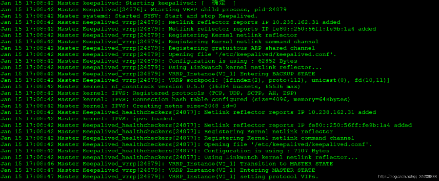

33服务器启动keepalived 

/etc/init.d/keepalived start

日志输出部分

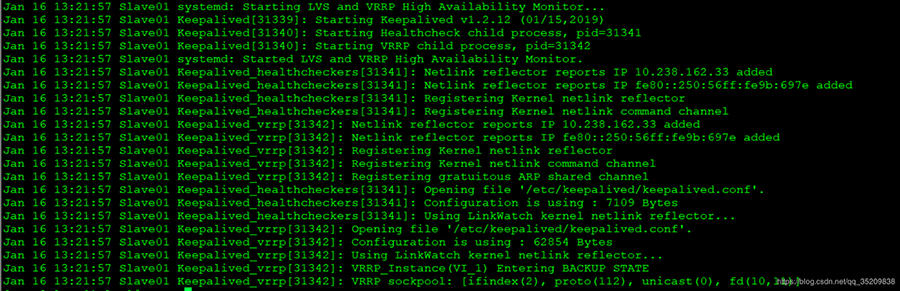

查看vip绑定状况 ：可以看到虚拟IP10.238.162.100已经绑定到了10.238.162.31服务器的ens160网卡上。

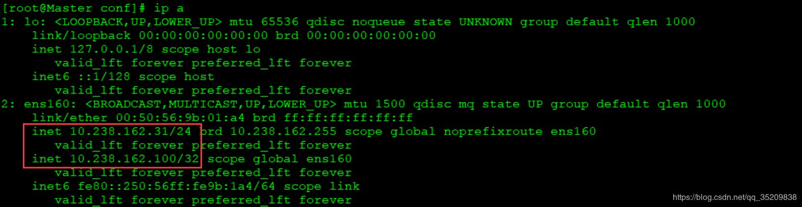

**MHA引入keepalived**

MySQL服务进程挂掉时通过MHA 停止keepalived:

要想把keepalived服务引入MHA，我们只需要修改切换是触发的脚本文件master_ip_failover即可，在该脚本中添加在master发生宕机时对keepalived的处理。

编辑**自动故障转移脚本**/usr/local/bin/master_ip_failover，修改后如下（10.238.162.31）操作：

```
# cat master_ip_failover #!/usr/bin/env perl use strict; use warnings FATAL => 'all';
use Getopt::Long;
my (   $command,      $ssh_user,     $orig_master_host, $orig_master_ip,   $orig_master_port, $new_master_host, $new_master_ip,   $new_master_port );
my $vip = '10.238.162.100'; my $ssh_start_vip = "/etc/init.d/keepalived start"; my $ssh_stop_vip = "/etc/init.d/keepalived stop";
GetOptions(   'command=s'      => \$command,   'ssh_user=s'     => \$ssh_user,   'orig_master_host=s' => \$orig_master_host,   'orig_master_ip=s'  => \$orig_master_ip,   'orig_master_port=i' => \$orig_master_port,   'new_master_host=s'  => \$new_master_host,   'new_master_ip=s'   => \$new_master_ip,   'new_master_port=i'  => \$new_master_port, );
exit &main();
sub main {
  print "\n\nIN SCRIPT TEST====$ssh_stop_vip==$ssh_start_vip===\n\n";
  if ( $command eq "stop" || $command eq "stopssh" ) {
    my $exit_code = 1;     eval {       print "Disabling the VIP on old master: $orig_master_host \n";       &stop_vip();       $exit_code = 0;     };     if ($@) {       warn "Got Error: $@\n";       exit $exit_code;     }     exit $exit_code;   }   elsif ( $command eq "start" ) {
    my $exit_code = 10;     eval {       print "Enabling the VIP - $vip on the new master - $new_master_host \n";       &start_vip();       $exit_code = 0;     };     if ($@) {       warn $@;       exit $exit_code;     }     exit $exit_code;   }   elsif ( $command eq "status" ) {     print "Checking the Status of the script.. OK \n";     exit 0;   }   else {     &usage();     exit 1;   } } sub start_vip() {   `ssh $ssh_user\@$new_master_host \" $ssh_start_vip \"`; } # A simple system call that disable the VIP on the old_master sub stop_vip() {   `ssh $ssh_user\@$orig_master_host \" $ssh_stop_vip \"`; }
sub usage {   print   "Usage: master_ip_failover --command=start|stop|stopssh|status --orig_master_host=host --orig_master_ip=ip --orig_master_port=port --new_master_host=host --new_master_ip=ip --new_master_port=port\n"; }
```

 将mha配置文件中#master_ip_failover_script= /usr/local/bin/master_ip_failover打开

```
[root@Master bin]# grep 'master_ip_failover_script' /etc/mha/app1.cnf

master_ip_failover_script=/usr/local/bin/master_ip_failover
```

再次执行检查 

```
masterha_check_repl --conf=/etc/mha/app1.cnf

MySQL Replication Health is OK. 
```


### 使用脚本引入VIP

通过脚本的方式管理VIP。这里是修改/usr/local/bin/master_ip_failover。修改完成后内容如下，而且如果使用脚本管理vip的话，需要手动在master服务器上绑定一个vip。

/sbin/ifconfig ens160:1 10.238.162.100/24

通过脚本引入VIP的实验不在演示，我自己做了自动切换的实验是可以的。大家可以自己做做实验看看日志输出理解原理。脚本如下供参考，需要根据自己环境修改VIP与网卡等信息

```
# cat master_ip_failover #!/usr/bin/env perl
use strict; use warnings FATAL => 'all';
use Getopt::Long;
my (   $command,      $ssh_user,     $orig_master_host, $orig_master_ip,   $orig_master_port, $new_master_host, $new_master_ip,   $new_master_port );
my $vip = '10.238.162.100/24'; my $key = '1'; my $ssh_start_vip = "/sbin/ifconfig ens160:$key $vip"; my $ssh_stop_vip = "/sbin/ifconfig ens160:$key down";
GetOptions(   'command=s'      => \$command,   'ssh_user=s'     => \$ssh_user,   'orig_master_host=s' => \$orig_master_host,   'orig_master_ip=s'  => \$orig_master_ip,   'orig_master_port=i' => \$orig_master_port,   'new_master_host=s'  => \$new_master_host,   'new_master_ip=s'   => \$new_master_ip,   'new_master_port=i'  => \$new_master_port, );
exit &main();
sub main {
  print "\n\nIN SCRIPT TEST====$ssh_stop_vip==$ssh_start_vip===\n\n";
  if ( $command eq "stop" || $command eq "stopssh" ) {
    my $exit_code = 1;     eval {       print "Disabling the VIP on old master: $orig_master_host \n";       &stop_vip();       $exit_code = 0;     };     if ($@) {       warn "Got Error: $@\n";       exit $exit_code;     }     exit $exit_code;   }   elsif ( $command eq "start" ) {
    my $exit_code = 10;     eval {       print "Enabling the VIP - $vip on the new master - $new_master_host \n";       &start_vip();       $exit_code = 0;     };     if ($@) {       warn $@;       exit $exit_code;     }     exit $exit_code;   }   elsif ( $command eq "status" ) {     print "Checking the Status of the script.. OK \n";     exit 0;   }   else {     &usage();     exit 1;   } }
sub start_vip() {   `ssh $ssh_user\@$new_master_host \" $ssh_start_vip \"`; } sub stop_vip() {    return 0  unless ($ssh_user);   `ssh $ssh_user\@$orig_master_host \" $ssh_stop_vip \"`; }
sub usage {   print   "Usage: master_ip_failover --command=start|stop|stopssh|status --orig_master_host=host --orig_master_ip=ip --orig_master_port=port --new_master_host=host --new_master_ip=ip --new_master_port=port\n"; }
```

 

## 实验验证

### 1 测试自动切换

在31服务器上停止MySQL进程

\# /etc/init.d/mysqld stop
 Shutting down MySQL............ SUCCESS! 

查看MHA manager日志（建议阅读切换日志，明白MHA工作原理） 31上的MySQL服务挂掉，33成为新的master，34成为33的slave。

```
cat /server/mha/app1/manager.log

Wed Jan 16 16:41:23 2019 - [warning] Got error on MySQL select ping: 2006 (MySQL server has gone away) 
Wed Jan 16 16:41:23 2019 - [info] Executing secondary network check script: /usr/local/bin/masterha_secondary_check -s 10.238 .162.33 -s 10.238.162.34 --user=root --port=22 --master_host=10.238.162.31 --master_port=3306  --user=root --master_host=10. 238.162.31  --master_ip=10.238.162.31 --master_port=3306 --master_user=mha --master_password=123456 --ping_type=SELECT 
Wed Jan 16 16:41:23 2019 - [info] Executing SSH check script: save_binary_logs --command=test --start_pos=4 --binlog_dir=/ser ver/mysql_data --output_file=/server/mha_tmp/save_binary_logs_test --manager_version=0.58 --binlog_prefix=mysql-bin 
Wed Jan 16 16:41:23 2019 - [info] HealthCheck: SSH to 10.238.162.31 is reachable. Monitoring server 10.238.162.33 is reachable, Master is not reachable from 10.238.162.33. OK. Monitoring server 10.238.162.34 is reachable, Master is not reachable from 10.238.162.34. OK. 
Wed Jan 16 16:41:24 2019 - [info] Master is not reachable from all other monitoring servers. Failover should start. 
Wed Jan 16 16:41:26 2019 - [warning] Got error on MySQL connect: 2003 (Can't connect to MySQL server on '10.238.162.31' (111) ) 
Wed Jan 16 16:41:26 2019 - [warning] Connection failed 2 time(s).. 
Wed Jan 16 16:41:29 2019 - [warning] Got error on MySQL connect: 2003 (Can't connect to MySQL server on '10.238.162.31' (111) ) 
Wed Jan 16 16:41:29 2019 - [warning] Connection failed 3 time(s).. 
Wed Jan 16 16:41:32 2019 - [warning] Got error on MySQL connect: 2003 (Can't connect to MySQL server on '10.238.162.31' (111) ) 
Wed Jan 16 16:41:32 2019 - [warning] Connection failed 4 time(s).. 
Wed Jan 16 16:41:32 2019 - [warning] Master is not reachable from health checker! 
Wed Jan 16 16:41:32 2019 - [warning] Master 10.238.162.31(10.238.162.31:3306) is not reachable! 
Wed Jan 16 16:41:32 2019 - [warning] SSH is reachable. 
Wed Jan 16 16:41:32 2019 - [info] Connecting to a master server failed. Reading configuration file /etc/masterha_default.cnf  and /etc/mha/app1.cnf again, and trying to connect to all servers to check server status.. 
Wed Jan 16 16:41:32 2019 - [warning] Global configuration file /etc/masterha_default.cnf not found. Skipping. 
Wed Jan 16 16:41:32 2019 - [info] Reading application default configuration from /etc/mha/app1.cnf.. 
Wed Jan 16 16:41:32 2019 - [info] Reading server configuration from /etc/mha/app1.cnf.. 
Wed Jan 16 16:41:33 2019 - [info] GTID failover mode = 0 
Wed Jan 16 16:41:33 2019 - [info] Dead Servers: 
Wed Jan 16 16:41:33 2019 - [info]  10.238.162.31(10.238.162.31:3306) 
Wed Jan 16 16:41:33 2019 - [info] Alive Servers: 
Wed Jan 16 16:41:33 2019 - [info]  10.238.162.33(10.238.162.33:3306) 
Wed Jan 16 16:41:33 2019 - [info]  10.238.162.34(10.238.162.34:3306) 
Wed Jan 16 16:41:33 2019 - [info] Alive Slaves: 
Wed Jan 16 16:41:33 2019 - [info]  10.238.162.33(10.238.162.33:3306)  Version=5.7.21-log (oldest major version between slave s) log-bin:enabled 
Wed Jan 16 16:41:33 2019 - [info]   Replicating from 10.238.162.31(10.238.162.31:3306) 
Wed Jan 16 16:41:33 2019 - [info]   Primary candidate for the new Master (candidate_master is set) 
Wed Jan 16 16:41:33 2019 - [info]  10.238.162.34(10.238.162.34:3306)  Version=5.7.21-log (oldest major version between slave s) log-bin:enabled 
Wed Jan 16 16:41:33 2019 - [info]   Replicating from 10.238.162.31(10.238.162.31:3306) 
Wed Jan 16 16:41:33 2019 - [info] Checking slave configurations.. 
Wed Jan 16 16:41:33 2019 - [info]  read_only=1 is not set on slave 10.238.162.34(10.238.162.34:3306). 
Wed Jan 16 16:41:33 2019 - [info] Checking replication filtering settings.. 
Wed Jan 16 16:41:33 2019 - [info]  Replication filtering check ok. 
Wed Jan 16 16:41:33 2019 - [info] Master is down! 
Wed Jan 16 16:41:33 2019 - [info] Terminating monitoring script. 
Wed Jan 16 16:41:33 2019 - [info] Got exit code 20 (Master dead). 
Wed Jan 16 16:41:33 2019 - [info] MHA::MasterFailover version 0.58. 
Wed Jan 16 16:41:33 2019 - [info] Starting master failover. 
Wed Jan 16 16:41:33 2019 - [info]  
Wed Jan 16 16:41:33 2019 - [info] * Phase 1: Configuration Check Phase.. 
Wed Jan 16 16:41:33 2019 - [info]  
Wed Jan 16 16:41:34 2019 - [info] GTID failover mode = 0 
Wed Jan 16 16:41:34 2019 - [info] Dead Servers: 
Wed Jan 16 16:41:34 2019 - [info]  10.238.162.31(10.238.162.31:3306) 
Wed Jan 16 16:41:34 2019 - [info] Checking master reachability via MySQL(double check)... 
Wed Jan 16 16:41:34 2019 - [info]  ok. 
Wed Jan 16 16:41:34 2019 - [info] Alive Servers: 
Wed Jan 16 16:41:34 2019 - [info]  10.238.162.33(10.238.162.33:3306) 
Wed Jan 16 16:41:34 2019 - [info]  10.238.162.34(10.238.162.34:3306) 
Wed Jan 16 16:41:34 2019 - [info] Alive Slaves: 
Wed Jan 16 16:41:34 2019 - [info]  10.238.162.33(10.238.162.33:3306)  Version=5.7.21-log (oldest major version between slave s) log-bin:enabled 
Wed Jan 16 16:41:34 2019 - [info]   Replicating from 10.238.162.31(10.238.162.31:3306) 
Wed Jan 16 16:41:34 2019 - [info]   Primary candidate for the new Master (candidate_master is set) 
Wed Jan 16 16:41:34 2019 - [info]  10.238.162.34(10.238.162.34:3306)  Version=5.7.21-log (oldest major version between slave s) log-bin:enabled 
Wed Jan 16 16:41:34 2019 - [info]   Replicating from 10.238.162.31(10.238.162.31:3306) 
Wed Jan 16 16:41:34 2019 - [info] Starting Non-GTID based failover. 
Wed Jan 16 16:41:34 2019 - [info]  
Wed Jan 16 16:41:34 2019 - [info] ** Phase 1: Configuration Check Phase completed. 
Wed Jan 16 16:41:34 2019 - [info]  
Wed Jan 16 16:41:34 2019 - [info] * Phase 2: Dead Master Shutdown Phase.. 
Wed Jan 16 16:41:34 2019 - [info]  
Wed Jan 16 16:41:34 2019 - [info] Forcing shutdown so that applications never connect to the current master.. 
Wed Jan 16 16:41:34 2019 - [info] Executing master IP deactivation script: 
Wed Jan 16 16:41:34 2019 - [info]  /usr/local/bin/master_ip_failover --orig_master_host=10.238.162.31 --orig_master_ip=10.23 8.162.31 --orig_master_port=3306 --command=stopssh --ssh_user=root  
 IN SCRIPT TEST====/etc/init.d/keepalived stop==/etc/init.d/keepalived start===
Disabling the VIP on old master: 10.238.162.31  
Wed Jan 16 16:41:35 2019 - [info]  done. 
Wed Jan 16 16:41:35 2019 - [warning] shutdown_script is not set. Skipping explicit shutting down of the dead master. 
Wed Jan 16 16:41:35 2019 - [info] * Phase 2: Dead Master Shutdown Phase completed. 
Wed Jan 16 16:41:35 2019 - [info]  
Wed Jan 16 16:41:35 2019 - [info] * Phase 3: Master Recovery Phase.. 
Wed Jan 16 16:41:35 2019 - [info]  
Wed Jan 16 16:41:35 2019 - [info] * Phase 3.1: Getting Latest Slaves Phase.. 
Wed Jan 16 16:41:35 2019 - [info]  
Wed Jan 16 16:41:35 2019 - [info] The latest binary log file/position on all slaves is mysql-bin.000010:306 
Wed Jan 16 16:41:35 2019 - [info] Latest slaves (Slaves that received relay log files to the latest): 
Wed Jan 16 16:41:35 2019 - [info]  10.238.162.33(10.238.162.33:3306)  Version=5.7.21-log (oldest major version between slave s) log-bin:enabled 
Wed Jan 16 16:41:35 2019 - [info]   Replicating from 10.238.162.31(10.238.162.31:3306) 
Wed Jan 16 16:41:35 2019 - [info]   Primary candidate for the new Master (candidate_master is set) 
Wed Jan 16 16:41:35 2019 - [info]  10.238.162.34(10.238.162.34:3306)  Version=5.7.21-log (oldest major version between slave s) log-bin:enabled 
Wed Jan 16 16:41:35 2019 - [info]   Replicating from 10.238.162.31(10.238.162.31:3306) 
Wed Jan 16 16:41:35 2019 - [info] The oldest binary log file/position on all slaves is mysql-bin.000010:306 
Wed Jan 16 16:41:35 2019 - [info] Oldest slaves: 
Wed Jan 16 16:41:35 2019 - [info]  10.238.162.33(10.238.162.33:3306)  Version=5.7.21-log (oldest major version between slave s) log-bin:enabled 
Wed Jan 16 16:41:35 2019 - [info]   Replicating from 10.238.162.31(10.238.162.31:3306) 
Wed Jan 16 16:41:35 2019 - [info]   Primary candidate for the new Master (candidate_master is set) 
Wed Jan 16 16:41:35 2019 - [info]  10.238.162.34(10.238.162.34:3306)  Version=5.7.21-log (oldest major version between slave s) log-bin:enabled 
Wed Jan 16 16:41:35 2019 - [info]   Replicating from 10.238.162.31(10.238.162.31:3306) 
Wed Jan 16 16:41:35 2019 - [info]  
Wed Jan 16 16:41:35 2019 - [info] * Phase 3.2: Saving Dead Master's Binlog Phase.. 
Wed Jan 16 16:41:35 2019 - [info]  
Wed Jan 16 16:41:35 2019 - [info] Fetching dead master's binary logs.. 
Wed Jan 16 16:41:35 2019 - [info] Executing command on the dead master 10.238.162.31(10.238.162.31:3306): save_binary_logs -- command=save --start_file=mysql-bin.000010  --start_pos=306 --binlog_dir=/server/mysql_data --output_file=/server/mha_tmp/sav ed_master_binlog_from_10.238.162.31_3306_20190116164133.binlog --handle_raw_binlog=1 --disable_log_bin=0 --manager_version=0.58  Creating /server/mha_tmp if not exists..   ok.  Concat binary/relay logs from mysql-bin.000010 pos 306 to mysql-bin.000010 EOF into /server/mha_tmp/saved_master_binlog_from _10.238.162.31_3306_20190116164133.binlog ..  Binlog Checksum enabled  Dumping binlog format description event, from position 0 to 154.. ok.  Dumping effective binlog data from /server/mysql_data/mysql-bin.000010 position 306 to tail(329).. ok.  Binlog Checksum enabled  Concat succeeded. 
Wed Jan 16 16:41:36 2019 - [info] scp from root@10.238.162.31:/server/mha_tmp/saved_master_binlog_from_10.238.162.31_3306_201 90116164133.binlog to local:/server/mha/app1/saved_master_binlog_from_10.238.162.31_3306_20190116164133.binlog succeeded. 
Wed Jan 16 16:41:36 2019 - [info] HealthCheck: SSH to 10.238.162.33 is reachable. 
Wed Jan 16 16:41:37 2019 - [info] HealthCheck: SSH to 10.238.162.34 is reachable. 
Wed Jan 16 16:41:37 2019 - [info]  
Wed Jan 16 16:41:37 2019 - [info] * Phase 3.3: Determining New Master Phase.. 
Wed Jan 16 16:41:37 2019 - [info]  
Wed Jan 16 16:41:37 2019 - [info] Finding the latest slave that has all relay logs for recovering other slaves.. 
Wed Jan 16 16:41:37 2019 - [info] All slaves received relay logs to the same position. No need to resync each other. 
Wed Jan 16 16:41:37 2019 - [info] Searching new master from slaves.. 
Wed Jan 16 16:41:37 2019 - [info]  Candidate masters from the configuration file: 
Wed Jan 16 16:41:37 2019 - [info]  10.238.162.33(10.238.162.33:3306)  Version=5.7.21-log (oldest major version between slave s) log-bin:enabled 
Wed Jan 16 16:41:37 2019 - [info]   Replicating from 10.238.162.31(10.238.162.31:3306) 
Wed Jan 16 16:41:37 2019 - [info]   Primary candidate for the new Master (candidate_master is set) 
Wed Jan 16 16:41:37 2019 - [info]  Non-candidate masters: 
Wed Jan 16 16:41:37 2019 - [info]  Searching from candidate_master slaves which have received the latest relay log events.. 
Wed Jan 16 16:41:37 2019 - [info] New master is 10.238.162.33(10.238.162.33:3306) 
Wed Jan 16 16:41:37 2019 - [info] Starting master failover.. 
Wed Jan 16 16:41:37 2019 - [info]  From: 10.238.162.31(10.238.162.31:3306) (current master)  +--10.238.162.33(10.238.162.33:3306)  +--10.238.162.34(10.238.162.34:3306)
To: 10.238.162.33(10.238.162.33:3306) (new master)  +--10.238.162.34(10.238.162.34:3306) 
Wed Jan 16 16:41:37 2019 - [info]  
Wed Jan 16 16:41:37 2019 - [info] * Phase 3.4: New Master Diff Log Generation Phase.. 
Wed Jan 16 16:41:37 2019 - [info]  
Wed Jan 16 16:41:37 2019 - [info]  This server has all relay logs. No need to generate diff files from the latest slave. 
Wed Jan 16 16:41:37 2019 - [info] Sending binlog.. 
Wed Jan 16 16:41:37 2019 - [info] scp from local:/server/mha/app1/saved_master_binlog_from_10.238.162.31_3306_20190116164133. binlog to root@10.238.162.33:/server/mha_tmp/saved_master_binlog_from_10.238.162.31_3306_20190116164133.binlog succeeded. 
Wed Jan 16 16:41:37 2019 - [info]  
Wed Jan 16 16:41:37 2019 - [info] * Phase 3.5: Master Log Apply Phase.. 
Wed Jan 16 16:41:37 2019 - [info]  
Wed Jan 16 16:41:37 2019 - [info] *NOTICE: If any error happens from this phase, manual recovery is needed. 
Wed Jan 16 16:41:37 2019 - [info] Starting recovery on 10.238.162.33(10.238.162.33:3306).. 
Wed Jan 16 16:41:37 2019 - [info]  Generating diffs succeeded. 
Wed Jan 16 16:41:37 2019 - [info] Waiting until all relay logs are applied. 
Wed Jan 16 16:41:37 2019 - [info]  done. 
Wed Jan 16 16:41:37 2019 - [info] Getting slave status.. 
Wed Jan 16 16:41:37 2019 - [info] This slave(10.238.162.33)'s Exec_Master_Log_Pos equals to Read_Master_Log_Pos(mysql-bin.000 010:306). No need to recover from Exec_Master_Log_Pos. 
Wed Jan 16 16:41:37 2019 - [info] Connecting to the target slave host 10.238.162.33, running recover script.. 
Wed Jan 16 16:41:37 2019 - [info] Executing command: apply_diff_relay_logs --command=apply --slave_user='mha' --slave_host=10 .238.162.33 --slave_ip=10.238.162.33  --slave_port=3306 --apply_files=/server/mha_tmp/saved_master_binlog_from_10.238.162.31_ 3306_20190116164133.binlog --workdir=/server/mha_tmp --target_version=5.7.21-log --timestamp=20190116164133 --handle_raw_binl og=1 --disable_log_bin=0 --manager_version=0.58 --slave_pass=xxx 
Wed Jan 16 16:41:38 2019 - [info]  MySQL client version is 5.7.21. Using --binary-mode. Applying differential binary/relay log files /server/mha_tmp/saved_master_binlog_from_10.238.162.31_3306_20190116164133.binlo g on 10.238.162.33:3306. This may take long time... Applying log files succeeded. 
Wed Jan 16 16:41:38 2019 - [info]  All relay logs were successfully applied. 
Wed Jan 16 16:41:38 2019 - [info] Getting new master's binlog name and position.. 
Wed Jan 16 16:41:38 2019 - [info]  Slave-mysql-bin.000004:458 
Wed Jan 16 16:41:38 2019 - [info]  All other slaves should start replication from here. Statement should be: CHANGE MASTER TO  MASTER_HOST='10.238.162.33', MASTER_PORT=3306, MASTER_LOG_FILE='Slave-mysql-bin.000004', MASTER_LOG_POS=458, MASTER_USER='re pl', MASTER_PASSWORD='xxx'; 
Wed Jan 16 16:41:38 2019 - [info] Executing master IP activate script: 
Wed Jan 16 16:41:38 2019 - [info]  /usr/local/bin/master_ip_failover --command=start --ssh_user=root --orig_master_host=10.2 38.162.31 --orig_master_ip=10.238.162.31 --orig_master_port=3306 --new_master_host=10.238.162.33 --new_master_ip=10.238.162.3 3 --new_master_port=3306 --new_master_user='mha'  --new_master_password=xxx Unknown option: new_master_user Unknown option: new_master_password
 IN SCRIPT TEST====/etc/init.d/keepalived stop==/etc/init.d/keepalived start===
Enabling the VIP - 10.238.162.100 on the new master - 10.238.162.33  
Wed Jan 16 16:41:38 2019 - [info]  OK. 
Wed Jan 16 16:41:38 2019 - [info] Setting read_only=0 on 10.238.162.33(10.238.162.33:3306).. 
Wed Jan 16 16:41:38 2019 - [info]  ok. 
Wed Jan 16 16:41:38 2019 - [info] ** Finished master recovery successfully. 
Wed Jan 16 16:41:38 2019 - [info] * Phase 3: Master Recovery Phase completed. 
Wed Jan 16 16:41:38 2019 - [info]  
Wed Jan 16 16:41:38 2019 - [info] * Phase 4: Slaves Recovery Phase.. 
Wed Jan 16 16:41:38 2019 - [info]  
Wed Jan 16 16:41:38 2019 - [info] * Phase 4.1: Starting Parallel Slave Diff Log Generation Phase.. 
Wed Jan 16 16:41:38 2019 - [info]  
Wed Jan 16 16:41:38 2019 - [info] -- Slave diff file generation on host 10.238.162.34(10.238.162.34:3306) started, pid: 28388 . Check tmp log /server/mha/app1/10.238.162.34_3306_20190116164133.log if it takes time.. 
Wed Jan 16 16:41:39 2019 - [info]  
Wed Jan 16 16:41:39 2019 - [info] Log messages from 10.238.162.34 ... 
Wed Jan 16 16:41:39 2019 - [info]  
Wed Jan 16 16:41:38 2019 - [info]  This server has all relay logs. No need to generate diff files from the latest slave. 
Wed Jan 16 16:41:39 2019 - [info] End of log messages from 10.238.162.34. 
Wed Jan 16 16:41:39 2019 - [info] -- 10.238.162.34(10.238.162.34:3306) has the latest relay log events. 
Wed Jan 16 16:41:39 2019 - [info] Generating relay diff files from the latest slave succeeded. 
Wed Jan 16 16:41:39 2019 - [info]  
Wed Jan 16 16:41:39 2019 - [info] * Phase 4.2: Starting Parallel Slave Log Apply Phase.. 
Wed Jan 16 16:41:39 2019 - [info]  
Wed Jan 16 16:41:39 2019 - [info] -- Slave recovery on host 10.238.162.34(10.238.162.34:3306) started, pid: 28390. Check tmp  log /server/mha/app1/10.238.162.34_3306_20190116164133.log if it takes time.. 
Wed Jan 16 16:41:40 2019 - [info]  
Wed Jan 16 16:41:40 2019 - [info] Log messages from 10.238.162.34 ... 
Wed Jan 16 16:41:40 2019 - [info]  
Wed Jan 16 16:41:39 2019 - [info] Sending binlog.. 
Wed Jan 16 16:41:39 2019 - [info] scp from local:/server/mha/app1/saved_master_binlog_from_10.238.162.31_3306_20190116164133. binlog to root@10.238.162.34:/server/mha_tmp/saved_master_binlog_from_10.238.162.31_3306_20190116164133.binlog succeeded. 
Wed Jan 16 16:41:39 2019 - [info] Starting recovery on 10.238.162.34(10.238.162.34:3306).. 
Wed Jan 16 16:41:39 2019 - [info]  Generating diffs succeeded. 
Wed Jan 16 16:41:39 2019 - [info] Waiting until all relay logs are applied. 
Wed Jan 16 16:41:39 2019 - [info]  done. 
Wed Jan 16 16:41:39 2019 - [info] Getting slave status.. 
Wed Jan 16 16:41:39 2019 - [info] This slave(10.238.162.34)'s Exec_Master_Log_Pos equals to Read_Master_Log_Pos(mysql-bin.000 010:306). No need to recover from Exec_Master_Log_Pos. 
Wed Jan 16 16:41:39 2019 - [info] Connecting to the target slave host 10.238.162.34, running recover script.. 
Wed Jan 16 16:41:39 2019 - [info] Executing command: apply_diff_relay_logs --command=apply --slave_user='mha' --slave_host=10 .238.162.34 --slave_ip=10.238.162.34  --slave_port=3306 --apply_files=/server/mha_tmp/saved_master_binlog_from_10.238.162.31_ 3306_20190116164133.binlog --workdir=/server/mha_tmp --target_version=5.7.21-log --timestamp=20190116164133 --handle_raw_binl og=1 --disable_log_bin=0 --manager_version=0.58 --slave_pass=xxx 
Wed Jan 16 16:41:40 2019 - [info]  MySQL client version is 5.7.21. Using --binary-mode. Applying differential binary/relay log files /server/mha_tmp/saved_master_binlog_from_10.238.162.31_3306_20190116164133.binlo g on 10.238.162.34:3306. This may take long time... Applying log files succeeded. 
Wed Jan 16 16:41:40 2019 - [info]  All relay logs were successfully applied. 
Wed Jan 16 16:41:40 2019 - [info]  Resetting slave 10.238.162.34(10.238.162.34:3306) and starting replication from the new ma ster 10.238.162.33(10.238.162.33:3306).. 
Wed Jan 16 16:41:40 2019 - [info]  Executed CHANGE MASTER. 
Wed Jan 16 16:41:40 2019 - [info]  Slave started. 
Wed Jan 16 16:41:40 2019 - [info] End of log messages from 10.238.162.34. 
Wed Jan 16 16:41:40 2019 - [info] -- Slave recovery on host 10.238.162.34(10.238.162.34:3306) succeeded. 
Wed Jan 16 16:41:40 2019 - [info] All new slave servers recovered successfully. 
Wed Jan 16 16:41:40 2019 - [info]  
Wed Jan 16 16:41:40 2019 - [info] * Phase 5: New master cleanup phase.. 
Wed Jan 16 16:41:40 2019 - [info]  
Wed Jan 16 16:41:40 2019 - [info] Resetting slave info on the new master.. 
Wed Jan 16 16:41:40 2019 - [info]  10.238.162.33: Resetting slave info succeeded. 
Wed Jan 16 16:41:40 2019 - [info] Master failover to 10.238.162.33(10.238.162.33:3306) completed successfully. 
Wed Jan 16 16:41:40 2019 - [info] Deleted server1 entry from /etc/mha/app1.cnf . 
Wed Jan 16 16:41:40 2019 - [info] 
----- Failover Report -----
app1: MySQL Master failover 10.238.162.31(10.238.162.31:3306) to 10.238.162.33(10.238.162.33:3306) succeeded
Master 10.238.162.31(10.238.162.31:3306) is down!
Check MHA Manager logs at Master:/server/mha/app1/manager.log for details.
Started automated(non-interactive) failover. Invalidated master IP address on 10.238.162.31(10.238.162.31:3306) The latest slave 10.238.162.33(10.238.162.33:3306) has all relay logs for recovery. Selected 10.238.162.33(10.238.162.33:3306) as a new master. 10.238.162.33(10.238.162.33:3306): OK: Applying all logs succeeded. 10.238.162.33(10.238.162.33:3306): OK: Activated master IP address. 10.238.162.34(10.238.162.34:3306): This host has the latest relay log events. Generating relay diff files from the latest slave succeeded. 10.238.162.34(10.238.162.34:3306): OK: Applying all logs succeeded. Slave started, replicating from 10.238.162.33(10.238.162. 33:3306) 10.238.162.33(10.238.162.33:3306): Resetting slave info succeeded. Master failover to 10.238.162.33(10.238.162.33:3306) completed successfully. 
Wed Jan 16 16:41:40 2019 - [info] Sending mail.. sh: /usr/local/bin/send_report: 权限不够 
Wed Jan 16 16:41:40 2019 - [error][/usr/local/share/perl5/MHA/MasterFailover.pm, ln2089] Failed to send mail with return code  126:0
```

从上面的输出可以看出整个MHA的切换过程，共包括以下的步骤：

1. 配置文件检查阶段，这个阶段会检查整个集群配置文件配置
2. 宕机的master处理，这个阶段包括虚拟ip摘除操作，主机关机操作（这个我这里还没有实现，需要研究）
3. 复制dead maste和最新slave相差的relay log，并保存到MHA Manger具体的目录下
4. 识别含有最新更新的slave
5. 应用从master保存的二进制日志事件（binlog events）
6. 提升一个slave为新的master进行复制
7. 使其他的slave连接新的master进行复制

## 查看VIP漂移状况

31服务器 VIP已经不在

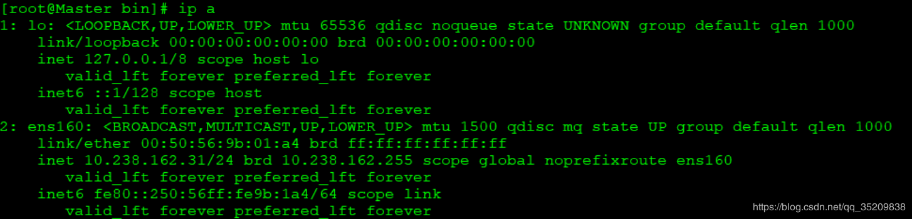

33服务器 VIP已经漂移到33服务器

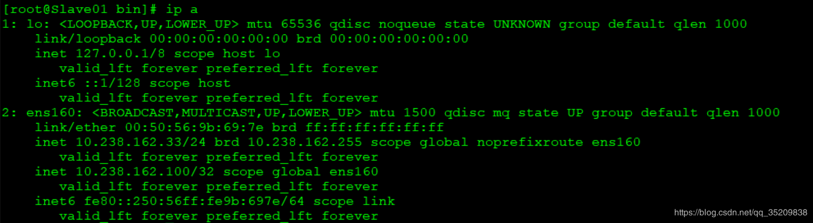

查看MySQL复制状况 在34服务上查看，33已经成为34的master。

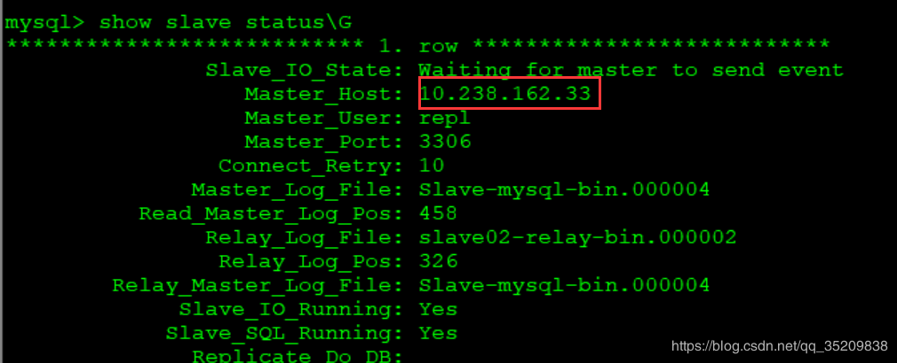

查看MHA 配置文件，发现注释和[server1]部分已经没有了。

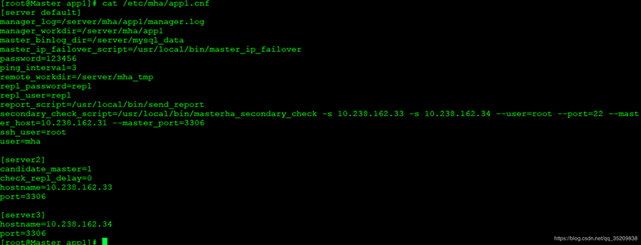

 完成切换后MHA manager进程会自动退出。查看官档找到原因

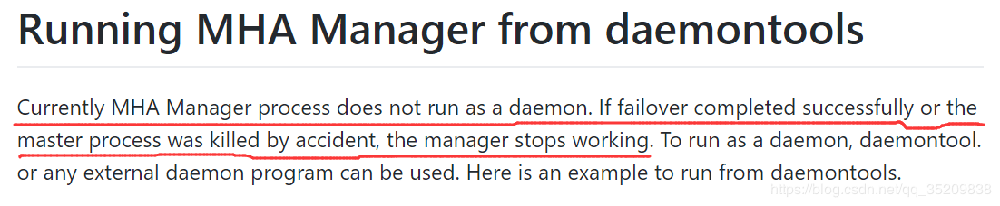

### 2 手动failover 

MHA Manager必须没有运行
 手动failover，这种场景意味着在业务上没有启用MHA自动切换功能，当主服务器故障时，人工手动调用MHA来进行故障切换操作，具体命令如下：
 注意：如果，MHA manager检测到没有dead的server，将报错，并结束failover： 

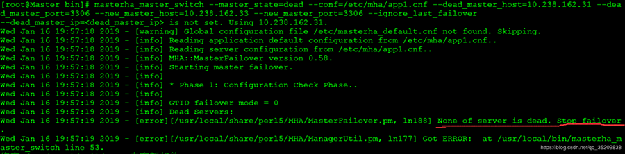

31服务器停掉MySQL模拟宕机或者服务异常停止。 /etc/init.d/mysqld stop 

手动切换命令如下：

```
masterha_master_switch --master_state=dead --conf=/etc/mha/app1.cnf --dead_master_host=10.238.162.31 --dead_master_port=3306 --new_master_host=10.238.162.33 --new_master_port=3306 --ignore_last_failover
```

输出信息是交互式，会询问你是否进行切换：建议阅读输出以理解切换手动切换过程。 

```
# masterha_master_switch --master_state=dead --conf=/etc/mha/app1.cnf --dead_master_host=10.238.162.31 --dead_master_port=3306 --new_master_host=10.238.162.33 --new_master_port=3306 --ignore_last_failover --dead_master_ip=<dead_master_ip> is not set. Using 10.238.162.31. 


Wed Jan 16 20:01:16 2019 - [warning] Global configuration file /etc/masterha_default.cnf not found. Skipping. 
Wed Jan 16 20:01:16 2019 - [info] Reading application default configuration from /etc/mha/app1.cnf.. 
Wed Jan 16 20:01:16 2019 - [info] Reading server configuration from /etc/mha/app1.cnf.. 
Wed Jan 16 20:01:16 2019 - [info] MHA::MasterFailover version 0.58. 
Wed Jan 16 20:01:16 2019 - [info] Starting master failover. 
Wed Jan 16 20:01:16 2019 - [info]  
Wed Jan 16 20:01:16 2019 - [info] * Phase 1: Configuration Check Phase.. 
Wed Jan 16 20:01:16 2019 - [info]  
Wed Jan 16 20:01:17 2019 - [info] GTID failover mode = 0 
Wed Jan 16 20:01:17 2019 - [info] Dead Servers: 
Wed Jan 16 20:01:17 2019 - [info]  10.238.162.31(10.238.162.31:3306) 
Wed Jan 16 20:01:17 2019 - [info] Checking master reachability via MySQL(double check)... 
Wed Jan 16 20:01:17 2019 - [info]  ok. 
Wed Jan 16 20:01:17 2019 - [info] Alive Servers: 
Wed Jan 16 20:01:17 2019 - [info]  10.238.162.33(10.238.162.33:3306) 
Wed Jan 16 20:01:17 2019 - [info]  10.238.162.34(10.238.162.34:3306) 
Wed Jan 16 20:01:17 2019 - [info] Alive Slaves: 
Wed Jan 16 20:01:17 2019 - [info]  10.238.162.33(10.238.162.33:3306)  Version=5.7.21-log (oldest major version between slaves) log-bin:enabled 
Wed Jan 16 20:01:17 2019 - [info]   Replicating from 10.238.162.31(10.238.162.31:3306) 
Wed Jan 16 20:01:17 2019 - [info]   Primary candidate for the new Master (candidate_master is set) 
Wed Jan 16 20:01:17 2019 - [info]  10.238.162.34(10.238.162.34:3306)  Version=5.7.21-log (oldest major version between slaves) log-bin:enabled 
Wed Jan 16 20:01:17 2019 - [info]   Replicating from 10.238.162.31(10.238.162.31:3306) Master 10.238.162.31(10.238.162.31:3306) is dead. Proceed? (yes/NO): yes 
Wed Jan 16 20:04:10 2019 - [info] Starting Non-GTID based failover. 
Wed Jan 16 20:04:10 2019 - [info]  
Wed Jan 16 20:04:10 2019 - [info] ** Phase 1: Configuration Check Phase completed. 
Wed Jan 16 20:04:10 2019 - [info]  
Wed Jan 16 20:04:10 2019 - [info] * Phase 2: Dead Master Shutdown Phase.. 
Wed Jan 16 20:04:10 2019 - [info]  
Wed Jan 16 20:04:10 2019 - [info] HealthCheck: SSH to 10.238.162.31 is reachable. 
Wed Jan 16 20:04:11 2019 - [info] Forcing shutdown so that applications never connect to the current master.. 
Wed Jan 16 20:04:11 2019 - [info] Executing master IP deactivation script: 
Wed Jan 16 20:04:11 2019 - [info]  /usr/local/bin/master_ip_failover --orig_master_host=10.238.162.31 --orig_master_ip=10.238.162.31 --orig_master_port=3306 --command=stopssh --ssh_user=root  
 IN SCRIPT TEST====/etc/init.d/keepalived stop==/etc/init.d/keepalived start===
Disabling the VIP on old master: 10.238.162.31  
Wed Jan 16 20:04:11 2019 - [info]  done. 
Wed Jan 16 20:04:11 2019 - [warning] shutdown_script is not set. Skipping explicit shutting down of the dead master. 
Wed Jan 16 20:04:11 2019 - [info] * Phase 2: Dead Master Shutdown Phase completed. 
Wed Jan 16 20:04:11 2019 - [info]  
Wed Jan 16 20:04:11 2019 - [info] * Phase 3: Master Recovery Phase.. 
Wed Jan 16 20:04:11 2019 - [info]  
Wed Jan 16 20:04:11 2019 - [info] * Phase 3.1: Getting Latest Slaves Phase.. 
Wed Jan 16 20:04:11 2019 - [info]  
Wed Jan 16 20:04:11 2019 - [info] The latest binary log file/position on all slaves is mysql-bin.000012:154 
Wed Jan 16 20:04:11 2019 - [info] Latest slaves (Slaves that received relay log files to the latest): 
Wed Jan 16 20:04:11 2019 - [info]  10.238.162.33(10.238.162.33:3306)  Version=5.7.21-log (oldest major version between slaves) log-bin:enabled 
Wed Jan 16 20:04:11 2019 - [info]   Replicating from 10.238.162.31(10.238.162.31:3306) 
Wed Jan 16 20:04:11 2019 - [info]   Primary candidate for the new Master (candidate_master is set) 
Wed Jan 16 20:04:11 2019 - [info]  10.238.162.34(10.238.162.34:3306)  Version=5.7.21-log (oldest major version between slaves) log-bin:enabled 
Wed Jan 16 20:04:11 2019 - [info]   Replicating from 10.238.162.31(10.238.162.31:3306) 
Wed Jan 16 20:04:11 2019 - [info] The oldest binary log file/position on all slaves is mysql-bin.000012:154 
Wed Jan 16 20:04:11 2019 - [info] Oldest slaves: 
Wed Jan 16 20:04:11 2019 - [info]  10.238.162.33(10.238.162.33:3306)  Version=5.7.21-log (oldest major version between slaves) log-bin:enabled 
Wed Jan 16 20:04:11 2019 - [info]   Replicating from 10.238.162.31(10.238.162.31:3306) 
Wed Jan 16 20:04:11 2019 - [info]   Primary candidate for the new Master (candidate_master is set) 
Wed Jan 16 20:04:11 2019 - [info]  10.238.162.34(10.238.162.34:3306)  Version=5.7.21-log (oldest major version between slaves) log-bin:enabled 
Wed Jan 16 20:04:11 2019 - [info]   Replicating from 10.238.162.31(10.238.162.31:3306) 
Wed Jan 16 20:04:11 2019 - [info]  
Wed Jan 16 20:04:11 2019 - [info] * Phase 3.2: Saving Dead Master's Binlog Phase.. 
Wed Jan 16 20:04:11 2019 - [info]  
Wed Jan 16 20:04:11 2019 - [info] Fetching dead master's binary logs.. 
Wed Jan 16 20:04:11 2019 - [info] Executing command on the dead master 10.238.162.31(10.238.162.31:3306): save_binary_logs --command=save --start_file=mysql-bin.000012  --start_pos=154 --binlog_dir=/server/mysql_data --output_file=/server/mha_tmp/saved_master_binlog_from_10.238.162.31_3306_20190116200116.binlog --handle_raw_binlog=1 --disable_log_bin=0 --manager_version=0.58  
Creating /server/mha_tmp if not exists..   ok.  
Concat binary/relay logs from mysql-bin.000012 pos 154 to mysql-bin.000012 
EOF into /server/mha_tmp/saved_master_binlog_from_10.238.162.31_3306_20190116200116.binlog ..  
Binlog Checksum enabled  
Dumping binlog format description event, from position 0 to 154.. ok.  
Dumping effective binlog data from /server/mysql_data/mysql-bin.000012 position 154 to tail(177).. ok.  
Binlog Checksum enabled  Concat succeeded. saved_master_binlog_from_10.238.162.31_3306_20190116200116.binlog              
100%  177  123.2KB/s  00:00    
Wed Jan 16 20:04:12 2019 - [info] scp from root@10.238.162.31:/server/mha_tmp/saved_master_binlog_from_10.238.162.31_3306_20190116200116.binlog to local:/server/mha/app1/saved_master_binlog_from_10.238.162.31_3306_20190116200116.binlog succeeded. 
Wed Jan 16 20:04:12 2019 - [info] HealthCheck: SSH to 10.238.162.33 is reachable. 
Wed Jan 16 20:04:13 2019 - [info] HealthCheck: SSH to 10.238.162.34 is reachable. 
Wed Jan 16 20:04:13 2019 - [info]  
Wed Jan 16 20:04:13 2019 - [info] * Phase 3.3: Determining New Master Phase.. 
Wed Jan 16 20:04:13 2019 - [info]  
Wed Jan 16 20:04:13 2019 - [info] Finding the latest slave that has all relay logs for recovering other slaves.. 
Wed Jan 16 20:04:13 2019 - [info] All slaves received relay logs to the same position. No need to resync each other. 
Wed Jan 16 20:04:13 2019 - [info] 10.238.162.33 can be new master. 
Wed Jan 16 20:04:13 2019 - [info] New master is 10.238.162.33(10.238.162.33:3306) 
Wed Jan 16 20:04:13 2019 - [info] Starting master failover.. 
Wed Jan 16 20:04:13 2019 - [info]  From: 10.238.162.31(10.238.162.31:3306) (current master)  +--10.238.162.33(10.238.162.33:3306)  +--10.238.162.34(10.238.162.34:3306)
To: 10.238.162.33(10.238.162.33:3306) (new master)  +--10.238.162.34(10.238.162.34:3306)
Starting master switch from 10.238.162.31(10.238.162.31:3306) to 10.238.162.33(10.238.162.33:3306)? (yes/NO): yes 
Wed Jan 16 20:06:21 2019 - [info] New master decided manually is 10.238.162.33(10.238.162.33:3306) 
Wed Jan 16 20:06:21 2019 - [info]  
Wed Jan 16 20:06:21 2019 - [info] * Phase 3.4: New Master Diff Log Generation Phase.. 
Wed Jan 16 20:06:21 2019 - [info]  
Wed Jan 16 20:06:21 2019 - [info]  This server has all relay logs. No need to generate diff files from the latest slave. 
Wed Jan 16 20:06:21 2019 - [info] Sending binlog.. saved_master_binlog_from_10.238.162.31_3306_20190116200116.binlog              
100%  177  110.1KB/s  00:00    
Wed Jan 16 20:06:21 2019 - [info] scp from local:/server/mha/app1/saved_master_binlog_from_10.238.162.31_3306_20190116200116.binlog to root@10.238.162.33:/server/mha_tmp/saved_master_binlog_from_10.238.162.31_3306_20190116200116.binlog succeeded. 
Wed Jan 16 20:06:21 2019 - [info]  
Wed Jan 16 20:06:21 2019 - [info] * Phase 3.5: Master Log Apply Phase.. 
Wed Jan 16 20:06:21 2019 - [info]  
Wed Jan 16 20:06:21 2019 - [info] *NOTICE: If any error happens from this phase, manual recovery is needed. 
Wed Jan 16 20:06:21 2019 - [info] Starting recovery on 10.238.162.33(10.238.162.33:3306).. 
Wed Jan 16 20:06:21 2019 - [info]  Generating diffs succeeded. 
Wed Jan 16 20:06:21 2019 - [info] Waiting until all relay logs are applied. 
Wed Jan 16 20:06:21 2019 - [info]  done. 
Wed Jan 16 20:06:21 2019 - [info] Getting slave status.. 
Wed Jan 16 20:06:21 2019 - [info] This slave(10.238.162.33)'s Exec_Master_Log_Pos equals to Read_Master_Log_Pos(mysql-bin.000012:154). No need to recover from Exec_Master_Log_Pos. 
Wed Jan 16 20:06:21 2019 - [info] Connecting to the target slave host 10.238.162.33, running recover script.. 
Wed Jan 16 20:06:21 2019 - [info] Executing command: apply_diff_relay_logs --command=apply --slave_user='mha' --slave_host=10.238.162.33 --slave_ip=10.238.162.33  --slave_port=3306 --apply_files=/server/mha_tmp/saved_master_binlog_from_10.238.162.31_3306_20190116200116.binlog --workdir=/server/mha_tmp --target_version=5.7.21-log --timestamp=20190116200116 --handle_raw_binlog=1 --disable_log_bin=0 --manager_version=0.58 --slave_pass=xxx 
Wed Jan 16 20:06:22 2019 - [info]  MySQL client version is 5.7.21. Using --binary-mode. Applying differential binary/relay log files /server/mha_tmp/saved_master_binlog_from_10.238.162.31_3306_20190116200116.binlog on 10.238.162.33:3306. This may take long time... Applying log files succeeded. 
Wed Jan 16 20:06:22 2019 - [info]  All relay logs were successfully applied. 
Wed Jan 16 20:06:22 2019 - [info] Getting new master's binlog name and position.. 
Wed Jan 16 20:06:22 2019 - [info]  Slave-mysql-bin.000004:458 
Wed Jan 16 20:06:22 2019 - [info]  All other slaves should start replication from here. Statement should be: CHANGE MASTER TO MASTER_HOST='10.238.162.33', MASTER_PORT=3306, MASTER_LOG_FILE='Slave-mysql-bin.000004', MASTER_LOG_POS=458, MASTER_USER='repl', MASTER_PASSWORD='xxx'; 
Wed Jan 16 20:06:22 2019 - [info] Executing master IP activate script: 
Wed Jan 16 20:06:22 2019 - [info]  /usr/local/bin/master_ip_failover --command=start --ssh_user=root --orig_master_host=10.238.162.31 --orig_master_ip=10.238.162.31 --orig_master_port=3306 --new_master_host=10.238.162.33 --new_master_ip=10.238.162.33 --new_master_port=3306 --new_master_user='mha'  --new_master_password=xxx Unknown option: new_master_user Unknown option: new_master_password
 IN SCRIPT TEST====/etc/init.d/keepalived stop==/etc/init.d/keepalived start===
Enabling the VIP - 10.238.162.100 on the new master - 10.238.162.33  
Wed Jan 16 20:06:22 2019 - [info]  OK. 
Wed Jan 16 20:06:22 2019 - [info] ** Finished master recovery successfully. 
Wed Jan 16 20:06:22 2019 - [info] * Phase 3: Master Recovery Phase completed. 
Wed Jan 16 20:06:22 2019 - [info]  
Wed Jan 16 20:06:22 2019 - [info] * Phase 4: Slaves Recovery Phase.. 
Wed Jan 16 20:06:22 2019 - [info]  
Wed Jan 16 20:06:22 2019 - [info] * Phase 4.1: Starting Parallel Slave Diff Log Generation Phase.. 
Wed Jan 16 20:06:22 2019 - [info]  
Wed Jan 16 20:06:22 2019 - [info] -- Slave diff file generation on host 10.238.162.34(10.238.162.34:3306) started, pid: 30439. Check tmp log /server/mha/app1/10.238.162.34_3306_20190116200116.log if it takes time.. 
Wed Jan 16 20:06:23 2019 - [info]  
Wed Jan 16 20:06:23 2019 - [info] Log messages from 10.238.162.34 ... 
Wed Jan 16 20:06:23 2019 - [info]  
Wed Jan 16 20:06:22 2019 - [info]  This server has all relay logs. No need to generate diff files from the latest slave. 
Wed Jan 16 20:06:23 2019 - [info] End of log messages from 10.238.162.34. 
Wed Jan 16 20:06:23 2019 - [info] -- 10.238.162.34(10.238.162.34:3306) has the latest relay log events. 
Wed Jan 16 20:06:23 2019 - [info] Generating relay diff files from the latest slave succeeded. 
Wed Jan 16 20:06:23 2019 - [info]  
Wed Jan 16 20:06:23 2019 - [info] * Phase 4.2: Starting Parallel Slave Log Apply Phase.. 
Wed Jan 16 20:06:23 2019 - [info]  
Wed Jan 16 20:06:23 2019 - [info] -- Slave recovery on host 10.238.162.34(10.238.162.34:3306) started, pid: 30441. Check tmp log /server/mha/app1/10.238.162.34_3306_20190116200116.log if it takes time.. saved_master_binlog_from_10.238.162.31_3306_20190116200116.binlog              100%  177  179.1KB/s  00:00    
Wed Jan 16 20:06:24 2019 - [info]  
Wed Jan 16 20:06:24 2019 - [info] Log messages from 10.238.162.34 ... 
Wed Jan 16 20:06:24 2019 - [info]  
Wed Jan 16 20:06:23 2019 - [info] Sending binlog.. 
Wed Jan 16 20:06:23 2019 - [info] scp from local:/server/mha/app1/saved_master_binlog_from_10.238.162.31_3306_20190116200116.binlog to root@10.238.162.34:/server/mha_tmp/saved_master_binlog_from_10.238.162.31_3306_20190116200116.binlog succeeded. 
Wed Jan 16 20:06:23 2019 - [info] Starting recovery on 10.238.162.34(10.238.162.34:3306).. 
Wed Jan 16 20:06:23 2019 - [info]  Generating diffs succeeded. 
Wed Jan 16 20:06:23 2019 - [info] Waiting until all relay logs are applied. 
Wed Jan 16 20:06:23 2019 - [info]  done. 
Wed Jan 16 20:06:23 2019 - [info] Getting slave status.. 
Wed Jan 16 20:06:23 2019 - [info] This slave(10.238.162.34)'s Exec_Master_Log_Pos equals to Read_Master_Log_Pos(mysql-bin.000012:154). No need to recover from Exec_Master_Log_Pos. 
Wed Jan 16 20:06:23 2019 - [info] Connecting to the target slave host 10.238.162.34, running recover script.. 
Wed Jan 16 20:06:23 2019 - [info] Executing command: apply_diff_relay_logs --command=apply --slave_user='mha' --slave_host=10.238.162.34 --slave_ip=10.238.162.34  --slave_port=3306 --apply_files=/server/mha_tmp/saved_master_binlog_from_10.238.162.31_3306_20190116200116.binlog --workdir=/server/mha_tmp --target_version=5.7.21-log --timestamp=20190116200116 --handle_raw_binlog=1 --disable_log_bin=0 --manager_version=0.58 --slave_pass=xxx 
Wed Jan 16 20:06:24 2019 - [info]  MySQL client version is 5.7.21. Using --binary-mode. 
Applying differential binary/relay log files /server/mha_tmp/saved_master_binlog_from_10.238.162.31_3306_20190116200116.binlog on 10.238.162.34:3306. This may take long time... 
Applying log files succeeded. 
Wed Jan 16 20:06:24 2019 - [info]  All relay logs were successfully applied. 
Wed Jan 16 20:06:24 2019 - [info]  Resetting slave 10.238.162.34(10.238.162.34:3306) and starting replication from the new master 10.238.162.33(10.238.162.33:3306).. 
Wed Jan 16 20:06:24 2019 - [info]  Executed CHANGE MASTER. 
Wed Jan 16 20:06:24 2019 - [info]  Slave started. 
Wed Jan 16 20:06:24 2019 - [info] End of log messages from 10.238.162.34. 
Wed Jan 16 20:06:24 2019 - [info] -- Slave recovery on host 10.238.162.34(10.238.162.34:3306) succeeded. 
Wed Jan 16 20:06:24 2019 - [info] All new slave servers recovered successfully. 
Wed Jan 16 20:06:24 2019 - [info]  
Wed Jan 16 20:06:24 2019 - [info] * Phase 5: New master cleanup phase.. 
Wed Jan 16 20:06:24 2019 - [info]  
Wed Jan 16 20:06:24 2019 - [info] Resetting slave info on the new master.. 
Wed Jan 16 20:06:24 2019 - [info]  10.238.162.33: Resetting slave info succeeded. 
Wed Jan 16 20:06:24 2019 - [info] Master failover to 10.238.162.33(10.238.162.33:3306) completed successfully. 
Wed Jan 16 20:06:24 2019 - [info] 
----- Failover Report -----
app1: MySQL Master failover 10.238.162.31(10.238.162.31:3306) to 10.238.162.33(10.238.162.33:3306) succeeded
Master 10.238.162.31(10.238.162.31:3306) is down!
Check MHA Manager logs at Master for details.
Started manual(interactive) failover. 
Invalidated master IP address on 10.238.162.31(10.238.162.31:3306) 
The latest slave 10.238.162.33(10.238.162.33:3306) has all relay logs for recovery. 
Selected 10.238.162.33(10.238.162.33:3306) as a new master. 
10.238.162.33(10.238.162.33:3306): OK: Applying all logs succeeded. 
10.238.162.33(10.238.162.33:3306): OK: Activated master IP address. 
10.238.162.34(10.238.162.34:3306): This host has the latest relay log events. 
Generating relay diff files from the latest slave succeeded. 
10.238.162.34(10.238.162.34:3306): OK: Applying all logs succeeded. 
Slave started, replicating from 10.238.162.33(10.238.162.33:3306) 
10.238.162.33(10.238.162.33:3306): Resetting slave info succeeded. 
Master failover to 10.238.162.33(10.238.162.33:3306) completed successfully.
```

### 3 在线切换

在许多情况下， 需要将现有的主服务器迁移到另外一台服务器上。 比如主服务器硬件故障，RAID 控制卡需要重建，将主服务器移到性能更好的服务器上等等。维护主服务器引起性能下降， 导致停机时间至少无法写入数据。 另外， 阻塞或杀掉当前运行的会话会导致主主之间数据不一致的问题发生。 MHA 提供快速切换和优雅的阻塞写入，这个切换过程只需要 0.5-2s 的时间，这段时间内数据是无法写入的。在很多情况下，0.5-2s 的阻塞写入是可以接受的。因此切换主服务器不需要计划分配维护时间窗口。

MHA在线切换的大概过程：

1.检测复制设置和确定当前主服务器

2.确定新的主服务器

3.阻塞写入到当前主服务器

4.等待所有从服务器赶上复制

5.授予写入到新的主服务器

6.重新设置从服务器 

 

注意，在线切换的时候应用架构需要考虑以下两个问题： 

1.自动识别master和slave的问题（master的机器可能会切换），如果采用了vip的方式，基本可以解决这个问题。 

2.负载均衡的问题（可以定义大概的读写比例，每台机器可承担的负载比例，当有机器离开集群时，需要考虑这个问题）

 

为了保证数据完全一致性，在最快的时间内完成切换，MHA的在线切换必须满足以下条件才会切换成功，否则会切换失败。

1.所有slave的IO线程都在运行 

2.所有slave的SQL线程都在运行 

3.所有的show slave status的输出中Seconds_Behind_Master参数小于或者等于running_updates_limit秒，如果在切换过程中不指定running_updates_limit,那么默认情况下running_updates_limit为1秒。 

4.在master端，通过show processlist输出，没有一个更新花费的时间大于running_updates_limit秒。

 

## 在线切换步骤如下： 

首先，停掉MHA监控：

注意：由于在线进行切换需要调用到master_ip_online_change这个脚本，但是由于该脚本不完整，需要自己进行相应的修改，我google到后发现还是有问题，脚本中new_master_password这个变量获取不到，导致在线切换失败，所以进行了相关的硬编码，直接把mysql的root用户密码赋值给变量new_master_password，如果有哪位大牛知道原因，请指点指点。这个脚本还可以管理vip。

下面贴出脚本：

```
 cat master_ip_online_change
#!/usr/bin/env perl
#  Copyright (C) 2011 DeNA Co.,Ltd. # #  This program is free software; you can redistribute it and/or modify #  it under the terms of the GNU General Public License as published by #  the Free Software Foundation; either version 2 of the License, or #  (at your option) any later version. # #  This program is distributed in the hope that it will be useful, #  but WITHOUT ANY WARRANTY; without even the implied warranty of #  MERCHANTABILITY or FITNESS FOR A PARTICULAR PURPOSE.  See the #  GNU General Public License for more details. # #  You should have received a copy of the GNU General Public License #  along with this program; if not, write to the Free Software #  Foundation, Inc., #  51 Franklin Street, Fifth Floor, Boston, MA  02110-1301 USA
## Note: This is a sample script and is not complete. Modify the script based on your environment.
use strict; use warnings FATAL => 'all';
use Getopt::Long; use MHA::DBHelper; use MHA::NodeUtil; use Time::HiRes qw( sleep gettimeofday tv_interval ); use Data::Dumper;
my $_tstart; my $_running_interval = 0.1; my (  $command,      $orig_master_host, $orig_master_ip,  $orig_master_port, $orig_master_user,   $new_master_host,  $new_master_ip,   $new_master_port,  $new_master_user,   );
 my $vip = '10.238.162.100/32';  # Virtual IP  my $key = "1";  my $ssh_start_vip = "/sbin/ifconfig ens160:$key $vip"; my $ssh_stop_vip = "/sbin/ifconfig ens160:$key down"; my $ssh_user = "root"; my $new_master_password='123456'; my $orig_master_password='123456'; GetOptions(  'command=s'        => \$command,  #'ssh_user=s'       => \$ssh_user,    'orig_master_host=s'   => \$orig_master_host,  'orig_master_ip=s'    => \$orig_master_ip,  'orig_master_port=i'   => \$orig_master_port,  'orig_master_user=s'   => \$orig_master_user,  #'orig_master_password=s' => \$orig_master_password,  'new_master_host=s'    => \$new_master_host,  'new_master_ip=s'     => \$new_master_ip,  'new_master_port=i'    => \$new_master_port,  'new_master_user=s'    => \$new_master_user,  #'new_master_password=s'  => \$new_master_password, );
exit &main();
sub current_time_us {  my ( $sec, $microsec ) = gettimeofday();  my $curdate = localtime($sec);  return $curdate . " " . sprintf( "%06d", $microsec ); }
sub sleep_until {  my $elapsed = tv_interval($_tstart);  if ( $_running_interval > $elapsed ) {   sleep( $_running_interval - $elapsed );  } }
sub get_threads_util {  my $dbh           = shift;  my $my_connection_id    = shift;  my $running_time_threshold = shift;  my $type          = shift;  $running_time_threshold = 0 unless ($running_time_threshold);  $type          = 0 unless ($type);  my @threads;
 my $sth = $dbh->prepare("SHOW PROCESSLIST");  $sth->execute();
 while ( my $ref = $sth->fetchrow_hashref() ) {   my $id     = $ref->{Id};   my $user    = $ref->{User};   my $host    = $ref->{Host};   my $command   = $ref->{Command};   my $state    = $ref->{State};   my $query_time = $ref->{Time};   my $info    = $ref->{Info};   $info =~ s/^\s*(.*?)\s*$/$1/ if defined($info);   next if ( $my_connection_id == $id );   next if ( defined($query_time) && $query_time < $running_time_threshold );   next if ( defined($command)   && $command eq "Binlog Dump" );   next if ( defined($user)    && $user eq "system user" );   next    if ( defined($command)    && $command eq "Sleep"    && defined($query_time)    && $query_time >= 1 );
  if ( $type >= 1 ) {    next if ( defined($command) && $command eq "Sleep" );    next if ( defined($command) && $command eq "Connect" );   }
  if ( $type >= 2 ) {    next if ( defined($info) && $info =~ m/^select/i );    next if ( defined($info) && $info =~ m/^show/i );   }
  push @threads, $ref;  }  return @threads; }
sub main {  if ( $command eq "stop" ) {   ## Gracefully killing connections on the current master   # 1. Set read_only= 1 on the new master   # 2. DROP USER so that no app user can establish new connections   # 3. Set read_only= 1 on the current master   # 4. Kill current queries   # * Any database access failure will result in script die.   my $exit_code = 1;   eval {    ## Setting read_only=1 on the new master (to avoid accident)    my $new_master_handler = new MHA::DBHelper();
   # args: hostname, port, user, password, raise_error(die_on_error)_or_not    $new_master_handler->connect( $new_master_ip, $new_master_port,     $new_master_user, $new_master_password, 1 );    print current_time_us() . " Set read_only on the new master.. ";    $new_master_handler->enable_read_only();    if ( $new_master_handler->is_read_only() ) {     print "ok.\n";    }    else {     die "Failed!\n";    }    $new_master_handler->disconnect();
   # Connecting to the orig master, die if any database error happens    my $orig_master_handler = new MHA::DBHelper();    $orig_master_handler->connect( $orig_master_ip, $orig_master_port,     $orig_master_user, $orig_master_password, 1 );
   ## Drop application user so that nobody can connect. Disabling per-session binlog beforehand    #$orig_master_handler->disable_log_bin_local();    #print current_time_us() . " Drpping app user on the orig master..\n";    #FIXME_xxx_drop_app_user($orig_master_handler);
   ## Waiting for N * 100 milliseconds so that current connections can exit    my $time_until_read_only = 15;    $_tstart = [gettimeofday];    my @threads = get_threads_util( $orig_master_handler->{dbh},     $orig_master_handler->{connection_id} );    while ( $time_until_read_only > 0 && $#threads >= 0 ) {     if ( $time_until_read_only % 5 == 0 ) {      printf "%s Waiting all running %d threads are disconnected.. (max %d milliseconds)\n",       current_time_us(), $#threads + 1, $time_until_read_only * 100;      if ( $#threads < 5 ) {       print Data::Dumper->new( [$_] )->Indent(0)->Terse(1)->Dump . "\n"        foreach (@threads);      }     }     sleep_until();     $_tstart = [gettimeofday];     $time_until_read_only--;     @threads = get_threads_util( $orig_master_handler->{dbh},      $orig_master_handler->{connection_id} );    }
   ## Setting read_only=1 on the current master so that nobody(except SUPER) can write    print current_time_us() . " Set read_only=1 on the orig master.. ";    $orig_master_handler->enable_read_only();    if ( $orig_master_handler->is_read_only() ) {     print "ok.\n";    }    else {     die "Failed!\n";    }
   ## Waiting for M * 100 milliseconds so that current update queries can complete    my $time_until_kill_threads = 5;    @threads = get_threads_util( $orig_master_handler->{dbh},     $orig_master_handler->{connection_id} );    while ( $time_until_kill_threads > 0 && $#threads >= 0 ) {     if ( $time_until_kill_threads % 5 == 0 ) {      printf "%s Waiting all running %d queries are disconnected.. (max %d milliseconds)\n",       current_time_us(), $#threads + 1, $time_until_kill_threads * 100;      if ( $#threads < 5 ) {       print Data::Dumper->new( [$_] )->Indent(0)->Terse(1)->Dump . "\n"        foreach (@threads);      }     }     sleep_until();     $_tstart = [gettimeofday];     $time_until_kill_threads--;     @threads = get_threads_util( $orig_master_handler->{dbh},      $orig_master_handler->{connection_id} );    }
        print "Disabling the VIP on old master: $orig_master_host \n";         &stop_vip();   
    ## Terminating all threads    print current_time_us() . " Killing all application threads..\n";    $orig_master_handler->kill_threads(@threads) if ( $#threads >= 0 );    print current_time_us() . " done.\n";    #$orig_master_handler->enable_log_bin_local();    $orig_master_handler->disconnect();
   ## After finishing the script, MHA executes FLUSH TABLES WITH READ LOCK    $exit_code = 0;   };   if ($@) {    warn "Got Error: $@\n";    exit $exit_code;   }   exit $exit_code;  }  elsif ( $command eq "start" ) {   ## Activating master ip on the new master   # 1. Create app user with write privileges   # 2. Moving backup script if needed   # 3. Register new master's ip to the catalog database
# We don't return error even though activating updatable accounts/ip failed so that we don't interrupt slaves' recovery. # If exit code is 0 or 10, MHA does not abort   my $exit_code = 10;   eval {    my $new_master_handler = new MHA::DBHelper();
   # args: hostname, port, user, password, raise_error_or_not    $new_master_handler->connect( $new_master_ip, $new_master_port,     $new_master_user, $new_master_password, 1 );
   ## Set read_only=0 on the new master    #$new_master_handler->disable_log_bin_local();    print current_time_us() . " Set read_only=0 on the new master.\n";    $new_master_handler->disable_read_only();
   ## Creating an app user on the new master    #print current_time_us() . " Creating app user on the new master..\n";    #FIXME_xxx_create_app_user($new_master_handler);    #$new_master_handler->enable_log_bin_local();    $new_master_handler->disconnect();
   ## Update master ip on the catalog database, etc         print "Enabling the VIP - $vip on the new master - $new_master_host \n";         &start_vip();         $exit_code = 0;   };   if ($@) {    warn "Got Error: $@\n";    exit $exit_code;   }   exit $exit_code;  }  elsif ( $command eq "status" ) {
  # do nothing   exit 0;  }  else {   &usage();   exit 1;  } }
# A simple system call that enable the VIP on the new master  sub start_vip() {   `ssh $ssh_user\@$new_master_host \" $ssh_start_vip \"`; } # A simple system call that disable the VIP on the old_master sub stop_vip() {   `ssh $ssh_user\@$orig_master_host \" $ssh_stop_vip \"`; }
sub usage {  print "Usage: master_ip_online_change --command=start|stop|status --orig_master_host=host --orig_master_ip=ip --orig_master_port=port --new_master_host=host --new_master_ip=ip --new_master_port=port\n";  die; }
```

masterha_stop --conf=/etc/mha/app1.cnf

其中参数的意思：

--orig_master_is_new_slave 切换时加上此参数是将原 master 变为 slave 节点，如果不加此参数，原来的 master 将不启动

--running_updates_limit=10000,故障切换时,候选master 如果有延迟的话， mha 切换不能成功，加上此参数表示延迟在此时间范围内都可切换（单位为s），但是切换的时间长短是由recover 时relay 日志的大小决定 

```
masterha_master_switch --conf=/etc/mha/app1.cnf --master_state=alive --new_master_host=10.238.162.33 --new_master_port=3306 --orig_master_is_new_slave --running_updates_limit=10000

Wed Jan 16 22:16:17 2019 - [info] MHA::MasterRotate version 0.58.
 Wed Jan 16 22:16:17 2019 - [info] Starting online master switch..
 Wed Jan 16 22:16:17 2019 - [info] 
 Wed Jan 16 22:16:17 2019 - [info] * Phase 1: Configuration Check Phase..
 Wed Jan 16 22:16:17 2019 - [info] 
 Wed Jan 16 22:16:17 2019 - [warning] Global configuration file /etc/masterha_default.cnf not found. Skipping.
 Wed Jan 16 22:16:17 2019 - [info] Reading application default configuration from /etc/mha/app1.cnf..
 Wed Jan 16 22:16:17 2019 - [info] Reading server configuration from /etc/mha/app1.cnf..
 Wed Jan 16 22:16:18 2019 - [info] GTID failover mode = 0
 Wed Jan 16 22:16:18 2019 - [info] Current Alive Master: 10.238.162.31(10.238.162.31:3306)
 Wed Jan 16 22:16:18 2019 - [info] Alive Slaves:
 Wed Jan 16 22:16:18 2019 - [info]  10.238.162.33(10.238.162.33:3306)  Version=5.7.21-log (oldest major version between slaves) log-bin:enabled
 Wed Jan 16 22:16:18 2019 - [info]   Replicating from 10.238.162.31(10.238.162.31:3306)
 Wed Jan 16 22:16:18 2019 - [info]   Primary candidate for the new Master (candidate_master is set)
 Wed Jan 16 22:16:18 2019 - [info]  10.238.162.34(10.238.162.34:3306)  Version=5.7.21-log (oldest major version between slaves) log-bin:enabled
 Wed Jan 16 22:16:18 2019 - [info]   Replicating from 10.238.162.31(10.238.162.31:3306)
It is better to execute FLUSH NO_WRITE_TO_BINLOG TABLES on the master before switching. Is it ok to execute on 10.238.162.31(10.238.162.31:3306)? (YES/no): yes
 Wed Jan 16 22:16:21 2019 - [info] Executing FLUSH NO_WRITE_TO_BINLOG TABLES. This may take long time..
 Wed Jan 16 22:16:21 2019 - [info]  ok.
 Wed Jan 16 22:16:21 2019 - [info] Checking MHA is not monitoring or doing failover..
 Wed Jan 16 22:16:21 2019 - [info] Checking replication health on 10.238.162.33..
 Wed Jan 16 22:16:21 2019 - [info]  ok.
 Wed Jan 16 22:16:21 2019 - [info] Checking replication health on 10.238.162.34..
 Wed Jan 16 22:16:21 2019 - [info]  ok.
 Wed Jan 16 22:16:21 2019 - [info] 10.238.162.33 can be new master.
 Wed Jan 16 22:16:21 2019 - [info] 
 From:
 10.238.162.31(10.238.162.31:3306) (current master)
 +--10.238.162.33(10.238.162.33:3306)
 +--10.238.162.34(10.238.162.34:3306)
To:
 10.238.162.33(10.238.162.33:3306) (new master)
 +--10.238.162.34(10.238.162.34:3306)
 +--10.238.162.31(10.238.162.31:3306)
Starting master switch from 10.238.162.31(10.238.162.31:3306) to 10.238.162.33(10.238.162.33:3306)? (yes/NO): yes
 Wed Jan 16 22:16:23 2019 - [info] Checking whether 10.238.162.33(10.238.162.33:3306) is ok for the new master..
 Wed Jan 16 22:16:23 2019 - [info]  ok.
 Wed Jan 16 22:16:23 2019 - [info] 10.238.162.31(10.238.162.31:3306): SHOW SLAVE STATUS returned empty result. To check replication filtering rules, temporarily executing CHANGE MASTER to a dummy host.
 Wed Jan 16 22:16:23 2019 - [info] 10.238.162.31(10.238.162.31:3306): Resetting slave pointing to the dummy host.
 Wed Jan 16 22:16:23 2019 - [info] ** Phase 1: Configuration Check Phase completed.
 Wed Jan 16 22:16:23 2019 - [info] 
 Wed Jan 16 22:16:23 2019 - [info] * Phase 2: Rejecting updates Phase..
 Wed Jan 16 22:16:23 2019 - [info] 
 Wed Jan 16 22:16:23 2019 - [info] Executing master ip online change script to disable write on the current master:
 Wed Jan 16 22:16:23 2019 - [info]  /usr/local/bin/master_ip_online_change --command=stop --orig_master_host=10.238.162.31 --orig_master_ip=10.238.162.31 --orig_master_port=3306 --orig_master_user='mha' --new_master_host=10.238.162.33 --new_master_ip=10.238.162.33 --new_master_port=3306 --new_master_user='mha' --orig_master_ssh_user=root --new_master_ssh_user=root  --orig_master_is_new_slave --orig_master_password=xxx --new_master_password=xxx
 Unknown option: orig_master_ssh_user
 Unknown option: new_master_ssh_user
 Unknown option: orig_master_is_new_slave
 Unknown option: orig_master_password
 Unknown option: new_master_password
 Wed Jan 16 22:16:23 2019 254185 Set read_only on the new master.. ok.
 Wed Jan 16 22:16:23 2019 257941 Set read_only=1 on the orig master.. ok.
 Disabling the VIP on old master: 10.238.162.31 
 SIOCSIFFLAGS: 无法指定被请求的地址
 Wed Jan 16 22:16:23 2019 477838 Killing all application threads..
 Wed Jan 16 22:16:23 2019 477953 done.
 Wed Jan 16 22:16:23 2019 - [info]  ok.
 Wed Jan 16 22:16:23 2019 - [info] Locking all tables on the orig master to reject updates from everybody (including root):
 Wed Jan 16 22:16:23 2019 - [info] Executing FLUSH TABLES WITH READ LOCK..
 Wed Jan 16 22:16:23 2019 - [info]  ok.
 Wed Jan 16 22:16:23 2019 - [info] Orig master binlog:pos is mysql-bin.000013:154.
 Wed Jan 16 22:16:23 2019 - [info]  Waiting to execute all relay logs on 10.238.162.33(10.238.162.33:3306)..
 Wed Jan 16 22:16:23 2019 - [info]  master_pos_wait(mysql-bin.000013:154) completed on 10.238.162.33(10.238.162.33:3306). Executed 0 events.
 Wed Jan 16 22:16:23 2019 - [info]  done.
 Wed Jan 16 22:16:23 2019 - [info] Getting new master's binlog name and position..
 Wed Jan 16 22:16:23 2019 - [info]  Slave-mysql-bin.000004:458
 Wed Jan 16 22:16:23 2019 - [info]  All other slaves should start replication from here. Statement should be: CHANGE MASTER TO MASTER_HOST='10.238.162.33', MASTER_PORT=3306, MASTER_LOG_FILE='Slave-mysql-bin.000004', MASTER_LOG_POS=458, MASTER_USER='repl', MASTER_PASSWORD='xxx';
 Wed Jan 16 22:16:23 2019 - [info] Executing master ip online change script to allow write on the new master:
 Wed Jan 16 22:16:23 2019 - [info]  /usr/local/bin/master_ip_online_change --command=start --orig_master_host=10.238.162.31 --orig_master_ip=10.238.162.31 --orig_master_port=3306 --orig_master_user='mha' --new_master_host=10.238.162.33 --new_master_ip=10.238.162.33 --new_master_port=3306 --new_master_user='mha' --orig_master_ssh_user=root --new_master_ssh_user=root  --orig_master_is_new_slave --orig_master_password=xxx --new_master_password=xxx
 Unknown option: orig_master_ssh_user
 Unknown option: new_master_ssh_user
 Unknown option: orig_master_is_new_slave
 Unknown option: orig_master_password
 Unknown option: new_master_password
 Wed Jan 16 22:16:23 2019 713106 Set read_only=0 on the new master.
 Enabling the VIP - 10.238.162.100/32 on the new master - 10.238.162.33 
 Wed Jan 16 22:16:23 2019 - [info]  ok.
 Wed Jan 16 22:16:23 2019 - [info] 
 Wed Jan 16 22:16:23 2019 - [info] * Switching slaves in parallel..
 Wed Jan 16 22:16:23 2019 - [info] 
 Wed Jan 16 22:16:23 2019 - [info] -- Slave switch on host 10.238.162.34(10.238.162.34:3306) started, pid: 31905
 Wed Jan 16 22:16:23 2019 - [info] 
 Wed Jan 16 22:16:24 2019 - [info] Log messages from 10.238.162.34 ...
 Wed Jan 16 22:16:24 2019 - [info] 
 Wed Jan 16 22:16:23 2019 - [info]  Waiting to execute all relay logs on 10.238.162.34(10.238.162.34:3306)..
 Wed Jan 16 22:16:23 2019 - [info]  master_pos_wait(mysql-bin.000013:154) completed on 10.238.162.34(10.238.162.34:3306). Executed 0 events.
 Wed Jan 16 22:16:23 2019 - [info]  done.
 Wed Jan 16 22:16:23 2019 - [info]  Resetting slave 10.238.162.34(10.238.162.34:3306) and starting replication from the new master 10.238.162.33(10.238.162.33:3306)..
 Wed Jan 16 22:16:23 2019 - [info]  Executed CHANGE MASTER.
 Wed Jan 16 22:16:24 2019 - [info]  Slave started.
 Wed Jan 16 22:16:24 2019 - [info] End of log messages from 10.238.162.34 ...
 Wed Jan 16 22:16:24 2019 - [info] 
 Wed Jan 16 22:16:24 2019 - [info] -- Slave switch on host 10.238.162.34(10.238.162.34:3306) succeeded.
 Wed Jan 16 22:16:24 2019 - [info] Unlocking all tables on the orig master:
 Wed Jan 16 22:16:24 2019 - [info] Executing UNLOCK TABLES..
 Wed Jan 16 22:16:24 2019 - [info]  ok.
 Wed Jan 16 22:16:24 2019 - [info] Starting orig master as a new slave..
 Wed Jan 16 22:16:24 2019 - [info]  Resetting slave 10.238.162.31(10.238.162.31:3306) and starting replication from the new master 10.238.162.33(10.238.162.33:3306)..
 Wed Jan 16 22:16:24 2019 - [info]  Executed CHANGE MASTER.
 Wed Jan 16 22:16:25 2019 - [info]  Slave started.
 Wed Jan 16 22:16:25 2019 - [info] All new slave servers switched successfully.
 Wed Jan 16 22:16:25 2019 - [info] 
 Wed Jan 16 22:16:25 2019 - [info] * Phase 5: New master cleanup phase..
 Wed Jan 16 22:16:25 2019 - [info] 
 Wed Jan 16 22:16:25 2019 - [info]  10.238.162.33: Resetting slave info succeeded.
 Wed Jan 16 22:16:25 2019 - [info] Switching master to 10.238.162.33(10.238.162.33:3306) completed successfully.
```

### 4 修复宕机master

通常情况下自动切换以后，原master可能已经废弃掉，待原master主机修复后，如果数据完整的情况下，可能想把原来master重新作为新主库的slave，这时我们可以借助当时自动切换时刻的MHA日志来完成对原master的修复。下面是提取相关日志的命令：

```
[root@Master app1]# grep -i "All other slaves should start" manager.log 

Wed Jan 16 17:24:47 2019 - [info] All other slaves should start replication from here. 
Statement should be: CHANGE MASTER TO     MASTER_HOST='10.238.162.33', MASTER_PORT=3306,     MASTER_LOG_FILE='Slave-mysql-bin.000004', MASTER_LOG_POS=458,     MASTER_USER='repl', MASTER_PASSWORD='xxx';
```


## 参考&感谢

主要参考了这位大神博客：站着巨人肩上可以看得更远 https://www.cnblogs.com/gomysql/p/3675429.html

Git官方文档： https://github.com/yoshinorim/mha4mysql-manager/wiki

```
已剪辑自: https://blog.csdn.net/qq_35209838/article/details/86497864
```