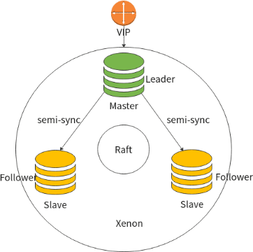

> MHA后，新一代高可用思路

基于复制的MySQL高可用

- 把binlog放到共享存储上
- GTID+半同步复制
  - 可以有多个slave，但master要求至少收到一个slave的ACK应答
- 引入binlog server和master保持半同步，其他slave都是异步复制
- 同城半同步，跨城做异步


[TOC]

# Xenon 高可用架构

> 项目地址 https://github.com/radondb/xenon




> 可以用ProxySQL + Xenon 实现请求的读写分离&数据库高可用切换


#  Xenon搭建配置文件鸟瞰

基于三节点的Xenon高科用架构配置文件鸟瞰

- 配置文件段

  ```
  {
      "server"
      "raft"
      "mysql"
      "replication"
      "backup"
      "rpc"
      "log"
  }
  ```

  - "server"

    ```
    "server":
    {
    	"endpoint":"172.16.0.150:8801"
    },
    ```

  - "raft"

    ```
    "raft":
    {
        "meta-datadir":"raft.meta",
        "heartbeat-timeout":1000,
        "election-timeout":3000,
        "leader-start-command":"sudo /sbin/ip a a 172.16.0.100/16 dev eth0 && arping -c 3 -A 172.16.0.100 -l eth0",
        "leader-stop-command":"sudo /sbin/ip a d 172.16.0.100/16 dev eth0"
    },
    ```

  - "mysql"

    ```
    "mysql":
    {
        "admin":"root",
        "passwd":"",
        "host":"127.0.0.1",
        "port":3306,
        "basedir":"/usr/local/mysql",
        "default-file":"/data/mysql/mysql3306/my3306.cnf",
        "ping-timeout":1000,
        "master-sysvars":"super_read_only=0;read_only=0;sync_binlog=default;innodb_flush_log_at_trx_commit=default;slave_net_timeout=5",
        "slave-sysvars":"super_read_only=1;read_only=1;sync_binlog=1000;innodb_flush_log_at_trx_commit=2;slave_net_timeout=5"
    },
    ```

  - "replication"

    ```
    "replication":
    {
        "user":"repl",
        "passwd":"repl4slave"
    },
    ```

  - "backup"

    ```
    "backup":
    {
        "ssh-host":"172.16.0.150",
        "ssh-user":"mysql",
        "ssh-passwd":"mysql",
        "ssh-port":22,
        "backupdir":"/data/mysql/mysql3306/data",
        "xtrabackup-bindir":"/usr/bin",
        "backup-iops-limit":"1GB",
        "backup-parallel":2
    },
    ```

  - "rpc"

    ```
    "rpc":
    {
    	"request-timeout":500
    },
    ```

  - "log"

    ```
    "log":
    {
    	"level":"INFO"
    }
    ```

    

- UnreachableMaster故障，Xenon处理逻辑

  1. 去除主库上的VIP

  2. 发起选举，校验自身是不是可以接管。

     > 同时加入io_thread是不是timeout判断
     >
     > https://github.com/wubx/xenon/commit/98c6f6335a835c77b84bff4f4f81bbdd2ce94e9#diff-bea04c1dd2a89b3db2b516e1c99770c0

     

# Xenon原理

- Xenon基于docker，未考虑单机多实例。

- Xenon监听三个端口，单机多实例的话需要hardcode修改监听端口。

 

> 但是Xenon可以尝试兼容MGR——后面再理解这是什么意思。

 

1. 每个MySQL机器上再装个Xenon实例，实例监控本地MySQL，如果MySQL当掉，会被xenon启动，并change到整个集群里。
2. raft选举当前的master（leader），xenon利用show master status ，获得execute_gtid_sets，通过该值作为选举的index，值高的为master（leader），如果值一样，谁先发起选举动作，谁可能成为master（leader）
3. 成为master（leader）后可以执行一些列脚本，绑定VIP
4. 成为slave时，取消绑定VIP（或注册到DNS）


- 开启了增强半同步&并行复制，

- 主库在没收到slave的ack时（至少一个）， 主库会hang，不会继续写数据。

- 所以半同步<font color=red>**不应该允许退为异步复制**</font>，否则没有保障。

 

- 自动重建
  - 微服务的思维方式，当出现问题时，会根据问题信息尝试自动处理方案，自动处理失败的话，便自动重建实例角色。