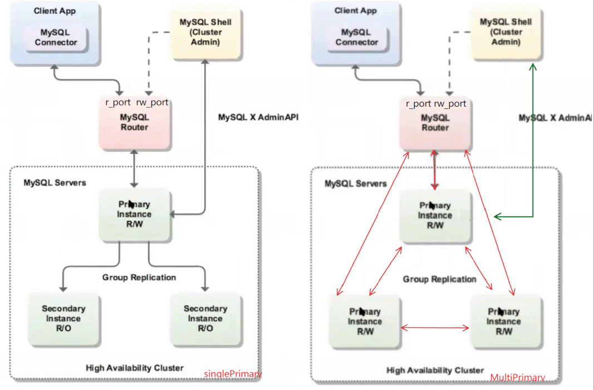
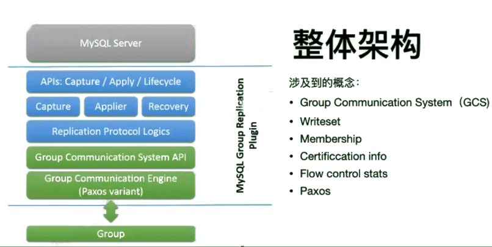
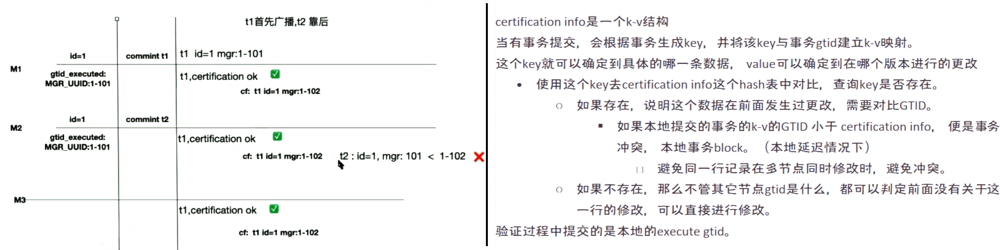
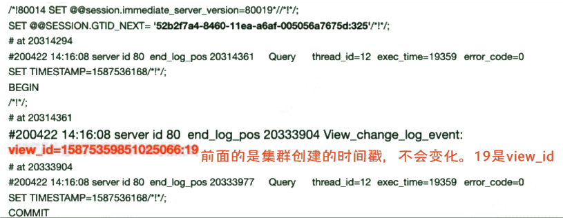
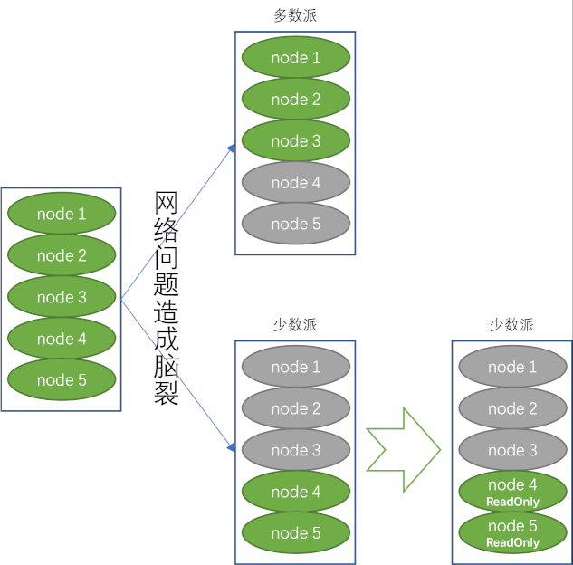
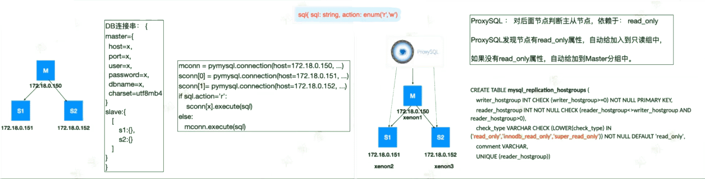
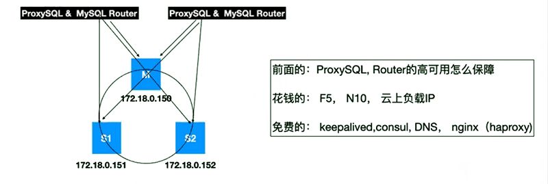

[TOC]


# InnoDB Cluster 结构图




- router可以开启2组（4个）端口号——(ro,rw) x 2

# MGR

 MGR十分重要。

 8.0开始，MySQL高可用解决方案只剩两种靠谱方案：

  1. GTID+Row+并行复制+增强半同步
  2. MGR （包括 MySQL InnoDB Cluster)

  

## MGR架构

 

 轻量级别plugin，提供paxos， multi master等。

  - raft同一时间内只有一个固定的leader，所有动作都是leader发起，也只能由leader下发。
  - paxos为每一个动作产生一个leader，该leader只负责这个动作的协调。 高并发场景更有优势。

### 可分为两种架构：

 - *single master* *（**single primary**）*
- 一写多读，master写，slave承接读
     - 没有数据冲突检测， 相对简单。
   - 性能最好
   - 主流用single primary

  

 - *multi master* *（**multi primary**）*

     - 多写多读
   - multi primary有15%的性能损失。损失在数据冲突验证环节。
   - DDL、DML不能同时在两个节点上操作一个对象。
   - 可能存在更新丢失。

 > *何为更新丢失？*

| **time** | **node1,session 1**                                | **node2,session 2**                                | **etc.**                                                     |
| -------- | -------------------------------------------------- | -------------------------------------------------- | ------------------------------------------------------------ |
| t1       | select c1 from tb1 where id = 10;                  | select c1 from tb1 where id = 10;                  | t1时间里，两个会话分别在不同节点执行相同查询                 |
|          | result,c1=10                                       | result,c1=10                                       | t1时间里，查询结果相同。                                     |
| t2       | update tb1 set c1=20 where id =10;                 | /*无操作*/                                         | t2时间里，节点1上的会话1执行更新                             |
|          | result,c1=20,并将变更复制给node2                   | /*无操作*/<br/>/*c1=20 ----> node2*/               |                                                              |
| t3       | /*无操作*/                                         | update tb1 set c1=0 where id = 10;                 | t3时间里，节点2上的会话2执行更新                             |
|          | /*无操作*/<br/> /*node 1<---- c1=0*/               | result,c1=0,并将结果复制给node1                    |                                                              |
| --       | select   c1 from tb1 where id = 10;   result,c1=0; | select   c1 from tb1 where id = 10;   result,c1=0; | 这时双节点执行查询，会发现t2时间段里session1的update操作结果丢失了。   这个现象不会引起数据库问题，但是对业务影响是致命的。 |

  

## MGR搭建

### 手动搭建MGR

 传送门：[实验：搭建MGR via 5.7 single primary](./MIC  MGR 实验/实验：手动搭建MGR via 5.7 single primary.md)

 8.0.16 之后不需要这个繁琐的操作了。

1. 配置参数:

| 基础配置                                                     | 早期版本MySQL注意配置                                        | MGR配置                                                      |
| ------------------------------------------------------------ | ------------------------------------------------------------ | ------------------------------------------------------------ |
| server_id=1 <br>grid_mode=ON<br>enforce_gtid_consistency=ON<br>binlog_checksum=NONE | log_bin=binlog<br/>log_slave_update=ON<br/>binlog_format=ROW<br/>master_info_repository=TABLE<br/>slave_log_info_repository=TABLE | binlog_checksum=NONE<br/>transaction_write_set_extraction=XXHASH64<br>loose-group_replication_group_name=${UUID}<br>loose-griuo_replication_start_on_boot=OFF<br>loose-group_replication_local_address=""<br>loose-group_replication_group_seeds=""<br>loose-group_replication_bootstrap_group=OFF |

  

2. 创建并启动GR
    ```
    create user mgr@'%' identified by 'mgr';

    grant replication slave on *.* to mgr@'%';

    grant backup_admin on *.* to mgr@'%';

    change master to master_user='mgr',master_password='mgr' for channel 'group_replication_recovery';

    install plugin group_replication soname 'group_replication.so';

    set global group_replication_bootstrap_group=ON;

    start group_replication;

    set global group_replication_bootstrap_group=OFF;
    ```

    
    
3. 查看集群

    ```
    select * from performance_schema.replication_group_members;
    ```


### 使用MySQL-Shell部署MGR

 传送门：[实验：MySQLShell@MySQL8.0.19 创建MGR](./MIC  MGR 实验/实验：MySQLShell@MySQL8.0.19 创建MGR.md) ， [实验：MGR_using_MySQLShell_on_MySQL8.0.20](./MIC  MGR 实验/实验：MGR_using_MySQLShell_on_MySQL8.0.20.md)

 8.0.16之后可以优雅的部署。

1. 配置参数

| 基础配置                                                     | MGR配置                                                      |
| ------------------------------------------------------------ | ------------------------------------------------------------ |
| server_id=1<br>grid_mode=ON <br>enforce_gtid_consistency=ON<br>binlog_checksum=NONE | binlog_checksum=NONE<br>transaction_write_set_extraction=XXHASH64 |

2. 创建数据库用户
    ```
    create user mgr@'%' identified by 'mgr';

    grant all privileges on *.* to mgr@'%' with grant option;
    ```

3. 使用MySQL Shell配置MGR
    ```
    shell.connect('mgr@node1:3306')

    var cl = dba.createCluster('$clustername')

    cl.addInstance('mgr@node2:3306')

    cl.addInstance('mgr@node3:3306')

    cl.status()
    ```

4. 更多命令：
    ```
    cl.removeInstance()

    cl.rejoinInstance()

    dba.getCluster('$clustername')
    ```


## MGR原理

 1. 复制原理
  2. 多主写入原理
  3. 单主模式的failover
  4. 复制延迟的处理
  5. 脑裂处理


### 复制原理

1. 正常复制通道，group_replication_applier

    无延迟状态下的复制状态。status:Online
    ```
    {
    "clusterName": "kk",
    "defaultReplicaSet": {
    ​     "name": "default",
    ​     "ssl": "REQUIRED",
    ​     "status": "OK",
    ​     "statusText": "Cluster is ONLINE and can tolerate up to ONE failure.",
    ​     "topology": {
    ​       "ms81:3306": {
    ​         "address": "ms81:3306",
    ​         "mode": "R/W",
    ​         "readReplicas": {},
    ​         "replicationLag": null,
    ​         "role": "HA",
    ​        "status": "ONLINE",
    ​         "version": "8.0.19"
    ​      },
    ……    
    ```

2. 延迟复制通道，group_replication_recovery
    出现在复制延迟严重时，MGR节点退化recovery状态，sql_thread从relay log中应用数据。

   - 可以查看视图

      ```
      mysql> select * from performance_schema.replication_connection_status\G
      *************************** 1. row ***************************
                 CHANNEL_NAME: group_replication_applier
                        GROUP_NAME: e18eec00-94e4-11ea-b938-0242c0a8bc51
                       SOURCE_UUID: e18eec00-94e4-11ea-b938-0242c0a8bc51
                        THREAD_ID: NULL
                      SERVICE_STATE: ON
                COUNT_RECEIVED_HEARTBEATS: 0
                 LAST_HEARTBEAT_TIMESTAMP: 0000-00-00 00:00:00.000000
                 RECEIVED_TRANSACTION_SET: e18eec00-94e4-11ea-b938-0242c0a8bc51:1-69
                    LAST_ERROR_NUMBER: 0
                    LAST_ERROR_MESSAGE:
                   LAST_ERROR_TIMESTAMP: 0000-00-00 00:00:00.000000
                 LAST_QUEUED_TRANSACTION: e18eec00-94e4-11ea-b938-0242c0a8bc51:69
      LAST_QUEUED_TRANSACTION_ORIGINAL_COMMIT_TIMESTAMP: 2020-05-13 15:34:16.530542
      LAST_QUEUED_TRANSACTION_IMMEDIATE_COMMIT_TIMESTAMP: 0000-00-00 00:00:00.000000
      LAST_QUEUED_TRANSACTION_START_QUEUE_TIMESTAMP: 2020-05-13 15:34:16.531227
       LAST_QUEUED_TRANSACTION_END_QUEUE_TIMESTAMP: 2020-05-13 15:34:16.531253
                   QUEUEING_TRANSACTION:
      QUEUEING_TRANSACTION_ORIGINAL_COMMIT_TIMESTAMP: 0000-00-00 00:00:00.000000
      QUEUEING_TRANSACTION_IMMEDIATE_COMMIT_TIMESTAMP: 0000-00-00 00:00:00.000000
        QUEUEING_TRANSACTION_START_QUEUE_TIMESTAMP: 0000-00-00 00:00:00.000000
      *************************** 2. row ***************************
                       CHANNEL_NAME: group_replication_recovery
                        GROUP_NAME:
                       SOURCE_UUID:
                        THREAD_ID: NULL
                      SERVICE_STATE: OFF
                COUNT_RECEIVED_HEARTBEATS: 0
                 LAST_HEARTBEAT_TIMESTAMP: 0000-00-00 00:00:00.000000
                 RECEIVED_TRANSACTION_SET:
                    LAST_ERROR_NUMBER: 0
                    LAST_ERROR_MESSAGE:
                   LAST_ERROR_TIMESTAMP: 0000-00-00 00:00:00.000000
                 LAST_QUEUED_TRANSACTION:
      LAST_QUEUED_TRANSACTION_ORIGINAL_COMMIT_TIMESTAMP: 0000-00-00 00:00:00.000000
      LAST_QUEUED_TRANSACTION_IMMEDIATE_COMMIT_TIMESTAMP: 0000-00-00 00:00:00.000000
      LAST_QUEUED_TRANSACTION_START_QUEUE_TIMESTAMP: 0000-00-00 00:00:00.000000
       LAST_QUEUED_TRANSACTION_END_QUEUE_TIMESTAMP: 0000-00-00 00:00:00.000000
                   QUEUEING_TRANSACTION:
      QUEUEING_TRANSACTION_ORIGINAL_COMMIT_TIMESTAMP: 0000-00-00 00:00:00.000000
      QUEUEING_TRANSACTION_IMMEDIATE_COMMIT_TIMESTAMP: 0000-00-00 00:00:00.000000
        QUEUEING_TRANSACTION_START_QUEUE_TIMESTAMP: 0000-00-00 00:00:00.000000
      2 rows in set (0.01 sec)
      ```


### 多主写入原理

1. 自增序列步长（保证insert不冲突）
修改每个节点的auto_increment_offset, auto_increment_increment

- `auto_increment_offset`表示自增长字段从那个数开始，他的取值范围是1 .. 65535

- `auto_increment_increment`表示自增长字段每次递增的量，其默认值是1，取值范围是1 .. 65535

  

  在主主同步配置时，需要将两台服务器的auto_increment_increment增长量都配置为2，而要把auto_increment_offset分别配置为1和2.这样才可以避免两台服务器同时做更新时自增长字段的值之间发生冲突。

  因为步长的原因，MGR节点最多只能时9个。(步长=10的时候就没意义了，一定会发生冲突)

    > -  group_replication_auto_increment_increment
    >
    > Determines the interval between successive column values for transactions that execute on this server instance. This system variable should have the same value on all group members. When Group Replication is started on a server, the value of the server system variable auto_increment_increment is changed to this value, and the value of the server system variable auto_increment_offset is changed to the server ID. These settings avoid the selection of duplicate auto-increment values for writes on group members, which causes rollback of transactions. The changes are reverted when Group Replication is stopped. These changes are only made and reverted if auto_increment_increment and auto_increment_offset each have their default value of 1. If their values have already been modified from the default, Group Replication does not alter them. From MySQL 8.0, the system variables are also not modified when Group Replication is in single-primary mode, where only one server writes.
    >
    >   
    >
    >  The default value of 7 represents a balance between the number of usable values and the permitted maximum size of a replication group (9 members). If your group has more or fewer members, you can set this system variable to match the expected number of group members before Group Replication is started. You cannot change the setting while Group Replication is running.

  

2. GTID区间
   
   - group_replication_gtid_assignment_block_size
   
     事务在节点执行完成，正式commit前发送到GR做校验。校验成功后，GR会给此事务分配一个GTID（如果该事务没有GTID）。
   
     GR会给每个节点预留一个范围的GTID，（MGR中GTID中的UUID部分都是一样的，数字部分则为各节点分配一个范围段，用完了再分配一个新的范围段）。这个范围段的大小就是有group_replication_gtid_assignment_block_size变量控制，默认是1000000。这个数字范围如果很大的话，gtid_executed就不能及时合并,许多GTID interval 会使校验算法变得复杂。

    - 每个节点一个独立的GTID区间，当用完了还会再申请新的区间。

    - 默认增量为1,000,000 作为间隔。

    - 4节点MGR，node1从1~开始 ，node2从1000070~开始，node3从2000071开始，node4从3000071开始
   
    ```
   mysql> show master status; 
   +------------------+----------+--------------+------------------+---------------------------------------------------------------------------+ 
   | File       | Position | Binlog_Do_DB | Binlog_Ignore_DB | Executed_Gtid_Set                             | 
   +------------------+----------+--------------+------------------+---------------------------------------------------------------------------+ 
   | mysql-bin.000003 |   4212 |       |         | d21856f4-93fb-11ea-8d4b-0242c0a8bc51:1-82:1000070-1000071:2000071:3000071 | 
   +------------------+----------+--------------+------------------+---------------------------------------------------------------------------+ 
   1 row in set (0.00 sec) 
    ```


​    

3. 事务验证机制：冲突检测certification_info机制（保证update不冲突）

   - 冲突检测只存在于多主模式。

     - 节点事务提交时本地进行验证，查找certification_info队列里是否冲突，本地验证结束后再进行远程验证（即冲突检测），验证完成后，才binlog提交。
     - 也就是说写操作都要先放入certification_info队列，判断是否可以放到队列，即冲突检测。
     - single primary的话，只需要本地验证，无需远程验证。
- 同一条数据在同一时间里只能在一个节点上应用，同时下次修改必须并保证前面的数据应用完毕。
   - 引入一个key-value结构，称为certiication_info。
      1. 当本地事务提交时，会根据规则使用xxhash64算法生成hash:execute_gtid的对应关系：

      | key   | xxhash64(索引名称+db名+db名长度+表名+表名长度+构成索引唯一性的每个列的值+值长度) |
      | ----- | ------------------------------------------------------------ |
      | value | 事务的executed gtid                                          |
      
      ​	这个key就可以确定到具体的哪一条数据， value可以确定到在哪个版本进行的更改。

      2. 执行提交后，在事务最终进行提交前，会通过paxos协议发送到MGR中的每个节点进行group replication 校验。

      3. 随事务writeset一起发送的数据包还包括事务执行时执行节点的gtid_executed信息，该信息即为事务的快照版本（key-value）。（第一次广播：进行冲突检测）
   
     4. 在进行事务认证时，会对比事务携带的gtid_executed和certification_info里面key对应的value（execute gtid）
   
        1. 如果提交事务的execute_gtid小于certification_info的value，那么意味着该事务操作的是旧的数据，说明该事务执行时，MGR的其他节点已经对事务操作的数据进行了更改，且已经先于该事务被MGR集群所接受，本次提交会被block，直到前者应用完成后，该kv值会被certification_info回收，这时新事务才允许提交。
        2. 如果未能在certification_info中找到对应的key或者value小于该事务携带的gtid_executed，意味着行数据之前未进行变更，或本次为最新版本数据，此时通过冲突认证，可以在执行节点提交。
   
     5. 执行节点提交后，才会真正的分配 trx gtid 给该事务即：为该事务注册一个gtid。并将事务通知给整个MGR。（谁提交谁分配注册GTID，并通过广播完成该事务的分发——第二次广播：正式提交发布事务）
   
     6. 其余节点会把该事务的binlog event写入relaylog，由applier线程应用。
   
        

  默认每一分钟对certification_info做一次队列清理，避免在certification_info越来越大导致性能下降。
  
  
  
  从冲突检测理论上得知，只要存在于certification info中的内容都可以并发。
  
  ~~多主模式下，每次验证后都会给发起节点一个回馈消息（相当于增强半同步的ack），比增强半同步更严格——具备下线节点的权力。（待明确）~~

  


 ### 单主模式的failover

- 只有singel primary模式需要选主。
  - 提议：节点之间彼此进行监督，当发现有down的情况时（主观故障），节点将发起提议（所以可能会同时发生多个节点进行提议）
  - 投票：投票没有超过半数，超时后依然不过半则投票超时，投票超时后将发起新一轮投票
  - 决议：当主观故障变成客观故障时（所有节点都认同故障），便形成决议，发起提议的节点将收获多数票，此时会考虑in coming队列情况——
    - in coming队列：复制队列。
    - 当in coming队列应用完成后，节点才有机会成为新master，此环节也会发生投票行为，各节点检查自己in coming队列，哪个跑干净了哪个上。

- 选主分为两个环节

 1. 第一环节

      1. group_replication_member_expel_timeout（8.0.13开始支持的参数）

         - MGR超时，默认5s —— MGR目前还达不到更快速的切换。

         - member从怀疑节点到驱逐节点之间的等待时间，单位为秒，默认值为0，最大为3600（1小时）。

         - 但是在怀疑开始前有5秒检测时间，完成这5秒检测后才会根据group_replication_member_expel_timeout  执行驱逐，因此这5s时间是不可避免的。

           > The period of time in seconds that a Group Replication group member waits after creating a suspicion before expelling from the group the member suspected of having failed. The initial 5-second detection period before a suspicion is created does not count as part of this time. Changing the value of group_replication_member_expel_timeout on a group member takes effect immediately for existing as well as future suspicions on that group member. It is not mandatory for all members of a group to have the same setting, but it is recommended in order to avoid unexpected expulsions.
           >
           > By default, group_replication_member_expel_timeout is set to 0, meaning that there is no waiting period and a suspected member is liable for expulsion immediately after the 5-second detection period ends. To avoid unnecessary expulsions on slower networks, or in the case of expected transient network failures or machine slowdowns, you can specify a timeout value greater than zero, up to a maximum of 3600 seconds (1 hour). If a suspect member becomes active again before the suspicion times out, it rejoins the group, applies all the messages that were buffered by the remaining group members, and enters ONLINE state.
           >
           > If the timeout is exceeded, the suspect member is liable for expulsion immediately after the suspicion times out. If the member is able to resume communications and receives a view where it is expelled, and the member has the group_replication_autorejoin_tries system variable set to specify a number of auto-rejoin attempts, it proceeds to make the specified number of attempts to rejoin the group while in super read only mode. If the member does not have any auto-rejoin attempts specified, or if it has exhausted the specified number of attempts, it follows the action specified by the system variable group_replication_exit_state_action.
           >
           > For more information on using this option, see Section 18.6.6.1, “Expel Timeout”. For alternative mitigation strategies to avoid unnecessary expulsions where this system variable is not available, see Section 18.9.2, “Group Replication Limitations”.

      2. 判定primary死掉，集群内节点完成数据复制后，升级ViewID。

         - 集群内每发生一次成员变更，viewID便+1，且写到binlog中。
         

  

2. 第二环节
     1. 自动选主

         任何节点都可以发起选举，发起选举后，根据强条件匹配规则，选举出新的primary

    2. 强条件匹配原则

         1. MySQL版本，越新越有优先权
       2. 如果版本一致，判断各节点权重——group_replication_member_weight 参数
       3. 如果权重一致，判断server_uuid，server_uuid与时间相关，值最小意味着节点最先创建，值最小的当选。

  

 ### 复制延迟的处理

1. MGR节点明确知道自己是否延迟、延迟多少

   binlog中可以看到

   ```
   # original_commit_timestamp=1589337555335021 (2020-05-13 10:39:15.335021 CST)
   
   # immediate_commit_timestamp=1589337555360759 (2020-05-13 10:39:15.360759 CST)
   ```

2. 再通过两个参数进行延迟处理的决议
     1. 一致性读增强 group_replication_consistency 

        - eventual 默认值
          - 只读和读写事务都不等待延迟的事务。
          - 并发度最好

        - before

          - 等待队列中的事务全部执行完，才能进行RW事务
          - 影响写性能， 不影响读，可能会读到老数据

        - before_on_primary_failover

          - 等待新primary执行完队列中的事务才对外服务

        - after

          - 在完成的事务被apply之前，要求全部其它节点都等待
          - 至少要写两份数据，安全性很好

        - before_and_after

          - 只读和读写事务在响应前，需要等数据复制到其它节点。
          - 包含参数before_on_primary_failover
          - 极致的安全性

   2. 流控 group_replication_flow_control_mode & group_replication_flow_control_period 

      在MGR中如果节点落后集群中其它成员太多，就会发起让其它节点等他完成在做的控制，这个叫流控。

      - 多IDC结构的MGR，建议关闭流控。

      - 启用流控

        ```
        group_replication_flow_control_mode=QUOTA
        ```

      - 多久进行一次流控统计(秒)

        ```
        group_replication_flow_control_period=
        ```

      - 流控默认通过两个参数控制：

        事务认证队列中积累超国少个待认证的事务后触发节点流控

        - group_replication_flow_control_applier_threshold      (默认: 25000)

        - group_replication_flow_control_certifier_threshold      (默认: 25000)

          也就说默认延迟在25000个GTID时，会对整个集群Block住写操作。

        当然，也可以允许节点延迟，就如同我们主从结构，从节点延迟，不往上面发请求就可以。

      - 关闭Flow control：

        ```
        set global group_replication_flow_control_mode='DISABLED';
        ```

        提示： 关闭流控制，注意查看是不是存在延迟，如果延迟，自已控制阀值不向上面发请求即可。

      - 流控注意事项：

        - 短板效应：尽可能让机器性能相同，发生流控时， 其它节点等待最慢节点完成应用事务。
        - 8.0流控策略很棒， 一般不用调整。


 ### 集群脑裂分区处理

MGR5.7不适合跨IDC

8.0.2开始提供了三个参数来处理脑裂

 - 由于集群为奇数节点，在脑裂后会出现多数派和少数派。

  - 当members 非正常退出，存活小于一半的小组（少数派）自动read only。

  - 如果真的出了问题， 多数派真的死掉了， 需要少数派小组组承接业务那么可以手动强制组成新的MGR：

    ```
    stop group replication;
    
    set global group_replication_force_members="$少数派成员";
    ```
    

  

 - group_replication_unreachable_majority_timeout

   组成员丧失多数时离开小组的超时时间由group_replication_unreachable_majority_timeout控制，默认为0。

   > 0为永远等待着（waiting），不离开。
    - 如果设置超时，则在经过指定的时间后，少数派成员处理的所有未决事务将回滚，并且少数派小组中的服务器将变为ERROR状态。
     - 如果成员的group_replication_autorejoin_tries系统变量设置为指定自动重新加入尝试的次数，则在super_read_only模式下，成员将重试次数尝试重新加入组。
     - 如果成员没有指定任何自动重新加入尝试，或者成员用尽了指定的尝试次数，则该成员将遵循group_replication_exit_state_action指定的操作。

    - <font color=red>当有一个对称组时，例如只有两个成员（S0，S2），如果发生脑裂并且没有多数，则在配置的超时后，所有成员都将进入ERROR状态。</font>

 - group_replication_autorejoin_tries

   成员尝试重新加入MGR的次数，默认为0.

 - group_replication_exit_state_action

   被驱逐的组成员直到重新连接到该组才知道被驱逐了，因此仅当该成员设法重新连接时，或者该成员对自己提出怀疑并驱逐自己时，才执行指定的操作。

   当成员意识到自己脱离了GR时执行的动作，可选为abort_server、readonly。

   ​	当为abort_server时，该节点会关闭实例进程

   ​	当为readonly时，该节点会set super_read_only=1;

 - 表replication_group_members
    ```
    mysql> select * from performance_schema.replication_group_members; 
    +---------------------------+--------------------------------------+-------------+-------------+--------------+-------------+----------------+ 
    | CHANNEL_NAME        | MEMBER_ID               | MEMBER_HOST | MEMBER_PORT | MEMBER_STATE | MEMBER_ROLE | MEMBER_VERSION | 
    +---------------------------+--------------------------------------+-------------+-------------+--------------+-------------+----------------+ 
    | group_replication_applier | 65bddd3c-93fe-11ea-aa77-0242c0a8bc53 | ms83    |    3307 | ONLINE    | PRIMARY   | 8.0.19     | 
    | group_replication_applier | d5b78b03-93fa-11ea-b31b-0242c0a8bc51 | ms81    |    3306 | ONLINE    | PRIMARY   | 8.0.19     | 
    | group_replication_applier | d6dcce31-93fa-11ea-b93c-0242c0a8bc52 | ms82    |    3306 | ONLINE    | PRIMARY   | 8.0.19     | 
    | group_replication_applier | d79cb78f-93fa-11ea-a294-0242c0a8bc53 | ms83    |    3306 | ONLINE    | PRIMARY   | 8.0.19     | 
    +---------------------------+--------------------------------------+-------------+-------------+--------------+-------------+----------------+ 
    4 rows in set (0.00 sec) 

    ```


 ## MGR注意事项

 - MGR启停注意：

   当全部节点关闭的情况下，启动MGR的方式

   任一节点执行：

   ```
   set global group_replication_bootstrap_group=ON;
   start group_replication;
   set global group_replication_bootstrap_group=OFF;
   ```

 - DDL注意事项

   <font color=red>DDL的表，其它节点不能有DML操作。</font>

 - 集群成员数量

   目前最多9个（因为自增序列步长的原因）

 - 集群成员的约束

   只支持InnoDB，GTID。 表必须有主键，最好不要使用外键。


 # 使用myrouter

```
[root@ms81 ~]# mysqlrouter -B mgr@192.168.188.81:3306 --directory=/data/mysql/mysqlroutekk -u root --force
```

 - -u root 是os账号， 用来指定将来启动router的user
  - --force 如果已经有配置，也会重新生成一份

```
Please enter MySQL password for mgr:
# Bootstrapping MySQL Router instance at '/data/mysql/mysqlroutekk'...

- Creating account(s) (only those that are needed, if any)
- Verifying account (using it to run SQL queries that would be run by Router)
- Storing account in keyring
- Adjusting permissions of generated files
- Creating configuration /data/mysql/mysqlroutekk/mysqlrouter.conf

# MySQL Router configured for the InnoDB Cluster 'kk'

After this MySQL Router has been started with the generated configuration

$ mysqlrouter -c /data/mysql/mysqlroutekk/mysqlrouter.conf

the cluster 'kk' can be reached by connecting to:

## MySQL Classic protocol

- Read/Write Connections: localhost:6446
- Read/Only Connections:  localhost:6447

## MySQL X protocol

- Read/Write Connections: localhost:64460
- Read/Only Connections:  localhost:64470
```


```
[root@ms81 mysqlroutekk]# tree /data/mysql/mysqlroutekk/
/data/mysql/mysqlroutekk/
├── data
│  ├── keyring
│  └── state.json
├── log
│  └── mysqlrouter.log
├── mysqlrouter.conf
├── mysqlrouter.key
├── run
├── start.sh
└── stop.sh

3 directories, 7 files
```


```
[root@ms81 mysqlroutekk]# cat /data/mysql/mysqlroutekk/mysqlrouter.conf
# File automatically generated during MySQL Router bootstrap
[DEFAULT]
user=root
logging_folder=/data/mysql/mysqlroutekk/log
runtime_folder=/data/mysql/mysqlroutekk/run
data_folder=/data/mysql/mysqlroutekk/data
keyring_path=/data/mysql/mysqlroutekk/data/keyring
master_key_path=/data/mysql/mysqlroutekk/mysqlrouter.key
connect_timeout=15
read_timeout=30
dynamic_state=/data/mysql/mysqlroutekk/data/state.json

[logger]
level = INFO

[metadata_cache:kk]
cluster_type=gr
router_id=1
user=mysql_router1_efk37yyqmir3
metadata_cluster=kk
ttl=0.5
auth_cache_ttl=-1
auth_cache_refresh_interval=2
use_gr_notifications=0

##destinations后面string可以是机器名，matadata-cache(MGR)
##Role:PRIMARY,SECONDARY or PRIMARY_AND_SECODARY

[routing:kk_rw]
bind_address=0.0.0.0
bind_port=6446
destinations=metadata-cache://kk/?role=PRIMARY
routing_strategy=first-available
protocol=classic

[routing:kk_ro]
bind_address=0.0.0.0
bind_port=6447
destinations=metadata-cache://kk/?role=SECONDARY
routing_strategy=round-robin-with-fallback
protocol=classic

[routing:kk_x_rw]
bind_address=0.0.0.0
bind_port=64460
destinations=metadata-cache://kk/?role=PRIMARY
routing_strategy=first-available
protocol=x

[routing:kk_x_ro]
bind_address=0.0.0.0
bind_port=64470
destinations=metadata-cache://kk/?role=SECONDARY
routing_strategy=round-robin-with-fallback
protocol=x
```

```
[root@ms81 mysqlroutekk]# cat /data/mysql/mysqlroutekk/data/state.json
{
"metadata-cache": {
​     "group-replication-id": "e18eec00-94e4-11ea-b938-0242c0a8bc51",
​     "cluster-metadata-servers": [
​       "mysql://ms81:3306",
​       "mysql://ms82:3306",
​       "mysql://ms83:3306"
​    ]
},
"version": "1.0.0"
```

```
[root@ms81 mysqlroutekk]# cat /data/mysql/mysqlroutekk/start.sh

#!/bin/bash
basedir=/data/mysql/mysqlroutekk
if [ `whoami` == 'root' ]; then
ROUTER_PID=$basedir/mysqlrouter.pid /usr/local/myrouter/bin/mysqlrouter -c $basedir/mysqlrouter.conf &
else
sudo ROUTER_PID=$basedir/mysqlrouter.pid /usr/local/myrouter/bin/mysqlrouter -c $basedir/mysqlrouter.conf --user=root &
fi
disown %-
```


 # MGR监控（from wubx）

 ## 监控点

 ### 可用性监控

- 本节点是不是online:

  ```
  select member_state from replication_group_members where member_id=@@server_uuid;
  ```

- 当前节点是不是可以写：

  ```
  select * from performance_schema.global_variables where variable_name in ('read_only', 'super_read_only');
  ```

  - 节点是Online表示属于集群中，正常工作。 
  - 节点不可写，表示是Single-master中的非Master节点。


 ### 性能监控

- 复制是不是存在延迟：

  对比获得到的GTID和本节点执行的GTID是不是一致：

  获取的GTID：

  ```
  SELECT Received_transaction_set FROM performance_schema.replication_connection_status WHERE Channel_name = 'group_replication_applier';
  ```

- 本节点执行的GTID：

  ```
   select @@gtid_executed;
  ```

- 远程获取的GTID - 本节点执行的GTID = 延迟的GTID数

  

- 本节点执行队列是不是有堆积(大于0表示有延迟）：

  ```
  select count_transactions_in_queue from replication_group_member_stats where member_id=@@server_uuid;
  ```


 ### 流控(flow control) 

​	看前面章节。

  

 # MGR调优（from wubx）

- MGR调优参数

  因为基本复制结构，所有的数据复制，还是逻辑的重放，所以优化也是复制优化点。

- 更改：

  ​	slave_parallel_type -> LOGICAL_CLOCK

- 增强sql_thread个数：

  ​	slave_parallel_workers -> 2-8

- 如果CPU瓶颈，网络没问题，减少CPU压缩：

  ​	group_replication_compression_threshold = 1000000 -> 2000000

  ​	由原来的1M变成2M，再进行压缩（主要针对大事务传述优化）

  >  来自 <[http://wubx.net/mgr%E7%9B%91%E6%8E%A7%E5%8F%8A%E4%BC%98%E5%8C%96%E7%82%B9/](http://wubx.net/mgr监控及优化点/)> 

  

 # 向MGR迁移

 ## 单机向MGR过渡

 通过mysqlsh的方式创建Clone节点，建立MGR。

 也可手动通过xtrabackup等方式创建从库，建立MGR。

  

 ## 复制架构增加读写分离



> 实际上，读全放slave并不合理，这一点需要注意。

  

 ## 复制架构迁移|转换到MIC

 复制架构可以直接转换MIC。

  

 master节点向MGR集群转换

  1. master可以直接启用GR

        1. 更改Master配置，以支持MGR启用。配置后重启一次实例（可以不重启嘛？待验证）
      2. 保证复制进行中
      3. 加载group replication       plugin
      4. 将master成为MGR成员（唯一的成员）

   2. slave成员转为MGR成员

         1. 更改slave配置，以支持MGR。配置后重启一次实例（可以不重启嘛？待验证）
       2. 加载group repliccation       plugin
       3. 如有需要，配置gtid_purged。多数情况下无需配置，因为复制已经在运行了。
       4. slave节点执行start       group_replication;

  

MGR集群的Primary节点可以做其它节点的从库：建立从关系时，指定一下channel通道名：

```
PrimaryOfMGR mysql > change master to master_host='',\
master_port=xxxx,\
master_user='',\
master_password='',\
master_auto_position=1,\
get_master_public_key=1
for channel 'mgrprimarytomaster';
```


换个思路：将2个slave变成mgr，业务切换到mgr(slave)，再将原master加入MGR，也OK


> 一通百通，反正可以直接转换

  



主从的时候，有非innodb引擎表或没有主键的表，必须DDL成innodb表，或添加主键后才能继续。