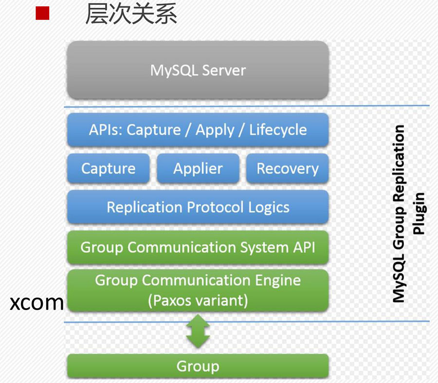
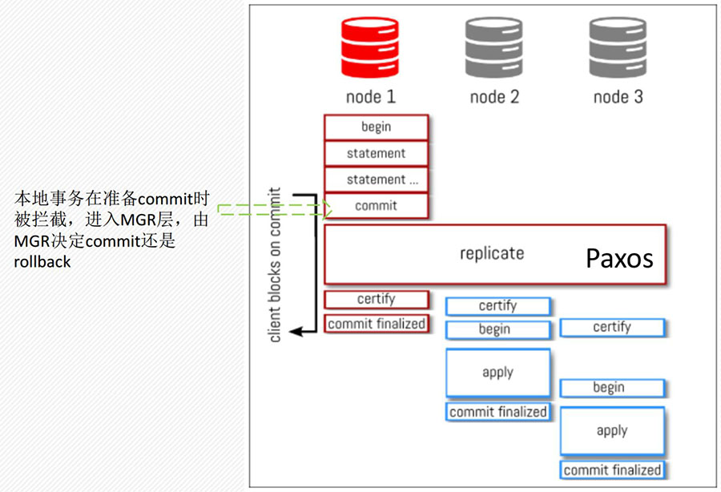
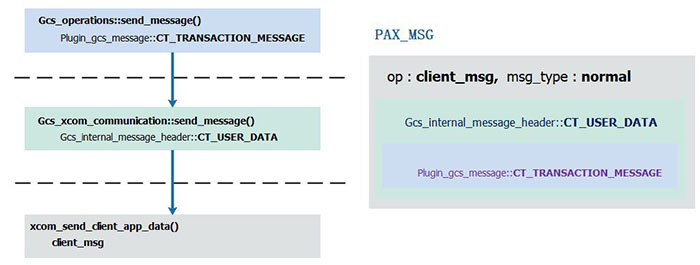

MySQL事务在MGR中的漫游记—路线图

本文来源于[数据库内核专栏](https://zhuanlan.zhihu.com/c_206071340)。

 

MGR即MySQL Group Replication，是MySQL官方推出的基于Paxos一致性协议的数据高可靠、服务高可用方案。MGR在2016年12月12号发布的MySQL 5.7.17版本达到GA状态，在这之后一年半时间里，MySQL又相继发布了5.7.18到5.7.22版本，每个版本都对MGR做了功能增强、性能优化和Bug修复，毫无疑问目前MGR达到了线上部署状态。

 

MySQL Plugin简介

MGR是一个MySQL Plugin（插件），简单来说，Plugin是MySQL官方提供的一套扩展机制，在MySQL实现事务处理、Binlog传输和持久化等操作时，在代码逻辑中预埋了一些（Hook）钩子，Plugin可以在钩子上注册处理函数，增加Plugin专有的功能实现。

Plugin提供了包括事务处理（Trans_observer）、服务器状态变化（Server_state_observer）、Binlog存储（Binlog_storage_observer）、Binlog发送（Binlog_transmit_observer）和Binlog回放（Binlog_relay_IO_observer）等不同功能模块的钩子集合。

举个栗子，比如事务处理钩子集包括了before_dml，before_commit，before_rollback，after_commit，after_rollback等五个钩子，分别用于在事务执行DML操作前，在事务提交前，在事务回滚前，在事务提交后，在事务回滚后进行特定的操作。

插件通过INSTALL PLUGIN启用，UNSTALL PLUGIN卸载。在INSTALL时会调用初始化函数向MySQL实例注册上述介绍的不同模块钩子集。

MGR作为一个官方插件，同样实现了这些钩子，其中事务处理集合的before_dml和before_commit是MGR中2个与事务处理相关的最主要钩子，注册函数分别为group_replication_trans_before_dml和group_replication_trans_before_commit，前者用于在执行DML前进行事务操作的合法性检查，包括所操作的表是否显式定义了主键，是否使用了InnoDB存储引擎等；后者是本文要重点介绍的MGR事务处理入口，它将MySQL中已经进入提交阶段的事务拦截下来，进入MGR处理流程，由MGR决定该事务应该提交还是回滚后，在返回MySQL通用代码进行后续处理。下图为作为Plugin的MGR整体框图。

 

 

 

 

MGR before_commit对事务的处理

MySQL事务通过before_commit钩子进入MGR，before_commit位于MYSQL_BIN_LOG::commit()函数中，具体是在进入事务组提交MYSQL_BIN_LOG::ordered_commit()之前，这就意味着执行到before_commit这个钩子时，事务还未提交，产生的Binlog还未写入Binlog文件中，事务GTID还未产生。接下来我们从group_replication_trans_before_commit开始详细分析事务如何一步步在MGR中漫游直到被宣判进天堂（提交）还是入地狱（回滚）。

 

 

 

事务处理合法性判断

首先，需要判断该事务是否需要交由MGR处理以及MGR当前是否可以处理事务。如果事务属于group_replication_applier或group_replication_recovery复制通道（channel），说明该事务已经被本节点或其他节点的MGR模块处理过，无需再进入；如果MGR节点当前状态非在线（ONLINE），或虽然在线，但是正在退出（stop group_replication），或已经退出，这些情况都不适合再处理事务。

如果MGR能够正常处理，那么先初始化事务gtid信息，分为2种情况，一种是事务还未产生gtid，这是通常的情况，表明该事务是在本节点第一次执行的；另一种是已经有gtid，这说明事务是同个主从复制通道进入MGR的，比如该MGR节点同时是一个Master-Slave异步复制的Slave节点，事务在SQL Thread上完成回放后在提交阶段进入group_replication_trans_before_commit函数钩子；对于第一种情况，会在完成事务认证（冲突检测）后由MGR Applier模块产生gtid。

 

事务信息收集和顺序写入

接下来，收集事务认证所需的相关信息。包括事务更新的记录主键信息、产生的Binlog信息和gtid信息。记录主键信息write_sets被封装在Transaction_context_log_event（tcle）中，tcle除了write_sets外，还包括了事务执行节点的server_uuid，事务是否为dml，事务的线程id和gtid是否已指定等；由于Binlog（log_event group）和gtid信息（Gtid_log_event）本来就是log_event，不需要再次封装。将这些信息会放入Transaction_Message对象中。

首先是冲突检测所需的信息Transaction_context_log_event被写入Transaction_Message对象，其次是Gtid_log_event，最后才是事务改变的数据（log_event group），这些信息写入的顺序非常有讲究，这在后续的章节会体现。

完成了事务信息收集后，下一步是消息的发送和返回。MGR会在发送消息前以事务线程id为key调用registerTicket注册一个Wait_ticket对象，对象计数设置为1，注册成功后调用Gcs_operations::send_message()将Transaction_Message对象（类型为Plugin_gcs_message::CT_TRANSACTION_MESSAGE）发送给Paxos，随后调用waitTicket()阻塞等待直到其他流程通过releaseTicket()将对应的Wait_ticket对象计数变为0。

最后，需要简单说明的是，在发送消息前会调用Flow_control_module::do_wait()就行流控处理，该函数会判断本周期（默认为1s）内本节点的事务提交配额是否已经用完，如果用完，在本周期无法再提交事务，需要等待本周期结束再发送消息。

 

事务在Paxos中的处理

MGR中的事务以Paxos请求的方式发送给Paxos，Paxos通过两阶段协议（propose、accept）方式使各节点达成一致后返回给MGR在进行后续处理。下面我们就具体介绍下事务请求如何进入Paxos，又是如何返回的。

Gcs_operations::send_message()函数会获取在MGR初始化时向GCS注册的Gcs_control_interface和Gcs_communication_interface，GCS可以理解为MGR分层实现中的消息通信层（Group Communication System），目前仅支持官方提供的基于Paxos实现的Xcom。通过Gcs_control_interface获取本节点的identifier（Gcs_member_identifier），通过Gcs_communication_interface提供的消息发送接口Gcs_xcom_communication::send_message()发送事务请求。

 

进入Paxos前层层封装

在Gcs_xcom_communication::send_message()接口中会将消息类型设置为Gcs_internal_message_header::CT_USER_DATA，交由 Gcs_xcom_proxy_impl::xcom_client_send_data()发送。

MGR初始化时会默认为Paxos创建6个socket管道来发送客户端消息，使用m_xcom_handlers[]数组维护，在xcom_client_send_data()中，会对消息再次进行封装，将其设置为app_type类型，该类型的消息在完成Paxos协议流程后需要返回给客户端处理，最后基于round-robin方式选择一个socket后调用xcom_send_client_app_data()对消息做最后封装处理，该函数会创建一个pax_msg ，放入事务数据，并指定发送的目标节点为所有节点，类型op为client_msg，消息类型msg_type为normal，最终调用socket的send接口将消息发送给Paxos。下图为消息的封装过程及最终表现形式。

 

 

这里需要注意的是：每次send_message的时候，仅是将其写入6个socket中的一个就返回了，发送消息的锁（shared_plugin_stop_lock）也释放了。比如T1写入socket1，T2写入socket2。每个socket上有个acceptor_learner_task负责将socket上的消息写入到prop_input_queue，proposer_task按需读取该queue消息进行propose。是不是有可能T2先被socket2上的acceptor_learner_task写入prop_input_queue，先被propose了？

这是有可能的，不过因为这些事务是并发执行，那么T1、T2先后顺序并不重要，只需要确保有依赖关系的事务不会先被propose即可（propose的先后表示在远端节点回放的先后），这显然是可以保证的，虽然事务数据消息写入socket就返回，但是事务还不会进入order_commit(）而是等待处理结果，那么与等待的事务有依赖的事务是无法执行到事务提交阶段的，更不用说写socket这步了。

 

事务Propose和Execute

Paxos实例在MGR创建socket时为每个分配一个acceptor_learner_task协程，该协程调用buffered_read_msg()读取socket消息。对于msg_type为normal的消息，会调用dispatch_op进行处理，对于op为client_msg的消息，dispatch_op会进一步调用handle_client_msg()插入到prop_input_queue请求通道末尾。每个MGR节点的Xcom有一个proposer_task，他会获取prop_input_queue头部的请求，并发送给MGR的其他节点进行propose操作，proposer_task会在发送前做事务请求的batch操作，所以一个Paxos propose请求可能包括多个事务的数据。Paxos的propose、accept和learn 三个流程的具体实现后续另开一篇，在此仅放一个图，不展开说明。

 

 

Paxos实例的executor_task会按序获取完成Paxos处理流程的事务请求，调用execute_msg()执行该请求，对于app_type类型的请求，会调用deliver_to_app()，而该函数最终调用了在MGR初始化时注册的xcom_data_receiver处理函数cb_xcom_receive_data()。

 

事务请求分发和解封

cb_xcom_receive_data()只是简单地初始化了一个Data_notification对象，赋予do_cb_xcom_receive_data()回调处理函数之后将其push到Gcs_xcom_engine对象的m_notification_queue队列中。

 

 

process_notification_thread线程调用Gcs_xcom_engine::process()函数从m_notification_queue队列pop请求，并交由指定的回调函数处理，对于Data_notification对象，即有do_cb_xcom_receive_data()进行处理。

do_cb_xcom_receive_data()首先会获取Gcs_xcom_interface对象，并基于该对象的get_xcom_group_information()和请求中的group_id找到对应的Gcs_group_identifier和Gcs_xcom_control对象，再通过Gcs_group_identifier获取Gcs_communication_interface对象（进一步转化为Gcs_xcom_communication_interface对象），接着对事务请求进行Gcs_internal_message_header::decode()和Gcs_message_data::decode()，重新创建Gcs_message(Gcs_member_identifier,Gcs_group_identifier, message_data)，对于CT_USER_DATA类型，Gcs_message会交由Gcs_xcom_communication_interface对象的Gcs_xcom_communication::xcom_receive_data(Gcs_message *message)进行下一步处理。

xcom_receive_data()判断节点当前是否处于视图切换状态，如果是则需要临时缓存该请求，完成视图切换后再处理，如果不是则调用Gcs_xcom_communication::notify_received_message(Gcs_message *message)，该函数内部获取MGR初始化时注册的Gcs_communication_event_listener，交由其中的Plugin_gcs_events_handler::on_message_received()根据消息的不同进行分发，对于Plugin_gcs_message::CT_TRANSACTION_MESSAGE消息类型，调用Plugin_gcs_events_handler::handle_transactional_message()，在该函数中，事务进入MGR的applier_module一系列pipeline处理。

 

 

 

事务在Applier_module中的处理

handle_transactional_message()调用applier_module的handle()接口创建类型为DATA_PACKET_TYPE的Data_packet对象，并将其push到Applier_module的incoming队列中。Applier_module在（MGR）初始化时注册了incoming队列处理线程Applier_module::applier_thread_handle()，对于DATA_PACKET_TYPE类型的Packet对象，调用Applier_module::apply_data_packet()进行处理，完成处理后将该对象从incoming队列中删除。下面我们会详细分析apply_data_packet()的具体处理流程，开始之前，先介绍Applier_module的pipeline机制。

配置事务处理pipeline

MGR在初始化Applier_module时（configure_and_start_applier_module())会调用Applier_module::setup_applier_module()，该接口除创建前述的incoming队列外，最重要的功能就是调用get_pipeline()来配置pipeline。

 

 

首先，调用get_pipeline_configuration()根据传入的Handler_pipeline_type来确定事务中的Event都需要经过哪几类处理，MGR将此设计为可定制模式，默认为STANDARD_GROUP_REPLICATION_PIPELINE，即标准的组复制管道，按顺序分别为CATALOGING_HANDLER、CERTIFICATION_HANDLER和SQL_THREAD_APPLICATION_HANDLER。

接着，调用configure_pipeline()来配置上一步定制的各个管道处理函数Event_handler（简称handler）。对于CATALOGING_HANDLER，注册Event_cataloger作为管道处理对象；CERTIFICATION_HANDLER对应Certification_handler；SQL_THREAD_APPLICATION_HANDLER对应Applier_handler。

handler具有unique属性和role属性，对于unique属性，表示在一条管道中，该类型的handler最多只能处理一次，目前标准的组复制管道中3个handler都是unique的。对于role属性，表示在一条管道中不允许存在2个及以上相同role类型的handler，目前3个handler的role分别为EVENT_CATALOGER、CERTIFIER和APPLIER，函数get_handler_by_role()用于获取指定role的handler。

在configure_pipeline()函数中，还会调用handler->initialize()来进行handler初始化，在该接口中Certification_handler创建了Certifier对象。最后configure_pipeline()会调用append_handler()来将每个handler按照顺序加入pipeline中。

 

Continuation对象

apply_data_packet()会将事务数据进行拆分为多个Event，并将其依次插入管道中，只有当所有（3个）handler完成该Event处理后，才会插入下一个Event。所以其实各个Event是个串行处理过程，pipeline相当于是一条流水线。

那么如何判断流水线完成了Event处理呢？这里需要引入Continuation对象，其实现了wait()和signal() 2个方法，包括ready、error_code、transaction_discarded和cond变量。ready用来表示一个Event是否已经处理结束（可能因为出错被中断），error_code表示处理过程是否出错，transaction_discarded表示是否丢弃该事务。在Event被handler处理时，如果处理出现错误，则调用signal()方法设置ready为true，error_code为true，transaction_discarded为true；如果处理结束，但冲突检测未通过，虽然error_code为false，但是transaction_discarded为true，表示扔需要丢弃事务数据；如果处理结束，且冲突检测通过，但如果是本地事务，也需要丢弃事务数据，因为本地事务不需要写relay log，而是交还给原始流程继续处理。wait()方法会判断ready和error_code是否有一个为true，若不满足，则会一直在信号量cond上的等待。由于在signal()中ready被置为true，且会唤醒在cond上等待的线程，所有调用wait(）即可获知一个Event是否结束处理。

 

事务在pipeline中处理流程

本小节详细分析apply_data_packet()的具体处理流程。在上个小节提到事务数据会被拆分为多个Event，其实所拆出来的Event就是在before_commit钩子中被先后放入事务消息中的Transaction_context_log_event，Gtid_log_event和事务产生的log_event group。拆出来的Event被转化为Pipeline_event对象后交由Applier_module::inject_event_into_pipeline()开始流水线的各个handler处理，handler会调用Event_handler::handle_event()处理，事务流水线处理是在其他线程中执行的，对于inject_event_into_pipeline()调用前述的Continuation对象wait()方法等待处理结束，并根据error_code和transaction_discarded进行最后处理。

 

 

 

Event_cataloger::handle_event()处理

Transaction_context_log_event：本阶段仅是将Pipeline_event对象标记为TRANSACTION_BEGIN（表示事务开始）。其作用是若前个事务因设置transaction_discarded为true而被丢弃后，收到该Event可重置transaction_discarded字段为false，避免该事务的Event被丢弃。

事务的其他Event（肯定在晚于Transaction_context_log_event被本阶段处理）：本阶段会判断Continuation对象的transaction_discarded是否为true，如果是，其实就说明事务冲突检测未通过，无需再继续处理，会调用signal(0, transaction_discarded)返回处理结果（显然是丢弃/回滚）。

完成上述处理或是其他情况，调用next()交由下一阶段处理。

 

 

 

Certification_handler::handle_event()处理

Transaction_context_log_event：交由Certification_handler::handle_transaction_context()处理，仅调用set_transaction_context()将Event内容缓存到transaction_context_packet变量上。

Gtid_log_event：交由Certification_handler::handle_transaction_id()处理。这是事务在pipeline处理流程中最最关键的一步，简单来说，其所做的就是通过Certification_handler::get_transaction_context()获取缓存在transaction_context_packet上的事务认证所需信息，调用Certifier::certify()进行事务认证。

 

 

certify()函数不是简单的事务冲突检测处理函数，而是会根据是否为本地事务，是否启动了冲突检测（多主模式？正在主从切换？），事务是否已经有gtid等多种场景分别进行不同的处理。如果启用了冲突检测，那么需要将事务的write_sets跟冲突检测数据库进行一一比对，决定事务能否正常提交。认证通过的事务，其write_sets会被添加到冲突检测数据库中，对于认证通过或无需认证的场景，如果事务还未有gtid，则为其分配gtid，并更新系统已分配的gtid集合，若为非本地事务，还需确定其组提交次序。函数中还会更新事务认证的统计信息。最终返回生成的sequence_number（同时也表示是否认证通过）。

返回到handle_transaction_id()后，继续根据是否为本地事务，是否认证通过来进行后续处理。对于本地事务，标志着该事务在MGR中处理已结束，初始化Transaction_termination_ctx对象，用于在before_commit钩子返回后MYSQL_BIN_LOG::commit()能够判断事务应该提交还是回滚，事务请求信息中的第三部分log_event group被丢弃。对于非本地事务（远端事务），若未认证通过，也意味着结束处理，否则还需要继续流水线下一步处理。

 

 

除了远端事务认证通过的调用next()进行下一阶段处理外，其他情况在均调用Continuation对象signal()结束。

上面寥寥几段还无法道出Certification_handler::handle_transaction_id()全部内容，需要专门安排一篇来对内容和背景进行详细分析。

 

Applier_handler::handle_event()处理

对于非Transaction_context_log_event类型Binlog，在本阶段会最终调用queue_event()写入到relay-log文件中。在MGR初始化是已经注册了group_replication_applier channel这个复制通道，所以，被relay-log文件的事务会被复制线程回放。

 

 

 

 

 

其实本阶段只会处理2种Event场景，第一种是Transaction_context_log_event，此时事务还未进行认证，所以该Event会走完pipeline全部3个阶段才返回；第二种场景就是通过了认证的远端事务，需要写入relay-log中被回放，此时事务组提交的次序已经确定。

 

以Event角度重讲

上面是以handler维度介绍事务处理，这里以Binlog为主角来介绍。

首先是Transaction_context_log_event，在Event_cataloger::handle_event()中会将Pipeline_event对象标记为TRANSACTION_BEGIN，表示事务开始，并将transaction_discarded设置为false。在Certification_handler::handle_event()中，其承载的事务认证信息（write_sets）被缓存到transaction_context_packet上。至此，该Event处理结束。

接着是Gtid_log_event，其仅在Certification_handler::handle_event()中被处理，基于缓存在transaction_context_packet上的认证信息决定事务提交还是回滚，若提交且为远端事务，则确定Gtid_log_event中的gtid后继续交由Applier_handler::handle_event()处理，最终写入relay-log文件。若回滚或为本地事务，则该Event处理结束。

最后是事务修改的数据log_event group，其只有在远端事务被判定可提交时才会被Applier_handler::handle_event()写入relay-log文件。前2个pipeline阶段不处理。

所以，很显然，Transaction_context_log_event只用来表示事务开始并将write_set传给Certification_handler::handle_event()，不会被写入relay-log；Gtid_log_event是事务认证的处理主场，在经过认证后会进行初始化，最终写入relay-log；远端事务的log_event group在认证通过后写入relay-log。最终经过MGR的事务写入relay-log/Binlog文件的东西跟普通事务是一样的。

 

总结

本篇将一个MySQL如何进入MGR并如何一步步执行直到返回进行了详细梳理，借此能够建立MGR事务处理流程的基本认识。但由于篇幅所限，事务在Paxos中达成协议的过程，事务认证过程还未充分描述，需要另外开篇。此外，事务在MGR中的各种处理，都离不开MGR初始化的时候确定的各种框架，要想深入通透的理解处理流程，还需要结合MGR是如何初始化和如何进行成员变更的。

 

网易云数据库[RDS](https://link.zhihu.com/?target=https%3A//www.163yun.com/product/rds%3Ftag%3DM_zhihu_40882015_zl)是一种稳定可靠、可弹性伸缩的在线关系型数据库服务，当前支持MySQL引擎，提供基础版，高可用版，金融版针对不同业务场景的高可用解决方案，同时提供多重安全防护措施，性能监控体系，专业的数据库备份、恢复及优化方案，使您能专注于应用开发和业务发展。

 

本文来源于数据库内核专栏。由作者温正湖授权发布

原文：[MySQL事务在MGR中的漫游记 - 路线图](https://zhuanlan.zhihu.com/p/38456012)

 

了解 网易云 ：

网易云官网：[https://www.163yun.com](https://link.zhihu.com/?target=https%3A//www.163yun.com/)

网易云社区：[https://sq.163yun.com/blog](https://link.zhihu.com/?target=https%3A//sq.163yun.com/blog)

云产品全面促销5折起：[https://www.163yun.com/activity/promotion](https://link.zhihu.com/?target=https%3A//www.163yun.com/activity/promotion%3Ftag%3DM_zhihu_40882015_zl)

编辑于 2018-07-30

 

来自 <https://zhuanlan.zhihu.com/p/40882015> 