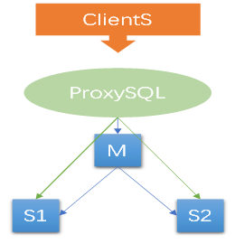
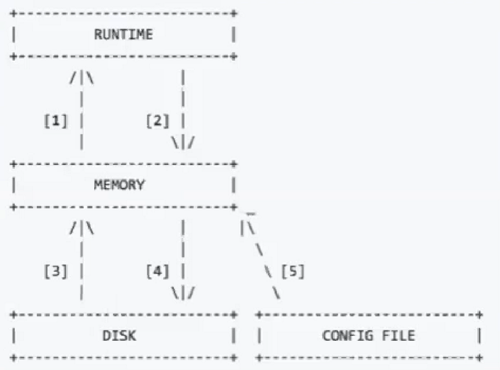

[TOC]

# Proxy SQL架构

- ProxySQL是一个中间件。



 

- ProxySQL配置架构分层

  ProxySQL的配置可以动态的更改生效。

配置分为三个层面

1. runtime

   运行的程序使用，已生效的配置

2. current（memory）

   寄存在内存中的配置，供修改。需要加载生效。需要写入到disk以持久化存储。

3. disk（sqlite、config-file）

   持久化存储，ProxySQL重启后还可以加载回来



 

​	config-file是传统配置，不能动态更改。现在可以完全用sqlite配置来代替config-file。

​	默认的，sqlite3数据库保存在$DATADIR/proxysql.db

 

- ProxySQL配置加载顺序

  - ProxySQL启动时，首先去找/etc/proxysql.cnf，通过配置文件读取到$DATADIR：如果$DATADIR下存在proxysql.db，就加载sqlite中的配置，利用sqlite中的配置初始化memory和runtime
  - 如果启动ProxySQL时带有 --initial ，会用/etc/proxysql.cnf的配置，把runtime、disk全部初始化
  - 在调用时调用 --reload，会把/etc/proxysql.cnf和disk中的配置进行合并，如果冲突需要用户干预。一般的Disk会覆盖config-file.

 

# ProxySQL核心概念

## 核心概念

| Hg(HostGroup)  | 节点机器分组                                 |
| -------------- | -------------------------------------------- |
| Query  digest  | 每一个类型的Query形成一个唯一的HashCode      |
| Query  Rule    | 通过正则或是HashCode指定查询分配到不同的Hg   |
| ProxySQL  User | 连接ProxySQL的用户（frontend、backend都为1） |

 

## 核心表

- mysql_users
- mysql_servers
- mysql_replication_hostgroups |     mysq_galera_hostgroups | mysql_group_replication_hostgroups
- mysql_query_rules

  > https://proxysql.com/documentation/main-runtime/#mysqlservers

 

# 安装

## 包管理器方式：

```
https://proxysql.com/documentation/installing-proxysql/
 
cat <<EOF | tee /etc/yum.repos.d/proxysql.repo
[proxysql_repo]
name= ProxySQL YUM repository
baseurl=https://repo.proxysql.com/ProxySQL/proxysql-2.0.x/centos/$releasever
gpgcheck=1
gpgkey=https://repo.proxysql.com/ProxySQL/repo_pub_key
EOF
 
yum install proxysql -y
```

 

## 软件包方式

```
https://github.com/sysown/proxysql/releases
yum localinstall -y proxysql-2.0.11-1-centos7.x86_64.rpm
 
默认管理用户：admin/admin
默认端口号：管理端口：6032，服务端口：6033
 
通过service、systemctl方式启动服务，
如果在docker中无法使用systemd，可以手动执行 /usr/bin/proxysql --idle-threads -c /etc/proxysql.cnf
```

 

## ProxySQL基本操作

主要是对这几个表（配置）进行load、save操作

- mysql users
- mysql servers
- mysql query rules
- mysql variables
- admin variables

```
LOAD MYSQL USERS TO RUNTIME
LOAD MYSQL USERS FROM CONFIG
SAVE MYSQL USERS TO DISK
SAVE MYSQL USERS FROM RUNTIME
 
LOAD MYSQL SERVERS TO RUNTIME
SAVE MYSQL SERVERS TO DISK
 
LOAD MYSQL QUERY RULES TO RUNTIME
SAVE MYSQL QUERY RULES TO DISK
 
LOAD MYSQL VARIABLES TO RUNTIME
SAVE MYSQL VARIABLES TO DISK
 
LOAD ADMIN VARIABLES TO RUNTIME
SAVE ADMIN VARIABLES TO DISK
```

 

# Proxy SQL作用

- 连接池功能

- 读写分离

  - 基于端口号规则
  - 基于用户规则
  - 基于正则表达式规则
  - 基于特定SQL的规则

- 缓存功能

- SQL改写

- 好用的监控诊断系统

- SQL防火墙

- SQL审计及Query Log (2.0.5)

 

# 利用ProxySQL实现透明读写分离及最佳实践

 建议默认将readonly设置为默认值。

当确认库节点没问题时，再关闭主库的readonly， proxysql会自动将主库加入读写分组

 

 

 

# ProxySQL可以提供的有用的Metric

 

 

# ProxySQL 快速操作手册

- 登录管理端

  ```
  mysql -h 127.0.0.1 -P 6032 -uadmin -padmin
  ```

- 配置读、写组：

    ```
    mysql> insert into mysql_replication_hostgroups(writer_hostgroup,reader_hostgroup,comment) values (100,101,'kk');
    ```

- 配置mysql节点：

    ```
    mysql> insert into mysql_servers(hostgroup_id,hostname,port,max_connections,comment) values (100,'192.168.188.81',3399,200,'kk-master');

    mysql> insert into mysql_servers(hostgroup_id,hostname,port,max_connections,comment) values (101,'192.168.188.82',3399,200,'kk-slave');

    mysql> insert into mysql_servers(hostgroup_id,hostname,port,max_connections,comment) values (101,'192.168.188.83',3399,200,'kk-slave');
    ```

- 配置proxysql 用户，注意，这个用户需要在MySQL中也有，并且对default_schema有权限噢。相当于外部用这个用户，通过proxysql访问MySQL

    ```
    mysql> insert into mysql_users(username,password,default_hostgroup,default_schema) values ('proxy','proxy',100,'kk');
    ```

- 加载配置，并保存到磁盘

    ```
    mysql> load mysql variables to run;
    mysql> save mysql variables to disk;
    ```

- 此时proxysql的ping日志可以看到ping成功了

    ```
    mysql> select * from monitor.mysql_server_ping_log;
    +----------------+------+------------------+----------------------+----------------------------------------------------------------------+
    | hostname    | port | time_start_us  | ping_success_time_us | ping_error                              |
    +----------------+------+------------------+----------------------+----------------------------------------------------------------------+
    | 192.168.188.83 | 3399 | 1589782751781878 | 0          | Access denied for user 'monitor'@'ms84.net188' (using password: YES) |

    | 192.168.188.83 | 3399 | 1589783348627199 | 366         | NULL                                 |
    ```

- 查看已经配置的MySQL节点

    ```
    mysql> select * from mysql_servers;
    +--------------+----------------+------+-----------+--------+--------+-------------+-----------------+---------------------+---------+----------------+-----------+
    | hostgroup_id | hostname    | port | gtid_port | status | weight | compression | max_connections | max_replication_lag | use_ssl | max_latency_ms | comment  |
    +--------------+----------------+------+-----------+--------+--------+-------------+-----------------+---------------------+---------+----------------+-----------+
    | 101     | 192.168.188.81 | 3399 | 0     | ONLINE | 1   | 0      | 200       | 0          | 0    | 0       | kk-master |
    | 101     | 192.168.188.83 | 3399 | 0     | ONLINE | 1   | 0      | 200       | 0          | 0    | 0       | kk-slave |
    | 101     | 192.168.188.82 | 3399 | 0     | ONLINE | 1   | 0      | 200       | 0          | 0    | 0       | kk-slave |
    +--------------+----------------+------+-----------+--------+--------+-------------+-----------------+---------------------+---------+----------------+-----------+
    3 rows in set (0.00 sec)
    ```

- 默认的，rw的也会存在于ro组中，可以设置一个参数，将rw节点不再存在于ro组，修改后需要重启proxysql服务才能生效。

```
mysql> show variables like '%also%';
+-------------------------------------+-------+
| Variable_name            | Value |
+-------------------------------------+-------+
| mysql-monitor_writer_is_also_reader | true |
+-------------------------------------+-------+
1 row in set (0.00 sec)
```

- 配置读写分离规则

    - 根据端口规则进行读写分离（myrouter方式）
      - mysql_query_rules.proxy_port
    
    
    
    - 正则表达式匹配sql文本方式
      - mysql_query_rules.match_pattern
    
    
    
    - digest匹配方式（sql hash code） 生产环境极度推荐。
    
      可以选择频繁或者事务量较大的sql进行规则匹配
    
      不过digest是完全正则匹配， 如果出现大小写、多空格等情况， 生成的digest是不同的， 无法利用上规
    
      - mysql_query_rules.digest
    
    
    
    - digest正则表达式匹配方式
    
    
    
    - 用户匹配方式
    
    
    
    - proxysql 本地IP来源匹配方式


- 配置后加载规则

  ```
  load mysql query rules to run;
  
  save mysql query rules to disk;
  ```

 

- 通过sysbench测试读写分离

    ```
    [~]$ sysbench /usr/share/sysbench/oltp_insert.lua --mysql-host=192.168.188.81 --mysql-port=3399 --mysql-db=kk --table-si
    ze=5000 --mysql-user=kk --mysql-password=kk --db-driver=mysql prepare
    
    #可能需要sysbench --skip_trx=1
    
    [~]$ sysbench /usr/share/sysbench/oltp_insert.lua --mysql-host=192.168.188.81 --mysql-port=3399 --mysql-db=kk --table-si
    ze=5000 --mysql-user=kk --mysql-password=kk --db-driver=mysql run
    ```
- 如果是基于sql文本匹配，那么也可以这样测试

  ```
  mysql> select @@hostname;
  +-----------+
  | @@hostname|
  +-----------+
  | mysql01   |
  +-----------+
  
  mysql> select @@hostname;
  +-----------+
  | @@hostname|
  +-----------+
  | mysql01   |
  +-----------+
  
  mysql> select @@hostname;
  +-----------+
  | @@hostname|
  +-----------+
  | mysql01   |
  +-----------+
  
  mysql> select @@hostname for update;
  +-----------+
  | @@hostname|
  +-----------+
  | mysql02   |
  +-----------+
  ```

  

 


# SQL并发度：（十分重要）

读写分离的规划，可以依照这个表和计算的结果：
```
mysql> select * from stats.stats_mysql_query_digest;
```

- 并发度=count/(last-first)
- 分时间段提取并发度 digest= (t2.count - t1.count) / (t2.last - t1.last)


示例：
	时间区间内sql并发度为：(409-350)/(1589870250-1589870249)=59 

```
| 100    | 0xE52A0A0210634DAC | INSERT INTO sbtest1 (id, k, c, pad) VALUES (?, ?, ?, ?)      | 350    | 1589870243 | 1589870249 |

| 100    | 0xE52A0A0210634DAC | INSERT INTO sbtest1 (id, k, c, pad) VALUES (?, ?, ?, ?)      | 409    | 1589870243 | 1589870250 |
```