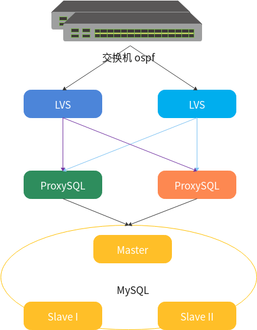

[TOC] 

 

# ProxySQL 本身的高可用

- 程序本身支持连接多个节点时
  - 利用keepalived + MySQL
    - 云上的话直接使用负载IP
  - Consul + ProxySQL 进行服务注册发现
    - 使用Consul集群，编写简单脚本
  - 基于DNS的注册发现
    - 编写脚本
    - DNS方式需要注意DNS缓存有效期


## JDBC方式连接

JDBC配置的连接列表中，第一个被认为是master

```
jdbc:mysql://[primary_host][:port],[secondary_host_1][:port]...[/[database]][?propetyName1=propertyValue1[&propertyName2=propertyValue2]...]

i.e.
jdbc:mysql://192.168.10.11:6033,192.168.10.12:6033,192.168.10.13:6033/test?failOverReadOnly=false
```

- 支持的propertName列表，建议用autoreconnect
  - failOverReadOnly
  - secondsBeforeRetryMaster
  - queriesBeforeRetryMaster
  - retriesAllDown
  - <font color=red>autoReconnect (建议)</font>
  - autoReconnectForPools

| propertName                                 | 说明                                                         |
| ------------------------------------------- | ------------------------------------------------------------ |
| failOverReadOnly                            | True：连接第一个节点write/read，其他节点read<br>False：所有节点都是write/read |
| secondBeforeRetryMaster                     | 用于failover时，间隔多少秒后重试切回master<br>默认为5秒      |
| quriesBeforeRetryMaster                     | 该节点操作多少次query后尝试切换回master<br>默认为120次       |
| retriesAllDown                              | 发生failover时，尝试和secondary节点发生连接，最终尝试retriesAllDown次 |
| autoReconnect<br>&<br>autoReconnectForPools | 断开重连                                                     |

> secondBeforeRetryMaster * quriesBeforeRetryMaster = 600秒，
>
> 也就是10分钟内节点1恢复rw，事务正常进行。 超时后jdbc会连接到第二节点。
>
> 如果想回归到节点1， 需要重启jdbc。

 


> 更多JDBC内容
>
> https://dev.mysql.com/doc/connector-j/5.1/en/connector-j-master-slave-replication-connection.html
>
> Support for Multiple-Master Replication Topographies
>
> 
>
> jdbc:mysql:replication://address=(type=master)(host=master1host),address=(type=master)(host=master2host),address=(type=slave)(host=slave1host)/database
>
> 不指定type，默认为slave


 

## python的实现逻辑

伪代码

```
ldb = [192.168.10.11:6033, 192.168.10.12:6033, 192.168.10.13:6033]

i = 0
for db in ldb:
	i += 1
	try:
		conn = mysql.connect(db)
		return conn, i
    except:
    	continue
```

 

# ProxySQL参与的高可用架构示意

- 冗余
  


- Keealived 方式
  

 

-  Consul 方式

  

 

- DNS 方式

  - DNS方式需要注意DNS缓存有效期， 可以设置得极短，甚至关闭缓存。

    > Monitor负责监控DB各节点状态并维护DNS解析
    >
    > - 如果slave挂掉，负责从DNS删除该节点的解析
    >
    > - 如果master挂掉，负责从slave中选出新master并注册到DNS
    >
    > 可以试试写个脚本实现monitor

  