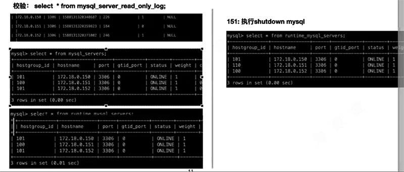
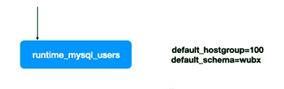
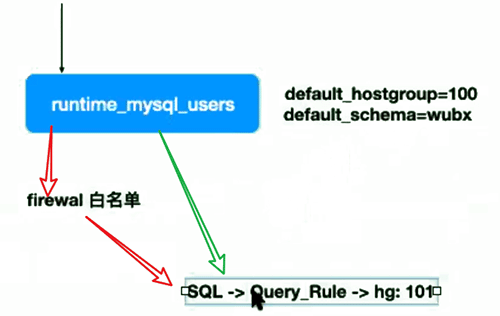

# 用ProxySQL替代MySQL Router

|      | MySQL Router                      | ProxySQL                                       |
| ---- | --------------------------------- | ---------------------------------------------- |
| 概述 | 提供MGR的高可用，节点故障自动处理 | 功能丰富的中间件                               |
| 特点 | 只能提供基于端口的读写分离        | 丰富的SQL路由规则  丰富的SQL控制及监控分析方法 |

## ProxySQL和MGR实战

| **hostname** | **IP**         | **port** | **role**          | **comm** |
| ------------ | -------------- | -------- | ----------------- | -------- |
| ms81         | 192.168.188.81 | 3399     | master            |          |
| ms82         | 192.168.188.82 | 3399     | slave             |          |
| ms83         | 192.168.188.83 | 3399     | slave             |          |
| ms84         | 192.168.188.84 | 6033     | proxysql&sysbench |          |

 

- 需要向MySQL导入一个监控脚本，多主模式随便找一个节点导入就行。

  ```
  mysql < addition_to_sys8.sql
  ```

- 需要将系统表授权给后续创建的monitor用户(后面完成用户创建再授权。)

  ```
  grant select on sys.gr_member_routing_candidate_status to 'monitor';
  ```

### 配置MGR

- 初始化node1

  ```
  mysql> set global super_read_only=0;
  ```
  - MySQL Shell创建MGR使用

    ```
    mysql> create user mgr@'192.168.188.%' identified by 'mgr';
    mysql> grant all privileges on *.* to mgr@'192.168.188.%' with grant option;
    ```

  - 供业务使用

    ```
    mysql> create user kk@'192.168.188.%' identified by 'kk';
    mysql> grant all privileges on *.* to kk@'192.168.188.%';
     
    #供业务使用
    mysql> create user proxy@'192.168.188.%' identified with mysql_native_password by 'proxy';
    mysql> grant all privileges on *.* to proxy@'192.168.188.%';
     
    #供proxysql monitor使用
    mysql> create user monitor@'192.168.188.%' identified with mysql_native_password by 'monitor';
    mysql> grant replication client on *.* to monitor@'192.168.188.%';
     
    mysql> reset master;
     
    mysql> create database kk;
    ```

  - 使用MySQL Shell 创建MGR

    略。

  - 在master导入proxysql所需的监控脚本，并授权

    ```
    grant select on sys.gr_member_routing_candidate_status to 'monitor';
    ```

### 配置ProxySQL

- 设置组

  > 这里没修改 max_writers ，默认为1。 不建议增加，即使是multiPromary模式，proxysql也建议使用单写。 

  ```
  mysql> insert into mysql_group_replication_hostgroups(writer_hostgroup,backup_writer_hostgroup,reader_hostgroup,offline_hostgroup,active) values (111,122,100,404,1); 
  
  Query OK, 1 row affected (0.00 sec)
  ```

| 字段                    | 意义                                                         |
| ----------------------- | ------------------------------------------------------------ |
| write_hostgroup         | 该组值用于写操作的分组id，一般也是mysql_users中指定为用户的默认节点，且要求read_only=0 |
| backup_write_hostgroup  | 组中如果有多个read_only=0的节点，其他成员放置的节点          |
| reader_hostgroup        | 该组中用于只读group                                          |
| offline_hostgroup       | 离线group                                                    |
| active                  | 设置是否可用，默认为1                                        |
| max_writers             | 设置最多几个成员可以writer_hostgroup                         |
| writer_is_also_reader   | 写组成员是否担任读的工作                                     |
| max_transactions_behind | 节点事务延迟情况                                             |
| comment                 | --                                                           |


- 设置servers

  ```
  mysql> insert into mysql_servers(hostgroup_id,hostname,port,max_connections) values (100,'192.168.188.81',3399,200);
  
  Query OK, 1 row affected (0.00 sec) 
  
  mysql> insert into mysql_servers(hostgroup_id,hostname,port,max_connections) values (100,'192.168.188.82',3399,200);
  
  Query OK, 1 row affected (0.00 sec) 
  
  mysql> insert into mysql_servers(hostgroup_id,hostname,port,max_connections) values (100,'192.168.188.83',3399,200);
  
  Query OK, 1 row affected (0.00 sec)
  
  mysql> load mysql servers to run; 
  
  Query OK, 0 rows affected (0.01 sec) 
  
  mysql> save mysql servers to disk; 
  
  Query OK, 0 rows affected (0.83 sec)
  ```

   随便放个组就行。反正会自动切换。

- 设置users

  ```
  mysql> insert into mysql_users(username,password,active,default_hostgroup,default_schema) values ('proxy','proxy',1,100,'kk');
  Query OK, 1 row affected (0.00 sec)
   
  mysql> insert into mysql_users(username,password,active,default_hostgroup,default_schema) values ('kk','kk',1,100,'kk');
  Query OK, 1 row affected (0.00 sec)
   
  mysql> load mysql users to run;
  Query OK, 0 rows affected (0.00 sec)
   
  mysql> save mysql users to disk;
  Query OK, 0 rows affected (0.36 sec)
  ```

 

- 配置规则

  略

## ProxySQL和MGR模式匹配注意事项

 

 151转到了110组， 虽然是online，但是请求不会发给110组。因为



先匹配用户default hg,

然后判断规则

> SQL --> Query_rule --> hg:101



 后面的动作就又回到了mysql_query_rules调整上了。

建议规则和username相关，便于管理和识别。

规则建议10条以下。 规则越多性能下降越多。

 

monitor会发现online变为offline


ProxySQL支持Single Primary 和Mutli-Primary，但需要注意，mysql_group_replication_hostgroups.max_writer = 1。多个节点写入时无法避免业务上的更新丢失。

依然建议多主模式时， 单点写入。

避免更新丢失发生（业务场景的逻辑问题）。

 


```
#addition_to_sys8.sql
USE sys;
DELIMITER $$
CREATE FUNCTION IFZERO(a INT, b INT)
RETURNS INT
DETERMINISTIC
RETURN IF(a = 0, b, a)$$
CREATE FUNCTION LOCATE2(needle TEXT(10000), haystack TEXT(10000), offset INT)
RETURNS INT
DETERMINISTIC
RETURN IFZERO(LOCATE(needle, haystack, offset), LENGTH(haystack) + 1)$$
CREATE FUNCTION GTID_NORMALIZE(g TEXT(10000))
RETURNS TEXT(10000)
DETERMINISTIC
RETURN GTID_SUBTRACT(g, '')$$
CREATE FUNCTION GTID_COUNT(gtid_set TEXT(10000))
RETURNS INT
DETERMINISTIC
BEGIN
  DECLARE result BIGINT DEFAULT 0;
  DECLARE colon_pos INT;
  DECLARE next_dash_pos INT;
  DECLARE next_colon_pos INT;
  DECLARE next_comma_pos INT;
  SET gtid_set = GTID_NORMALIZE(gtid_set);
  SET colon_pos = LOCATE2(':', gtid_set, 1);
  WHILE colon_pos != LENGTH(gtid_set) + 1 DO
     SET next_dash_pos = LOCATE2('-', gtid_set, colon_pos + 1);
     SET next_colon_pos = LOCATE2(':', gtid_set, colon_pos + 1);
     SET next_comma_pos = LOCATE2(',', gtid_set, colon_pos + 1);
     IF next_dash_pos < next_colon_pos AND next_dash_pos < next_comma_pos THEN
       SET result = result +
         SUBSTR(gtid_set, next_dash_pos + 1,
                LEAST(next_colon_pos, next_comma_pos) - (next_dash_pos + 1)) -
         SUBSTR(gtid_set, colon_pos + 1, next_dash_pos - (colon_pos + 1)) + 1;
     ELSE
       SET result = result + 1;
     END IF;
     SET colon_pos = next_colon_pos;
  END WHILE;
  RETURN result;
END$$
CREATE FUNCTION gr_applier_queue_length()
RETURNS INT
DETERMINISTIC
BEGIN
  RETURN (SELECT sys.gtid_count( GTID_SUBTRACT( (SELECT
Received_transaction_set FROM performance_schema.replication_connection_status
WHERE Channel_name = 'group_replication_applier' ), (SELECT
@@global.GTID_EXECUTED) )));
END$$
CREATE FUNCTION gr_member_in_primary_partition()
RETURNS VARCHAR(3)
DETERMINISTIC
BEGIN
  RETURN (SELECT IF( MEMBER_STATE='ONLINE' AND ((SELECT COUNT(*) FROM
performance_schema.replication_group_members WHERE MEMBER_STATE != 'ONLINE') >=
((SELECT COUNT(*) FROM performance_schema.replication_group_members)/2) = 0),
'YES', 'NO' ) FROM performance_schema.replication_group_members JOIN
performance_schema.replication_group_member_stats USING(member_id)
          where performance_schema.replication_group_members.member_host=@@hostname);
END$$
CREATE VIEW gr_member_routing_candidate_status AS
    SELECT 
        sys.gr_member_in_primary_partition() AS viable_candidate,
        IF((SELECT 
                    (SELECT 
                                GROUP_CONCAT(variable_value)
                            FROM
                                performance_schema.global_variables
                            WHERE
                                variable_name IN ('read_only' , 'super_read_only')) != 'OFF,OFF'
                ),
            'YES',
            'NO') AS read_only,
        sys.gr_applier_queue_length() AS transactions_behind,
        Count_Transactions_in_queue AS 'transactions_to_cert'
    FROM
        performance_schema.replication_group_member_stats a
            JOIN
        performance_schema.replication_group_members b ON a.member_id = b.member_id
    WHERE
        b.member_host IN (SELECT 
                variable_value
            FROM
                performance_schema.global_variables
            WHERE
                variable_name = 'hostname')$$
DELIMITER ;

来自 <https://raw.githubusercontent.com/jolleykong/mysql_gr_routing_check/master/addition_to_sys8.sql> 

```

```
#addition_to_sys.sql
USE sys;
DELIMITER $$
CREATE FUNCTION IFZERO(a INT, b INT)
RETURNS INT
DETERMINISTIC
RETURN IF(a = 0, b, a)$$
CREATE FUNCTION LOCATE2(needle TEXT(10000), haystack TEXT(10000), offset INT)
RETURNS INT
DETERMINISTIC
RETURN IFZERO(LOCATE(needle, haystack, offset), LENGTH(haystack) + 1)$$
CREATE FUNCTION GTID_NORMALIZE(g TEXT(10000))
RETURNS TEXT(10000)
DETERMINISTIC
RETURN GTID_SUBTRACT(g, '')$$
CREATE FUNCTION GTID_COUNT(gtid_set TEXT(10000))
RETURNS INT
DETERMINISTIC
BEGIN
  DECLARE result BIGINT DEFAULT 0;
  DECLARE colon_pos INT;
  DECLARE next_dash_pos INT;
  DECLARE next_colon_pos INT;
  DECLARE next_comma_pos INT;
  SET gtid_set = GTID_NORMALIZE(gtid_set);
  SET colon_pos = LOCATE2(':', gtid_set, 1);
  WHILE colon_pos != LENGTH(gtid_set) + 1 DO
     SET next_dash_pos = LOCATE2('-', gtid_set, colon_pos + 1);
     SET next_colon_pos = LOCATE2(':', gtid_set, colon_pos + 1);
     SET next_comma_pos = LOCATE2(',', gtid_set, colon_pos + 1);
     IF next_dash_pos < next_colon_pos AND next_dash_pos < next_comma_pos THEN
       SET result = result +
         SUBSTR(gtid_set, next_dash_pos + 1,
                LEAST(next_colon_pos, next_comma_pos) - (next_dash_pos + 1)) -
         SUBSTR(gtid_set, colon_pos + 1, next_dash_pos - (colon_pos + 1)) + 1;
     ELSE
       SET result = result + 1;
     END IF;
     SET colon_pos = next_colon_pos;
  END WHILE;
  RETURN result;
END$$
CREATE FUNCTION gr_applier_queue_length()
RETURNS INT
DETERMINISTIC
BEGIN
  RETURN (SELECT sys.gtid_count( GTID_SUBTRACT( (SELECT
Received_transaction_set FROM performance_schema.replication_connection_status
WHERE Channel_name = 'group_replication_applier' ), (SELECT
@@global.GTID_EXECUTED) )));
END$$
CREATE FUNCTION gr_member_in_primary_partition()
RETURNS VARCHAR(3)
DETERMINISTIC
BEGIN
  RETURN (SELECT IF( MEMBER_STATE='ONLINE' AND ((SELECT COUNT(*) FROM
performance_schema.replication_group_members WHERE MEMBER_STATE != 'ONLINE') >=
((SELECT COUNT(*) FROM performance_schema.replication_group_members)/2) = 0),
'YES', 'NO' ) FROM performance_schema.replication_group_members JOIN
performance_schema.replication_group_member_stats USING(member_id));
END$$
CREATE VIEW gr_member_routing_candidate_status AS SELECT
sys.gr_member_in_primary_partition() as viable_candidate,
IF( (SELECT (SELECT GROUP_CONCAT(variable_value) FROM
performance_schema.global_variables WHERE variable_name IN ('read_only',
'super_read_only')) != 'OFF,OFF'), 'YES', 'NO') as read_only,
sys.gr_applier_queue_length() as transactions_behind, Count_Transactions_in_queue as 'transactions_to_cert' from performance_schema.replication_group_member_stats;$$
DELIMITER ;

来自 <https://raw.githubusercontent.com/jolleykong/mysql_gr_routing_check/master/addition_to_sys.sql> 


```

