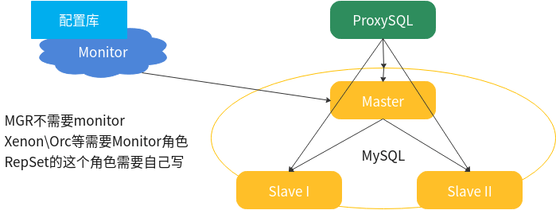

> MySQL InnoDB ReplicaSet 就是mysh实现的mysql复制。
>
> 和MIC一样，通过mysh构建后，就无法手动维护了。
>
> 目前RS是异步复制，还不支持半同步。

 

1. MySQL InnoDB ReplicaSet 搭建及原理
2. 学习分析mysh的调用及执行命令分析
3. 利用ProxySQL + InnoDB ReplicaSet定制高可用
4. 尝试编写脚本


-  InnoDB ReplicaSet实质
  - 利用mysh构建的MySQL Replication，所有slave节点都是ReadOnly状态
  - InnoDB ReplicaSet不具备高可用
- 必备条件
  - MySQL 8.0 + ，因为要使用clone plugin
  - GTID based Replication || Row Base Replication （RBR）
  - 不支持复制过滤
  - 对通道管理支持的也不好
  - 复制结构中只能是一个主库，但是可以多个从库
  - ReplicaSet管理只能使用myshell


- 打印操作日志，分析mysh的动作

  ```
  mysqlsh --log-level=8 --dba-log-sql=2
  
  请求的SQL记录到~/.mysqlsh/mysqlsh.log
  ```

- RepSet的话， orc就用不了了——因为所有主从切换都要基于mysh进行。


- 关于Monitor




- replication -> xenon 

- 多实例的replication -> orchestrator

- mysh replicaSet -> 需要自己实现

- MGR 本身自带高可用 

 

mysql replicaSet 实现逻辑

1. 配置库： 每个Group里的成员及谁是当前的Master
2. 获取主库，ping , select ping, update,insert ping
   
- 连接数据库失败 -> 主库挂了
   
3. 一个选主的过程 s1, s2 怎么获取一个新的主呢
   
- GTID_SUBTRACT(s1,s2) -NULL
   
4. ```
   var rs = dba.getReplicaSet()
   
   print("failover mysql11:3310")
   
   rs.forcePrimaryInstance('mysql11:3310')
   
   /usr/local/mysqlshell/bin/mysqlsh --log-level=8 --dba-log-sql=2 --uri kk@192.168.10.11:3310 -f ./db3310failover.js 
   ```

5. group -> old_master -> 故障节点 ， mysql11 :role: old_master

 

6. monitor -> mysql11

   > 只需要监控主库就ok，proxysql和router能自动处理slave挂掉的情况——offline

 

> “在应用开发过程中，先实现功能，在功能实现后再去考虑性能。”

 

- 数据库连接池问题：

1. 池中的连接不能受污染。
2. 应用程序问题可能会导致连接池内存泄漏。
   1. prepare后没回收 ： 需要drop
   2. 游标没回收 ：需要close游标
   3. set xxx ：连接需要closed